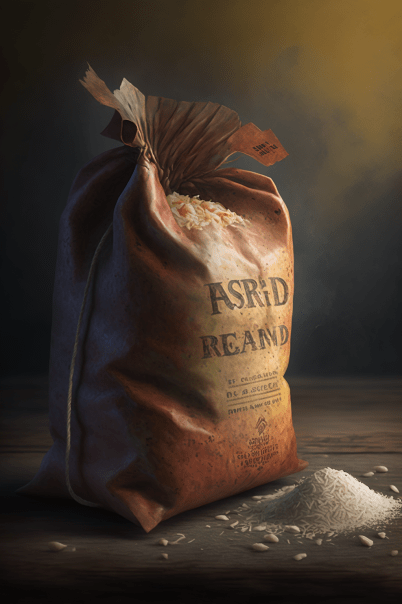

# 一袋大米(COD-废城)  
> 一袋装好的大米  
  
<table class="table table-bordered" data-toggle="table"  data-show-header="false"><thead style="display:none"><tr ><th  style="width:50%;text-align:left;vertical-align:top;"  >title</th><th  style="width:50%;text-align:left;vertical-align:top;"  ></th></tr></thead><tr ><td  style="width:50%;text-align:left;vertical-align:top;"  >**重量：**500  **标签：**	  **可用次数：**6</td><td  style="width:50%;text-align:left;vertical-align:top;"  >

<a href="cod_一袋大米.md" style="color:black">一袋大米</a>

</td></tr></tbody></table>  
  
## 动作  

<table><tr><td rowspan="2" style="width:200px;text-align:center;font-size:1.3em;font-weight:bold">

取出大米

</td><td></td></tr><tr><td><b>自身：</b>使用次数  <b>-6(-100%)</b></td></tr><tr><td colspan="2">[

[稻米](RiceGrains.md)](RiceGrains.md)(<b>+6</b>), [

[绳子](Rope.md)](Rope.md)(<b>+1</b>), [

[布](Cloth.md)](Cloth.md)(<b>+1</b>)</td></tr></table>
  
  
  
## 属性   

<table style="margin-bottom:0px;"><tr><td style="width:30%;text-align:left; background-color:#FEFEFE;font-size:1.3em;font-weight:bold;">使用次数</td><td style="font-size:1em;background-color:#FEFEFE">初始：6 , 最大：6 -</td></tr><tr style="background-color:#FFFFFF"><td colspan=2>** 到达0时： ** 自身: →消失</td></tr></table>
  

