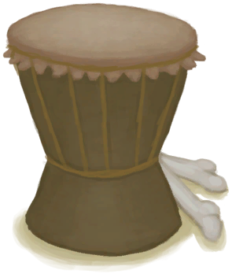
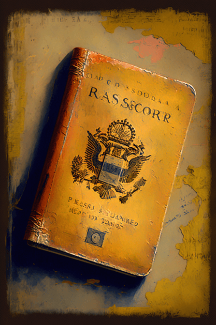
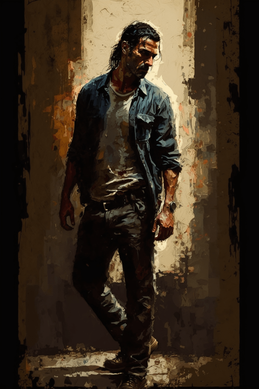
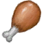
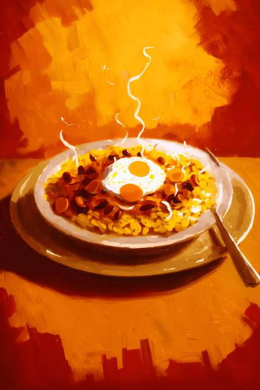
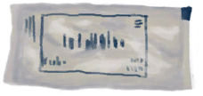

# 购买10个蛇草(COD-废城)  
> 购买蛇草  
  
<table class="table table-bordered" data-toggle="table"  data-show-header="false"><thead style="display:none"><tr ><th  style="width:50%;text-align:left;vertical-align:top;"  >title</th><th  style="width:50%;text-align:left;vertical-align:top;"  ></th></tr></thead><tr ><td  style="width:50%;text-align:left;vertical-align:top;"  >** 解锁条件: ** [

[餐馆好感度](cod_救世军信任度.md)](cod_救世军信任度.md): <b>40-150</b> [

[击鼓(技能)](Skill_Percussion.md)](Skill_Percussion.md): <b>40-150</b>  ** 研究耗时: ** 3小时  ** 动作分类: ** [“手部动作(组)”](HandAction.md)  ** 制作条件: ** ~~[

[购买10个蛇草(蓝图)](cod_击鼓工作.md)](cod_击鼓工作.md)存在于手中/面板~~</td><td  style="width:50%;text-align:left;vertical-align:top;"  >

<a href="cod_击鼓工作.md" style="color:black">购买10个蛇草</a>

</td></tr></tbody></table>  
  
## 制作  

<table><tr><td style="width:100px;"><b>材料总计：</b></td><td>[

[破败轮船](cod_工作证.md)](cod_工作证.md) x 1 , [

[破败轮船](cod_Garvin.md)](cod_Garvin.md) x 1</td></tr><tr><td><b>耗时：</b></td><td>3小时/每步骤 , 共计：6小时</td></tr><tr><td><b>需求：</b></td><td>[

[光亮](Light.md)](Light.md): <b>0-100</b></td></tr><tr><td><b>状态变化：</b></td><td>[

[饱食](Satiation.md)](Satiation.md)<b>-15～-25</b>, [

[手掌损伤](HandDamage.md)](HandDamage.md)<b>+40</b>, [

[污垢](Filth.md)](Filth.md)<b>+30</b>, [

[体重](Weight.md)](Weight.md)<b>-5</b>, [

[耐力](Stamina.md)](Stamina.md)<b>-24</b>, [

[餐馆好感度](cod_救世军信任度.md)](cod_救世军信任度.md)<b>+1</b>, [

[击鼓(技能)](Skill_Percussion.md)](Skill_Percussion.md)<b>+0.5</b></td></tr><tr><td colspan=2><b>步骤：</b></td></tr><tr><td style="text-align:right"><b>1.</b></td><td>[

[破败轮船](cod_工作证.md)](cod_工作证.md) x 1</td></tr><tr><td style="text-align:right"><b>2.</b></td><td>[

[破败轮船](cod_Garvin.md)](cod_Garvin.md) x 1</td></tr><tr style="background-color:#fff;font-size:1.2em;"><td></td><td style="text-align:right"><b>成品：</b>[

[破败轮船](cod_Garvin.md)](cod_Garvin.md)(<b>+1</b>) , [

[铸币](cod_铸币.md)](cod_铸币.md)(<b>+22～+26</b>) , [

[破败轮船](cod_工作证.md)](cod_工作证.md)(<b>+1</b>) , [

[破败轮船](cod_工作餐1.md)](cod_工作餐1.md)(<b>+1</b>) , [

[应急水包](WaterRation.md)](WaterRation.md)(<b>+1</b>)</td></tr></table>
  
  

