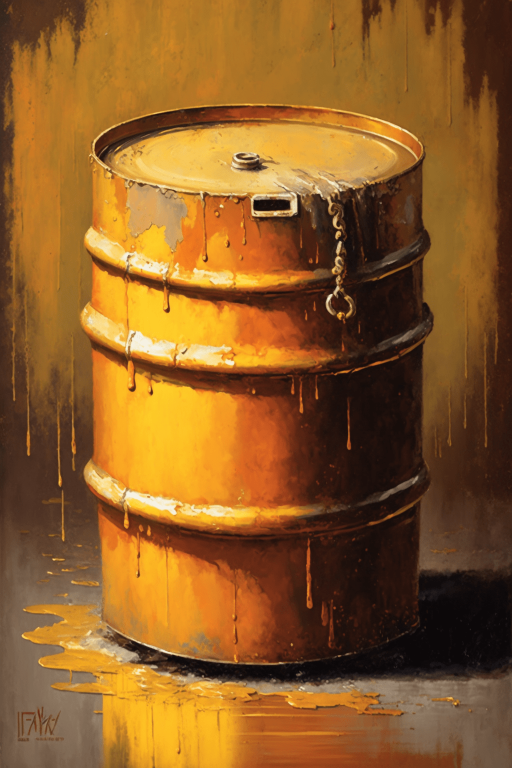
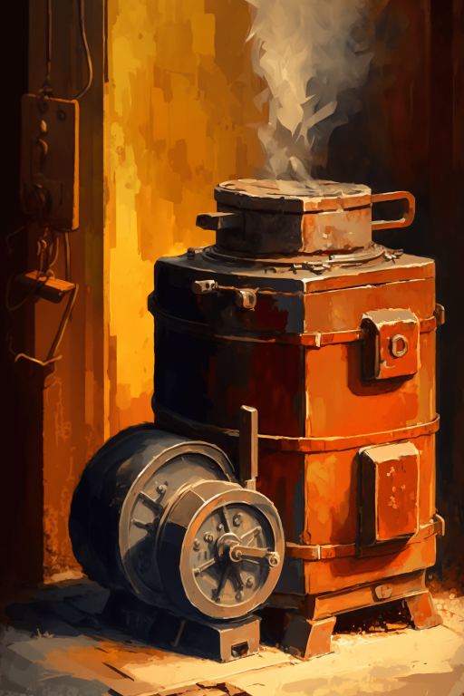

# 制作大油桶(COD-废城)  
> 制作大油桶  
  
<table class="table table-bordered" data-toggle="table"  data-show-header="false"><thead style="display:none"><tr ><th  style="width:50%;text-align:left;vertical-align:top;"  >title</th><th  style="width:50%;text-align:left;vertical-align:top;"  ></th></tr></thead><tr ><td  style="width:50%;text-align:left;vertical-align:top;"  >** 解锁需求: ** [小型熔炉 ](cod_小形熔炉.md)  ** 研究耗时: ** 3小时  ** 动作分类: ** [“手部动作(组)”](HandAction.md) [“制造动作(组)”](CraftAction.md)  ** 制作条件: ** ~~[

[制作大油桶(蓝图)](cod_制作大油桶.md)](cod_制作大油桶.md)存在于手中/面板~~</td><td  style="width:50%;text-align:left;vertical-align:top;"  >

<a href="cod_制作大油桶.md" style="color:black">制作大油桶</a>

</td></tr></tbody></table>  
  
## 制作  

<table><tr><td style="width:100px;"><b>材料总计：</b></td><td>[

[小型熔炉 ](cod_小形熔炉.md)](cod_小形熔炉.md) x 1 , [

[多功能工具箱](cod_多功能工具箱.md)](cod_多功能工具箱.md) x 1 , [

[空锡罐](cod_空锡罐.md)](cod_空锡罐.md) x 20 , [

[小树枝](Sticks.md)](Sticks.md) x 2 , [

[铁制材料](cod_Nc_IndustrialMaterials.md)](cod_Nc_IndustrialMaterials.md) x 10 , [

[木材](Wood.md)](Wood.md) x 8 , [“锤击工具(组)”](GpTag_Hammer.md) x 1(使用次数-1) , [

[火种](TinderLit.md)](TinderLit.md) x 1</td></tr><tr><td><b>耗时：</b></td><td>4小时</td></tr><tr><td><b>需求：</b></td><td>[

[光亮](Light.md)](Light.md): <b>10-100</b></td></tr><tr><td><b>状态变化：</b></td><td>[

[情绪](Morale.md)](Morale.md)<b>+15</b>, [

[压力](Stress.md)](Stress.md)<b>-20</b>, [

[手掌损伤](HandDamage.md)](HandDamage.md)<b>+100</b></td></tr><tr><td colspan=2><b>步骤：</b></td></tr><tr><td style="text-align:right"><b>1.</b></td><td>[

[小型熔炉 ](cod_小形熔炉.md)](cod_小形熔炉.md) x 1 + [

[多功能工具箱](cod_多功能工具箱.md)](cod_多功能工具箱.md) x 1 + [

[空锡罐](cod_空锡罐.md)](cod_空锡罐.md) x 20 + [

[小树枝](Sticks.md)](Sticks.md) x 2 + [

[铁制材料](cod_Nc_IndustrialMaterials.md)](cod_Nc_IndustrialMaterials.md) x 10 + [

[木材](Wood.md)](Wood.md) x 8 + [“锤击工具(组)”](GpTag_Hammer.md) x 1(使用次数-1) + [

[火种](TinderLit.md)](TinderLit.md) x 1</td></tr><tr style="background-color:#fff;font-size:1.2em;"><td></td><td style="text-align:right"><b>成品：</b>[

[多功能工具箱](cod_多功能工具箱.md)](cod_多功能工具箱.md)(<b>+1</b>) , [

[大油桶](cod_大油桶.md)](cod_大油桶.md)(<b>+1</b>) , [

[小型熔炉 ](cod_小形熔炉.md)](cod_小形熔炉.md)(<b>+1</b>)</td></tr></table>
  
  

