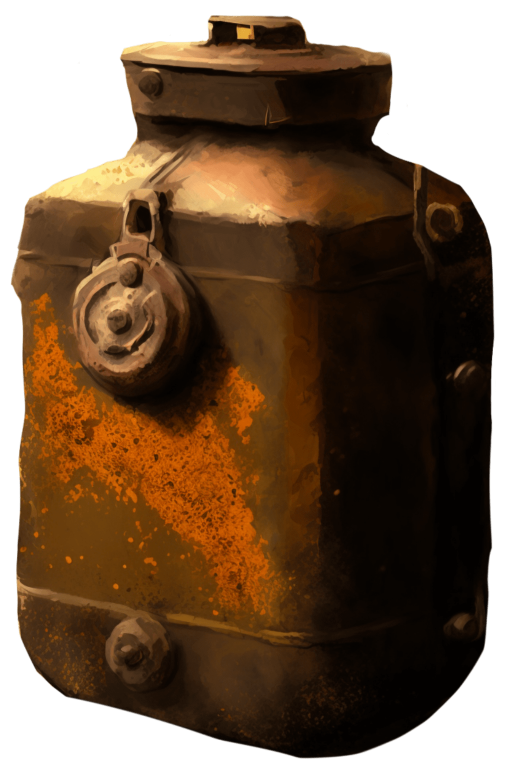

# 购买10个蛇草(COD-废城)  
> 购买蛇草  
  
<table class="table table-bordered" data-toggle="table"  data-show-header="false"><thead style="display:none"><tr ><th  style="width:50%;text-align:left;vertical-align:top;"  >title</th><th  style="width:50%;text-align:left;vertical-align:top;"  ></th></tr></thead><tr ><td  style="width:50%;text-align:left;vertical-align:top;"  >** 解锁条件: ** [

[餐馆好感度](cod_弹药学.md)](cod_弹药学.md): <b>40-150</b>  ** 解锁需求: ** [破败轮船](cod_弹药制作台.md)  ** 动作分类: ** [“手部动作(组)”](HandAction.md) [“制造动作(组)”](CraftAction.md)  ** 制作条件: ** ~~[

[购买10个蛇草(蓝图)](cod_制作左轮子弹蓝图.md)](cod_制作左轮子弹蓝图.md)存在于手中/面板~~</td><td  style="width:50%;text-align:left;vertical-align:top;"  >

<a href="cod_制作左轮子弹蓝图.md" style="color:black">购买10个蛇草</a>

</td></tr></tbody></table>  
  
## 制作  

<table><tr><td style="width:100px;"><b>材料总计：</b></td><td>[

[破败轮船](cod_弹药制作台.md)](cod_弹药制作台.md) x 1 , [

[破败轮船](cod_火药罐.md)](cod_火药罐.md) x 1 , [

[铁制材料](cod_Nc_IndustrialMaterials.md)](cod_Nc_IndustrialMaterials.md) x 4 , [

[破败轮船](cod_红砖.md)](cod_红砖.md) x 2</td></tr><tr><td><b>耗时：</b></td><td>2小时</td></tr><tr><td><b>需求：</b></td><td>[

[光亮](Light.md)](Light.md): <b>10-100</b>, [

[餐馆好感度](cod_弹药学.md)](cod_弹药学.md): <b>40-150</b></td></tr><tr><td><b>状态变化：</b></td><td>[

[情绪](Morale.md)](Morale.md)<b>+15</b>, [

[压力](Stress.md)](Stress.md)<b>-20</b>, [

[制作(技能)](Skill_Crafting.md)](Skill_Crafting.md)<b>+0.5</b></td></tr><tr><td colspan=2><b>步骤：</b></td></tr><tr><td style="text-align:right"><b>1.</b></td><td>[

[破败轮船](cod_弹药制作台.md)](cod_弹药制作台.md) x 1 + [

[破败轮船](cod_火药罐.md)](cod_火药罐.md) x 1 + [

[铁制材料](cod_Nc_IndustrialMaterials.md)](cod_Nc_IndustrialMaterials.md) x 4 + [

[破败轮船](cod_红砖.md)](cod_红砖.md) x 2</td></tr><tr style="background-color:#fff;font-size:1.2em;"><td></td><td style="text-align:right"><b>成品：</b>[

[破败轮船](cod_左轮子弹.md)](cod_左轮子弹.md)(<b>+6</b>) , [

[破败轮船](cod_弹药制作台.md)](cod_弹药制作台.md)(<b>+1</b>)</td></tr></table>
  
  

