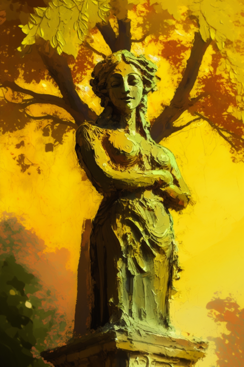

# 破败轮船(COD-废城)  
> 一个破败的轮船  
  
<table class="table table-bordered" data-toggle="table"  data-show-header="false"><thead style="display:none"><tr ><th  style="width:50%;text-align:left;vertical-align:top;"  >title</th><th  style="width:50%;text-align:left;vertical-align:top;"  ></th></tr></thead><tr ><td  style="width:50%;text-align:left;vertical-align:top;"  >** 区域唯一 **  **环境：**[腐败之城(环境)](cod_Env_腐败之城.md)</td><td  style="width:50%;text-align:left;vertical-align:top;"  >

<a href="cod_城市雕像.md" style="color:black">破败轮船</a>

</td></tr></tbody></table>  
  
## 获取来源  

探索

[破败轮船(腐败之城)](cod_Exp_腐败之城.md)

  
  
## 动作  

<table><tr><td rowspan="2" style="width:200px;text-align:center;font-size:1.3em;font-weight:bold">

search

1小时

</td><td></td></tr><tr><td></td></tr><tr><td colspan="2"><b>需求：</b>[

[光亮](Light.md)](Light.md): <b>10-100</b></td></tr><tr><td colspan="2"><b>状态变化：</b>[

[情绪](Morale.md)](Morale.md)<b>+25</b>, [

[娱乐](Entertainment.md)](Entertainment.md)<b>+48</b>, [

[压力](Stress.md)](Stress.md)<b>-25</b>, [

[勇气](Courage.md)](Courage.md)<b>+300</b>, [

[孤立感](Isolation.md)](Isolation.md)<b>-1～-10</b></td></tr></table>
  
  
  

