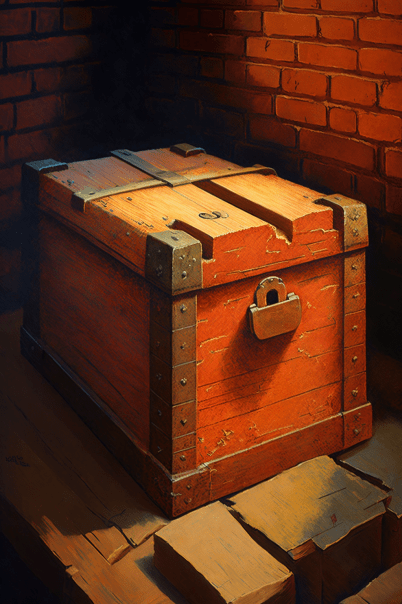

# 破败轮船(COD-废城)  
> 一个破败的轮船  
  
<table class="table table-bordered" data-toggle="table"  data-show-header="false"><thead style="display:none"><tr ><th  style="width:50%;text-align:left;vertical-align:top;"  >title</th><th  style="width:50%;text-align:left;vertical-align:top;"  ></th></tr></thead><tr ><td  style="width:50%;text-align:left;vertical-align:top;"  >**重量：**2000</td><td  style="width:50%;text-align:left;vertical-align:top;"  >

<a href="cod_小镇宝箱.md" style="color:black">破败轮船</a>

</td></tr></tbody></table>  
  
## 获取来源  

转化

[破败轮船](cod_大建筑废墟.md)

  
  
## 可拖入  

<table style="margin-bottom:0px;"><tr><td style="width:40%;text-align:left; background-color:#FEFEFE"><b>拖入：</b></td><td style="width:40%;font-size:1em;font-weight:bold;background-color:#FEFEFE">照照片 (15分) </td></tr><tr><td colspan="2"><b>需求：</b>[

[光亮](Light.md)](Light.md): <b>10-100</b></td></tr><tr style="background-color:#FFFFFF"><td style=""><b>使用物：</b>→ [

[破箱子](cod_一大袋食物.md)](cod_一大袋食物.md), 可用次数  <b>-2</b></td><td style=""><b>自身：</b>→消失</td></tr></table>
  
  

