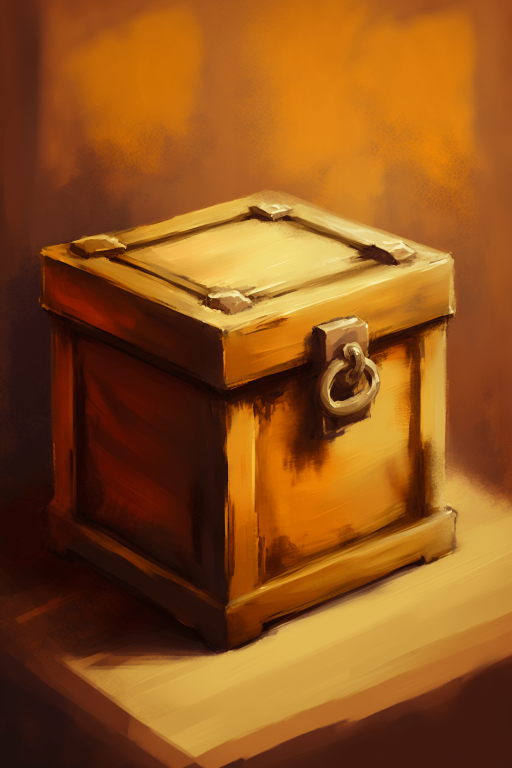
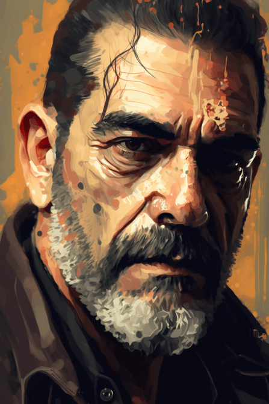
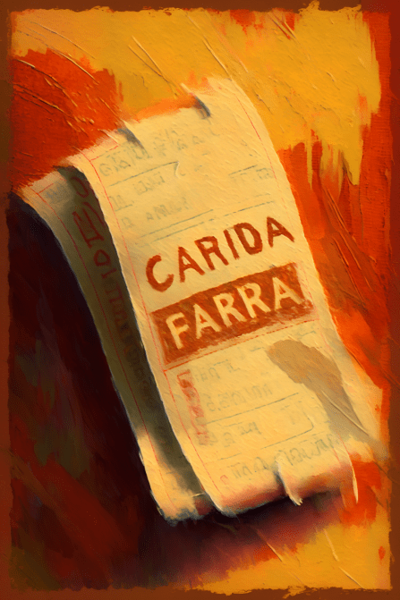

# 木箱任务(COD-废城)  
> 木箱任务  
  
<table class="table table-bordered" data-toggle="table"  data-show-header="false"><thead style="display:none"><tr ><th  style="width:50%;text-align:left;vertical-align:top;"  >title</th><th  style="width:50%;text-align:left;vertical-align:top;"  ></th></tr></thead><tr ><td  style="width:50%;text-align:left;vertical-align:top;"  >** 解锁需求: ** [木箱子](cod_尼根任务箱子1.md)  ** 研究耗时: ** 3小时  ** 动作分类: ** [“手部动作(组)”](HandAction.md)  ** 制作条件: ** ~~[

[木箱任务(蓝图)](cod_尼根任务蓝图1.md)](cod_尼根任务蓝图1.md)存在于手中/面板~~</td><td  style="width:50%;text-align:left;vertical-align:top;"  >

<a href="cod_尼根任务蓝图1.md" style="color:black">木箱任务</a>

</td></tr></tbody></table>  
  
## 制作  

<table><tr><td style="width:100px;"><b>材料总计：</b></td><td>[

[尼根](cod_Negan.md)](cod_Negan.md) x 1 , [

[木箱子](cod_尼根任务箱子1.md)](cod_尼根任务箱子1.md) x 1</td></tr><tr><td><b>耗时：</b></td><td>15分</td></tr><tr><td><b>需求：</b></td><td>[

[光亮](Light.md)](Light.md): <b>10-100</b></td></tr><tr><td><b>状态变化：</b></td><td>[

[救世军信任度](cod_救世军信任度.md)](cod_救世军信任度.md)<b>+15</b></td></tr><tr><td colspan=2><b>步骤：</b></td></tr><tr><td style="text-align:right"><b>1.</b></td><td>[

[尼根](cod_Negan.md)](cod_Negan.md) x 1 + [

[木箱子](cod_尼根任务箱子1.md)](cod_尼根任务箱子1.md) x 1</td></tr><tr style="background-color:#fff;font-size:1.2em;"><td></td><td style="text-align:right"><b>成品：</b>[

[尼根](cod_Negan.md)](cod_Negan.md)(<b>+1</b>) , [

[一瓶红酒](cod_一瓶红酒.md)](cod_一瓶红酒.md)(<b>+1</b>) , [

[尼根(事件)](cod_eve_尼根木箱任务成功.md)](cod_eve_尼根木箱任务成功.md)(<b>+1</b>) , [

[5元代金券](cod_代金券5元.md)](cod_代金券5元.md)(<b>+4</b>)</td></tr></table>
  
  

