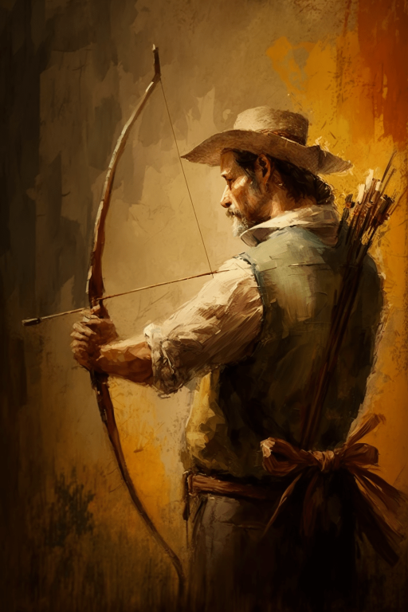
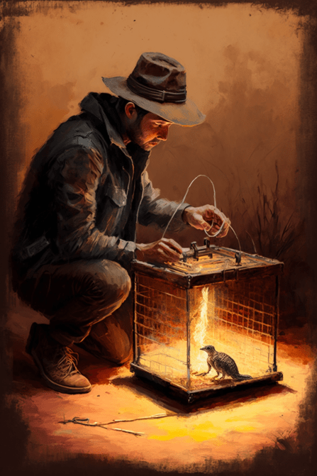
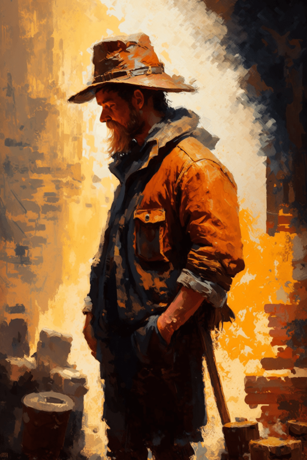

# 破败轮船(COD-废城)  
> 一个破败的轮船  
  
<table class="table table-bordered" data-toggle="table"  data-show-header="false"><thead style="display:none"><tr ><th  style="width:50%;text-align:left;vertical-align:top;"  >title</th><th  style="width:50%;text-align:left;vertical-align:top;"  ></th></tr></thead><tr ><td  style="width:50%;text-align:left;vertical-align:top;"  >**重量：**10  **标签：**	[“高级装饰品”](tag_DecorationAdv.md), [“美丽的/好看的”](tag_Pretty.md)</td><td  style="width:50%;text-align:left;vertical-align:top;"  >

<a href="cod_工作证.md" style="color:black">破败轮船</a>

</td></tr></tbody></table>  
  
## 获取来源  

蓝图制造

[购买10个蛇草(蓝图)](cod_购买工作证.md)

蓝图制造

[购买10个蛇草(蓝图)](cod_击鼓工作.md)

蓝图制造

[购买10个蛇草(蓝图)](cod_务农工作.md)

蓝图制造

[购买10个蛇草(蓝图)](cod_厨师工作.md)

蓝图制造

[购买10个蛇草(蓝图)](cod_射箭教学工作.md)

蓝图制造

[购买10个蛇草(蓝图)](cod_投石索教练.md)

蓝图制造

[购买10个蛇草(蓝图)](cod_捕兽工作.md)

蓝图制造

[购买10个蛇草(蓝图)](cod_木工工作.md)

蓝图制造

[购买10个蛇草(蓝图)](cod_杂工工作蓝图.md)

蓝图制造

[购买10个蛇草(蓝图)](cod_监工工作.md)

蓝图制造

[购买10个蛇草(蓝图)](cod_石匠工作.md)

蓝图制造

[购买10个蛇草(蓝图)](cod_纺织工作.md)

蓝图制造

[购买10个蛇草(蓝图)](cod_钓鱼工作.md)

蓝图制造

[购买10个蛇草(蓝图)](cod_铁匠工作.md)

蓝图制造

[购买10个蛇草(蓝图)](cod_长矛教学工作.md)

  
  
## 可用于蓝图  

<a href="cod_击鼓工作.md" style="color:black">购买10个蛇草</a>

<a href="cod_务农工作.md" style="color:black">购买10个蛇草</a>

<a href="cod_厨师工作.md" style="color:black">购买10个蛇草</a>

<a href="cod_射箭教学工作.md" style="color:black">购买10个蛇草</a>

<a href="cod_投石索教练.md" style="color:black">购买10个蛇草</a>

<a href="cod_捕兽工作.md" style="color:black">购买10个蛇草</a>

<a href="cod_木工工作.md" style="color:black">购买10个蛇草</a>

<a href="cod_杂工工作蓝图.md" style="color:black">购买10个蛇草</a>

<a href="cod_监工工作.md" style="color:black">购买10个蛇草</a>

<a href="cod_石匠工作.md" style="color:black">购买10个蛇草</a>

<a href="cod_纺织工作.md" style="color:black">购买10个蛇草</a>

<a href="cod_钓鱼工作.md" style="color:black">购买10个蛇草</a>

<a href="cod_铁匠工作.md" style="color:black">购买10个蛇草</a>

<a href="cod_长矛教学工作.md" style="color:black">购买10个蛇草</a>

  
  
  

