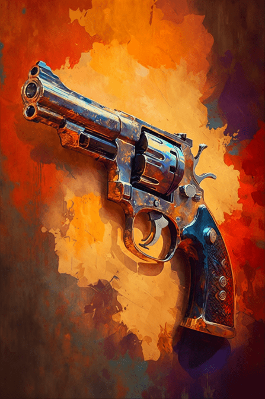

# 左轮手枪(COD-废城)  
> 一把改装的左轮，可以装更多弹药  
  
<table class="table table-bordered" data-toggle="table"  data-show-header="false"><thead style="display:none"><tr ><th  style="width:50%;text-align:left;vertical-align:top;"  >title</th><th  style="width:50%;text-align:left;vertical-align:top;"  ></th></tr></thead><tr ><td  style="width:50%;text-align:left;vertical-align:top;"  >**重量：**200  **标签：**	[“军用的”](tag_Military.md)  **可用次数：**1</td><td  style="width:50%;text-align:left;vertical-align:top;"  >

<a href="cod_左轮手枪.md" style="color:black">左轮手枪</a>

</td></tr></tbody></table>  
  
## 获取来源  

** 使用**[左轮子弹](cod_左轮子弹.md)装填

[空的左轮](cod_空的左轮.md)

  
  
## 可拖入  

<table style="margin-bottom:0px;"><tr><td style="width:40%;text-align:left; background-color:#FEFEFE"><b>拖入：</b>[

[左轮子弹](cod_左轮子弹.md)](cod_左轮子弹.md)</td><td style="width:40%;font-size:1em;font-weight:bold;background-color:#FEFEFE">装弹 (3分) </td></tr><tr style="background-color:#FFFFFF"><td style=""><b>使用物：</b></td><td style=""><b>自身：</b>使用次数  <b>+1(8.33%)</b></td></tr></table>
  
  
## 属性   

<table style="margin-bottom:0px;"><tr><td style="width:30%;text-align:left; background-color:#FEFEFE;font-size:1.3em;font-weight:bold;">使用次数</td><td style="font-size:1em;background-color:#FEFEFE">初始：1 , 最大：12 -</td></tr><tr style="background-color:#FFFFFF"><td colspan=2>** 到达0时：Out of ammo ** 自身: → [

[空的左轮](cod_空的左轮.md)](cod_空的左轮.md)</td></tr></table>
  

