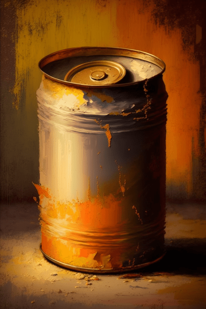

# 建筑废墟(COD-废城)  
> 我可以直接挖，但是用斧头或铲子的话，我应该挖掘的更彻底，发现更多有用的东西  
  
<table class="table table-bordered" data-toggle="table"  data-show-header="false"><thead style="display:none"><tr ><th  style="width:50%;text-align:left;vertical-align:top;"  >title</th><th  style="width:50%;text-align:left;vertical-align:top;"  ></th></tr></thead><tr ><td  style="width:50%;text-align:left;vertical-align:top;"  >**重量：**5000  **可用次数：**10  ** 效果: ** [

[不适](Discomfort.md)](Discomfort.md)<b>+50</b></td><td  style="width:50%;text-align:left;vertical-align:top;"  >

<a href="cod_建筑废墟.md" style="color:black">建筑废墟</a>

</td></tr></tbody></table>  
  
## 获取来源  

Explore

[神秘小镇](cod_Exp_神秘小镇.md)

Explore

[深入小镇](cod_Exp_深入小镇.md)

  
  
## 动作  

<table><tr><td rowspan="2" style="width:200px;text-align:center;font-size:1.3em;font-weight:bold">

Clear

1小时

</td><td></td></tr><tr><td><b>自身：</b>使用次数  <b>-2</b></td></tr><tr><td colspan="2"><b>需求：</b>[

[光亮](Light.md)](Light.md): <b>10-100</b></td></tr><tr><td colspan="2"><b>状态变化：</b>[

[耐力](Stamina.md)](Stamina.md)<b>-8</b>, [

[手掌损伤](HandDamage.md)](HandDamage.md)<b>+25</b></td></tr><tr><td colspan="2">[

[干土堆](DirtPile.md)](DirtPile.md)(<b>+0～+2</b>), [

[长木棍](StickLong.md)](StickLong.md)(<b>+0～+1</b>)</td></tr></table>
  
  
  
## 可拖入  

<table style="margin-bottom:0px;"><tr><td style="width:40%;text-align:left; background-color:#FEFEFE"><b>拖入：</b>[“铲子”](tag_Shovel.md) | [“斧”](tag_Axe.md)</td><td style="width:40%;font-size:1em;font-weight:bold;background-color:#FEFEFE">深度挖掘 (30分) </td></tr><tr><td colspan="2"><b>需求：</b>[

[光亮](Light.md)](Light.md): <b>10-100</b></td></tr><tr style="background-color:#FFFFFF"><td style=""><b>使用物：</b>使用次数  <b>-1(-2%)</b></td><td style=""><b>自身：</b>使用次数  <b>-2</b></td></tr><tr><td colspan="2"><b>状态变化：</b>[

[耐力](Stamina.md)](Stamina.md)<b>-9</b>, [

[手掌损伤](HandDamage.md)](HandDamage.md)<b>+20</b>, [

[石工(技能)](Skill_Knapping.md)](Skill_Knapping.md)<b>+0.5</b></td></tr><tr><td colspan="2">

<table style="margin-bottom:3px;"><tr><td rowspan=2 style="text-align:center" width="80px">
基础权重

10
</td><td style="font-size:0.6em;line-height:0.6em;font-weight:bold">Debris</td></tr><tr><td>[

[干土堆](DirtPile.md)](DirtPile.md)(<b>+0～+2</b>), [

[长木棍](StickLong.md)](StickLong.md)(<b>+0～+1</b>), [

[红砖](cod_红砖.md)](cod_红砖.md)(<b>+0～+1</b>)</td></tr></table>

<table style="margin-bottom:3px;"><tr><td rowspan=2 style="text-align:center" width="80px">
基础权重

1
</td><td style="font-size:0.6em;line-height:0.6em;font-weight:bold">biubiu</td></tr><tr><td>[

[陈旧的牛肉罐头](cod_陈旧的牛肉罐头.md)](cod_陈旧的牛肉罐头.md)(<b>+0～+1</b>)</td></tr></table>

<table style="margin-bottom:3px;"><tr><td rowspan=2 style="text-align:center" width="80px">
基础权重

1
</td><td style="font-size:0.6em;line-height:0.6em;font-weight:bold">Debris</td></tr><tr><td>[

[陈旧的狗粮罐头](cod_狗粮罐头.md)](cod_狗粮罐头.md)(<b>+0～+1</b>)</td></tr></table>

<table style="margin-bottom:3px;"><tr><td rowspan=2 style="text-align:center" width="80px">
基础权重

1
</td><td style="font-size:0.6em;line-height:0.6em;font-weight:bold">Debris</td></tr><tr><td>[

[空锡罐](cod_空锡罐.md)](cod_空锡罐.md)(<b>+0～+1</b>)</td></tr></table>

<table style="margin-bottom:3px;"><tr><td rowspan=2 style="text-align:center" width="80px">
基础权重

1
</td><td style="font-size:0.6em;line-height:0.6em;font-weight:bold">Debris</td></tr><tr><td>[

[木板](Plank.md)](Plank.md)(<b>+0～+1</b>)</td></tr></table>

<table style="margin-bottom:3px;"><tr><td rowspan=2 style="text-align:center" width="80px">
基础权重

1
</td><td style="font-size:0.6em;line-height:0.6em;font-weight:bold">Dry Leaves</td></tr><tr><td>[

[僵尸(事件)](cod_eve_普通僵尸攻击.md)](cod_eve_普通僵尸攻击.md)(<b>+1</b>)</td></tr></table>

</td></tr></table>
  
  
## 属性   

<table style="margin-bottom:0px;"><tr><td style="width:30%;text-align:left; background-color:#FEFEFE;font-size:1.3em;font-weight:bold;">使用次数</td><td style="font-size:1em;background-color:#FEFEFE">初始：10 -</td></tr><tr style="background-color:#FFFFFF"><td colspan=2>** 到达0时： ** 自身: →消失</td></tr></table>
  

