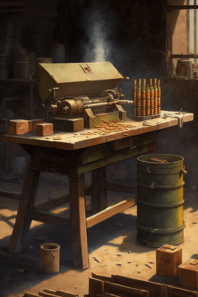

# 弹药制作台(COD-废城)  
> 有了这个台子，火药、金属废料和红砖粉末，我就可以制作子弹了  
  
<table class="table table-bordered" data-toggle="table"  data-show-header="false"><thead style="display:none"><tr ><th  style="width:50%;text-align:left;vertical-align:top;"  >title</th><th  style="width:50%;text-align:left;vertical-align:top;"  ></th></tr></thead><tr ><td  style="width:50%;text-align:left;vertical-align:top;"  >**重量：**2500  **标签：**	[“高级装饰品”](tag_DecorationAdv.md), [“美丽的/好看的”](tag_Pretty.md)</td><td  style="width:50%;text-align:left;vertical-align:top;"  >

<a href="cod_弹药制作台.md" style="color:black">弹药制作台</a>

</td></tr></tbody></table>  
  
## 获取来源  

继续

[尼根(事件)](cod_eve_救世军信任度奖励50.md)

蓝图制造

[制6发左轮子弹(蓝图)](cod_制作左轮子弹蓝图.md)

  
  
## 可用于蓝图  

<a href="cod_制作左轮子弹蓝图.md" style="color:black">制6发左轮子弹</a>

  
  
  

