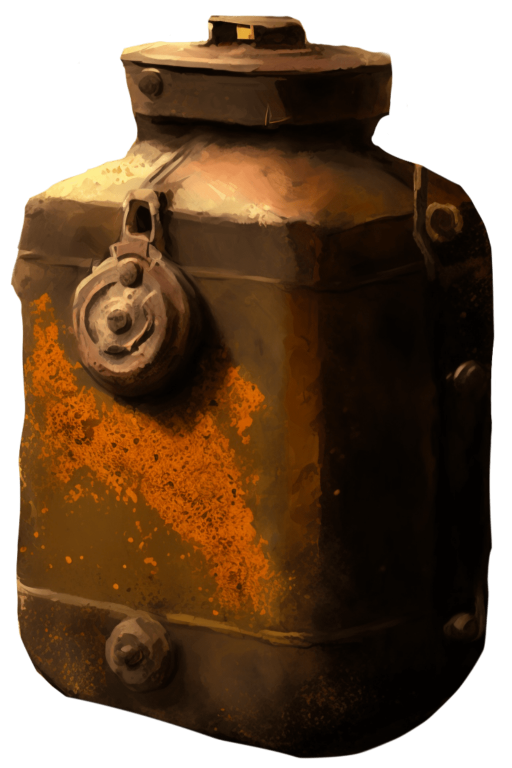

# 破箱子(COD-废城)  
> 破旧的箱子  
  
<table class="table table-bordered" data-toggle="table"  data-show-header="false"><thead style="display:none"><tr ><th  style="width:50%;text-align:left;vertical-align:top;"  >title</th><th  style="width:50%;text-align:left;vertical-align:top;"  ></th></tr></thead><tr ><td  style="width:50%;text-align:left;vertical-align:top;"  >**重量：**100</td><td  style="width:50%;text-align:left;vertical-align:top;"  >

<a href="cod_弹药学技能书.md" style="color:black">破箱子</a>

</td></tr></tbody></table>  
  
## 获取来源  

奇怪

[加文(事件)](cod_eve_信任度30.md)

  
  
## 动作  

<table><tr><td rowspan="2" style="width:200px;text-align:center;font-size:1.3em;font-weight:bold">

搜索

1小时

</td><td></td></tr><tr><td></td></tr><tr><td colspan="2"><b>状态变化：</b>[

[餐馆好感度](cod_弹药学.md)](cod_弹药学.md)<b>+1～+2</b></td></tr></table>
  

<table><tr><td rowspan="2" style="width:200px;text-align:center;font-size:1.3em;font-weight:bold">

搜索

4小时

</td><td></td></tr><tr><td></td></tr><tr><td colspan="2"><b>状态变化：</b>[

[餐馆好感度](cod_弹药学.md)](cod_弹药学.md)<b>+4～+8</b></td></tr></table>
  
  
  

