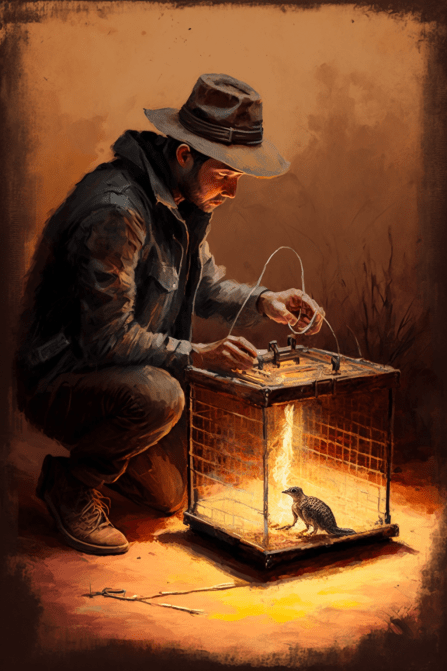
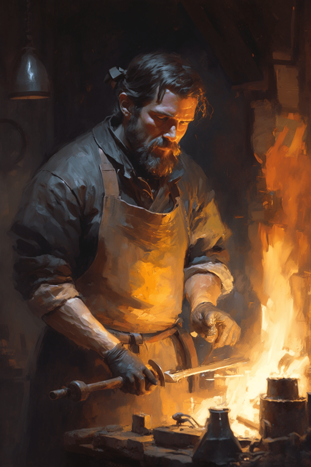

# 餐馆好感度  
> 餐馆好感度  
  

<b>基础值: </b> 0 
  

<b>变化范围: </b> 0 ~ 150 
  

<b>基础变化率: </b> 无 
  

<b>衰减: </b>相同来源3小时内衰减80%，叠加2次 
  
## 可被以下操作改变  
<table class="table table-bordered" data-toggle="table"  ><thead style=""><tr ><th  style="text-align:left;vertical-align:top;"  >来源</th><th  style="text-align:left;vertical-align:top;"  >操作</th><th  style="text-align:left;vertical-align:top;"  data-sortable="true"  >值</th></tr></thead><tr ><td  style="text-align:left;vertical-align:top;"  >[

[购买10个蛇草(蓝图)](cod_尼根任务蓝图1.md)](cod_尼根任务蓝图1.md)</td><td  style="text-align:left;vertical-align:top;"  >蓝图制造</td><td  style="text-align:left;vertical-align:top;"  >15</td></tr><tr ><td  style="text-align:left;vertical-align:top;"  >[

[加文(事件)](cod_eve_回答我是尼根.md)](cod_eve_回答我是尼根.md)</td><td  style="text-align:left;vertical-align:top;"  >奇怪</td><td  style="text-align:left;vertical-align:top;"  >5</td></tr><tr ><td  style="text-align:left;vertical-align:top;"  >[

[购买10个蛇草(蓝图)](cod_击鼓工作.md)](cod_击鼓工作.md)</td><td  style="text-align:left;vertical-align:top;"  >蓝图制造</td><td  style="text-align:left;vertical-align:top;"  >1</td></tr><tr ><td  style="text-align:left;vertical-align:top;"  >[

[购买10个蛇草(蓝图)](cod_务农工作.md)](cod_务农工作.md)</td><td  style="text-align:left;vertical-align:top;"  >蓝图制造</td><td  style="text-align:left;vertical-align:top;"  >1</td></tr><tr ><td  style="text-align:left;vertical-align:top;"  >[

[购买10个蛇草(蓝图)](cod_厨师工作.md)](cod_厨师工作.md)</td><td  style="text-align:left;vertical-align:top;"  >蓝图制造</td><td  style="text-align:left;vertical-align:top;"  >1</td></tr><tr ><td  style="text-align:left;vertical-align:top;"  >[

[购买10个蛇草(蓝图)](cod_射箭教学工作.md)](cod_射箭教学工作.md)</td><td  style="text-align:left;vertical-align:top;"  >蓝图制造</td><td  style="text-align:left;vertical-align:top;"  >1</td></tr><tr ><td  style="text-align:left;vertical-align:top;"  >[

[购买10个蛇草(蓝图)](cod_投石索教练.md)](cod_投石索教练.md)</td><td  style="text-align:left;vertical-align:top;"  >蓝图制造</td><td  style="text-align:left;vertical-align:top;"  >1</td></tr><tr ><td  style="text-align:left;vertical-align:top;"  >[

[购买10个蛇草(蓝图)](cod_捕兽工作.md)](cod_捕兽工作.md)</td><td  style="text-align:left;vertical-align:top;"  >蓝图制造</td><td  style="text-align:left;vertical-align:top;"  >1</td></tr><tr ><td  style="text-align:left;vertical-align:top;"  >[

[购买10个蛇草(蓝图)](cod_木工工作.md)](cod_木工工作.md)</td><td  style="text-align:left;vertical-align:top;"  >蓝图制造</td><td  style="text-align:left;vertical-align:top;"  >1</td></tr><tr ><td  style="text-align:left;vertical-align:top;"  >[

[购买10个蛇草(蓝图)](cod_杂工工作蓝图.md)](cod_杂工工作蓝图.md)</td><td  style="text-align:left;vertical-align:top;"  >蓝图制造</td><td  style="text-align:left;vertical-align:top;"  >1</td></tr><tr ><td  style="text-align:left;vertical-align:top;"  >[

[购买10个蛇草(蓝图)](cod_监工工作.md)](cod_监工工作.md)</td><td  style="text-align:left;vertical-align:top;"  >蓝图制造</td><td  style="text-align:left;vertical-align:top;"  >1</td></tr><tr ><td  style="text-align:left;vertical-align:top;"  >[

[购买10个蛇草(蓝图)](cod_石匠工作.md)](cod_石匠工作.md)</td><td  style="text-align:left;vertical-align:top;"  >蓝图制造</td><td  style="text-align:left;vertical-align:top;"  >1</td></tr><tr ><td  style="text-align:left;vertical-align:top;"  >[

[购买10个蛇草(蓝图)](cod_纺织工作.md)](cod_纺织工作.md)</td><td  style="text-align:left;vertical-align:top;"  >蓝图制造</td><td  style="text-align:left;vertical-align:top;"  >1</td></tr><tr ><td  style="text-align:left;vertical-align:top;"  >[

[购买10个蛇草(蓝图)](cod_钓鱼工作.md)](cod_钓鱼工作.md)</td><td  style="text-align:left;vertical-align:top;"  >蓝图制造</td><td  style="text-align:left;vertical-align:top;"  >1</td></tr><tr ><td  style="text-align:left;vertical-align:top;"  >[

[购买10个蛇草(蓝图)](cod_铁匠工作.md)](cod_铁匠工作.md)</td><td  style="text-align:left;vertical-align:top;"  >蓝图制造</td><td  style="text-align:left;vertical-align:top;"  >1</td></tr><tr ><td  style="text-align:left;vertical-align:top;"  >[

[购买10个蛇草(蓝图)](cod_长矛教学工作.md)](cod_长矛教学工作.md)</td><td  style="text-align:left;vertical-align:top;"  >蓝图制造</td><td  style="text-align:left;vertical-align:top;"  >1</td></tr><tr ><td  style="text-align:left;vertical-align:top;"  >[

[加文(事件)](cod_eve_尼根的试验.md)](cod_eve_尼根的试验.md)</td><td  style="text-align:left;vertical-align:top;"  >奇怪</td><td  style="text-align:left;vertical-align:top;"  >-50</td></tr></tbody></table>  
  

