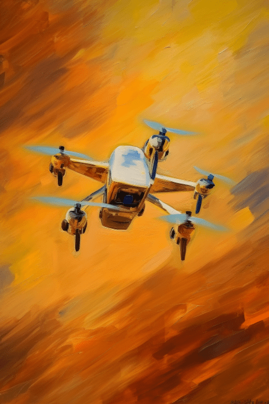

# 无人机伙伴(COD-废城)  
> “嗡嗡”。一架无人机，装备可以提升你的所有技能，提供20护甲值，但是会降低潜行，因为跟它说小点声它一点也不听  
  
<table class="table table-bordered" data-toggle="table"  data-show-header="false"><thead style="display:none"><tr ><th  style="width:50%;text-align:left;vertical-align:top;"  >title</th><th  style="width:50%;text-align:left;vertical-align:top;"  ></th></tr></thead><tr ><td  style="width:50%;text-align:left;vertical-align:top;"  >**重量：**5  **装备时减重：**-5  **标签：**	[“面部”](tag_Mask.md), [“腿部（内层）”](tag_Clothing.md)  **装备：**[“面部装备”](eTag_Mask.md)  **可用次数：**2880  ** 效果: ** [

[矛战(技能)](Skill_SpearFighting.md)](Skill_SpearFighting.md)<b>+16</b> [

[箭术(技能)](Skill_Archery.md)](Skill_Archery.md)<b>+16</b> [

[攀爬(技能)](Skill_Climbing.md)](Skill_Climbing.md)<b>+16</b> [

[投石(技能)](Skill_RockThrowing.md)](Skill_RockThrowing.md)<b>+16</b> [

[投石索(技能)](Skill_Sling.md)](Skill_Sling.md)<b>+16</b> [

[手枪(技能)](Skill_Handguns.md)](Skill_Handguns.md)<b>+16</b> [

[潜行(技能)](Skill_Stealth.md)](Skill_Stealth.md)<b>-5</b> [

[护甲](Armor.md)](Armor.md)<b>+20</b> [

[烹饪(技能)](Skill_Cooking.md)](Skill_Cooking.md)<b>+10</b> [

[制作(技能)](Skill_Crafting.md)](Skill_Crafting.md)<b>+10</b> [

[钓鱼(技能)](Skill_Fishing.md)](Skill_Fishing.md)<b>+10</b> [

[药草学(技能)](Skill_Herbology.md)](Skill_Herbology.md)<b>+10</b> [

[石工(技能)](Skill_Knapping.md)](Skill_Knapping.md)<b>+10</b> [

[金工(技能)](Skill_Metalworking.md)](Skill_Metalworking.md)<b>+10</b> [

[击鼓(技能)](Skill_Percussion.md)](Skill_Percussion.md)<b>+10</b> [

[叉鱼(技能)](Skill_SpearFishing.md)](Skill_SpearFishing.md)<b>+10</b> [

[游泳(技能)](Skill_Swimming.md)](Skill_Swimming.md)<b>+10</b> [

[纺织(技能)](Skill_Tailoring.md)](Skill_Tailoring.md)<b>+10</b> [

[陷阱(技能)](Skill_Trapping.md)](Skill_Trapping.md)<b>+10</b> [

[管乐器(技能)](Skill_WindInstruments.md)](Skill_WindInstruments.md)<b>+10</b> [

[木工(技能)](Skill_Woodworking.md)](Skill_Woodworking.md)<b>+10</b></td><td  style="width:50%;text-align:left;vertical-align:top;"  >

<a href="cod_无人机伙伴.md" style="color:black">无人机伙伴</a>

</td></tr></tbody></table>  
  
## 获取来源  

蓝图制造

[购买无人机(蓝图)](cod_购买无人机.md)

  
  
## 动作  

<table><tr><td rowspan="2" style="width:200px;text-align:center;font-size:1.3em;font-weight:bold">

你~没有朋友吗 ？

4小时

</td><td></td></tr><tr><td></td></tr><tr><td colspan="2">[

[攻击无人机！(事件)](Event_DroneFight.md)](Event_DroneFight.md)(<b>+3～+5</b>)</td></tr></table>
  

<table><tr><td rowspan="2" style="width:200px;text-align:center;font-size:1.3em;font-weight:bold">

你能不能小点声？能不能？

30分

</td><td></td></tr><tr><td></td></tr><tr><td colspan="2">[

[无人机(事件)](cod_eve_血压升高.md)](cod_eve_血压升高.md)(<b>+1</b>)[

[血压](Blood.md)](Blood.md)<b>+5</b></td></tr></table>
  
  
  
## 属性   

<table style="margin-bottom:0px;"><tr><td style="width:30%;text-align:left; background-color:#FEFEFE;font-size:1.3em;font-weight:bold;">使用次数</td><td style="font-size:1em;background-color:#FEFEFE">初始：2880 , 最大：2880 -</td></tr><tr style="background-color:#FFFFFF"><td colspan=2></td></tr></table>
  

