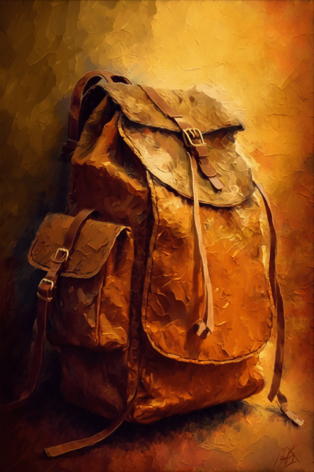

# 末日背包(COD-废城)  
> I can store things inside. <b>CAN BE EQUIPPED ON EQUIPMENT SLOTS</b>

  
  
<table class="table table-bordered" data-toggle="table"  data-show-header="false"><thead style="display:none"><tr ><th  style="width:50%;text-align:left;vertical-align:top;"  >title</th><th  style="width:50%;text-align:left;vertical-align:top;"  ></th></tr></thead><tr ><td  style="width:50%;text-align:left;vertical-align:top;"  >** 不可删除 **  ** 不可堆叠 **  **重量：**500  **装备时减重：**-475  **标签：**	[“袋子”](tag_Bag.md), [“背包”](tag_Backpack.md)  **装备：**[“后背装备”](eTag_Backpack.md)  **容量：**2500  **减重：**-1500</td><td  style="width:50%;text-align:left;vertical-align:top;"  >

<a href="cod_末日背包.md" style="color:black">末日背包</a>

</td></tr></tbody></table>  
  
## 获取来源  

蓝图制造

[购买背包(蓝图)](cod_购买末日背包.md)

  
  

