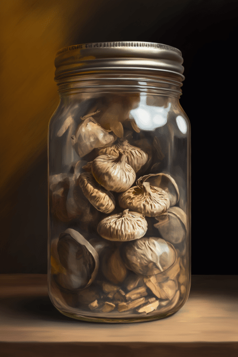
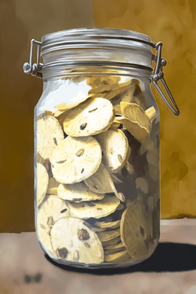

# 破败轮船(COD-废城)  
> 一个破败的轮船  
  
<table class="table table-bordered" data-toggle="table"  data-show-header="false"><thead style="display:none"><tr ><th  style="width:50%;text-align:left;vertical-align:top;"  >title</th><th  style="width:50%;text-align:left;vertical-align:top;"  ></th></tr></thead><tr ><td  style="width:50%;text-align:left;vertical-align:top;"  >**重量：**50  **标签：**	[“储水容器”](tag_WaterContainer.md), [“容器（密封）”](tag_ContainerSealed.md),   **储水量：**300</td><td  style="width:50%;text-align:left;vertical-align:top;"  >

<a href="cod_玻璃罐.md" style="color:black">破败轮船</a>

</td></tr></tbody></table>  
  
## 获取来源  

搜索

[破箱子](cod_废墟1箱子.md)

搜索

[破箱子](cod_废墟2箱子.md)

搜索

[破箱子](cod_废墟3箱子.md)

搜索

[破箱子](cod_废墟4箱子.md)

转化

[罐装香蕉片](cod_自制柠檬草罐头.md)

转化

[罐装香蕉片](cod_自制肉罐头.md)

转化

[罐装香蕉片](cod_自制芒果罐头.md)

search

[破败轮船](cod_自制蘑菇罐头.md)

转化

[罐装香蕉片](cod_自制虾罐头.md)

转化

[罐装香蕉片](cod_自制蛋罐头.md)

转化

[罐装香蕉片](cod_自制辣椒罐头.md)

转化

[罐装香蕉片](cod_自制香蕉罐头.md)

转化

[罐装蛋](cod_Nc_ScavengingSupplies_Food_CannedGood_TypeEight.md)

转化

[泰园芒果](cod_Nc_ScavengingSupplies_Food_CannedGood_TypeFive.md)

转化

[德式肉肠](cod_Nc_ScavengingSupplies_Food_CannedGood_TypeFour.md)

转化

[罐装辣椒](cod_Nc_ScavengingSupplies_Food_CannedGood_TypeNine.md)

转化

[冰原虾品](cod_Nc_ScavengingSupplies_Food_CannedGood_TypeSeven.md)

吃

[莱斯蘑菇](cod_Nc_ScavengingSupplies_Food_CannedGood_TypeSix.md)

转化

[罐装香蕉片](cod_Nc_ScavengingSupplies_Food_CannedGood_TypeTen.md)

转化

[世家草本](cod_Nc_ScavengingSupplies_Food_CannedGood_TypeThree.md)

搜索

[破箱子](cod_一箱玻璃罐.md)

  
  
## 动作  

<table><tr><td rowspan="2" style="width:200px;text-align:center;font-size:1.3em;font-weight:bold">

search

</td><td></td></tr><tr><td></td></tr><tr><td colspan="2"><b>需求：</b>[

[降水值](RainValue.md)](RainValue.md): <b>1-5</b></td></tr><tr><td colspan="2">[水](LQ_Water.md)(<b>+50</b>)</td></tr></table>
  
  
  
## 可用于蓝图  

<a href="cod_自制柠檬草罐头蓝图.md" style="color:black">购买10个蛇草</a>

<a href="cod_自制肉罐头蓝图.md" style="color:black">购买10个蛇草</a>

<a href="cod_自制芒果罐头蓝图.md" style="color:black">购买10个蛇草</a>

<a href="cod_自制蘑菇罐头蓝图.md" style="color:black">购买10个蛇草</a>

<a href="cod_自制虾罐头蓝图.md" style="color:black">购买10个蛇草</a>

<a href="cod_自制辣椒罐头蓝图.md" style="color:black">购买10个蛇草</a>

<a href="cod_自制香蕉罐头蓝图.md" style="color:black">购买10个蛇草</a>

<a href="cod_蛋罐头蓝图.md" style="color:black">购买10个蛇草</a>

  
  
  

