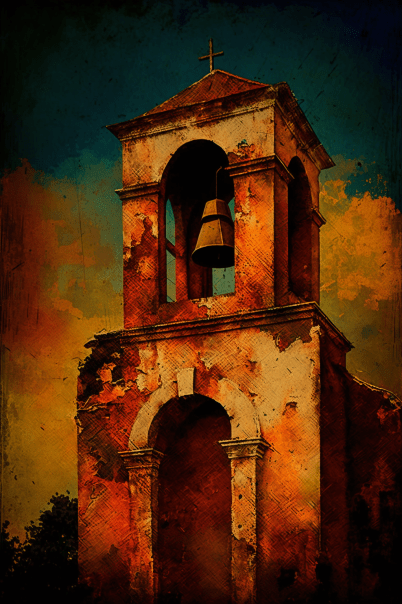
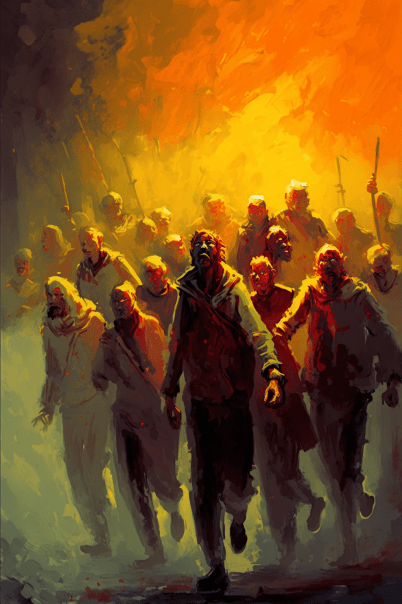
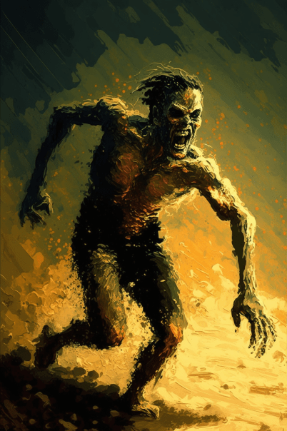
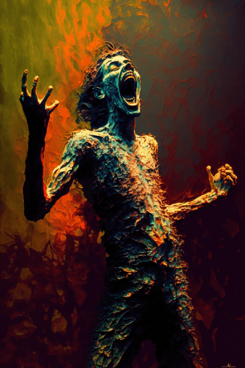
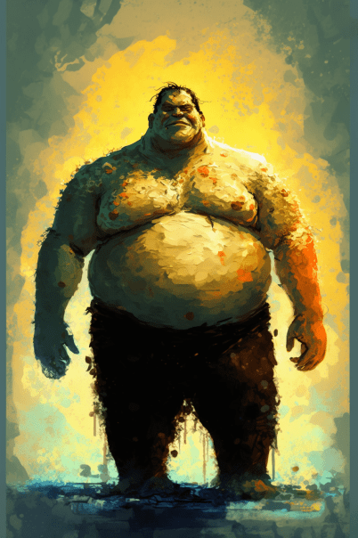
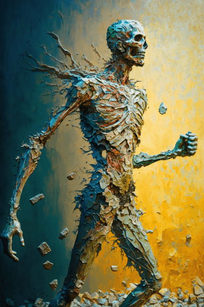

# 破败轮船(COD-废城)  
> 一个破败的轮船  
  
<table class="table table-bordered" data-toggle="table"  data-show-header="false"><thead style="display:none"><tr ><th  style="width:50%;text-align:left;vertical-align:top;"  >title</th><th  style="width:50%;text-align:left;vertical-align:top;"  ></th></tr></thead><tr ><td  style="width:50%;text-align:left;vertical-align:top;"  >**重量：**5000</td><td  style="width:50%;text-align:left;vertical-align:top;"  >

<a href="cod_神秘小镇钟楼.md" style="color:black">破败轮船</a>

</td></tr></tbody></table>  
  
## 获取来源  

探索

[破败轮船(腐败之城)](cod_Exp_神秘小镇.md)

  
  
## 动作  

<table><tr><td rowspan="2" style="width:200px;text-align:center;font-size:1.3em;font-weight:bold">

search

15分

</td><td></td></tr><tr><td></td></tr><tr><td colspan="2"><b>需求：</b>[

[光亮](Light.md)](Light.md): <b>10-100</b></td></tr><tr><td colspan="2"><b>状态变化：</b>[

[耐力](Stamina.md)](Stamina.md)<b>-4</b>, [

[手掌损伤](HandDamage.md)](HandDamage.md)<b>+10</b>, [

[勇气](Courage.md)](Courage.md)<b>+500</b>, [

[精神失常](MindState.md)](MindState.md)<b>+45～+55</b>, [

[情绪](Morale.md)](Morale.md)<b>+35～+45</b>, [

[孤立感](Isolation.md)](Isolation.md)<b>-20～-30</b></td></tr><tr><td colspan="2">

<table style="margin-bottom:3px;"><tr><td rowspan=2 style="text-align:center" width="80px">
基础权重

1
</td><td style="font-size:0.6em;line-height:0.6em;font-weight:bold">Debris</td></tr><tr><td>[

[尸群(事件)(腐败之城)](cod_eve_尸群来了.md)](cod_eve_尸群来了.md)(<b>+0～+1</b>), [

[尖叫僵尸(事件)](cod_eve_迅猛僵尸攻击.md)](cod_eve_迅猛僵尸攻击.md)(<b>+0～+3</b>)</td></tr></table>

<table style="margin-bottom:3px;"><tr><td rowspan=2 style="text-align:center" width="80px">
基础权重

1
</td><td style="font-size:0.6em;line-height:0.6em;font-weight:bold">Debris</td></tr><tr><td>[

[尸群(事件)(腐败之城)](cod_eve_尸群来了.md)](cod_eve_尸群来了.md)(<b>+0～+1</b>), [

[尖叫僵尸(事件)](cod_eve_尖叫僵尸攻击.md)](cod_eve_尖叫僵尸攻击.md)(<b>+0～+3</b>)</td></tr></table>

<table style="margin-bottom:3px;"><tr><td rowspan=2 style="text-align:center" width="80px">
基础权重

1
</td><td style="font-size:0.6em;line-height:0.6em;font-weight:bold">Debris</td></tr><tr><td>[

[巨霸僵尸(事件)](cod_eve_巨霸僵尸攻击.md)](cod_eve_巨霸僵尸攻击.md)(<b>+0～+1</b>), [

[尖叫僵尸(事件)](cod_eve_迅猛僵尸攻击.md)](cod_eve_迅猛僵尸攻击.md)(<b>+0～+3</b>)</td></tr></table>

<table style="margin-bottom:3px;"><tr><td rowspan=2 style="text-align:center" width="80px">
基础权重

1
</td><td style="font-size:0.6em;line-height:0.6em;font-weight:bold">Debris</td></tr><tr><td>[

[石化僵尸(事件)(基地)](cod_eve_石化僵尸攻击.md)](cod_eve_石化僵尸攻击.md)(<b>+0～+3</b>), [

[尖叫僵尸(事件)](cod_eve_尖叫僵尸攻击.md)](cod_eve_尖叫僵尸攻击.md)(<b>+0～+2</b>)</td></tr></table>

</td></tr></table>
  
  
  

