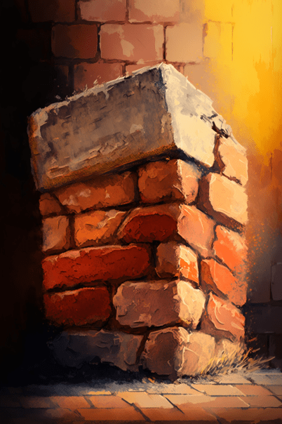
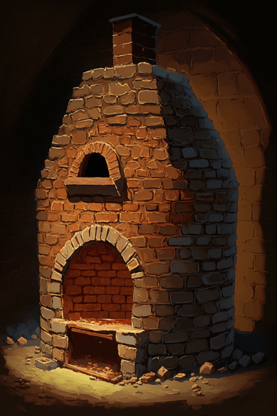
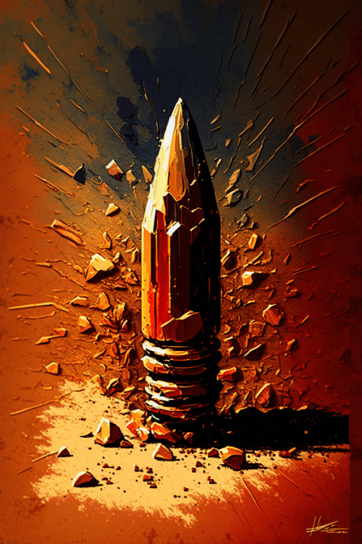

# 红砖(COD-废城)  
> 砌啥好呢  
  
<table class="table table-bordered" data-toggle="table"  data-show-header="false"><thead style="display:none"><tr ><th  style="width:50%;text-align:left;vertical-align:top;"  >title</th><th  style="width:50%;text-align:left;vertical-align:top;"  ></th></tr></thead><tr ><td  style="width:50%;text-align:left;vertical-align:top;"  >**重量：**150  **标签：**	[“沉重的”](tag_Heavy.md), </td><td  style="width:50%;text-align:left;vertical-align:top;"  >

<a href="cod_红砖.md" style="color:black">红砖</a>

</td></tr></tbody></table>  
  
## 获取来源  

** 使用**[“铲子”](tag_Shovel.md) , [“斧”](tag_Axe.md)深度挖掘

[大建筑废墟](cod_大建筑废墟.md)

** 使用**[“铲子”](tag_Shovel.md) , [“斧”](tag_Axe.md)深度挖掘

[建筑废墟](cod_废墟1.md)

** 使用**[“铲子”](tag_Shovel.md) , [“斧”](tag_Axe.md)深度挖掘

[建筑废墟](cod_废墟2.md)

** 使用**[“铲子”](tag_Shovel.md) , [“斧”](tag_Axe.md)深度挖掘

[建筑废墟](cod_废墟3.md)

** 使用**[“铲子”](tag_Shovel.md) , [“斧”](tag_Axe.md)深度挖掘

[建筑废墟](cod_废墟4.md)

** 使用**[“铲子”](tag_Shovel.md) , [“斧”](tag_Axe.md)深度挖掘

[建筑废墟](cod_建筑废墟.md)

** 使用**[“锤”](tag_Hammer.md)Demolish

[砖炉](cod_未点燃的砖炉.md)

** 使用**[“铲子”](tag_Shovel.md) , [“斧”](tag_Axe.md)挖掘

[石块堆](cod_石块堆.md)

  
  
## 可拖入  

<table style="margin-bottom:0px;"><tr><td style="width:40%;text-align:left; background-color:#FEFEFE"><b>拖入：</b>[“锤”](tag_Hammer.md)</td><td style="width:40%;font-size:1em;font-weight:bold;background-color:#FEFEFE">Break (15分) [“手部动作(组)”](HandAction.md)</td></tr><tr style="background-color:#FFFFFF"><td style=""><b>使用物：</b></td><td style=""><b>自身：</b>→ [

[干土堆](DirtPile.md)](DirtPile.md)</td></tr></table>
  
  
## 可用于蓝图  

<a href="cod_砖炉蓝图.md" style="color:black">砖炉</a>

<a href="cod_出售红砖.md" style="color:black">出售红砖</a>

<a href="cod_制作左轮子弹蓝图.md" style="color:black">制6发左轮子弹</a>

  
  
  

