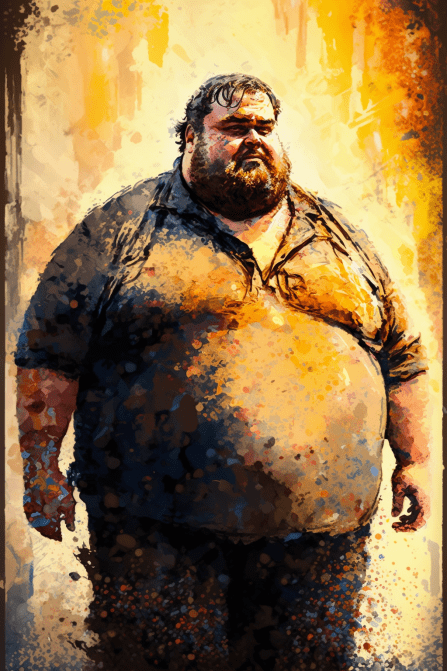
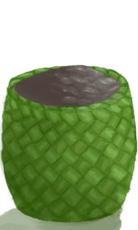
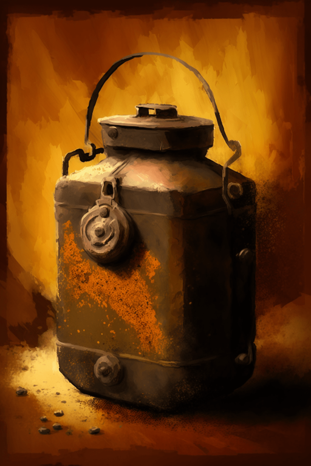
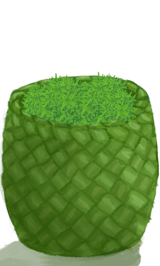

# 破败轮船(COD-废城)  
> 一个破败的轮船  
  
<table class="table table-bordered" data-toggle="table"  data-show-header="false"><thead style="display:none"><tr ><th  style="width:50%;text-align:left;vertical-align:top;"  >title</th><th  style="width:50%;text-align:left;vertical-align:top;"  ></th></tr></thead><tr ><td  style="width:50%;text-align:left;vertical-align:top;"  >**重量：**1500000  **标签：**	[“高级装饰品”](tag_DecorationAdv.md), [“美丽的/好看的”](tag_Pretty.md), </td><td  style="width:50%;text-align:left;vertical-align:top;"  >

<a href="cod_肥乔.md" style="color:black">破败轮船</a>

</td></tr></tbody></table>  
  
## 获取来源  

蓝图制造

[购买10个蛇草(蓝图)](cod_出售公山羊.md)

蓝图制造

[购买10个蛇草(蓝图)](cod_出售公野猪.md)

蓝图制造

[购买10个蛇草(蓝图)](cod_出售山羊.md)

蓝图制造

[购买10个蛇草(蓝图)](cod_出售巨蜥.md)

蓝图制造

[购买10个蛇草(蓝图)](cod_购买泥堆.md)

蓝图制造

[购买10个蛇草(蓝图)](cod_购买泥锅.md)

蓝图制造

[购买10个蛇草(蓝图)](cod_购买火药罐.md)

蓝图制造

[购买10个蛇草(蓝图)](cod_购买蛇草.md)

蓝图制造

[购买10个蛇草(蓝图)](cod_购买鱼罐头配方.md)

探索

[破败轮船(基地)](cod_Exp_基地.md)

  
  
## 动作  

<table><tr><td rowspan="2" style="width:200px;text-align:center;font-size:1.3em;font-weight:bold">

search

</td><td></td></tr><tr><td></td></tr><tr><td colspan="2">[

[加文(事件)](cod_eve_肥乔谈话1.md)](cod_eve_肥乔谈话1.md)(<b>+1</b>)</td></tr></table>
  
  
  
## 可用于蓝图  

<a href="cod_出售公山羊.md" style="color:black">购买10个蛇草</a>

<a href="cod_出售公野猪.md" style="color:black">购买10个蛇草</a>

<a href="cod_出售山羊.md" style="color:black">购买10个蛇草</a>

<a href="cod_出售巨蜥.md" style="color:black">购买10个蛇草</a>

<a href="cod_购买泥堆.md" style="color:black">购买10个蛇草</a>

<a href="cod_购买泥锅.md" style="color:black">购买10个蛇草</a>

<a href="cod_购买火药罐.md" style="color:black">购买10个蛇草</a>

<a href="cod_购买蛇草.md" style="color:black">购买10个蛇草</a>

<a href="cod_购买鱼罐头配方.md" style="color:black">购买10个蛇草</a>

  
  
  

