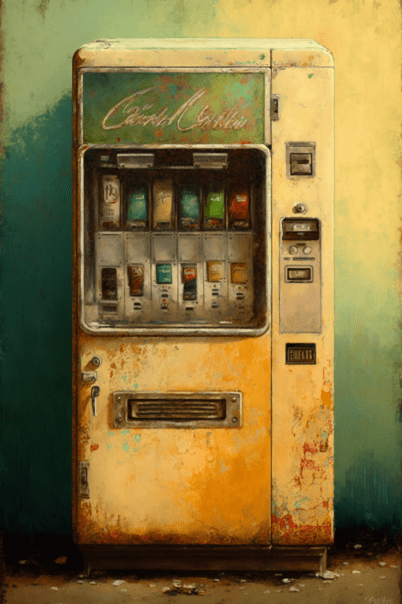

# 自动售货机(COD-废城)  
> 可以花钱随机购买两种零食  
  
<table class="table table-bordered" data-toggle="table"  data-show-header="false"><thead style="display:none"><tr ><th  style="width:50%;text-align:left;vertical-align:top;"  >title</th><th  style="width:50%;text-align:left;vertical-align:top;"  ></th></tr></thead><tr ><td  style="width:50%;text-align:left;vertical-align:top;"  >**重量：**5000  **标签：**	[“高级装饰品”](tag_DecorationAdv.md), [“美丽的/好看的”](tag_Pretty.md), [“沉重的”](tag_Heavy.md)</td><td  style="width:50%;text-align:left;vertical-align:top;"  >

<a href="cod_自动贩卖机.md" style="color:black">自动售货机</a>

</td></tr></tbody></table>  
  
## 获取来源  

蓝图制造

[袋装水包(蓝图)](cod_购买水包.md)

蓝图制造

[黑奴套餐(蓝图)](cod_购买狗粮.md)

蓝图制造

[6份盐(蓝图)](cod_购买盐.md)

蓝图制造

[苏打薯片(蓝图)](cod_购买零食.md)

蓝图制造

[红牛可乐(蓝图)](cod_购买零食2.md)

蓝图制造

[曲奇鱼罐头(蓝图)](cod_购买零食3.md)

蓝图制造

[午餐牛肉(蓝图)](cod_购买零食4.md)

蓝图制造

[香蕉椰子(蓝图)](cod_购买零食5.md)

蓝图制造

[饿货套餐(蓝图)](cod_购买零食6.md)

蓝图制造

[红酒猪肉(蓝图)](cod_购买零食7.md)

蓝图制造

[两罐脂肪块(蓝图)](cod_购买零食8.md)

探索

[基地](cod_Exp_基地.md)

  
  
## 可用于蓝图  

<a href="cod_购买水包.md" style="color:black">袋装水包</a>

<a href="cod_购买狗粮.md" style="color:black">黑奴套餐</a>

<a href="cod_购买盐.md" style="color:black">6份盐</a>

<a href="cod_购买零食.md" style="color:black">苏打薯片</a>

<a href="cod_购买零食2.md" style="color:black">红牛可乐</a>

<a href="cod_购买零食3.md" style="color:black">曲奇鱼罐头</a>

<a href="cod_购买零食4.md" style="color:black">午餐牛肉</a>

<a href="cod_购买零食5.md" style="color:black">香蕉椰子</a>

<a href="cod_购买零食6.md" style="color:black">饿货套餐</a>

<a href="cod_购买零食7.md" style="color:black">红酒猪肉</a>

<a href="cod_购买零食8.md" style="color:black">两罐脂肪块</a>

  
  
  

