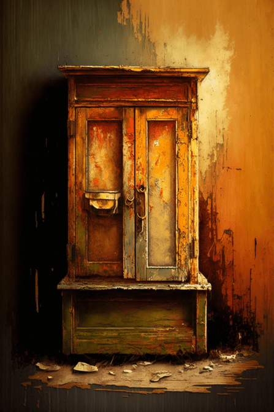

# 柜子(COD-废城)  
  
<table class="table table-bordered" data-toggle="table"  data-show-header="false"><thead style="display:none"><tr ><th  style="width:50%;text-align:left;vertical-align:top;"  >title</th><th  style="width:50%;text-align:left;vertical-align:top;"  ></th></tr></thead><tr ><td  style="width:50%;text-align:left;vertical-align:top;"  >** 区域唯一 **  **环境：**[船舱(环境)](cod_Env_船仓.md)  ** 效果: ** [

[舒适度](Comfort.md)](Comfort.md)<b>+50</b></td><td  style="width:50%;text-align:left;vertical-align:top;"  >

<a href="cod_船舱柜子.md" style="color:black">柜子</a>

</td></tr></tbody></table>  
  
## 获取来源  

探索

[船舱](cod_Exp_船舱.md)

  
  
## 动作  

<table><tr><td rowspan="2" style="width:200px;text-align:center;font-size:1.3em;font-weight:bold">

搜索

15分

</td><td>[“攀爬动作(组)”](ClimbAction.md), </td></tr><tr><td></td></tr><tr><td colspan="2"><b>需求：</b>[

[光亮](Light.md)](Light.md): <b>10-100</b></td></tr><tr><td colspan="2"><b>状态变化：</b>[

[情绪](Morale.md)](Morale.md)<b>+2</b></td></tr><tr><td colspan="2">

<table style="margin-bottom:3px;"><tr><td rowspan=2 style="text-align:center" width="80px">
基础权重

100
</td><td style="font-size:0.6em;line-height:0.6em;font-weight:bold">Jerrycan</td></tr><tr><td>[

[止血带](Tourniquet.md)](Tourniquet.md)(<b>+1</b>)</td></tr></table>

<table style="margin-bottom:3px;"><tr><td rowspan=2 style="text-align:center" width="80px">
基础权重

100
</td><td style="font-size:0.6em;line-height:0.6em;font-weight:bold">Scrap</td></tr><tr><td>[

[大马哈鱼罐头](cod_大马哈鱼罐头.md)](cod_大马哈鱼罐头.md)(<b>+1</b>)</td></tr></table>

<table style="margin-bottom:3px;"><tr><td rowspan=2 style="text-align:center" width="80px">
基础权重

100
</td><td style="font-size:0.6em;line-height:0.6em;font-weight:bold">Plastic Sheet</td></tr><tr><td>[

[一瓶红酒](cod_一瓶红酒.md)](cod_一瓶红酒.md)(<b>+1</b>)</td></tr></table>

<table style="margin-bottom:3px;"><tr><td rowspan=2 style="text-align:center" width="80px">
基础权重

200
</td><td style="font-size:0.6em;line-height:0.6em;font-weight:bold"> Rope</td></tr><tr><td>[

[一瓶红牛](cod_红牛.md)](cod_红牛.md)(<b>+1</b>)</td></tr></table>

<table style="margin-bottom:3px;"><tr><td rowspan=2 style="text-align:center" width="80px">
基础权重

200
</td><td style="font-size:0.6em;line-height:0.6em;font-weight:bold"> Ropee</td></tr><tr><td>[

[一瓶苏打饮料](cod_苏打饮料.md)](cod_苏打饮料.md)(<b>+2</b>)</td></tr></table>

<table style="margin-bottom:3px;"><tr><td rowspan=2 style="text-align:center" width="80px">
基础权重

200
</td><td style="font-size:0.6em;line-height:0.6em;font-weight:bold"> Roo</td></tr><tr><td>[

[军裤](MilitaryPants.md)](MilitaryPants.md)(<b>+1</b>)</td></tr></table>

<table style="margin-bottom:3px;"><tr><td rowspan=2 style="text-align:center" width="80px">
基础权重

200
</td><td style="font-size:0.6em;line-height:0.6em;font-weight:bold"> Ree</td></tr><tr><td>[

[夏威夷衬衫](HawaiianShirt.md)](HawaiianShirt.md)(<b>+1</b>)</td></tr></table>

<table style="margin-bottom:3px;"><tr><td rowspan=2 style="text-align:center" width="80px">
基础权重

200
</td><td style="font-size:0.6em;line-height:0.6em;font-weight:bold">bu</td></tr><tr><td>[

[草木灰敷料](AshDressing.md)](AshDressing.md)(<b>+6</b>)</td></tr></table>

<table style="margin-bottom:3px;"><tr><td rowspan=2 style="text-align:center" width="80px">
基础权重

200
</td><td style="font-size:0.6em;line-height:0.6em;font-weight:bold">beltbag</td></tr><tr><td>[

[腰包](BeltBag.md)](BeltBag.md)(<b>+1</b>)</td></tr></table>

<table style="margin-bottom:3px;"><tr><td rowspan=2 style="text-align:center" width="80px">
基础权重

200
</td><td style="font-size:0.6em;line-height:0.6em;font-weight:bold">YoYo</td></tr><tr><td>[

[破损长矛](cod_Nc_RusticSpear_Destory.md)](cod_Nc_RusticSpear_Destory.md)(<b>+1</b>)</td></tr></table>

<table style="margin-bottom:3px;"><tr><td rowspan=2 style="text-align:center" width="80px">
基础权重

50
</td><td style="font-size:0.6em;line-height:0.6em;font-weight:bold">Nothing</td></tr><tr><td></td></tr></table>

</td></tr></table>
  
  
  

