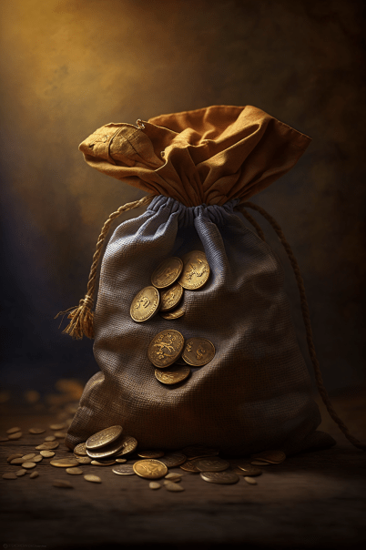

# 购买工具箱(COD-废城)  
> 购买锯木工具  
  
<table class="table table-bordered" data-toggle="table"  data-show-header="false"><thead style="display:none"><tr ><th  style="width:50%;text-align:left;vertical-align:top;"  >title</th><th  style="width:50%;text-align:left;vertical-align:top;"  ></th></tr></thead><tr ><td  style="width:50%;text-align:left;vertical-align:top;"  >** 解锁需求: ** [加文](cod_Garvin.md)  ** 动作分类: ** [“手部动作(组)”](HandAction.md) [“制造动作(组)”](CraftAction.md)  ** 制作条件: ** ~~[

[购买工具箱(蓝图)](cod_购买工具箱.md)](cod_购买工具箱.md)存在于手中/面板~~</td><td  style="width:50%;text-align:left;vertical-align:top;"  >

<a href="cod_购买工具箱.md" style="color:black">购买工具箱</a>

</td></tr></tbody></table>  
  
## 制作  

<table><tr><td style="width:100px;"><b>材料总计：</b></td><td>[

[加文](cod_Garvin.md)](cod_Garvin.md) x 1 , [

[一小袋铸币](cod_一小袋铸币.md)](cod_一小袋铸币.md) x 8</td></tr><tr><td><b>耗时：</b></td><td>-</td></tr><tr><td><b>需求：</b></td><td>[

[光亮](Light.md)](Light.md): <b>10-100</b></td></tr><tr><td><b>状态变化：</b></td><td>[

[情绪](Morale.md)](Morale.md)<b>+15</b>, [

[压力](Stress.md)](Stress.md)<b>-20</b></td></tr><tr><td colspan=2><b>步骤：</b></td></tr><tr><td style="text-align:right"><b>1.</b></td><td>[

[加文](cod_Garvin.md)](cod_Garvin.md) x 1 + [

[一小袋铸币](cod_一小袋铸币.md)](cod_一小袋铸币.md) x 8</td></tr><tr style="background-color:#fff;font-size:1.2em;"><td></td><td style="text-align:right"><b>成品：</b>[

[加文](cod_Garvin.md)](cod_Garvin.md)(<b>+1</b>) , [

[多功能工具箱](cod_多功能工具箱.md)](cod_多功能工具箱.md)(<b>+1</b>)</td></tr></table>
  
  

