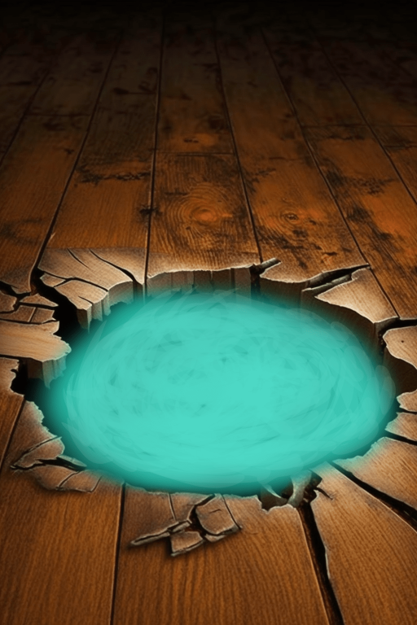

# 钓鱼洞(COD-废城)  
> 可以钓鱼的小洞  
  
<table class="table table-bordered" data-toggle="table"  data-show-header="false"><thead style="display:none"><tr ><th  style="width:50%;text-align:left;vertical-align:top;"  >title</th><th  style="width:50%;text-align:left;vertical-align:top;"  ></th></tr></thead><tr ><td  style="width:50%;text-align:left;vertical-align:top;"  >** 区域唯一 **  **环境：**[基地(环境)](cod_Env_鱼肉加工厂.md)  **标签：**	[“浅水域”](tag_ShallowWater.md), [“海”](tag_Sea.md)</td><td  style="width:50%;text-align:left;vertical-align:top;"  >

<a href="cod_钓鱼洞.md" style="color:black">钓鱼洞</a>

</td></tr></tbody></table>  
  
## 获取来源  

探索

[破败轮船(基地)](cod_Exp_鱼肉加工厂.md)

  
  
## 动作  

<table><tr><td rowspan="2" style="width:200px;text-align:center;font-size:1.3em;font-weight:bold">

饮用

3分

</td><td></td></tr><tr><td></td></tr><tr><td colspan="2"><b>需求：</b>[肾脏](IfKidneys.md): <b>1-1</b></td></tr><tr><td colspan="2"><b>状态变化：</b>[

[水分](Hydration.md)](Hydration.md)<b>+40</b>, [

[钠](Sodium.md)](Sodium.md)<b>+250</b></td></tr></table>
  

<table><tr><td rowspan="2" style="width:200px;text-align:center;font-size:1.3em;font-weight:bold">

洗个澡

15分

</td><td>[“手部动作(组)”](HandAction.md)</td></tr><tr><td></td></tr><tr><td colspan="2"><b>相关卡牌变化：</b>装备中的[“腿部（内层）”](tag_Clothing.md)

  <b>+12(100%)</b>, 所有[眼镜蛇毒液](W_CobraSpit.md)燃料  <b>-75</b></td></tr><tr><td colspan="2"><b>状态变化：</b>[

[湿度](Wetness.md)](Wetness.md)<b>+100</b> (每15分钟), [

[情绪](Morale.md)](Morale.md)<b>+1</b>, [

[污垢](Filth.md)](Filth.md)<b>-150</b>, [

[泥巴防护](MudProtection.md)](MudProtection.md)<b>-50</b>, [

[芦荟膏防护](AloeVeraGelProtection.md)](AloeVeraGelProtection.md)<b>-50</b>, [

[驱虫](BugRepellentApplied.md)](BugRepellentApplied.md)<b>-50</b>, [

[阳光防护](SunProtection.md)](SunProtection.md)<b>-50</b></td></tr></table>
  
  
  
## 可拖入  

<table style="margin-bottom:0px;"><tr><td style="width:40%;text-align:left; background-color:#FEFEFE"><b>拖入：</b>[“一级矛”](tag_Spear.md)</td><td style="width:40%;font-size:1em;font-weight:bold;background-color:#FEFEFE">叉鱼 (30分) [“手部动作(组)”](HandAction.md)</td></tr><tr><td colspan="2"><b>需求：</b>[

[光亮](Light.md)](Light.md): <b>10-100</b></td></tr><tr style="background-color:#FFFFFF"><td style=""><b>使用物：</b>使用次数  <b>-1</b></td><td style=""><b>自身：</b></td></tr><tr><td colspan="2"><b>状态变化：</b>[

[湿度](Wetness.md)](Wetness.md)<b>+60</b>, [

[叉鱼(技能)](Skill_SpearFishing.md)](Skill_SpearFishing.md)<b>+0.5</b>, [

[情绪](Morale.md)](Morale.md)<b>+1</b></td></tr><tr><td colspan="2">

<table style="margin-bottom:3px;"><tr><td rowspan=2 style="text-align:center" width="80px">
基础权重

25
</td><td style="font-size:0.6em;line-height:0.6em;font-weight:bold">Nothing</td></tr><tr><td></td></tr><tr><td colspan=2><li>[

[叉鱼(技能)](Skill_SpearFishing.md)](Skill_SpearFishing.md)为<b>0～150(0%～100%)</b>时权重限定为<b>+0～-19</b></li><li>洋流冲刷为<b>0～1000(0%～100%)</b>时权重<b>+0～+100</b></li><li>[

[鱼叉](SpearFishing.md)](SpearFishing.md)存在于*手中/面板*，权重<b>-5</b>,</li></td></tr></table>

<table style="margin-bottom:3px;"><tr><td rowspan=2 style="text-align:center" width="80px">
基础权重

6
</td><td style="font-size:0.6em;line-height:0.6em;font-weight:bold">Mudskipper</td></tr><tr><td>[

[弹涂鱼](Mudskipper.md)](Mudskipper.md)(<b>+1</b>)</td></tr></table>

<table style="margin-bottom:3px;"><tr><td rowspan=2 style="text-align:center" width="80px">
基础权重

4
</td><td style="font-size:0.6em;line-height:0.6em;font-weight:bold">Parrot Fish</td></tr><tr><td>[

[鹦哥鱼](ParrotFish.md)](ParrotFish.md)(<b>+1</b>)</td></tr></table>

<table style="margin-bottom:3px;"><tr><td rowspan=2 style="text-align:center" width="80px">
基础权重

5
</td><td style="font-size:0.6em;line-height:0.6em;font-weight:bold">Goat Fish</td></tr><tr><td>[

[绯鲤](Goatfish.md)](Goatfish.md)(<b>+1</b>)</td></tr></table>

<table style="margin-bottom:3px;"><tr><td rowspan=2 style="text-align:center" width="80px">
基础权重

1
</td><td style="font-size:0.6em;line-height:0.6em;font-weight:bold">King Threadfin</td></tr><tr><td>[

[大马鲅鱼](KingThreadfin.md)](KingThreadfin.md)(<b>+1</b>)</td></tr><tr><td colspan=2><li>[

[叉鱼(技能)](Skill_SpearFishing.md)](Skill_SpearFishing.md)为<b>0～150(0%～100%)</b>时权重<b>+0～+3</b></li></td></tr></table>

<table style="margin-bottom:3px;"><tr><td rowspan=2 style="text-align:center" width="80px">
基础权重

2
</td><td style="font-size:0.6em;line-height:0.6em;font-weight:bold">Sea Krait</td></tr><tr><td>[

[海蛇尸体](SeaKraitDead.md)](SeaKraitDead.md)(<b>+1</b>)</td></tr></table>

<table style="margin-bottom:3px;"><tr><td rowspan=2 style="text-align:center" width="80px">
基础权重

1
</td><td style="font-size:0.6em;line-height:0.6em;font-weight:bold">Sea Krait Bite</td></tr><tr><td>[

[一条海蛇！(事件)](Event_SeaKraitStep.md)](Event_SeaKraitStep.md)(<b>+1</b>)</td></tr></table>
<button class="btn btn-secondary btn-sm" style="" data-toggle="modal" onclick="setCollectionDataBase64('eyJ0aXRsZSI6IuamgueOh+aooeaLnzog5Y+J6bG8ICjpkpPpsbzmtJ4pIiwiY29sbGVjdGlvbnMiOlt7ImRyb3AiOiLml6AiLCJiYXNlIjoyNSwiY29uZGl0aW9uIjpbeyJrZXkiOiJTa2lsbF9TcGVhckZpc2hpbmciLCJ0aXRsZSI6IuWPiemxvCjmioDog70pIiwidHlwZSI6InJhbmdlIiwibWF4IjpbMCwxNTBdLCJyYW5nZSI6WzAsMTUwXSwid2VpZ2h0IjpbMCwtMTldLCJkZWZhdWx0VmFsdWUiOjAsIndoZW5PdXRPZlJhbmdlIjoxfSx7ImtleSI6IlNwZWNpYWwxIiwidGl0bGUiOiLmtIvmtYHlhrLliLciLCJ0eXBlIjoicmFuZ2UiLCJtYXgiOlswLDEwMDBdLCJyYW5nZSI6WzAsMTAwMF0sIndlaWdodCI6WzAsMTAwXSwiZGVmYXVsdFZhbHVlIjowLCJ3aGVuT3V0T2ZSYW5nZSI6MH0seyJrZXkiOiJTcGVhckZpc2hpbmciLCJ0aXRsZSI6IjxkaXYgc3R5bGU9XCJ3aWR0aDoyMHB4O2Rpc3BsYXk6aW5saW5lLWJsb2NrO3RleHQtYWxpZ246Y2VudGVyXCI+PGltZyBkZWNvZGluZz1cImFzeW5jXCIgc3JjPVwiU3ByaXRlL1NwZWFyRmlzaGluZy5wbmdcIiBocmVmPVwiYS5tZFwiIHN0eWxlPVwibWF4LXdpZHRoOjIwcHg7bWF4LWhlaWdodDoyMHB4O1wiPjwvZGl2PumxvOWPieWtmOWcqOS6jirmiYvkuK0v6Z2i5p2/Ku+8jCIsInR5cGUiOiJ0b2dnbGUiLCJyYW5nZSI6WzAsMV0sIm1heCI6WzAsMV0sIndlaWdodCI6WzAsLTVdLCJkZWZhdWx0VmFsdWUiOjAsIndoZW5PdXRPZlJhbmdlIjowLCJtYXhTdGFja0dyb3VwIjoiIn1dfSx7ImRyb3AiOiI8ZGl2IHN0eWxlPVwid2lkdGg6MjVweDtkaXNwbGF5OmlubGluZS1ibG9jazt0ZXh0LWFsaWduOmNlbnRlclwiPjxpbWcgZGVjb2Rpbmc9XCJhc3luY1wiIHNyYz1cIlNwcml0ZS9NdWRza2lwcGVyLnBuZ1wiIGhyZWY9XCJhLm1kXCIgc3R5bGU9XCJtYXgtd2lkdGg6MjVweDttYXgtaGVpZ2h0OjI1cHg7XCI+PC9kaXY+5by55raC6bG8IiwiYmFzZSI6NiwiY29uZGl0aW9uIjpbXX0seyJkcm9wIjoiPGRpdiBzdHlsZT1cIndpZHRoOjI1cHg7ZGlzcGxheTppbmxpbmUtYmxvY2s7dGV4dC1hbGlnbjpjZW50ZXJcIj48aW1nIGRlY29kaW5nPVwiYXN5bmNcIiBzcmM9XCJTcHJpdGUvUGFycm90RmlzaC5wbmdcIiBocmVmPVwiYS5tZFwiIHN0eWxlPVwibWF4LXdpZHRoOjI1cHg7bWF4LWhlaWdodDoyNXB4O1wiPjwvZGl2Pum5puWTpemxvCIsImJhc2UiOjQsImNvbmRpdGlvbiI6W119LHsiZHJvcCI6IjxkaXYgc3R5bGU9XCJ3aWR0aDoyNXB4O2Rpc3BsYXk6aW5saW5lLWJsb2NrO3RleHQtYWxpZ246Y2VudGVyXCI+PGltZyBkZWNvZGluZz1cImFzeW5jXCIgc3JjPVwiU3ByaXRlL0dvYXRmaXNoLnBuZ1wiIGhyZWY9XCJhLm1kXCIgc3R5bGU9XCJtYXgtd2lkdGg6MjVweDttYXgtaGVpZ2h0OjI1cHg7XCI+PC9kaXY+57uv6bKkIiwiYmFzZSI6NSwiY29uZGl0aW9uIjpbXX0seyJkcm9wIjoiPGRpdiBzdHlsZT1cIndpZHRoOjI1cHg7ZGlzcGxheTppbmxpbmUtYmxvY2s7dGV4dC1hbGlnbjpjZW50ZXJcIj48aW1nIGRlY29kaW5nPVwiYXN5bmNcIiBzcmM9XCJTcHJpdGUvS2luZ1RocmVhZGZpbi5wbmdcIiBocmVmPVwiYS5tZFwiIHN0eWxlPVwibWF4LXdpZHRoOjI1cHg7bWF4LWhlaWdodDoyNXB4O1wiPjwvZGl2PuWkp+mprOmyhemxvCIsImJhc2UiOjEsImNvbmRpdGlvbiI6W3sia2V5IjoiU2tpbGxfU3BlYXJGaXNoaW5nIiwidGl0bGUiOiLlj4npsbwo5oqA6IO9KSIsInR5cGUiOiJyYW5nZSIsIm1heCI6WzAsMTUwXSwicmFuZ2UiOlswLDE1MF0sIndlaWdodCI6WzAsM10sImRlZmF1bHRWYWx1ZSI6MCwid2hlbk91dE9mUmFuZ2UiOjB9XX0seyJkcm9wIjoiPGRpdiBzdHlsZT1cIndpZHRoOjI1cHg7ZGlzcGxheTppbmxpbmUtYmxvY2s7dGV4dC1hbGlnbjpjZW50ZXJcIj48aW1nIGRlY29kaW5nPVwiYXN5bmNcIiBzcmM9XCJTcHJpdGUvU2VhS3JhaXRDYXJjYXNzLnBuZ1wiIGhyZWY9XCJhLm1kXCIgc3R5bGU9XCJtYXgtd2lkdGg6MjVweDttYXgtaGVpZ2h0OjI1cHg7XCI+PC9kaXY+5rW36JuH5bC45L2TIiwiYmFzZSI6MiwiY29uZGl0aW9uIjpbXX0seyJkcm9wIjoiPGRpdiBzdHlsZT1cIndpZHRoOjI1cHg7ZGlzcGxheTppbmxpbmUtYmxvY2s7dGV4dC1hbGlnbjpjZW50ZXJcIj48aW1nIGRlY29kaW5nPVwiYXN5bmNcIiBzcmM9XCJTcHJpdGUvU2VhS3JhaXQucG5nXCIgaHJlZj1cImEubWRcIiBzdHlsZT1cIm1heC13aWR0aDoyNXB4O21heC1oZWlnaHQ6MjVweDtcIj48L2Rpdj7kuIDmnaHmtbfom4fvvIEo5LqL5Lu2KSIsImJhc2UiOjEsImNvbmRpdGlvbiI6W119XX0=')" data-target="#modelCollectionSimulator">概率模拟</button>
</td></tr></table>
  

<table style="margin-bottom:0px;"><tr><td style="width:40%;text-align:left; background-color:#FEFEFE"><b>拖入：</b>[“钓鱼线”](tag_FishingLine.md)</td><td style="width:40%;font-size:1em;font-weight:bold;background-color:#FEFEFE">鱼肉 (1小时) </td></tr><tr style="background-color:#FFFFFF"><td style=""><b>使用物：</b>使用次数  <b>-1(-3.33%)</b></td><td style=""><b>自身：</b></td></tr><tr><td colspan="2"><b>状态变化：</b>[

[情绪](Morale.md)](Morale.md)<b>+1</b>, [

[钓鱼(技能)](Skill_Fishing.md)](Skill_Fishing.md)<b>+1</b>, [

[压力](Stress.md)](Stress.md)<b>-50</b></td></tr><tr><td colspan="2">

<table style="margin-bottom:3px;"><tr><td rowspan=2 style="text-align:center" width="80px">
基础权重

25
</td><td style="font-size:0.6em;line-height:0.6em;font-weight:bold">Nothing</td></tr><tr><td></td></tr><tr><td colspan=2><li>[

[钓鱼(技能)](Skill_Fishing.md)](Skill_Fishing.md)为<b>0～150(0%～100%)</b>时权重<b>+0～-15</b></li><li>洋流冲刷为<b>0～1000(0%～100%)</b>时权重<b>+0～+100</b></li><li>[

[钓鱼竿](FishingRod.md)](FishingRod.md)存在于*手中*，权重<b>-5</b>(可叠加),</li></td></tr></table>

<table style="margin-bottom:3px;"><tr><td rowspan=2 style="text-align:center" width="80px">
基础权重

5
</td><td style="font-size:0.6em;line-height:0.6em;font-weight:bold">Mudskipper</td></tr><tr><td>[

[弹涂鱼](Mudskipper.md)](Mudskipper.md)(<b>+1</b>)</td></tr></table>

<table style="margin-bottom:3px;"><tr><td rowspan=2 style="text-align:center" width="80px">
基础权重

4
</td><td style="font-size:0.6em;line-height:0.6em;font-weight:bold">Parrot Fish</td></tr><tr><td>[

[鹦哥鱼](ParrotFish.md)](ParrotFish.md)(<b>+1</b>)</td></tr></table>

<table style="margin-bottom:3px;"><tr><td rowspan=2 style="text-align:center" width="80px">
基础权重

4
</td><td style="font-size:0.6em;line-height:0.6em;font-weight:bold">Goat Fish</td></tr><tr><td>[

[绯鲤](Goatfish.md)](Goatfish.md)(<b>+1</b>)</td></tr></table>

<table style="margin-bottom:3px;"><tr><td rowspan=2 style="text-align:center" width="80px">
基础权重

4
</td><td style="font-size:0.6em;line-height:0.6em;font-weight:bold">Bonefish</td></tr><tr><td>[

[北梭鱼](Bonefish.md)](Bonefish.md)(<b>+1</b>)</td></tr></table>

<table style="margin-bottom:3px;"><tr><td rowspan=2 style="text-align:center" width="80px">
基础权重

3
</td><td style="font-size:0.6em;line-height:0.6em;font-weight:bold">King Threadfin</td></tr><tr><td>[

[大马鲅鱼](KingThreadfin.md)](KingThreadfin.md)(<b>+1</b>)</td></tr></table>
<button class="btn btn-secondary btn-sm" style="" data-toggle="modal" onclick="setCollectionDataBase64('eyJ0aXRsZSI6IuamgueOh+aooeaLnzog6bG86IKJICjpkpPpsbzmtJ4pIiwiY29sbGVjdGlvbnMiOlt7ImRyb3AiOiLml6AiLCJiYXNlIjoyNSwiY29uZGl0aW9uIjpbeyJrZXkiOiJTa2lsbF9GaXNoaW5nIiwidGl0bGUiOiLpkpPpsbwo5oqA6IO9KSIsInR5cGUiOiJyYW5nZSIsIm1heCI6WzAsMTUwXSwicmFuZ2UiOlswLDE1MF0sIndlaWdodCI6WzAsLTE1XSwiZGVmYXVsdFZhbHVlIjowLCJ3aGVuT3V0T2ZSYW5nZSI6MH0seyJrZXkiOiJTcGVjaWFsMSIsInRpdGxlIjoi5rSL5rWB5Yay5Yi3IiwidHlwZSI6InJhbmdlIiwibWF4IjpbMCwxMDAwXSwicmFuZ2UiOlswLDEwMDBdLCJ3ZWlnaHQiOlswLDEwMF0sImRlZmF1bHRWYWx1ZSI6MCwid2hlbk91dE9mUmFuZ2UiOjB9LHsia2V5IjoiRmlzaGluZ1JvZF9hbW91bnQiLCJ0aXRsZSI6IumSk+mxvOervyIsInR5cGUiOiJyYW5nZSIsInJhbmdlIjpbMCwyMF0sIm1heCI6WzAsMjBdLCJ3ZWlnaHQiOlswLC0xMDBdLCJkZWZhdWx0VmFsdWUiOjAsIndoZW5PdXRPZlJhbmdlIjowLCJtYXhTdGFja0dyb3VwIjoiIn1dfSx7ImRyb3AiOiI8ZGl2IHN0eWxlPVwid2lkdGg6MjVweDtkaXNwbGF5OmlubGluZS1ibG9jazt0ZXh0LWFsaWduOmNlbnRlclwiPjxpbWcgZGVjb2Rpbmc9XCJhc3luY1wiIHNyYz1cIlNwcml0ZS9NdWRza2lwcGVyLnBuZ1wiIGhyZWY9XCJhLm1kXCIgc3R5bGU9XCJtYXgtd2lkdGg6MjVweDttYXgtaGVpZ2h0OjI1cHg7XCI+PC9kaXY+5by55raC6bG8IiwiYmFzZSI6NSwiY29uZGl0aW9uIjpbXX0seyJkcm9wIjoiPGRpdiBzdHlsZT1cIndpZHRoOjI1cHg7ZGlzcGxheTppbmxpbmUtYmxvY2s7dGV4dC1hbGlnbjpjZW50ZXJcIj48aW1nIGRlY29kaW5nPVwiYXN5bmNcIiBzcmM9XCJTcHJpdGUvUGFycm90RmlzaC5wbmdcIiBocmVmPVwiYS5tZFwiIHN0eWxlPVwibWF4LXdpZHRoOjI1cHg7bWF4LWhlaWdodDoyNXB4O1wiPjwvZGl2Pum5puWTpemxvCIsImJhc2UiOjQsImNvbmRpdGlvbiI6W119LHsiZHJvcCI6IjxkaXYgc3R5bGU9XCJ3aWR0aDoyNXB4O2Rpc3BsYXk6aW5saW5lLWJsb2NrO3RleHQtYWxpZ246Y2VudGVyXCI+PGltZyBkZWNvZGluZz1cImFzeW5jXCIgc3JjPVwiU3ByaXRlL0dvYXRmaXNoLnBuZ1wiIGhyZWY9XCJhLm1kXCIgc3R5bGU9XCJtYXgtd2lkdGg6MjVweDttYXgtaGVpZ2h0OjI1cHg7XCI+PC9kaXY+57uv6bKkIiwiYmFzZSI6NCwiY29uZGl0aW9uIjpbXX0seyJkcm9wIjoiPGRpdiBzdHlsZT1cIndpZHRoOjI1cHg7ZGlzcGxheTppbmxpbmUtYmxvY2s7dGV4dC1hbGlnbjpjZW50ZXJcIj48aW1nIGRlY29kaW5nPVwiYXN5bmNcIiBzcmM9XCJTcHJpdGUvQm9uZWZpc2gucG5nXCIgaHJlZj1cImEubWRcIiBzdHlsZT1cIm1heC13aWR0aDoyNXB4O21heC1oZWlnaHQ6MjVweDtcIj48L2Rpdj7ljJfmoq3psbwiLCJiYXNlIjo0LCJjb25kaXRpb24iOltdfSx7ImRyb3AiOiI8ZGl2IHN0eWxlPVwid2lkdGg6MjVweDtkaXNwbGF5OmlubGluZS1ibG9jazt0ZXh0LWFsaWduOmNlbnRlclwiPjxpbWcgZGVjb2Rpbmc9XCJhc3luY1wiIHNyYz1cIlNwcml0ZS9LaW5nVGhyZWFkZmluLnBuZ1wiIGhyZWY9XCJhLm1kXCIgc3R5bGU9XCJtYXgtd2lkdGg6MjVweDttYXgtaGVpZ2h0OjI1cHg7XCI+PC9kaXY+5aSn6ams6bKF6bG8IiwiYmFzZSI6MywiY29uZGl0aW9uIjpbXX1dfQ==')" data-target="#modelCollectionSimulator">概率模拟</button>
</td></tr></table>
  

<table style="margin-bottom:0px;"><tr><td style="width:40%;text-align:left; background-color:#FEFEFE"><b>拖入：</b>[“诱饵（用于钓鱼线）”](tag_FishingLineBait.md)</td><td style="width:40%;font-size:1em;font-weight:bold;background-color:#FEFEFE">鱼肉 (1小时) </td></tr><tr style="background-color:#FFFFFF"><td style=""><b>使用物：</b>使用次数  <b>-1(-3.33%)</b>, 诱饵

  <b>-1(-100%)</b></td><td style=""><b>自身：</b></td></tr><tr><td colspan="2"><b>状态变化：</b>[

[情绪](Morale.md)](Morale.md)<b>+1</b>, [

[钓鱼(技能)](Skill_Fishing.md)](Skill_Fishing.md)<b>+1</b>, [

[压力](Stress.md)](Stress.md)<b>-50</b></td></tr><tr><td colspan="2">

<table style="margin-bottom:3px;"><tr><td rowspan=2 style="text-align:center" width="80px">
基础权重

15
</td><td style="font-size:0.6em;line-height:0.6em;font-weight:bold">Nothing</td></tr><tr><td></td></tr><tr><td colspan=2><li>[

[钓鱼(技能)](Skill_Fishing.md)](Skill_Fishing.md)为<b>0～150(0%～100%)</b>时权重<b>+0～-10</b></li><li>洋流冲刷为<b>0～1000(0%～100%)</b>时权重<b>+0～+100</b></li><li>[

[钓鱼竿（已添加诱饵）](FishingRodBait.md)](FishingRodBait.md)存在于*手中*，权重<b>-4</b>(可叠加),</li></td></tr></table>

<table style="margin-bottom:3px;"><tr><td rowspan=2 style="text-align:center" width="80px">
基础权重

6
</td><td style="font-size:0.6em;line-height:0.6em;font-weight:bold">Mudskipper</td></tr><tr><td>[

[弹涂鱼](Mudskipper.md)](Mudskipper.md)(<b>+1</b>)</td></tr></table>

<table style="margin-bottom:3px;"><tr><td rowspan=2 style="text-align:center" width="80px">
基础权重

10
</td><td style="font-size:0.6em;line-height:0.6em;font-weight:bold">Parrot Fish</td></tr><tr><td>[

[鹦哥鱼](ParrotFish.md)](ParrotFish.md)(<b>+1</b>)</td></tr></table>

<table style="margin-bottom:3px;"><tr><td rowspan=2 style="text-align:center" width="80px">
基础权重

10
</td><td style="font-size:0.6em;line-height:0.6em;font-weight:bold">Goat Fish</td></tr><tr><td>[

[绯鲤](Goatfish.md)](Goatfish.md)(<b>+1</b>)</td></tr></table>

<table style="margin-bottom:3px;"><tr><td rowspan=2 style="text-align:center" width="80px">
基础权重

8
</td><td style="font-size:0.6em;line-height:0.6em;font-weight:bold">Bonefish</td></tr><tr><td>[

[北梭鱼](Bonefish.md)](Bonefish.md)(<b>+1</b>)</td></tr></table>

<table style="margin-bottom:3px;"><tr><td rowspan=2 style="text-align:center" width="80px">
基础权重

6
</td><td style="font-size:0.6em;line-height:0.6em;font-weight:bold">King Threadfin</td></tr><tr><td>[

[大马鲅鱼](KingThreadfin.md)](KingThreadfin.md)(<b>+1</b>)</td></tr></table>
<button class="btn btn-secondary btn-sm" style="" data-toggle="modal" onclick="setCollectionDataBase64('eyJ0aXRsZSI6IuamgueOh+aooeaLnzog6bG86IKJICjpkpPpsbzmtJ4pIiwiY29sbGVjdGlvbnMiOlt7ImRyb3AiOiLml6AiLCJiYXNlIjoxNSwiY29uZGl0aW9uIjpbeyJrZXkiOiJTa2lsbF9GaXNoaW5nIiwidGl0bGUiOiLpkpPpsbwo5oqA6IO9KSIsInR5cGUiOiJyYW5nZSIsIm1heCI6WzAsMTUwXSwicmFuZ2UiOlswLDE1MF0sIndlaWdodCI6WzAsLTEwXSwiZGVmYXVsdFZhbHVlIjowLCJ3aGVuT3V0T2ZSYW5nZSI6MH0seyJrZXkiOiJTcGVjaWFsMSIsInRpdGxlIjoi5rSL5rWB5Yay5Yi3IiwidHlwZSI6InJhbmdlIiwibWF4IjpbMCwxMDAwXSwicmFuZ2UiOlswLDEwMDBdLCJ3ZWlnaHQiOlswLDEwMF0sImRlZmF1bHRWYWx1ZSI6MCwid2hlbk91dE9mUmFuZ2UiOjB9LHsia2V5IjoiRmlzaGluZ1JvZEJhaXRfYW1vdW50IiwidGl0bGUiOiLpkpPpsbznq7/vvIjlt7Lmt7vliqDor7HppbXvvIkiLCJ0eXBlIjoicmFuZ2UiLCJyYW5nZSI6WzAsMjBdLCJtYXgiOlswLDIwXSwid2VpZ2h0IjpbMCwtODBdLCJkZWZhdWx0VmFsdWUiOjAsIndoZW5PdXRPZlJhbmdlIjowLCJtYXhTdGFja0dyb3VwIjoiIn1dfSx7ImRyb3AiOiI8ZGl2IHN0eWxlPVwid2lkdGg6MjVweDtkaXNwbGF5OmlubGluZS1ibG9jazt0ZXh0LWFsaWduOmNlbnRlclwiPjxpbWcgZGVjb2Rpbmc9XCJhc3luY1wiIHNyYz1cIlNwcml0ZS9NdWRza2lwcGVyLnBuZ1wiIGhyZWY9XCJhLm1kXCIgc3R5bGU9XCJtYXgtd2lkdGg6MjVweDttYXgtaGVpZ2h0OjI1cHg7XCI+PC9kaXY+5by55raC6bG8IiwiYmFzZSI6NiwiY29uZGl0aW9uIjpbXX0seyJkcm9wIjoiPGRpdiBzdHlsZT1cIndpZHRoOjI1cHg7ZGlzcGxheTppbmxpbmUtYmxvY2s7dGV4dC1hbGlnbjpjZW50ZXJcIj48aW1nIGRlY29kaW5nPVwiYXN5bmNcIiBzcmM9XCJTcHJpdGUvUGFycm90RmlzaC5wbmdcIiBocmVmPVwiYS5tZFwiIHN0eWxlPVwibWF4LXdpZHRoOjI1cHg7bWF4LWhlaWdodDoyNXB4O1wiPjwvZGl2Pum5puWTpemxvCIsImJhc2UiOjEwLCJjb25kaXRpb24iOltdfSx7ImRyb3AiOiI8ZGl2IHN0eWxlPVwid2lkdGg6MjVweDtkaXNwbGF5OmlubGluZS1ibG9jazt0ZXh0LWFsaWduOmNlbnRlclwiPjxpbWcgZGVjb2Rpbmc9XCJhc3luY1wiIHNyYz1cIlNwcml0ZS9Hb2F0ZmlzaC5wbmdcIiBocmVmPVwiYS5tZFwiIHN0eWxlPVwibWF4LXdpZHRoOjI1cHg7bWF4LWhlaWdodDoyNXB4O1wiPjwvZGl2Pue7r+mypCIsImJhc2UiOjEwLCJjb25kaXRpb24iOltdfSx7ImRyb3AiOiI8ZGl2IHN0eWxlPVwid2lkdGg6MjVweDtkaXNwbGF5OmlubGluZS1ibG9jazt0ZXh0LWFsaWduOmNlbnRlclwiPjxpbWcgZGVjb2Rpbmc9XCJhc3luY1wiIHNyYz1cIlNwcml0ZS9Cb25lZmlzaC5wbmdcIiBocmVmPVwiYS5tZFwiIHN0eWxlPVwibWF4LXdpZHRoOjI1cHg7bWF4LWhlaWdodDoyNXB4O1wiPjwvZGl2PuWMl+airemxvCIsImJhc2UiOjgsImNvbmRpdGlvbiI6W119LHsiZHJvcCI6IjxkaXYgc3R5bGU9XCJ3aWR0aDoyNXB4O2Rpc3BsYXk6aW5saW5lLWJsb2NrO3RleHQtYWxpZ246Y2VudGVyXCI+PGltZyBkZWNvZGluZz1cImFzeW5jXCIgc3JjPVwiU3ByaXRlL0tpbmdUaHJlYWRmaW4ucG5nXCIgaHJlZj1cImEubWRcIiBzdHlsZT1cIm1heC13aWR0aDoyNXB4O21heC1oZWlnaHQ6MjVweDtcIj48L2Rpdj7lpKfpqazpsoXpsbwiLCJiYXNlIjo2LCJjb25kaXRpb24iOltdfV19')" data-target="#modelCollectionSimulator">概率模拟</button>
</td></tr></table>
  

<table style="margin-bottom:0px;"><tr><td style="width:40%;text-align:left; background-color:#FEFEFE"><b>拖入：</b>[

[炸药(开)](DynamiteOn.md)](DynamiteOn.md)</td><td style="width:40%;font-size:1em;font-weight:bold;background-color:#FEFEFE">轰隆！ (30分) </td></tr><tr style="background-color:#FFFFFF"><td style=""><b>使用物：</b>→消失</td><td style=""><b>自身：</b>洋流冲刷  <b>+500(50%)</b></td></tr><tr><td colspan="2">[

[绯鲤](Goatfish.md)](Goatfish.md)(<b>+8～+16</b>), [

[鹦哥鱼](ParrotFish.md)](ParrotFish.md)(<b>+8～+16</b>), [

[弹涂鱼](Mudskipper.md)](Mudskipper.md)(<b>+8～+16</b>), [

[大马鲅鱼](KingThreadfin.md)](KingThreadfin.md)(<b>+1～+6</b>)</td></tr></table>
  
  
## 属性   

<table style="margin-bottom:0px;"><tr><td style="width:30%;text-align:left; background-color:#FEFEFE;font-size:1.3em;font-weight:bold;">洋流冲刷</td><td style="font-size:1em;background-color:#FEFEFE">初始：0 , 最大：1000 每15分钟-0.5 , 最多需要：20天20小时</td></tr><tr style="background-color:#FFFFFF"><td colspan=2></td></tr></table>
  

