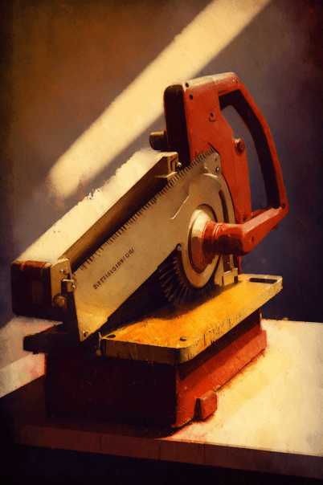

# 铸币(COD-废城)  
> 一枚铸币，也许有用  
  
<table class="table table-bordered" data-toggle="table"  data-show-header="false"><thead style="display:none"><tr ><th  style="width:50%;text-align:left;vertical-align:top;"  >title</th><th  style="width:50%;text-align:left;vertical-align:top;"  ></th></tr></thead><tr ><td  style="width:50%;text-align:left;vertical-align:top;"  >**重量：**5  **标签：**	[“美丽的/好看的”](tag_Pretty.md)</td><td  style="width:50%;text-align:left;vertical-align:top;"  >

<a href="cod_铸币.md" style="color:black">铸币</a>

</td></tr></tbody></table>  
  
## 获取来源  

search

[垃圾箱(深入小镇)](cod_小镇垃圾箱2.md)

search

[Shabby cabinet(红色砖房)](cod_红砖房柜子.md)

蓝图制造

[4代金券(蓝图)](cod_代金券5.md)

蓝图制造

[5元(蓝图)](cod_赌博蓝图.md)

蓝图制造

[10元(蓝图)](cod_赌博蓝图2.md)

蓝图制造

[出售煤(蓝图)](cod_出售煤块.md)

蓝图制造

[出售空罐(蓝图)](cod_出售空罐.md)

蓝图制造

[出售编织物(蓝图)](cod_出售编制物.md)

蓝图制造

[出售贝壳(蓝图)](cod_出售贝壳.md)

蓝图制造

[购买20张代金券(蓝图)](cod_购买代金券.md)

** 使用**交易

[加文](cod_Garvin.md)

** 使用**交易

[加文](cod_Garvin.md)

** 使用**交易

[加文](cod_Garvin.md)

** 使用**交易

[加文](cod_Garvin.md)

** 使用**交易

[加文](cod_Garvin.md)

搜索

[汽车抽屉(废弃车辆)](cod_汽车抽屉.md)

蓝图制造

[击鼓工作 (蓝图)](cod_击鼓工作.md)

蓝图制造

[务农工作(蓝图)](cod_务农工作.md)

蓝图制造

[厨师工作(蓝图)](cod_厨师工作.md)

蓝图制造

[弓箭教官(蓝图)](cod_射箭教学工作.md)

蓝图制造

[投石索教官(蓝图)](cod_投石索教练.md)

蓝图制造

[捕兽工作(蓝图)](cod_捕兽工作.md)

蓝图制造

[木工工作(蓝图)](cod_木工工作.md)

蓝图制造

[杂工工作(蓝图)](cod_杂工工作蓝图.md)

蓝图制造

[监工工作(蓝图)](cod_监工工作.md)

蓝图制造

[石匠工作(蓝图)](cod_石匠工作.md)

蓝图制造

[纺织工作(蓝图)](cod_纺织工作.md)

蓝图制造

[钓鱼工作(蓝图)](cod_钓鱼工作.md)

蓝图制造

[铁匠工作(蓝图)](cod_铁匠工作.md)

蓝图制造

[矛战教官(蓝图)](cod_长矛教学工作.md)

取出铸币

[一小袋铸币](cod_一小袋铸币.md)

搜索

[破旧邮轮酒吧(破败轮船)](cod_邮轮酒吧.md)

搜刮

[僵尸尸体](cod_Nc_ZombieCorpse.md)

搜刮

[烧焦尸体](cod_Nc_ZombieCorpse_Burn_TypeOne.md)

搜刮

[烧焦尸体](cod_Nc_ZombieCorpse_Burn_TypeThree.md)

搜刮

[烧焦尸体](cod_Nc_ZombieCorpse_Burn_TypeTwo.md)

  
  
## 可用于蓝图  

<a href="cod_50铸币蓝图.md" style="color:black">装入5袋铸币</a>

<a href="cod_购买水包.md" style="color:black">袋装水包</a>

<a href="cod_购买狗粮.md" style="color:black">黑奴套餐</a>

<a href="cod_购买盐.md" style="color:black">6份盐</a>

<a href="cod_购买零食.md" style="color:black">苏打薯片</a>

<a href="cod_购买零食2.md" style="color:black">红牛可乐</a>

<a href="cod_购买零食3.md" style="color:black">曲奇鱼罐头</a>

<a href="cod_购买零食4.md" style="color:black">午餐牛肉</a>

<a href="cod_购买零食5.md" style="color:black">香蕉椰子</a>

<a href="cod_购买零食6.md" style="color:black">饿货套餐</a>

<a href="cod_购买零食7.md" style="color:black">红酒猪肉</a>

<a href="cod_购买零食8.md" style="color:black">两罐脂肪块</a>

<a href="cod_赌博蓝图.md" style="color:black">5元</a>

<a href="cod_赌博蓝图2.md" style="color:black">10元</a>

<a href="cod_购买子弹.md" style="color:black">购买10发子弹</a>

<a href="cod_购买工作证.md" style="color:black">购买工作证</a>

<a href="cod_购买手电.md" style="color:black">购买手电</a>

<a href="cod_购买抗生素.md" style="color:black">购买抗生素</a>

<a href="cod_购买末日背包.md" style="color:black">购买背包</a>

<a href="cod_购买玻璃罐.md" style="color:black">购买六个玻璃罐</a>

<a href="cod_购买罐装食物秘籍.md" style="color:black">购买罐装素食秘方</a>

<a href="cod_购买罐装食物秘籍2.md" style="color:black">购买罐装肉食秘方</a>

<a href="cod_购买解毒剂.md" style="color:black">购买解毒剂</a>

<a href="cod_购买锯木工具.md" style="color:black">购买锯木工具</a>

<a href="cod_购买泥堆.md" style="color:black">购买10个泥堆</a>

<a href="cod_购买火药罐.md" style="color:black">购买两个火药罐</a>

<a href="cod_购买蛇草.md" style="color:black">购买10个蛇草</a>

<a href="cod_沙拉套餐.md" style="color:black">沙拉套餐</a>

<a href="cod_猪排豆子套餐.md" style="color:black">猪排豆子套餐</a>

<a href="cod_红烧鱼菜谱.md" style="color:black">红烧鱼</a>

  
  
  

