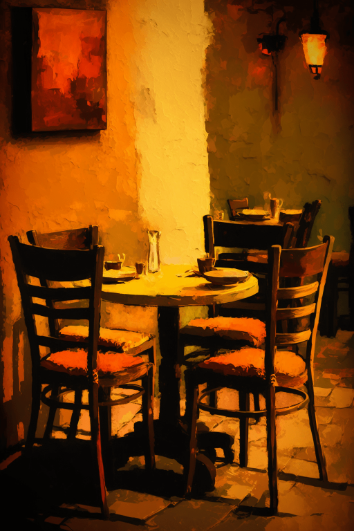

# 破败轮船(COD-废城)  
> 一个破败的轮船  
  
<table class="table table-bordered" data-toggle="table"  data-show-header="false"><thead style="display:none"><tr ><th  style="width:50%;text-align:left;vertical-align:top;"  >title</th><th  style="width:50%;text-align:left;vertical-align:top;"  ></th></tr></thead><tr ><td  style="width:50%;text-align:left;vertical-align:top;"  >**重量：**5000  **标签：**	[“装饰品”](tag_Decoration.md), [“美丽的/好看的”](tag_Pretty.md), [“沉重的”](tag_Heavy.md)  ** 效果: ** [

[用餐环境](Foodplace.md)](Foodplace.md)<b>+10</b> [

[情绪](Morale.md)](Morale.md)<b>+10</b> [

[用餐环境](cod_用餐环境.md)](cod_用餐环境.md)<b>+1</b></td><td  style="width:50%;text-align:left;vertical-align:top;"  >

<a href="cod_餐馆桌椅.md" style="color:black">破败轮船</a>

</td></tr></tbody></table>  
  
## 获取来源  

探索

[破败轮船(基地)](cod_Exp_饭馆.md)

  
  

