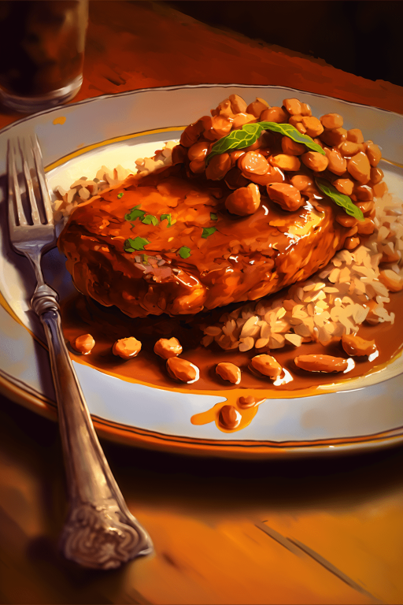

# 饭馆服务员(COD-废城)  
> 尊贵的客人，随时为您服务  
  
<table class="table table-bordered" data-toggle="table"  data-show-header="false"><thead style="display:none"><tr ><th  style="width:50%;text-align:left;vertical-align:top;"  >title</th><th  style="width:50%;text-align:left;vertical-align:top;"  ></th></tr></thead><tr ><td  style="width:50%;text-align:left;vertical-align:top;"  >**重量：**10000  **标签：**	[“高级装饰品”](tag_DecorationAdv.md), [“美丽的/好看的”](tag_Pretty.md)</td><td  style="width:50%;text-align:left;vertical-align:top;"  >

<a href="cod_饭馆服务员.md" style="color:black">饭馆服务员</a>

</td></tr></tbody></table>  
  
## 获取来源  

Explore

[饭馆](cod_Exp_饭馆.md)

蓝图制造

[V我50套餐(蓝图)](cod_V我50套餐.md)

蓝图制造

[沙拉套餐(蓝图)](cod_沙拉套餐.md)

蓝图制造

[感恩节大餐(蓝图)](cod_火鸡菜谱.md)

蓝图制造

[牛排套餐(蓝图)](cod_牛排套餐.md)

蓝图制造

[猪排豆子套餐(蓝图)](cod_猪排豆子套餐.md)

蓝图制造

[红烧鱼(蓝图)](cod_红烧鱼菜谱.md)

蓝图制造

[面包套餐(蓝图)](cod_面包套餐.md)

  
  
## 动作  

<table><tr><td rowspan="2" style="width:200px;text-align:center;font-size:1.3em;font-weight:bold">

交谈

</td><td></td></tr><tr><td></td></tr><tr><td colspan="2">[

[服务员(事件)](cod_eve_服务员对话.md)](cod_eve_服务员对话.md)(<b>+1</b>)</td></tr></table>
  
  
  
## 可用于蓝图  

<a href="cod_V我50套餐.md" style="color:black">V我50套餐</a>

<a href="cod_沙拉套餐.md" style="color:black">沙拉套餐</a>

<a href="cod_火鸡菜谱.md" style="color:black">感恩节大餐</a>

<a href="cod_牛排套餐.md" style="color:black">牛排套餐</a>

<a href="cod_猪排豆子套餐.md" style="color:black">猪排豆子套餐</a>

<a href="cod_红烧鱼菜谱.md" style="color:black">红烧鱼</a>

<a href="cod_面包套餐.md" style="color:black">面包套餐</a>

  
  
  

