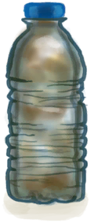

# 常用  
## 数据查询  

[食物体脂查询(胃)](Stomach.md#可被以下操作改变)

[储物容器容量查询](tag_Bag.md)

[储水容器容量查询](tag_WaterContainer.md)

[室内环境对比](tag_EnvIndoors.md)

[室外环境对比](outdoor.md)

[农作物生长](tag_Crop.md)

[生态资源分布](biome.md)

  
  
## 物品丢失  
<table class="table table-bordered"><thead><tr ><th  style="width:14%;text-align:left;vertical-align:top;" >来源</th><th  style="text-align:left;vertical-align:top;" >丢失物品</th></tr></thead><tr ><td  style="width:14%;text-align:left;vertical-align:top;" >[猕猴(事件)](Event_MacaqueRaidRummaging.md)</td><td  style="text-align:left;vertical-align:top;" >[“饲料”](tag_Feed.md) , [

[简易箭矢](ArrowSimple.md)](ArrowSimple.md) , [

[背包](BackpackTourist.md)](BackpackTourist.md) , [

[香蕉](Banana.md)](Banana.md) , [

[军用皮带](BeltMilitary.md)](BeltMilitary.md) , [

[扫帚](Broom.md)](Broom.md) , [

[蜡烛(关)](CandleOff.md)](CandleOff.md) , [

[水壶](Canteen.md)](Canteen.md) , [

[椰子凉鞋](CoconutSandals.md)](CoconutSandals.md) , [

[布](Cloth.md)](Cloth.md) , [

[大块的布](ClothLarge.md)](ClothLarge.md) , [

[布片](ClothSmall.md)](ClothSmall.md) , [

[钓鱼线](FishingLineRustic.md)](FishingLineRustic.md) , [

[钓鱼线（已添加诱饵）](FishingLineRusticBait.md)](FishingLineRusticBait.md) , [

[钓鱼线](FishingLine.md)](FishingLine.md) , [

[钓鱼线（已添加诱饵）](FishingLineBait.md)](FishingLineBait.md) , [

[人字拖](Flipflops.md)](Flipflops.md) , [

[鲜花项链](FlowerNecklace.md)](FlowerNecklace.md) , [

[抗生素](Antibiotics.md)](Antibiotics.md) , [

[泻立停](AntiDiarrhoeaPills.md)](AntiDiarrhoeaPills.md) , [

[眼镜](Glasses.md)](Glasses.md) , [

[枪](Gun.md)](Gun.md) , [

[空的手枪](GunEmpty.md)](GunEmpty.md) , [

[手钻](HandDrill.md)](HandDrill.md) , [

[弓钻](BowDrill.md)](BowDrill.md) , [

[骨刀](KnifeBone.md)](KnifeBone.md) , [

[铜刀](KnifeCopper.md)](KnifeCopper.md) , [

[钝刀](KnifeCopperBlunt.md)](KnifeCopperBlunt.md) , [

[军刀](KnifeMilitary.md)](KnifeMilitary.md) , [

[钝刀](KnifeMilitaryBlunt.md)](KnifeMilitaryBlunt.md) , [

[废金属刀](KnifeScrap.md)](KnifeScrap.md) , [

[金属废料](MetalScrap.md)](MetalScrap.md) , [

[止痛药](Painkillers.md)](Painkillers.md) , [

[手机(关)](PhoneOff.md)](PhoneOff.md) , [

[手机(开)](PhoneOn.md)](PhoneOn.md) , [

[手机](PhoneOnLight.md)](PhoneOnLight.md) , [

[塑料瓶](PlasticBottle.md)](PlasticBottle.md) , [

[塑料瓶(满)](PlasticBottleFull.md)](PlasticBottleFull.md) , [

[茉莉花(塑料瓶)](PlasticBottleJasmine.md)](PlasticBottleJasmine.md) , [

[箭筒](Quiver.md)](Quiver.md) , [

[安全刀](SafetyKnife.md)](SafetyKnife.md) , [

[挎包](Satchel.md)](Satchel.md) , [

[投石索](Sling.md)](Sling.md) , [

[矛头](SpearHead.md)](SpearHead.md) , [

[钝矛头](SpearHeadBlunt.md)](SpearHeadBlunt.md) , [

[纺锤](Spindle.md)](Spindle.md) , [

[缠好的纺锤](SpindleFiber.md)](SpindleFiber.md) , [

[净水片](WaterPurificationTablets.md)](WaterPurificationTablets.md) , [

[水袋](Waterskin.md)](Waterskin.md) , [

[线团](YarnFiber.md)](YarnFiber.md) , [

[珍珠](Pearl.md)](Pearl.md) , [

[珍珠项链](PearlNecklace.md)](PearlNecklace.md) , [“腿部（内层）”](tag_Clothing.md) , [“装饰品”](tag_Decoration.md) , [“美丽的/好看的”](tag_Pretty.md)</td></tr><tr ><td  style="width:14%;text-align:left;vertical-align:top;" >[巨蜥(事件)](Event_MonitorRummaging.md)</td><td  style="text-align:left;vertical-align:top;" >[“肉”](tag_Meat.md)</td></tr><tr ><td  style="width:14%;text-align:left;vertical-align:top;" >[海鸥(事件)](Event_SeagullRaidRummaging.md)</td><td  style="text-align:left;vertical-align:top;" >[“饲料”](tag_Feed.md)</td></tr><tr ><td  style="width:14%;text-align:left;vertical-align:top;" >[风暴侵袭(事件)](Event_FloodDamage.md)</td><td  style="text-align:left;vertical-align:top;" >[“农作物”](tag_Crop.md) , [

[叶床](LeafBed.md)](LeafBed.md) , [

[窝棚](Shelter.md)](Shelter.md) , [

[有遮蔽的叶床](ShelteredLeafBed.md)](ShelteredLeafBed.md) , [

[雨水收集器](RainCatcher.md)](RainCatcher.md) , [

[太阳能蒸馏器](SolarStill.md)](SolarStill.md) , [

[吊床](Hammock.md)](Hammock.md) , [

[稻草人](Scarecrow.md)](Scarecrow.md) , [

[帐篷](TentDeployed.md)](TentDeployed.md) , [

[织布机](Loom.md)](Loom.md) , [

[织布机（空）](LoomEmpty.md)](LoomEmpty.md) , [

[晾晒架](DryingRack.md)](DryingRack.md)</td></tr><tr ><td  style="width:14%;text-align:left;vertical-align:top;" >[风暴侵袭(事件)](Event_StormDamage.md)</td><td  style="text-align:left;vertical-align:top;" >[“农作物”](tag_Crop.md) , [

[叶床](LeafBed.md)](LeafBed.md) , [

[窝棚](Shelter.md)](Shelter.md) , [

[有遮蔽的叶床](ShelteredLeafBed.md)](ShelteredLeafBed.md) , [

[雨水收集器](RainCatcher.md)](RainCatcher.md) , [

[太阳能蒸馏器](SolarStill.md)](SolarStill.md) , [

[吊床](Hammock.md)](Hammock.md) , [

[稻草人](Scarecrow.md)](Scarecrow.md) , [

[帐篷](TentDeployed.md)](TentDeployed.md) , [

[织布机](Loom.md)](Loom.md) , [

[织布机（空）](LoomEmpty.md)](LoomEmpty.md) , [

[晾晒架](DryingRack.md)](DryingRack.md) , [

[落石陷阱](DeadfallTrap.md)](DeadfallTrap.md) , [

[套索陷阱](SnareTrap.md)](SnareTrap.md) , [

[捕鱼陷阱](FishTrapDeployed.md)](FishTrapDeployed.md)</td></tr></tbody></table>  
  

