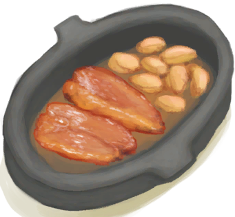

# 常用  

[

 食物效果一览](food_value.md)

[

 特殊事件查询](event.md)

[

 储物容器容量查询](tag_Bag.md)

[

 储水容器容量查询](tag_WaterContainer.md)

[

 室内环境对比](tag_EnvIndoors.md)

[

 室外环境对比](outdoor.md)

[

 农作物生长](crop.md)

[

 生态资源分布](biome.md)

[

 灾害物品损失](event_lost.md)

[

 存档查看](SaveDataEditor.md)

  
  
  
# 数值模拟  

[

 蜂箱](BeeSkep_sim.md)

[

 母猪](BoarEnclosureFemale_sim.md)

[

 母山羊](GoatEnclosureFemale_sim.md)

[

 泌乳期山羊](GoatEnclosureLactating_sim.md)

[

 雌灰山鹑](PartridgeFemaleEnclosure_sim.md)

[

 杏仁树田](CropPlotAlmondTree_sim.md)

[

 芦荟田](CropPlotAloeVera_sim.md)

[

 香蕉树田](CropPlotBananaTree_sim.md)

[

 辣椒田](CropPlotChilies_sim.md)

[

 月季田](CropPlotChinaRose_sim.md)

[

 金鸡纳树田](CropPlotCinchonaTree_sim.md)

[

 咖啡田](CropPlotCoffee_sim.md)

[

 姜田](CropPlotGinger_sim.md)

[

 茉莉花田](CropPlotJasmine_sim.md)

[

 卡瓦胡椒田](CropPlotKava_sim.md)

[

 柠檬草田](CropPlotLemonGrass_sim.md)

[

 芒果树田](CropPlotMangoTree_sim.md)

[

 水椰树田](CropPlotNipaPalm_sim.md)

[

 棕榈丛田](CropPlotPalmBush_sim.md)

[

 椰子树田](CropPlotPalmTree_sim.md)

[

 稻田](CropPlotRice_sim.md)

[

 西米树田](CropPlotSagoPalm_sim.md)

[

 蛇草田](CropPlotSnakeGrass_sim.md)

[

 蜘蛛兰田](CropPlotSpiderLily_sim.md)

[

 大叶仙茅田](CropPlotWeevilLily_sim.md)

[

 野枣田](CropPlotWildJujube_sim.md)

[

 参薯田](CropPlotYam_sim.md)

[

 杂菌菌床](MushroomBedAssorted_sim.md)

[

 迷幻菇菌床](MushroomBedMagic_sim.md)

[

 马勃菌菌床](MushroomBedPuffballs_sim.md)

  
  

