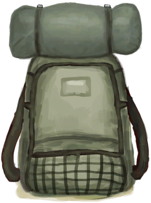

# “后背装备”  

<a href="BowRustic.md" style="color:black">简易的弓</a>

<a href="BackpackBasket.md" style="color:black">背篓</a>

<a href="BackpackLeather.md" style="color:black">皮革背包</a>

<a href="BackpackSurvivalist.md" style="color:black">生存者背包</a>

<a href="BackpackTourist.md" style="color:black">背包</a>

  
  

