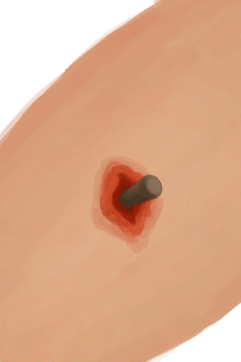

# “擦伤”  

<a href="W_Abrasion.md" style="color:black">擦伤</a>

<a href="W_Bruise.md" style="color:black">淤青</a>

<a href="W_DogBite.md" style="color:black">狗咬伤</a>

<a href="W_MacaqueBite.md" style="color:black">猕猴咬伤</a>

<a href="W_PunctureBullet.md" style="color:black">穿刺伤</a>

<a href="W_SeahoundSting.md" style="color:black">海怪刺伤</a>

<a href="W_SpiderBite.md" style="color:black">蜘蛛咬伤</a>

<a href="W_UrchinWound.md" style="color:black">海胆刺伤</a>

<a href="W_UrchinWoundSpines.md" style="color:black">海胆刺伤</a>

  
  

