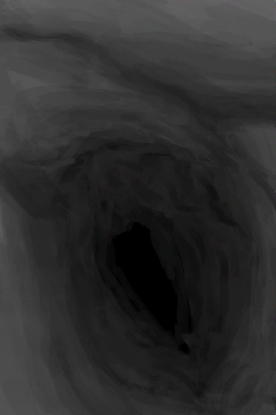

# 环境  
  

[

 [蝙蝠洞](Env_CaveBats.md)](Env_CaveBats.md)

[

 [潮湿洞穴](Env_DampChamber.md)](Env_DampChamber.md)

[潮汐洞(环境)](Env_CaveTidal.md)

[

 [畜栏](Env_Enclosure.md)](Env_Enclosure.md)

[

 [丛林](Env_Jungle.md)](Env_Jungle.md)

[

 [丛林边缘](Env_Outskirts.md)](Env_Outskirts.md)

[

 [丛林高地](Env_JungleHighlands.md)](Env_JungleHighlands.md)

[

 [丛林深处](Env_DeepJungle.md)](Env_DeepJungle.md)

[

 [地窖](Env_Cellar.md)](Env_Cellar.md)

[

 [东部草原](Env_GrasslandsE.md)](Env_GrasslandsE.md)

[

 [东部高地](Env_HighlandsEastern.md)](Env_HighlandsEastern.md)

[洞穴(环境)](Env_CaveGrasslands.md)

[洞穴(环境)](Env_CaveSea.md)

[

 [洞穴底层](Env_LowChamber.md)](Env_LowChamber.md)

[

 [洞穴上层](Env_CrystalChamber.md)](Env_CrystalChamber.md)

[

 [洞穴上层](Env_HighChamber.md)](Env_HighChamber.md)

[

 [洞穴上层](Env_NarrowTunnel.md)](Env_NarrowTunnel.md)

[

 [洞穴中层](Env_MidChamber.md)](Env_MidChamber.md)

[

 [覆溺洞穴](Env_FloodedChamber.md)](Env_FloodedChamber.md)

[

 [海湾](Env_Bay.md)](Env_Bay.md)

[

 [红树林](Env_Mangroves.md)](Env_Mangroves.md)

[

 [环礁](Env_Atoll.md)](Env_Atoll.md)

[

 [荒芜沙滩](Env_DesolateBeach.md)](Env_DesolateBeach.md)

[

 [火山](Env_AcidLake.md)](Env_AcidLake.md)

[

 [火山](Env_Volcano.md)](Env_Volcano.md)

[坑洞(环境)](Env_HighlandHole.md)

[

 [猕猴窝](Env_MacaqueDen.md)](Env_MacaqueDen.md)

[

 [木筏](Env_Raft.md)](Env_Raft.md)

[

 [泥屋](Env_MudHut.md)](Env_MudHut.md)

[

 [泥屋](Env_MudHutRuins.md)](Env_MudHutRuins.md)

[

 [鸟岩岛](Env_BirdRock.md)](Env_BirdRock.md)

[

 [棚屋](Env_Shed.md)](Env_Shed.md)

[

 [沙滩](Env_Beach.md)](Env_Beach.md)

[

 [沙滩](Env_Cove.md)](Env_Cove.md)

[

 [神秘谷](Env_SecretValley.md)](Env_SecretValley.md)

[

 [湿地](Env_Wetlands.md)](Env_Wetlands.md)

[

 [石屋](Env_StoneHut.md)](Env_StoneHut.md)

[

 [隧道](Env_Tunnel.md)](Env_Tunnel.md)

[

 [西部草原](Env_GrasslandsW.md)](Env_GrasslandsW.md)

[

 [西部高地](Env_HighlandsWestern.md)](Env_HighlandsWestern.md)

[

 [岩滩](Env_Rocks.md)](Env_Rocks.md)

[

 [阴暗洞穴](Env_DarkChamber.md)](Env_DarkChamber.md)

[

 [幽暗洞穴](Env_CaveDark.md)](Env_CaveDark.md)

[

 [坠毁的飞机](Env_CrashedPlane.md)](Env_CrashedPlane.md)

  
  

