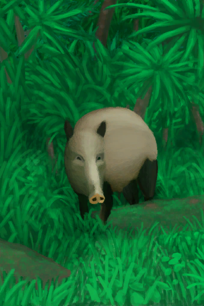
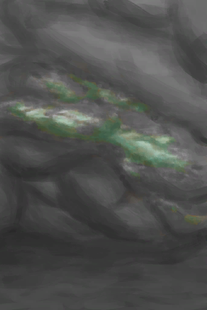

# 事件  
## 动物  
###   ·  山羊  

[

 [拿下了！](Event_GoatFightSuccess.md)](Event_GoatFightSuccess.md)

[

 [它逃跑了！](Event_GoatFightFailure.md)](Event_GoatFightFailure.md)

[

 [一头山羊！](Event_GoatFight.md)](Event_GoatFight.md)

  
  
###   ·  巨蜥  

[

 [巨蜥](Event_MonitorRummaging.md)](Event_MonitorRummaging.md)

[

 [巨蜥倒下了！](Event_MonitorFightSuccess.md)](Event_MonitorFightSuccess.md)

[

 [巨蜥发动攻击了！](Event_MonitorFightFailedRetreat.md)](Event_MonitorFightFailedRetreat.md)

[

 [它逃跑了！](Event_MonitorFightFailure.md)](Event_MonitorFightFailure.md)

[

 [我被它伤到了……](Event_MonitorFightBadFailure.md)](Event_MonitorFightBadFailure.md)

[

 [我拿下它了，但我受伤了。](Event_MonitorFightMixedSuccess.md)](Event_MonitorFightMixedSuccess.md)

[

 [一头巨蜥！](Event_MonitorFight.md)](Event_MonitorFight.md)

[

 [一头巨蜥！](Event_MonitorRaid.md)](Event_MonitorRaid.md)

  
  
###   ·  海怪  

[

 [海怪倒下了！](Event_SeahoundFightSuccess.md)](Event_SeahoundFightSuccess.md)

[

 [海怪攻击了！](Event_SeahoundFightFailedRetreat.md)](Event_SeahoundFightFailedRetreat.md)

[

 [我被它伤到了……](Event_SeahoundFightBadFailure.md)](Event_SeahoundFightBadFailure.md)

[

 [我击退了它！](Event_SeahoundFightFailure.md)](Event_SeahoundFightFailure.md)

[

 [我拿下它了，但我受伤了。](Event_SeahoundFightMixedSuccess.md)](Event_SeahoundFightMixedSuccess.md)

[

 [一头海怪！](Event_SeahoundFight.md)](Event_SeahoundFight.md)

  
  
###   ·  海蛇  

[

 [一条海蛇！](Event_SeaKraitStep.md)](Event_SeaKraitStep.md)

[

 [一条海蛇！](Event_SeaKraitSwim.md)](Event_SeaKraitSwim.md)

  
  
###   ·  海鸥  

[

 [海鸥](Event_SeagullRaidCropDestruction.md)](Event_SeagullRaidCropDestruction.md)

[

 [海鸥](Event_SeagullRaidRummaging.md)](Event_SeagullRaidRummaging.md)

[

 [拿下了！](Event_SeagullFightSuccess.md)](Event_SeagullFightSuccess.md)

[

 [你做到了！](Event_SeagullNest.md)](Event_SeagullNest.md)

[

 [它逃跑了！](Event_SeagullFightFailure.md)](Event_SeagullFightFailure.md)

[

 [一只海鸥！](Event_SeagullFight.md)](Event_SeagullFight.md)

[

 [一只海鸥！](Event_SeagullRaid.md)](Event_SeagullRaid.md)

[

 [一只海鸥！](Event_SeagullRaidCrop.md)](Event_SeagullRaidCrop.md)

  
  
###   ·  灰山鹑  

[

 [拿下了！](Event_PartridgeFightSuccess.md)](Event_PartridgeFightSuccess.md)

[

 [它逃跑了！](Event_PartridgeFightFailure.md)](Event_PartridgeFightFailure.md)

[

 [一个灰山鹑巢！](Event_PartridgeNest.md)](Event_PartridgeNest.md)

[

 [一只灰山鹑！](Event_PartridgeFight.md)](Event_PartridgeFight.md)

  
  
###   ·  猕猴  

[

 [啊！](Event_MacaqueDenFightBadFailure.md)](Event_MacaqueDenFightBadFailure.md)

[

 [啊！](Event_MacaqueDenFightFailedRetreat.md)](Event_MacaqueDenFightFailedRetreat.md)

[

 [啊！](Event_MacaqueFightBadFailure.md)](Event_MacaqueFightBadFailure.md)

[

 [啊！](Event_MacaqueFightFailedRetreat.md)](Event_MacaqueFightFailedRetreat.md)

[

 [啊！！！！](Event_MacaqueFoeAnger.md)](Event_MacaqueFoeAnger.md)

[

 [啊！！！！](Event_MacaqueFriendAnger.md)](Event_MacaqueFriendAnger.md)

[

 [礼物！](Event_MacaqueFriendGift.md)](Event_MacaqueFriendGift.md)

[

 [猕猴](Event_MacaqueRaidRummaging.md)](Event_MacaqueRaidRummaging.md)

[

 [猕猴们攻击了你！](Event_MacaqueDenFight.md)](Event_MacaqueDenFight.md)

[

 [那只猕猴倒下了！](Event_MacaqueFightSuccess.md)](Event_MacaqueFightSuccess.md)

[

 [那只猕猴倒下了！](Event_MacaqueUndeadFightSuccess.md)](Event_MacaqueUndeadFightSuccess.md)

[

 [它逃跑了！](Event_MacaqueFightFailure.md)](Event_MacaqueFightFailure.md)

[

 [它逃跑了！](Event_MacaqueUndeadFightFailure.md)](Event_MacaqueUndeadFightFailure.md)

[

 [我把猕猴吓跑了！](Event_MacaqueFightEscape.md)](Event_MacaqueFightEscape.md)

[

 [我成功了，但我受伤了。](Event_MacaqueDenFightMixedSuccess.md)](Event_MacaqueDenFightMixedSuccess.md)

[

 [我进不去！](Event_MacaqueDenFightFailure.md)](Event_MacaqueDenFightFailure.md)

[

 [我拿下它了，但我受伤了。](Event_MacaqueFightMixedSuccess.md)](Event_MacaqueFightMixedSuccess.md)

[

 [我做到啦！](Event_MacaqueDenFightSuccess.md)](Event_MacaqueDenFightSuccess.md)

[

 [一只猕猴！](Event_MacaqueFight.md)](Event_MacaqueFight.md)

[

 [一只猕猴！](Event_MacaqueFightRaid.md)](Event_MacaqueFightRaid.md)

[

 [一只猕猴！](Event_MacaqueRaid.md)](Event_MacaqueRaid.md)

[

 [一只猕猴！](Event_MacaqueUndeadFight.md)](Event_MacaqueUndeadFight.md)

  
  
###   ·  眼镜蛇  

[

 [成功！](Event_CobraFightSuccess.md)](Event_CobraFightSuccess.md)

[

 [那条眼镜蛇喷射了毒液！](Event_CobraFightFailedRetreat.md)](Event_CobraFightFailedRetreat.md)

[

 [喷毒眼镜蛇！](Event_CobraFight.md)](Event_CobraFight.md)

[

 [胜负参半](Event_CobraFightMixedSuccess.md)](Event_CobraFightMixedSuccess.md)

[

 [它逃跑了！](Event_CobraFightFailure.md)](Event_CobraFightFailure.md)

[

 [我被它伤到了……](Event_CobraFightBadFailure.md)](Event_CobraFightBadFailure.md)

  
  
###   ·  蜘蛛  

[

 [一只蜘蛛！](Event_Spider.md)](Event_Spider.md)

[

 [一只蜘蛛咬了我！](Event_SpiderNight.md)](Event_SpiderNight.md)

  
  
###   ·  野猪  

[

 [近期的踪迹](Event_BoarTrailRecent.md)](Event_BoarTrailRecent.md)

[

 [老旧的踪迹](Event_BoarTrailOld.md)](Event_BoarTrailOld.md)

[

 [它逃跑了！](Event_BoarArcheryFailure.md)](Event_BoarArcheryFailure.md)

[

 [它逃跑了！](Event_BoarFightFailure.md)](Event_BoarFightFailure.md)

[

 [我被它伤到了……](Event_BoarFightBadFailure.md)](Event_BoarFightBadFailure.md)

[

 [我发现了一头野猪！](Event_BoarFight.md)](Event_BoarFight.md)

[

 [我跟丢了踪迹……](Event_BoarTrailLost.md)](Event_BoarTrailLost.md)

[

 [我拿下它了，但我受伤了。](Event_BoarFightMixedSuccess.md)](Event_BoarFightMixedSuccess.md)

[

 [野猪倒下了！](Event_BoarFightSuccess.md)](Event_BoarFightSuccess.md)

[

 [野猪伤到了我！](Event_BoarWoundMajor.md)](Event_BoarWoundMajor.md)

[

 [野猪伤到了我！](Event_BoarWoundMinor.md)](Event_BoarWoundMinor.md)

  
  
###   ·  鲨鱼  

[

 [鲨鱼攻击！](Event_SharkFightFailedRetreat.md)](Event_SharkFightFailedRetreat.md)

[

 [鲨鱼死了！](Event_SharkFightSuccess.md)](Event_SharkFightSuccess.md)

[

 [它逃跑了！](Event_SharkFightFailure.md)](Event_SharkFightFailure.md)

[

 [我被它伤到了……](Event_SharkFightBadFailure.md)](Event_SharkFightBadFailure.md)

[

 [我拿下它了，但我受伤了。](Event_SharkFightMixedSuccess.md)](Event_SharkFightMixedSuccess.md)

[

 [一条鲨鱼！](Event_SharkFight.md)](Event_SharkFight.md)

[

 [一条鲨鱼！](Event_Raft_SharkVisitor.md)](Event_Raft_SharkVisitor.md)

  
  
## 发现  

[

 [沉船](Event_ShipwreckFound.md)](Event_ShipwreckFound.md)

[

 [丛林](Event_JungleFound.md)](Event_JungleFound.md)

[

 [丛林边缘](Event_JungleFoundFromWetlands.md)](Event_JungleFoundFromWetlands.md)

[

 [丛林边缘](Event_OutskirtsFoundFromBeach.md)](Event_OutskirtsFoundFromBeach.md)

[

 [丛林边缘](Event_OutskirtsFoundFromJungle.md)](Event_OutskirtsFoundFromJungle.md)

[

 [丛林小径](Event_JunglePathFound.md)](Event_JunglePathFound.md)

[

 [大岛](Event_BigIslandFound.md)](Event_BigIslandFound.md)

[

 [洞穴](Event_CaveDarkFound.md)](Event_CaveDarkFound.md)

[

 [洞穴](Event_CaveFound.md)](Event_CaveFound.md)

[

 [飞机残骸](Event_PlaneCrashFound.md)](Event_PlaneCrashFound.md)

[

 [高地](Event_HighlandsFound.md)](Event_HighlandsFound.md)

[

 [红树林](Event_MangrovesFoundFromBeach.md)](Event_MangrovesFoundFromBeach.md)

[

 [红树林](Event_MangrovesFoundFromWetlands.md)](Event_MangrovesFoundFromWetlands.md)

[

 [沙滩](Event_BeachFoundFromMangroves.md)](Event_BeachFoundFromMangroves.md)

[

 [沙滩](Event_BeachFoundFromOutskirts.md)](Event_BeachFoundFromOutskirts.md)

[

 [山路](Event_MountainsFound.md)](Event_MountainsFound.md)

[

 [湿地](Event_WetlandsFound.md)](Event_WetlandsFound.md)

[

 [湿地](Event_WetlandsFoundFromMangroves.md)](Event_WetlandsFoundFromMangroves.md)

[

 [铜矿脉](Event_CopperFound.md)](Event_CopperFound.md)

[

 [岩滩](Event_RocksFound.md)](Event_RocksFound.md)

[

 [隐秘港湾](Event_CoveFound.md)](Event_CoveFound.md)

  
  
## 技能  

[

 [叉鱼技能提升！](Event_SkillSpearFishing1.md)](Event_SkillSpearFishing1.md)

[

 [叉鱼技能提升！](Event_SkillSpearFishing2.md)](Event_SkillSpearFishing2.md)

[

 [叉鱼技能提升！](Event_SkillSpearFishing3.md)](Event_SkillSpearFishing3.md)

[

 [叉鱼技能提升！](Event_SkillSpearFishing4.md)](Event_SkillSpearFishing4.md)

[

 [钓鱼技能提升！](Event_SkillFishing1.md)](Event_SkillFishing1.md)

[

 [钓鱼技能提升！](Event_SkillFishing2.md)](Event_SkillFishing2.md)

[

 [钓鱼技能提升！](Event_SkillFishing3.md)](Event_SkillFishing3.md)

[

 [钓鱼技能提升！](Event_SkillFishing4.md)](Event_SkillFishing4.md)

[

 [纺织技能提升！](Event_SkillTailoring1.md)](Event_SkillTailoring1.md)

[

 [纺织技能提升！](Event_SkillTailoring2.md)](Event_SkillTailoring2.md)

[

 [纺织技能提升！](Event_SkillTailoring3.md)](Event_SkillTailoring3.md)

[

 [纺织技能提升！](Event_SkillTailoring4.md)](Event_SkillTailoring4.md)

[

 [击鼓技能提升！](Event_SkillPercussion1.md)](Event_SkillPercussion1.md)

[

 [击鼓技能提升！](Event_SkillPercussion2.md)](Event_SkillPercussion2.md)

[

 [击鼓技能提升！](Event_SkillPercussion3.md)](Event_SkillPercussion3.md)

[

 [击鼓技能提升！](Event_SkillPercussion4.md)](Event_SkillPercussion4.md)

[

 [箭术提升了！](Event_SkillArchery1.md)](Event_SkillArchery1.md)

[

 [箭术提升了！](Event_SkillArchery2.md)](Event_SkillArchery2.md)

[

 [箭术提升了！](Event_SkillArchery3.md)](Event_SkillArchery3.md)

[

 [箭术提升了！](Event_SkillArchery4.md)](Event_SkillArchery4.md)

[

 [金工技能提升！](Event_SkillMetalworking1.md)](Event_SkillMetalworking1.md)

[

 [金工技能提升！](Event_SkillMetalworking2.md)](Event_SkillMetalworking2.md)

[

 [金工技能提升！](Event_SkillMetalworking4.md)](Event_SkillMetalworking4.md)

[

 [灵视增强！](Event_SkillInsight1.md)](Event_SkillInsight1.md)

[

 [灵视增强！](Event_SkillInsight2.md)](Event_SkillInsight2.md)

[

 [灵视增强！](Event_SkillInsight3.md)](Event_SkillInsight3.md)

[

 [灵视增强！](Event_SkillInsight4.md)](Event_SkillInsight4.md)

[

 [木工技能提升！](Event_SkillWoodworking1.md)](Event_SkillWoodworking1.md)

[

 [木工技能提升！](Event_SkillWoodworking2.md)](Event_SkillWoodworking2.md)

[

 [木工技能提升！](Event_SkillWoodworking3.md)](Event_SkillWoodworking3.md)

[

 [木工技能提升！](Event_SkillWoodworking4.md)](Event_SkillWoodworking4.md)

[

 [烹饪技能提升！](Event_SkillCooking1.md)](Event_SkillCooking1.md)

[

 [烹饪技能提升！](Event_SkillCooking2.md)](Event_SkillCooking2.md)

[

 [烹饪技能提升！](Event_SkillCooking3.md)](Event_SkillCooking3.md)

[

 [烹饪技能提升！](Event_SkillCooking4.md)](Event_SkillCooking4.md)

[

 [石工技能提升！](Event_SkillKnapping1.md)](Event_SkillKnapping1.md)

[

 [石工技能提升！](Event_SkillKnapping2.md)](Event_SkillKnapping2.md)

[

 [石工技能提升！](Event_SkillKnapping3.md)](Event_SkillKnapping3.md)

[

 [石工技能提升！](Event_SkillKnapping4.md)](Event_SkillKnapping4.md)

[

 [陷阱技能提升了！](Event_SkillTrapping1.md)](Event_SkillTrapping1.md)

[

 [陷阱技能提升了！](Event_SkillTrapping2.md)](Event_SkillTrapping2.md)

[

 [陷阱技能提升了！](Event_SkillTrapping3.md)](Event_SkillTrapping3.md)

[

 [陷阱技能提升了！](Event_SkillTrapping4.md)](Event_SkillTrapping4.md)

[

 [药草学技能提升了！](Event_SkillHerbology1.md)](Event_SkillHerbology1.md)

[

 [药草学技能提升了！](Event_SkillHerbology2.md)](Event_SkillHerbology2.md)

[

 [药草学技能提升了！](Event_SkillHerbology3.md)](Event_SkillHerbology3.md)

[

 [药草学技能提升了！](Event_SkillHerbology4.md)](Event_SkillHerbology4.md)

[

 [长矛技巧提升！](Event_SkillSpearFighting1.md)](Event_SkillSpearFighting1.md)

[

 [长矛技巧提升！](Event_SkillSpearFighting2.md)](Event_SkillSpearFighting2.md)

[

 [长矛技巧提升！](Event_SkillSpearFighting3.md)](Event_SkillSpearFighting3.md)

[

 [长矛技巧提升！](Event_SkillSpearFighting4.md)](Event_SkillSpearFighting4.md)

[

 [制作技能提升！](Event_SkillCrafting1.md)](Event_SkillCrafting1.md)

[

 [制作技能提升！](Event_SkillCrafting2.md)](Event_SkillCrafting2.md)

[

 [制作技能提升！](Event_SkillCrafting3.md)](Event_SkillCrafting3.md)

[

 [制作技能提升！](Event_SkillCrafting4.md)](Event_SkillCrafting4.md)

[

 [制作技能提升！](Event_SkillMetalworking3.md)](Event_SkillMetalworking3.md)

  
  
## 探索  

[

 [地区探索完毕](Event_AcidLakeExplored.md)](Event_AcidLakeExplored.md)

[

 [地区探索完毕](Event_BayExplored.md)](Event_BayExplored.md)

[

 [地区探索完毕](Event_BeachExplored.md)](Event_BeachExplored.md)

[

 [地区探索完毕](Event_BirdRockExplored.md)](Event_BirdRockExplored.md)

[

 [地区探索完毕](Event_CoveExplored.md)](Event_CoveExplored.md)

[

 [地区探索完毕](Event_DeepJungleExplored.md)](Event_DeepJungleExplored.md)

[

 [地区探索完毕](Event_DesolateBeachExplored.md)](Event_DesolateBeachExplored.md)

[

 [地区探索完毕](Event_GrasslandsEExplored.md)](Event_GrasslandsEExplored.md)

[

 [地区探索完毕](Event_GrasslandsWExplored.md)](Event_GrasslandsWExplored.md)

[

 [地区探索完毕](Event_HighlandsEExplored.md)](Event_HighlandsEExplored.md)

[

 [地区探索完毕](Event_HighlandsWExplored.md)](Event_HighlandsWExplored.md)

[

 [地区探索完毕](Event_JungleExplored.md)](Event_JungleExplored.md)

[

 [地区探索完毕](Event_JungleHighlandsExplored.md)](Event_JungleHighlandsExplored.md)

[

 [地区探索完毕](Event_MangrovesExplored.md)](Event_MangrovesExplored.md)

[

 [地区探索完毕](Event_OutskirtsExplored.md)](Event_OutskirtsExplored.md)

[

 [地区探索完毕](Event_RocksExplored.md)](Event_RocksExplored.md)

[

 [地区探索完毕](Event_SecretValleyExplored.md)](Event_SecretValleyExplored.md)

[

 [地区探索完毕](Event_VolcanoExplored.md)](Event_VolcanoExplored.md)

[

 [地区探索完毕](Event_WetlandsExplored.md)](Event_WetlandsExplored.md)

  
  
## 敌人  
###   ·  宿敌  

[

 [宿敌被打败了！](Event_EnemyFightSuccess.md)](Event_EnemyFightSuccess.md)

[

 [宿敌来了！](Event_EnemyFight.md)](Event_EnemyFight.md)

[

 [我感觉到某种“存在”……](Event_EnemyPresence.md)](Event_EnemyPresence.md)

[

 [我没能逃掉！](Event_EnemyFightFailedRetreat.md)](Event_EnemyFightFailedRetreat.md)

[

 [我失败了！](Event_EnemyFightFailure.md)](Event_EnemyFightFailure.md)

  
  
###   ·  无人机  

[

 [成功！](Event_DroneFightSuccess.md)](Event_DroneFightSuccess.md)

[

 [攻击无人机！](Event_DroneFight.md)](Event_DroneFight.md)

[

 [胜负参半](Event_DroneFightMixedSuccess.md)](Event_DroneFightMixedSuccess.md)

[

 [它撤退了！](Event_DroneFightFailure.md)](Event_DroneFightFailure.md)

[

 [我被它伤到了……](Event_DroneFightBadFailure.md)](Event_DroneFightBadFailure.md)

[

 [无人机开火了！](Event_DroneFightFailedRetreat.md)](Event_DroneFightFailedRetreat.md)

[

 [无人机伤到了我！](Event_DroneWoundMajor.md)](Event_DroneWoundMajor.md)

[

 [无人机伤到了我！](Event_DroneWoundMinor.md)](Event_DroneWoundMinor.md)

  
  
###   ·  猎手  

[

 [猎手被击败了！](Event_HunterFightSuccess.md)](Event_HunterFightSuccess.md)

[

 [猎手来了](Event_HunterFight.md)](Event_HunterFight.md)

[

 [我没能逃掉！](Event_HunterFightFailedRetreat.md)](Event_HunterFightFailedRetreat.md)

[

 [我失败了！](Event_HunterFightBadFailure.md)](Event_HunterFightBadFailure.md)

  
  
## 灵视  

[

 [监视者](Event_WatchedExperience1a.md)](Event_WatchedExperience1a.md)

[

 [监视者](Event_WatchedExperience1b.md)](Event_WatchedExperience1b.md)

[

 [监视者](Event_WatchedExperience1c.md)](Event_WatchedExperience1c.md)

[

 [监视者](Event_WatchedExperience1d.md)](Event_WatchedExperience1d.md)

[

 [监视者](Event_WatchedExperience1e.md)](Event_WatchedExperience1e.md)

[

 [监视者](Event_WatchedExperience1f.md)](Event_WatchedExperience1f.md)

[

 [监视者](Event_WatchedExperience1gGod.md)](Event_WatchedExperience1gGod.md)

[

 [监视者](Event_WatchedExperience1gVoid.md)](Event_WatchedExperience1gVoid.md)

[

 [飘渺灵视](Event_SpiritsEverywhere1a.md)](Event_SpiritsEverywhere1a.md)

[

 [神圣灵视](Event_GodExperience1a.md)](Event_GodExperience1a.md)

[

 [神圣灵视](Event_GodExperience1b.md)](Event_GodExperience1b.md)

[

 [神圣灵视](Event_GodExperience1c.md)](Event_GodExperience1c.md)

[

 [神圣灵视](Event_GodExperience1d.md)](Event_GodExperience1d.md)

[

 [神圣灵视](Event_GodExperience1e.md)](Event_GodExperience1e.md)

[

 [神圣灵视](Event_GodExperience1f.md)](Event_GodExperience1f.md)

[

 [神圣灵视](Event_GodExperience1g.md)](Event_GodExperience1g.md)

[

 [神圣灵视](Event_GodExperience1z.md)](Event_GodExperience1z.md)

[

 [神圣灵视](Event_GodExperience1zz.md)](Event_GodExperience1zz.md)

[

 [神圣灵视](Event_HuntedExperience1a.md)](Event_HuntedExperience1a.md)

[

 [神圣灵视](Event_HuntedExperience1b.md)](Event_HuntedExperience1b.md)

[

 [神圣灵视](Event_HuntedExperience1c.md)](Event_HuntedExperience1c.md)

[

 [神圣灵视](Event_HuntedExperience1d.md)](Event_HuntedExperience1d.md)

[

 [神圣灵视](Event_HuntedExperience1e.md)](Event_HuntedExperience1e.md)

[

 [神圣灵视](Event_HuntedExperience1f.md)](Event_HuntedExperience1f.md)

[

 [神圣灵视](Event_HuntedExperience1g.md)](Event_HuntedExperience1g.md)

[

 [虚空灵视](Event_SpiritsEverywhere1b.md)](Event_SpiritsEverywhere1b.md)

[

 [虚空灵视](Event_SpiritsEverywhere1c.md)](Event_SpiritsEverywhere1c.md)

[

 [虚空灵视](Event_SpiritsEverywhere1d.md)](Event_SpiritsEverywhere1d.md)

[

 [虚空灵视](Event_SpiritsEverywhere1e.md)](Event_SpiritsEverywhere1e.md)

[

 [虚空灵视](Event_SpiritsEverywhere1f.md)](Event_SpiritsEverywhere1f.md)

[

 [虚空灵视](Event_SpiritsEverywhere1g.md)](Event_SpiritsEverywhere1g.md)

[

 [虚空灵视](Event_VoidExperience1a.md)](Event_VoidExperience1a.md)

[

 [虚空灵视](Event_VoidExperience1b.md)](Event_VoidExperience1b.md)

[

 [虚空灵视](Event_VoidExperience1c.md)](Event_VoidExperience1c.md)

[

 [虚空灵视](Event_VoidExperience1d.md)](Event_VoidExperience1d.md)

[

 [虚空灵视](Event_VoidExperience1e.md)](Event_VoidExperience1e.md)

[

 [虚空灵视](Event_VoidExperience1f.md)](Event_VoidExperience1f.md)

[

 [虚空灵视](Event_VoidExperience1g.md)](Event_VoidExperience1g.md)

  
  
## 真人秀  

[

 [表演开始！](Event_TVIntro.md)](Event_TVIntro.md)

[

 [掉落的空投 — 草原](Event_TVPackageGrasslands.md)](Event_TVPackageGrasslands.md)

[

 [掉落的空投 — 丛林](Event_TVPackageJungle.md)](Event_TVPackageJungle.md)

[

 [掉落的空投 — 高地](Event_TVPackageHighlands.md)](Event_TVPackageHighlands.md)

[

 [掉落的空投 — 红树林](Event_TVPackageMangroves.md)](Event_TVPackageMangroves.md)

[

 [掉落的空投 — 岩滩](Event_TVPackageRocks.md)](Event_TVPackageRocks.md)

[

 [受到来自项圈的伤害！](Event_TVNerveDamageDead.md)](Event_TVNerveDamageDead.md)

[

 [受到来自项圈的伤害！](Event_TVNerveDamageHands.md)](Event_TVNerveDamageHands.md)

[

 [受到来自项圈的伤害！](Event_TVNerveDamageLegs.md)](Event_TVNerveDamageLegs.md)

  
  
## 船长  

[

 [船长](Event_Captain0a.md)](Event_Captain0a.md)

[

 [船长](Event_Captain0b.md)](Event_Captain0b.md)

[

 [船长](Event_Captain0c.md)](Event_Captain0c.md)

[

 [船长](Event_Captain0d.md)](Event_Captain0d.md)

[

 [船长](Event_Captain0e.md)](Event_Captain0e.md)

[

 [船长](Event_Captain1a.md)](Event_Captain1a.md)

[

 [船长](Event_Captain1b.md)](Event_Captain1b.md)

[

 [船长](Event_Captain1c.md)](Event_Captain1c.md)

[

 [船长](Event_Captain1d.md)](Event_Captain1d.md)

[

 [船长](Event_Captain1e.md)](Event_Captain1e.md)

[

 [船长](Event_Captain2a.md)](Event_Captain2a.md)

[

 [船长](Event_Captain2b.md)](Event_Captain2b.md)

[

 [船长](Event_Captain2c.md)](Event_Captain2c.md)

[

 [船长](Event_Captain2d.md)](Event_Captain2d.md)

[

 [船长](Event_Captain3a.md)](Event_Captain3a.md)

[

 [船长](Event_Captain3b.md)](Event_Captain3b.md)

[

 [船长](Event_Captain3c.md)](Event_Captain3c.md)

[

 [船长](Event_Captain3d.md)](Event_Captain3d.md)

[

 [船长](Event_CaptainSpecial1a.md)](Event_CaptainSpecial1a.md)

[

 [船长](Event_CaptainSpecial1b.md)](Event_CaptainSpecial1b.md)

[

 [船长](Event_CaptainSpecial1c.md)](Event_CaptainSpecial1c.md)

[

 [船长](Event_CaptainSpecial1d.md)](Event_CaptainSpecial1d.md)

[

 [船长](Event_CaptainSpecial1e.md)](Event_CaptainSpecial1e.md)

[

 [船长](Event_CaptainSpecial1f.md)](Event_CaptainSpecial1f.md)

[

 [船长](Event_CaptainTalk1a.md)](Event_CaptainTalk1a.md)

  
  
## 韦斯顿  

[

 [韦斯顿](Event_Weston0a.md)](Event_Weston0a.md)

[

 [韦斯顿](Event_Weston0b.md)](Event_Weston0b.md)

[

 [韦斯顿](Event_Weston0c.md)](Event_Weston0c.md)

[

 [韦斯顿](Event_Weston0d.md)](Event_Weston0d.md)

[

 [韦斯顿](Event_Weston0e.md)](Event_Weston0e.md)

[

 [韦斯顿](Event_Weston1a.md)](Event_Weston1a.md)

[

 [韦斯顿](Event_Weston1b.md)](Event_Weston1b.md)

[

 [韦斯顿](Event_Weston1c.md)](Event_Weston1c.md)

[

 [韦斯顿](Event_Weston1d.md)](Event_Weston1d.md)

[

 [韦斯顿](Event_Weston1e.md)](Event_Weston1e.md)

[

 [韦斯顿](Event_Weston2a.md)](Event_Weston2a.md)

[

 [韦斯顿](Event_Weston2b.md)](Event_Weston2b.md)

[

 [韦斯顿](Event_Weston2c.md)](Event_Weston2c.md)

[

 [韦斯顿](Event_Weston2d.md)](Event_Weston2d.md)

[

 [韦斯顿](Event_Weston3a.md)](Event_Weston3a.md)

[

 [韦斯顿](Event_Weston3b.md)](Event_Weston3b.md)

[

 [韦斯顿](Event_Weston3c.md)](Event_Weston3c.md)

[

 [韦斯顿](Event_Weston3d.md)](Event_Weston3d.md)

[

 [韦斯顿](Event_WestonIslandEscape1.md)](Event_WestonIslandEscape1.md)

[

 [韦斯顿](Event_WestonIslandEscape2.md)](Event_WestonIslandEscape2.md)

[

 [韦斯顿](Event_WestonSpecial1a.md)](Event_WestonSpecial1a.md)

[

 [韦斯顿](Event_WestonSpecial1b.md)](Event_WestonSpecial1b.md)

[

 [韦斯顿](Event_WestonSpecial1c.md)](Event_WestonSpecial1c.md)

[

 [韦斯顿](Event_WestonSpecial1d.md)](Event_WestonSpecial1d.md)

[

 [韦斯顿](Event_WestonSpecial1e.md)](Event_WestonSpecial1e.md)

[

 [韦斯顿](Event_WestonSpecial2a.md)](Event_WestonSpecial2a.md)

[

 [韦斯顿](Event_WestonSpecial2b.md)](Event_WestonSpecial2b.md)

[

 [韦斯顿](Event_WestonSpecial2c.md)](Event_WestonSpecial2c.md)

[

 [韦斯顿](Event_WestonSpecial2d.md)](Event_WestonSpecial2d.md)

[

 [韦斯顿](Event_WestonSpecial2e.md)](Event_WestonSpecial2e.md)

[

 [韦斯顿](Event_WestonTalk1a.md)](Event_WestonTalk1a.md)

  
  
## 其他  

[

 [<b>砰！！！</b>](Event_JerrycanExplosion.md)](Event_JerrycanExplosion.md)

[

 [┗｀O′┛ 嗷！！！！](Event_DogFriendAnger.md)](Event_DogFriendAnger.md)

[

 [啊！](Event_DiveLaceration.md)](Event_DiveLaceration.md)

[

 [残骸漂走了](Event_FloatingDebrisMissed.md)](Event_FloatingDebrisMissed.md)

[

 [沉船事故](Event_IntroSmart.md)](Event_IntroSmart.md)

[

 [成功了！](Event_CoconutHit.md)](Event_CoconutHit.md)

[

 [船舶救援](Event_ShipRescue.md)](Event_ShipRescue.md)

[

 [错过了船只](Event_ShipMissed.md)](Event_ShipMissed.md)

[

 [噩梦！](Event_Nightmare.md)](Event_Nightmare.md)

[

 [飞机救援](Event_PlaneRescue.md)](Event_PlaneRescue.md)

[

 [风暴侵袭](Event_FloodDamage.md)](Event_FloodDamage.md)

[

 [风暴侵袭](Event_StormDamage.md)](Event_StormDamage.md)

[

 [风太大了！](Event_Flood.md)](Event_Flood.md)

[

 [风太大了！](Event_Storm.md)](Event_Storm.md)

[

 [鼓](Event_DrumMenu.md)](Event_DrumMenu.md)

[

 [海胆！！](Event_Urchin.md)](Event_Urchin.md)

[

 [滑倒了！](Event_SlipRocks.md)](Event_SlipRocks.md)

[

 [获救！](Event_ShipEscape.md)](Event_ShipEscape.md)

[

 [降落伞](Event_IntroParachute.md)](Event_IntroParachute.md)

[

 [介绍](Event_IntroFarmer.md)](Event_IntroFarmer.md)

[

 [巨浪击中了木筏！](Event_Wave.md)](Event_Wave.md)

[

 [礼物！](Event_DogFriendGift.md)](Event_DogFriendGift.md)

[

 [迷失](Event_IntroNormal.md)](Event_IntroNormal.md)

[

 [迷失](Event_Liferaft.md)](Event_Liferaft.md)

[

 [你昏过去了](Event_FaintDizzy.md)](Event_FaintDizzy.md)

[

 [你昏过去了](Event_FaintExhaustion.md)](Event_FaintExhaustion.md)

[

 [你睡着了！](Event_FallingAsleep.md)](Event_FallingAsleep.md)

[

 [你一无所获！](Event_FishNothing.md)](Event_FishNothing.md)

[

 [呕吐！](Event_Vomit.md)](Event_Vomit.md)

[

 [漂浮的残骸！](Event_Raft_FloatingDebris.md)](Event_Raft_FloatingDebris.md)

[失败！(事件)](Event_GrouperFailure.md)

[失败！(事件)](Event_SwimmingFailed.md)

[

 [时候已到！](Event_Pregnancy.md)](Event_Pregnancy.md)

[

 [鼠害](Event_MouseDamage.md)](Event_MouseDamage.md)

[

 [树液补给点](Event_SapStationNoCoconuts.md)](Event_SapStationNoCoconuts.md)

[

 [树汁补给点](Event_SapStation.md)](Event_SapStation.md)

[

 [死亡](Event_DeathContentment.md)](Event_DeathContentment.md)

[

 [死亡](Event_DeathGeneral.md)](Event_DeathGeneral.md)

[

 [死亡](Event_DeathHypothermia.md)](Event_DeathHypothermia.md)

[

 [死亡](Event_DeathNutrition.md)](Event_DeathNutrition.md)

[

 [我游不动了……](Event_SwimFail.md)](Event_SwimFail.md)

[

 [无法控制焦虑！](Event_AnxietyAttack.md)](Event_AnxietyAttack.md)

[

 [小行星撞击！](Event_AlienCrater.md)](Event_AlienCrater.md)

[

 [椰子树](Event_PalmTree.md)](Event_PalmTree.md)

[

 [椰子树](Event_PalmTree1.md)](Event_PalmTree1.md)

[

 [椰子树](Event_PalmTree2.md)](Event_PalmTree2.md)

[

 [椰子树](Event_PalmTree3.md)](Event_PalmTree3.md)

[

 [椰子树](Event_PalmTree4.md)](Event_PalmTree4.md)

[

 [一具骷髅！](Event_SkeletonSeen.md)](Event_SkeletonSeen.md)

[

 [一群蜜蜂！](Event_BeesSwarming.md)](Event_BeesSwarming.md)

[

 [一艘路过的船！](Event_Raft_PassingShip.md)](Event_Raft_PassingShip.md)

[

 [有船来了！](Event_ShipRescueDistance.md)](Event_ShipRescueDistance.md)

[远处有一座大岛……(事件)](Event_DistantIsland.md)

[遭遇石斑鱼(事件)](Event_Grouper.md)

[

 [着陆预警！](Event_Raft_Atoll.md)](Event_Raft_Atoll.md)

[

 [坠机](Event_IntroTough.md)](Event_IntroTough.md)

[

 [坠机](Event_IntroTourist1.md)](Event_IntroTourist1.md)

[

 [坠机](Event_IntroTourist2.md)](Event_IntroTourist2.md)

[

 [坠落！](Event_FallAbrasion.md)](Event_FallAbrasion.md)

[

 [坠落！](Event_FallBruise.md)](Event_FallBruise.md)

[

 [坠落！](Event_FallFracture.md)](Event_FallFracture.md)

[

 [坠落！](Event_FallLaceration.md)](Event_FallLaceration.md)

[

 [坠落！](Event_FallSprains.md)](Event_FallSprains.md)

[坠落！(事件)](Event_MountainSlip.md)

[

 [祖父康复了！](Event_OutroFarmer1.md)](Event_OutroFarmer1.md)

[

 [祖父康复了！](Event_OutroFarmer2.md)](Event_OutroFarmer2.md)

[

 [罪魁祸首回来了！](Event_Boat.md)](Event_Boat.md)

  
  

