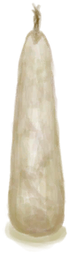
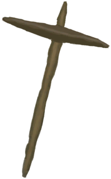
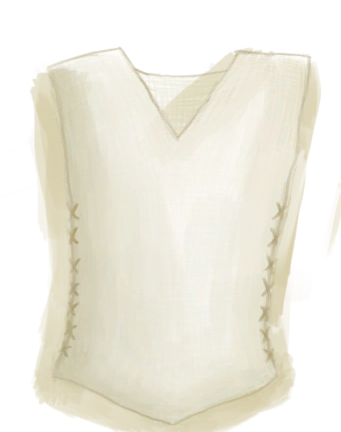
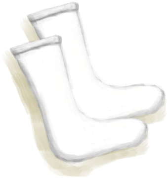
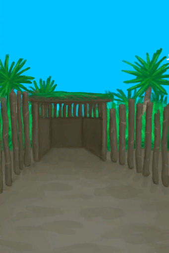

# 特殊事件物品损失  
<table class="table table-bordered" data-toggle="table"  ><thead style=""><tr ><th  style="width:14%;text-align:left;vertical-align:top;"  >事件</th><th  style="text-align:left;vertical-align:top;"  >可能损失物品</th></tr></thead><tr ><td  style="width:14%;text-align:left;vertical-align:top;"  >
[

 [猕猴](Event_MacaqueRaidRummaging.md)](Event_MacaqueRaidRummaging.md)
</td><td  style="text-align:left;vertical-align:top;"  >** 地上物品**中的[“饲料”](tag_Feed.md) ** 地上物品**中的[

[简易箭矢](ArrowSimple.md)](ArrowSimple.md), [

[背包](BackpackTourist.md)](BackpackTourist.md), [

[香蕉](Banana.md)](Banana.md), [

[军用皮带](BeltMilitary.md)](BeltMilitary.md), [

[扫帚](Broom.md)](Broom.md), [

[蜡烛(关)](CandleOff.md)](CandleOff.md), [

[水壶](Canteen.md)](Canteen.md), [

[椰子凉鞋](CoconutSandals.md)](CoconutSandals.md), [

[布](Cloth.md)](Cloth.md), [

[大块的布](ClothLarge.md)](ClothLarge.md), [

[布片](ClothSmall.md)](ClothSmall.md), [

[钓鱼线](FishingLineRustic.md)](FishingLineRustic.md), [

[钓鱼线（已添加诱饵）](FishingLineRusticBait.md)](FishingLineRusticBait.md), [

[钓鱼线](FishingLine.md)](FishingLine.md), [

[钓鱼线（已添加诱饵）](FishingLineBait.md)](FishingLineBait.md), [

[人字拖](Flipflops.md)](Flipflops.md), [

[鲜花项链](FlowerNecklace.md)](FlowerNecklace.md), [

[抗生素](Antibiotics.md)](Antibiotics.md), [

[泻立停](AntiDiarrhoeaPills.md)](AntiDiarrhoeaPills.md), [

[眼镜](Glasses.md)](Glasses.md), [

[枪](Gun.md)](Gun.md), [

[空的手枪](GunEmpty.md)](GunEmpty.md), [

[手钻](HandDrill.md)](HandDrill.md), [

[弓钻](BowDrill.md)](BowDrill.md), [

[骨刀](KnifeBone.md)](KnifeBone.md), [

[铜刀](KnifeCopper.md)](KnifeCopper.md), [

[钝刀](KnifeCopperBlunt.md)](KnifeCopperBlunt.md), [

[军刀](KnifeMilitary.md)](KnifeMilitary.md), [

[钝刀](KnifeMilitaryBlunt.md)](KnifeMilitaryBlunt.md), [

[废金属刀](KnifeScrap.md)](KnifeScrap.md), [

[金属废料](MetalScrap.md)](MetalScrap.md), [

[止‍疼薬](Painkillers.md)](Painkillers.md), [

[手机(关)](PhoneOff.md)](PhoneOff.md), [

[手机(开)](PhoneOn.md)](PhoneOn.md), [

[手机](PhoneOnLight.md)](PhoneOnLight.md), [

[塑料瓶](PlasticBottle.md)](PlasticBottle.md), [

[塑料瓶(满)](PlasticBottleFull.md)](PlasticBottleFull.md), [

[茉莉花(塑料瓶)](PlasticBottleJasmine.md)](PlasticBottleJasmine.md), [

[箭筒](Quiver.md)](Quiver.md), [

[安全刀](SafetyKnife.md)](SafetyKnife.md), [

[挎包](Satchel.md)](Satchel.md), [

[投石索](Sling.md)](Sling.md), [

[矛头](SpearHead.md)](SpearHead.md), [

[钝矛头](SpearHeadBlunt.md)](SpearHeadBlunt.md), [

[纺锤](Spindle.md)](Spindle.md), [

[缠好的纺锤](SpindleFiber.md)](SpindleFiber.md), [

[净水片](WaterPurificationTablets.md)](WaterPurificationTablets.md), [

[水袋](Waterskin.md)](Waterskin.md), [

[线团](YarnFiber.md)](YarnFiber.md), [

[珍珠](Pearl.md)](Pearl.md), [

[珍珠项链](PearlNecklace.md)](PearlNecklace.md), [

[防蜂服](BeeSuit.md)](BeeSuit.md), [

[项圈](CollarTV.md)](CollarTV.md), [

[铜项链](CopperNecklace.md)](CopperNecklace.md), [

[包脚布](FootWrappings.md)](FootWrappings.md), [

[防毒面具](GasMaskRustic.md)](GasMaskRustic.md), [

[绑手带](HandWrappings.md)](HandWrappings.md), [

[求生帽](HatSurvival.md)](HatSurvival.md), [

[棕榈编织帽](HatWoven.md)](HatWoven.md), [

[夏威夷衬衫](HawaiianShirt.md)](HawaiianShirt.md), [

[头巾](HeadWrappings.md)](HeadWrappings.md), [

[卫衣](HoodieRetromation.md)](HoodieRetromation.md), [

[草裙](LeafSKirt.md)](LeafSKirt.md), [

[皮革手套](LeatherGloves.md)](LeatherGloves.md), [

[皮裤](LeatherPants.md)](LeatherPants.md), [

[皮革鞋子](LeatherShoes.md)](LeatherShoes.md), [

[临时防毒面具](MaskMakeshift.md)](MaskMakeshift.md), [

[军靴](MilitaryBoots.md)](MilitaryBoots.md), [

[军裤](MilitaryPants.md)](MilitaryPants.md), [布制裤子](PantsCloth.md), [

[雨衣](Raincoat.md)](Raincoat.md), [

[海鸥护符](SeagullCharm.md)](SeagullCharm.md), [

[贝壳项链](SeashellNecklace.md)](SeashellNecklace.md), [

[鲨鱼头饰](SharkHeadpiece.md)](SharkHeadpiece.md), [

[衬衫](ShirtFiber.md)](ShirtFiber.md), [

[短裤](Shorts.md)](Shorts.md), [

[运动鞋](Sneakers.md)](Sneakers.md), [

[袜子](Socks.md)](Socks.md), [

[蓑衣](StrawCape.md)](StrawCape.md), [

[T恤](T-Shirt.md)](T-Shirt.md), [

[内裤](Underwear.md)](Underwear.md), [

[方解石晶体](Calcite.md)](Calcite.md), [

[茉莉花(陶罐)](ClayJarJasmine.md)](ClayJarJasmine.md), [

[铜瓶](CopperBottle.md)](CopperBottle.md), [

[铜罐](CopperJar.md)](CopperJar.md), [

[铸铜鱼雕](CopperDecoration_Fish.md)](CopperDecoration_Fish.md), [

[铜制贝壳](CopperDecoration_Seashell.md)](CopperDecoration_Seashell.md), [

[铜制乌龟](CopperDecoration_Turtle.md)](CopperDecoration_Turtle.md), [

[珊瑚](Coral.md)](Coral.md), [

[铜制餐具](EatingUtensilsCopper.md)](EatingUtensilsCopper.md), [

[木质餐具](EatingUtensilsWooden.md)](EatingUtensilsWooden.md), [

[大海螺](GiantConch.md)](GiantConch.md), [

[山羊木雕](WoodCarving_Goat.md)](WoodCarving_Goat.md), [

[小人木雕（男）](WoodCarving_Man.md)](WoodCarving_Man.md), [

[神灵木雕](WoodCarving_Monster.md)](WoodCarving_Monster.md), [

[海鸥木雕](WoodCarving_Seagull.md)](WoodCarving_Seagull.md), [

[小人木雕（女）](WoodCarving_Woman.md)](WoodCarving_Woman.md), [

[海螺](Conch.md)](Conch.md), [

[陶碗](ClayBowl.md)](ClayBowl.md), [

[小陶罐](ClayJar.md)](ClayJar.md), [

[废铜](CopperDecoration_Failed.md)](CopperDecoration_Failed.md), [

[燧石](Flint.md)](Flint.md), [

[黑曜石](Obsidian.md)](Obsidian.md), [

[漂亮贝壳](SeashellsPretty.md)](SeashellsPretty.md), [

[仪式匕首](CeremonialDagger.md)](CeremonialDagger.md), [

[燧石刀](KnifeFlint.md)](KnifeFlint.md), [

[祖父的刀](KnifeGrandpa.md)](KnifeGrandpa.md), [

[祖父的钝刀](KnifeGrandpaBlunt.md)](KnifeGrandpaBlunt.md), [

[黑曜石刀](KnifeObsidian.md)](KnifeObsidian.md), [

[石刀](StoneSharpened.md)](StoneSharpened.md), [

[侏儒牙雕（女）](TuskCarving_GnomeFemale.md)](TuskCarving_GnomeFemale.md), [

[侏儒牙雕（男）](TuskCarving_GnomeMale.md)](TuskCarving_GnomeMale.md), [

[韦斯顿](Weston.md)](Weston.md)</td></tr><tr ><td  style="width:14%;text-align:left;vertical-align:top;"  >
[

 [巨蜥](Event_MonitorRummaging.md)](Event_MonitorRummaging.md)
</td><td  style="text-align:left;vertical-align:top;"  >** 地上物品**中的[“肉”](tag_Meat.md)</td></tr><tr ><td  style="width:14%;text-align:left;vertical-align:top;"  >
[

 [海鸥](Event_SeagullRaidRummaging.md)](Event_SeagullRaidRummaging.md)
</td><td  style="text-align:left;vertical-align:top;"  >** 地上物品**中的[“饲料”](tag_Feed.md)</td></tr><tr ><td  style="width:14%;text-align:left;vertical-align:top;"  >
[

 [鼠害](Event_MouseDamage.md)](Event_MouseDamage.md)
</td><td  style="text-align:left;vertical-align:top;"  >** 地上物品**中的[“饲料”](tag_Feed.md)</td></tr><tr ><td  style="width:14%;text-align:left;vertical-align:top;"  >
[

 [风暴侵袭](Event_StormDamage.md)](Event_StormDamage.md)
</td><td  style="text-align:left;vertical-align:top;"  >所有** 地上物品**, 除了~~[“沉重的”](tag_Heavy.md)~~/~~[“大的”](tag_Large.md)~~/~~[

[韦斯顿](Weston.md)](Weston.md)~~ ** 区域物品**中的[

[叶床](LeafBed.md)](LeafBed.md), [

[窝棚](Shelter.md)](Shelter.md), [

[有遮蔽的叶床](ShelteredLeafBed.md)](ShelteredLeafBed.md), [

[雨水收集器](RainCatcher.md)](RainCatcher.md), [

[太阳能蒸馏器](SolarStill.md)](SolarStill.md), [

[吊床](Hammock.md)](Hammock.md), [

[稻草人](Scarecrow.md)](Scarecrow.md), [

[帐篷](TentDeployed.md)](TentDeployed.md), [

[织布机](Loom.md)](Loom.md), [

[织布机（空）](LoomEmpty.md)](LoomEmpty.md), [

[晾晒架](DryingRack.md)](DryingRack.md), [

[落石陷阱](DeadfallTrap.md)](DeadfallTrap.md), [

[套索陷阱](SnareTrap.md)](SnareTrap.md), [

[捕鱼陷阱](FishTrapDeployed.md)](FishTrapDeployed.md)</td></tr><tr ><td  style="width:14%;text-align:left;vertical-align:top;"  >
[

 [风太大了！](Event_Storm.md)](Event_Storm.md)
</td><td  style="text-align:left;vertical-align:top;"  >所有** 地上物品**, 除了~~[“沉重的”](tag_Heavy.md)~~/~~[“大的”](tag_Large.md)~~/~~[

[韦斯顿](Weston.md)](Weston.md)~~ ** 区域物品**中的[

[叶床](LeafBed.md)](LeafBed.md), [

[窝棚](Shelter.md)](Shelter.md), [

[有遮蔽的叶床](ShelteredLeafBed.md)](ShelteredLeafBed.md), [

[雨水收集器](RainCatcher.md)](RainCatcher.md), [

[太阳能蒸馏器](SolarStill.md)](SolarStill.md), [

[吊床](Hammock.md)](Hammock.md), [

[稻草人](Scarecrow.md)](Scarecrow.md), [

[帐篷](TentDeployed.md)](TentDeployed.md), [

[织布机](Loom.md)](Loom.md), [

[织布机（空）](LoomEmpty.md)](LoomEmpty.md), [

[晾晒架](DryingRack.md)](DryingRack.md), [

[落石陷阱](DeadfallTrap.md)](DeadfallTrap.md), [

[套索陷阱](SnareTrap.md)](SnareTrap.md), [

[捕鱼陷阱](FishTrapDeployed.md)](FishTrapDeployed.md)</td></tr><tr ><td  style="width:14%;text-align:left;vertical-align:top;"  >
[

 [巨浪击中了木筏！](Event_Wave.md)](Event_Wave.md)
</td><td  style="text-align:left;vertical-align:top;"  >所有** 地上物品** 所有** 手上物品** 所有** 地上物品** ** 区域物品**中的[

[叶床](LeafBed.md)](LeafBed.md), [

[窝棚](Shelter.md)](Shelter.md), [

[有遮蔽的叶床](ShelteredLeafBed.md)](ShelteredLeafBed.md), [

[畜栏](EnclosureEntrance.md)](EnclosureEntrance.md), [

[泥屋](MudHutEntrance.md)](MudHutEntrance.md), [

[雨水收集器](RainCatcher.md)](RainCatcher.md), [

[蓄水池](WaterReservoir.md)](WaterReservoir.md), [

[编织篓(已放置)](BasketPlaced.md)](BasketPlaced.md), [

[帐篷](TentDeployed.md)](TentDeployed.md)</td></tr></tbody></table>  
  

