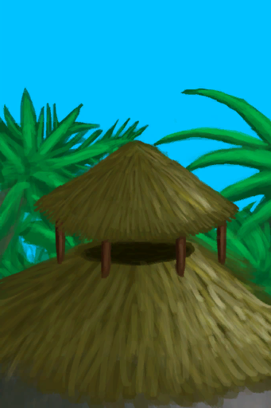

# 改造  

[

 [白墙](Imp_WhiteWashedWalls.md)](Imp_WhiteWashedWalls.md)

[

 [灌溉系统](Imp_Irrigation.md)](Imp_Irrigation.md)

[

 [海之荣耀](Imp_SeaTrophy.md)](Imp_SeaTrophy.md)

[

 [家园标志](Imp_HomeSign.md)](Imp_HomeSign.md)

[

 [扩建木筏](Imp_RaftExpansion1.md)](Imp_RaftExpansion1.md)

[

 [扩建木筏](Imp_RaftExpansion2.md)](Imp_RaftExpansion2.md)

[

 [门](Imp_Door.md)](Imp_Door.md)

[

 [泥屋扩建](Imp_MudHutExpansion.md)](Imp_MudHutExpansion.md)

[

 [棚屋扩建](Imp_ShedExpansion.md)](Imp_ShedExpansion.md)

[

 [皮地毯](Imp_RaftStitchedHideFloor.md)](Imp_RaftStitchedHideFloor.md)

[

 [皮地毯](Imp_StitchedHideFloor.md)](Imp_StitchedHideFloor.md)

[

 [石屋扩建](Imp_StoneHutExpansion.md)](Imp_StoneHutExpansion.md)

[

 [通风塔](Imp_WindcatcherMudHut.md)](Imp_WindcatcherMudHut.md)

[

 [通风塔](Imp_WindcatcherStoneHut.md)](Imp_WindcatcherStoneHut.md)

[

 [陷阱栅栏](Imp_TrappingFences.md)](Imp_TrappingFences.md)

[

 [小径](Imp_Path.md)](Imp_Path.md)

  
  

