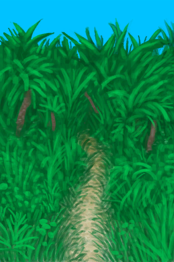

# 改造  
   |     |     |     
 :----:    |   :----:    |   :----:    |   :----:    
[ [白墙](Imp_WhiteWashedWalls.md)](Imp_WhiteWashedWalls.md)  |  [捕风者](Imp_Windcatcher.md)  |  [ [灌溉系统](Imp_Irrigation.md)](Imp_Irrigation.md)  |  [ [海之荣耀](Imp_SeaTrophy.md)](Imp_SeaTrophy.md)  
[ [家园标志](Imp_HomeSign.md)](Imp_HomeSign.md)  |  [ [扩建木筏(1)](Imp_RaftExpansion1.md)](Imp_RaftExpansion1.md)  |  [ [扩建木筏(2)](Imp_RaftExpansion2.md)](Imp_RaftExpansion2.md)  |  [ [门](Imp_Door.md)](Imp_Door.md)  
[ [泥屋扩建](Imp_MudHutExpansion.md)](Imp_MudHutExpansion.md)  |  [ [棚屋扩建](Imp_ShedExpansion.md)](Imp_ShedExpansion.md)  |  [ [皮地毯(木筏)](Imp_RaftStitchedHideFloor.md)](Imp_RaftStitchedHideFloor.md)  |  [ [皮地毯](Imp_StitchedHideFloor.md)](Imp_StitchedHideFloor.md)  
[ [石屋扩建](Imp_StoneHutExpansion.md)](Imp_StoneHutExpansion.md)  |  [ [陷阱栅栏](Imp_TrappingFences.md)](Imp_TrappingFences.md)  |  [ [小径](Imp_Path.md)](Imp_Path.md)  |    

