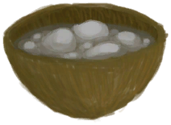

# 液体  

[

 [不安全的水](LQ_WaterUnsafe.md)](LQ_WaterUnsafe.md)

[

 [醋](LQ_Vinegar.md)](LQ_Vinegar.md)

[

 [肥皂混合物](LQ_SoapMix.md)](LQ_SoapMix.md)

[

 [蜂蜜](LQ_Honey.md)](LQ_Honey.md)

[

 [蜂蜜酒](LQ_Mead.md)](LQ_Mead.md)

[

 [蜂蜜水](LQ_HoneyWater.md)](LQ_HoneyWater.md)

[

 [灰水](LQ_AshWater.md)](LQ_AshWater.md)

[

 [碱液](LQ_Lye.md)](LQ_Lye.md)

[

 [姜茶](LQ_GingerTea.md)](LQ_GingerTea.md)

[

 [浸泡的参薯](LQ_SoakedYam.md)](LQ_SoakedYam.md)

[

 [浸泡的米](LQ_SoakedRice.md)](LQ_SoakedRice.md)

[

 [浸泡的西米](LQ_SoakedSago.md)](LQ_SoakedSago.md)

[

 [咖啡](LQ_Coffee.md)](LQ_Coffee.md)

[

 [卡瓦汤](LQ_Kava.md)](LQ_Kava.md)

[

 [开水](LQ_WaterBoiling.md)](LQ_WaterBoiling.md)

[

 [辣椒农药](LQ_PesticideChilli.md)](LQ_PesticideChilli.md)

[

 [硫磺农药](LQ_PesticideBrimstone.md)](LQ_PesticideBrimstone.md)

[

 [硫酸](LQ_Vitriol.md)](LQ_Vitriol.md)

[

 [硫酸盐混合物](LQ_VitriolMix.md)](LQ_VitriolMix.md)

[

 [米汤](LQ_WaterRice.md)](LQ_WaterRice.md)

[

 [茉莉花茶](LQ_JasmineTea.md)](LQ_JasmineTea.md)

[

 [茉莉精油](LQ_OilJasmine.md)](LQ_OilJasmine.md)

[

 [茉莉油混合物](LQ_OilJasmineMix.md)](LQ_OilJasmineMix.md)

[

 [浓硝酸](LQ_AquaFortis.md)](LQ_AquaFortis.md)

[

 [全脂羊奶](LQ_MilkWhole.md)](LQ_MilkWhole.md)

[

 [乳清](LQ_MilkWhey.md)](LQ_MilkWhey.md)

[

 [熟石灰](LQ_SlakedLime.md)](LQ_SlakedLime.md)

[

 [水](LQ_Water.md)](LQ_Water.md)

[

 [水椰树汁](LQ_Sap.md)](LQ_Sap.md)

[

 [汤力水](LQ_TonicWater.md)](LQ_TonicWater.md)

[

 [糖酒](LQ_SugarWine.md)](LQ_SugarWine.md)

[

 [糖水](LQ_SugarWater.md)](LQ_SugarWater.md)

[

 [脱脂羊奶](LQ_MilkSkimmed.md)](LQ_MilkSkimmed.md)

[

 [香茅精油](LQ_OilCitronella.md)](LQ_OilCitronella.md)

[

 [香茅油混合物](LQ_OilCitronellaMix.md)](LQ_OilCitronellaMix.md)

[

 [硝石溶液](LQ_DissolvedNiter.md)](LQ_DissolvedNiter.md)

[

 [盐水](LQ_WaterSalt.md)](LQ_WaterSalt.md)

[

 [椰奶](LQ_CoconutMilk.md)](LQ_CoconutMilk.md)

[

 [椰子水](LQ_CoconutWater.md)](LQ_CoconutWater.md)

[

 [油](LQ_Oil.md)](LQ_Oil.md)

[

 [有毒的水](LQ_WaterToxic.md)](LQ_WaterToxic.md)

[

 [月季花茶](LQ_ChinaRoseTea.md)](LQ_ChinaRoseTea.md)

[

 [蜘蛛兰茶](LQ_SpiderLily.md)](LQ_SpiderLily.md)

[

 [棕榈酒](LQ_PalmWine.md)](LQ_PalmWine.md)

  
  

