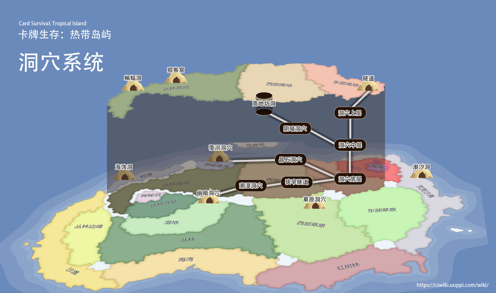
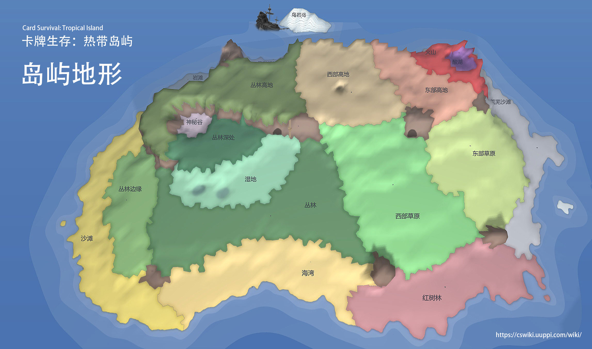
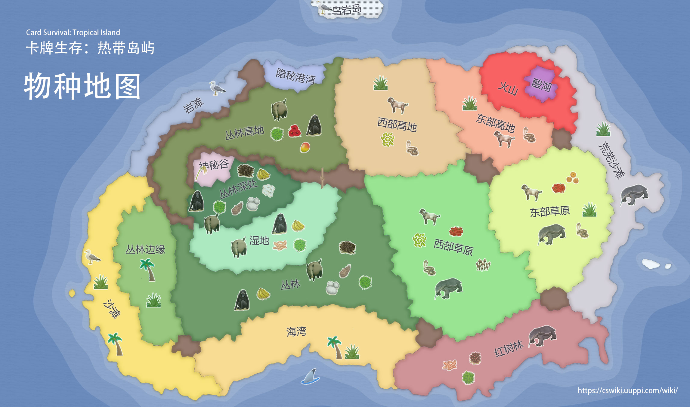

# 岛屿地图

<!-- Image Map Generated by http://www.image-map.net/ -->

<map name="image-map">
    <area target="" alt="海湾" title="海湾" href="./#!Bay.md" coords="695,1161,741,1278,1001,1163,1282,1242,1373,1118,1116,1019,818,1070" shape="poly">
    <area target="" alt="红树林" title="红树林" href="./#!Mangroves.md" coords="1347,1207,1341,1298,1596,1306,1809,1205,2009,1203,2005,1075,1795,1021" shape="poly">
    <area target="" alt="沙滩" title="沙滩" href="./#!Beach.md" coords="630,1189,727,1302,506,1280,352,1187,280,982,288,715,436,508,496,640,385,743,381,893,464,1102" shape="poly">
    <area target="" alt="丛林边缘" title="丛林边缘" href="./#!Outskirts.md" coords="490,654,395,741,391,895,464,1092,612,1116,567,968,571,750" shape="poly">
    <area target="" alt="丛林" title="丛林" href="./#!Jungle.md" coords="583,750,575,966,626,1110,713,1120,810,1055,1096,1003,1365,1090,1215,636,1149,644,1033,871,709,912" shape="poly">
    <area target="" alt="湿地" title="湿地" href="./#!Wetlands.md" coords="1138,638,1021,852,703,887,640,759,802,759,1009,618,1070,610" shape="poly">
    <area target="" alt="丛林深处" title="丛林深处" href="./#!DeepJungle.md" coords="1001,610,800,537,756,605,652,624,620,703,656,743,802,747" shape="poly">
    <area target="" alt="神秘谷" title="神秘谷" href="./#!SecretValley.md" coords="776,526,677,508,646,539,648,610,749,597" shape="poly">
    <area target="" alt="丛林高地" title="丛林高地" href="./#!JungleHighlands.md" coords="624,628,606,717,527,654,506,539,596,431,877,285,999,306,1104,279,1149,520,1055,577,662,478,612,547" shape="poly">
    <area target="" alt="岩滩" title="岩滩" href="./#!Rocks.md" coords="794,239,814,304,567,429,498,521,444,494,596,306" shape="poly">
    <area target="" alt="隐秘港湾" title="隐秘港湾" href="./#!Cove.md" coords="867,202,877,271,991,294,1068,271,1088,215" shape="poly">
    <area target="" alt="西部高地" title="西部高地" href="./#!HighlandsWestern.md" coords="1147,195,1112,280,1167,572,1377,588,1531,531,1525,432,1454,361,1416,189" shape="poly">
    <area target="" alt="东部高地" title="东部高地" href="./#!HighlandsEastern.md" coords="1422,191,1456,353,1531,430,1535,456,1665,563,1829,486,1831,403,1663,361,1592,308,1592,223,1519,223" shape="poly">
    <area target="" alt="西部草原" title="西部草原" href="./#!GrasslandsW.md" coords="1213,598,1377,598,1539,541,1620,620,1631,770,1673,847,1746,847,1785,1007,1517,1116,1377,1058" shape="poly">
    <area target="" alt="东部草原" title="东部草原" href="./#!GrasslandsE.md" coords="1631,592,1637,760,1677,831,1750,837,1787,966,1882,966,2032,756,2018,567,1904,490,1843,484" shape="poly">
    <area target="" alt="荒芜沙滩" title="荒芜沙滩" href="./#!DesolateBeach.md" coords="1888,979,1900,1023,1991,1052,2232,620,2127,525,1920,165,1697,152,1839,197,1908,302,1902,468,2009,545,2044,760" shape="poly">
    <area target="" alt="火山" title="火山" href="./#!Volcano.md" coords="1596,221,1600,308,1671,348,1829,391,1849,425,1894,440,1900,308,1829,201,1702,160,1623,180" shape="poly">
    <area target="" alt="酸湖" title="酸湖" href="./#!AcidLake.md" coords="1776,219,1742,262,1738,308,1825,335,1855,276,1841,231" shape="poly">
    <area target="" alt="鸟岩岛" title="鸟岩岛" href="./#!BirdRock.md" coords="1023,9,1055,79,1250,75,1296,0" shape="poly">
</map>

