# COD-废城  
<table><tr><td width=140><b>作者：</b></td><td></td></tr><tr><td><b>Wiki数据版本：</b></td><td>1.19</td></tr><tr><td><b>版本下载：</b></td><td>

获取中...

</td></tr></table>  
## 装备  

<a href="cod_Nc_Bandage.md" style="color:black">绷带</a>

<a href="cod_大腰包.md" style="color:black">破败轮船</a>

<a href="cod_无人机伙伴.md" style="color:black">破败轮船</a>

<a href="cod_末日背包.md" style="color:black">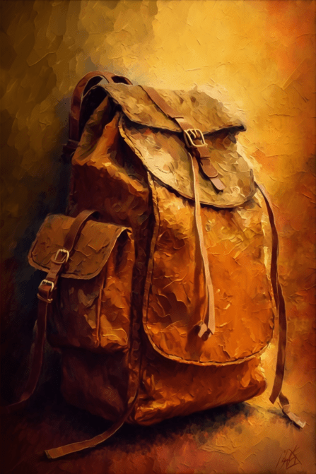破败轮船</a>

  
  

  
## 食物  

<a href="cod_自制蘑菇罐头.md" style="color:black">破败轮船</a>

<a href="cod_Nc_ScavengingSupplies_Food_BaggedFood_TypeEight.md" style="color:black">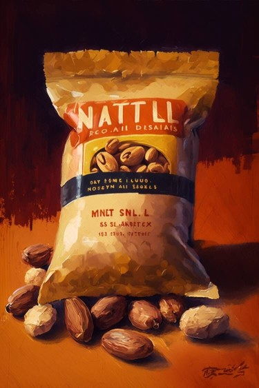袋装食品</a>

<a href="cod_Nc_ScavengingSupplies_Food_BaggedFood_TypeFive.md" style="color:black">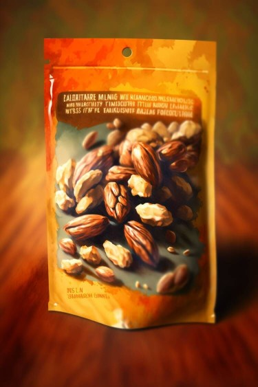袋装食品</a>

<a href="cod_Nc_ScavengingSupplies_Food_BaggedFood_TypeFour.md" style="color:black">袋装食品</a>

<a href="cod_Nc_ScavengingSupplies_Food_BaggedFood_TypeNine.md" style="color:black">袋装食品</a>

<a href="cod_Nc_ScavengingSupplies_Food_BaggedFood_TypeOne.md" style="color:black">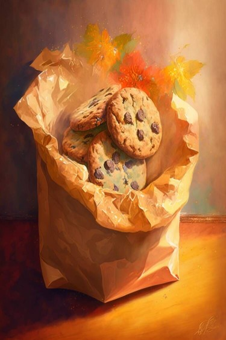格林曲奇</a>

<a href="cod_Nc_ScavengingSupplies_Food_BaggedFood_TypeSeven.md" style="color:black">袋装食品</a>

<a href="cod_Nc_ScavengingSupplies_Food_BaggedFood_TypeSix.md" style="color:black">袋装食品</a>

<a href="cod_Nc_ScavengingSupplies_Food_BaggedFood_TypeTen.md" style="color:black">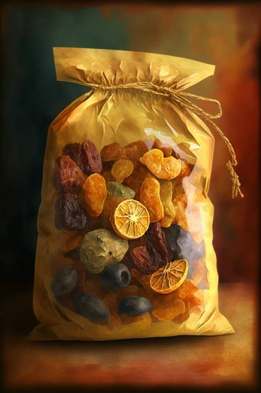袋装食品</a>

<a href="cod_Nc_ScavengingSupplies_Food_BaggedFood_TypeThree.md" style="color:black">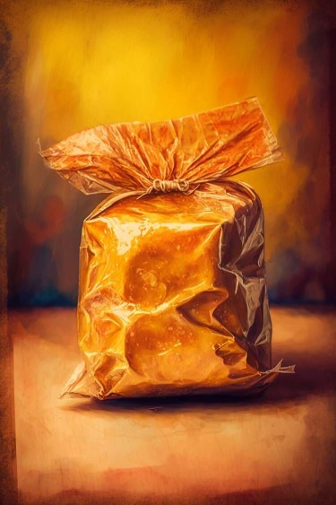袋装食品</a>

<a href="cod_Nc_ScavengingSupplies_Food_BaggedFood_TypeTwo.md" style="color:black">袋装食品</a>

<a href="cod_Nc_ScavengingSupplies_Food_CannedGood_TypeEighteen.md" style="color:black">金枪鱼罐头</a>

<a href="cod_Nc_ScavengingSupplies_Food_CannedGood_TypeEleven.md" style="color:black">午餐肉罐头</a>

<a href="cod_Nc_ScavengingSupplies_Food_CannedGood_TypeFivteen.md" style="color:black">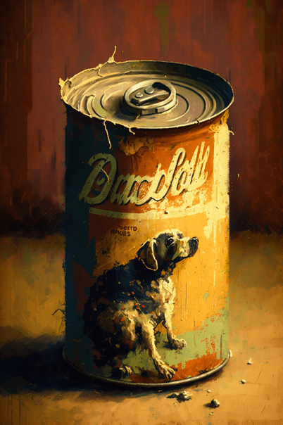陈旧的狗粮罐头</a>

<a href="cod_Nc_ScavengingSupplies_Food_CannedGood_TypeFourteen.md" style="color:black">椰子罐头</a>

<a href="cod_Nc_ScavengingSupplies_Food_CannedGood_TypeOne.md" style="color:black">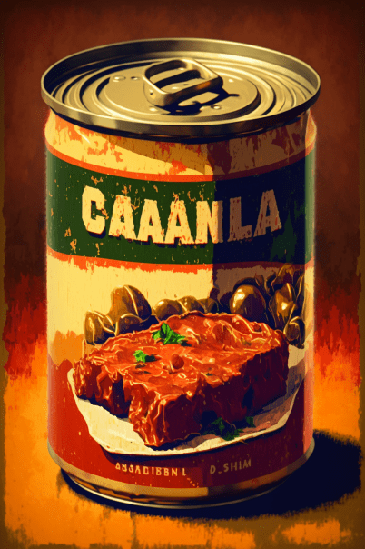梅林牛肉</a>

<a href="cod_Nc_ScavengingSupplies_Food_CannedGood_TypeSeventeen.md" style="color:black">豆子罐头</a>

<a href="cod_Nc_ScavengingSupplies_Food_CannedGood_TypeSix.md" style="color:black">莱斯蘑菇</a>

<a href="cod_Nc_ScavengingSupplies_Food_CannedGood_TypeSixteen.md" style="color:black">猪肉罐头</a>

<a href="cod_Nc_ScavengingSupplies_Food_CannedGood_TypeThirteen.md" style="color:black">大马哈鱼罐头</a>

<a href="cod_Nc_ScavengingSupplies_Food_CannedGood_TypeTwelve.md" style="color:black">咖喱罐头</a>

<a href="cod_Nc_ScavengingSupplies_Food_CannedGood_TypeTwenty.md" style="color:black">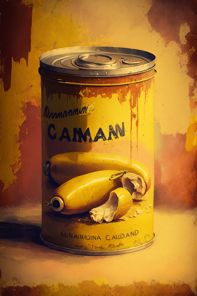香蕉罐头</a>

<a href="cod_Nc_ScavengingSupplies_Food_CannedGood_TypeTwo.md" style="color:black">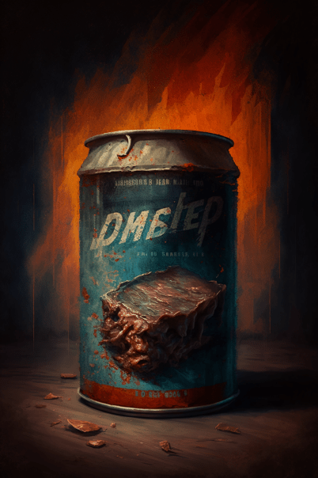梅林牛肉</a>

<a href="cod_Nc_ScavengingSupplies_Food_Suger_TypeEight.md" style="color:black">糖果</a>

<a href="cod_Nc_ScavengingSupplies_Food_Suger_TypeFive.md" style="color:black">糖果</a>

<a href="cod_Nc_ScavengingSupplies_Food_Suger_TypeFour.md" style="color:black">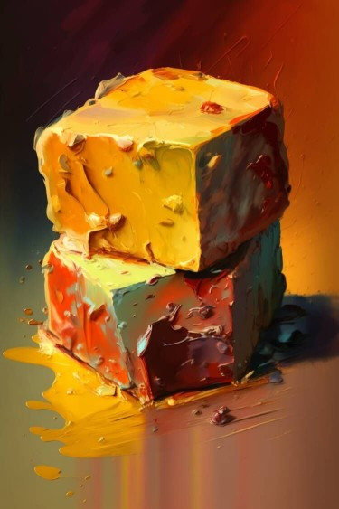糖果</a>

<a href="cod_Nc_ScavengingSupplies_Food_Suger_TypeNine.md" style="color:black">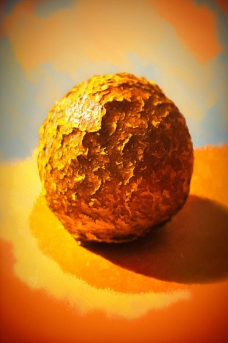金蒂</a>

<a href="cod_Nc_ScavengingSupplies_Food_Suger_TypeOne.md" style="color:black">糖果</a>

<a href="cod_Nc_ScavengingSupplies_Food_Suger_TypeSeven.md" style="color:black">童年</a>

<a href="cod_Nc_ScavengingSupplies_Food_Suger_TypeSix.md" style="color:black">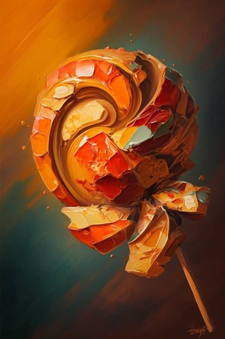童心</a>

<a href="cod_Nc_ScavengingSupplies_Food_Suger_TypeTen.md" style="color:black">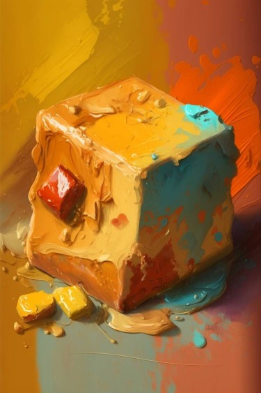糖果</a>

<a href="cod_Nc_ScavengingSupplies_Food_Suger_TypeThree.md" style="color:black">糖果</a>

<a href="cod_Nc_ScavengingSupplies_Food_Suger_TypeTwo.md" style="color:black">金蒂</a>

<a href="cod_一瓶红酒.md" style="color:black">破败轮船</a>

<a href="cod_午餐肉罐头.md" style="color:black">破败轮船</a>

<a href="cod_可口可乐.md" style="color:black">破败轮船</a>

<a href="cod_咖喱罐头.md" style="color:black">破败轮船</a>

<a href="cod_大马哈鱼罐头.md" style="color:black">破败轮船</a>

<a href="cod_椰子罐头.md" style="color:black">破败轮船</a>

<a href="cod_牛肉罐头.md" style="color:black">破败轮船</a>

<a href="cod_狗粮罐头.md" style="color:black">破败轮船</a>

<a href="cod_猪肉罐头.md" style="color:black">破败轮船</a>

<a href="cod_红牛.md" style="color:black">破败轮船</a>

<a href="cod_能量棒.md" style="color:black">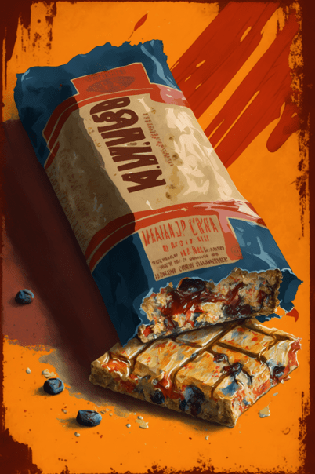破败轮船</a>

<a href="cod_苏打饮料.md" style="color:black">破败轮船</a>

<a href="cod_薯片.md" style="color:black">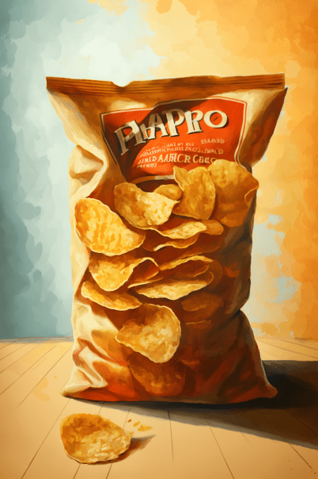破败轮船</a>

<a href="cod_蘑菇汤罐头.md" style="color:black">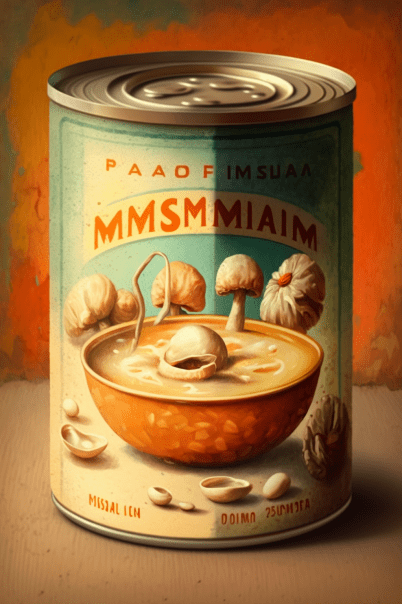破败轮船</a>

<a href="cod_豆子罐头.md" style="color:black">破败轮船</a>

<a href="cod_金枪鱼罐头.md" style="color:black">破败轮船</a>

<a href="cod_陈旧的牛肉罐头.md" style="color:black">破败轮船</a>

<a href="cod_香蕉罐头.md" style="color:black">破败轮船</a>

<a href="cod_鱼罐头制作机罐头.md" style="color:black">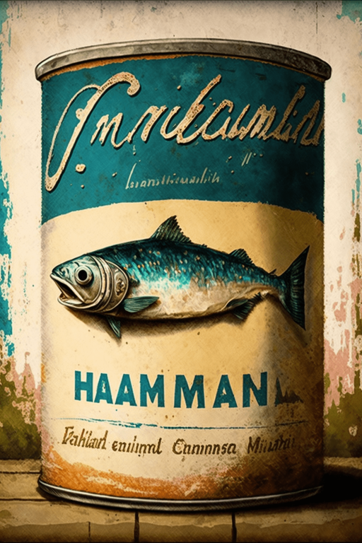破败轮船</a>

<a href="cod_工作餐1.md" style="color:black">破败轮船</a>

<a href="cod_工作餐2.md" style="color:black">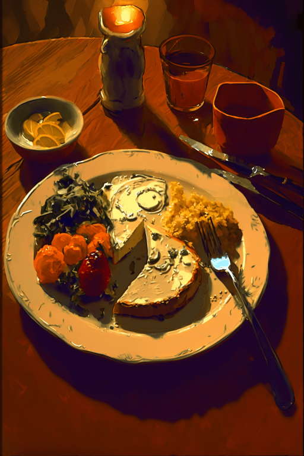破败轮船</a>

<a href="cod_普通工作餐.md" style="color:black">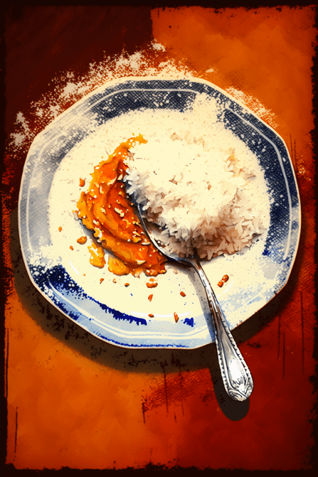破败轮船</a>

<a href="cod_普通工作餐面包.md" style="color:black">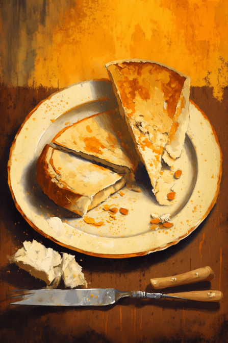破败轮船</a>

<a href="cod_工作餐鱼肉1.md" style="color:black">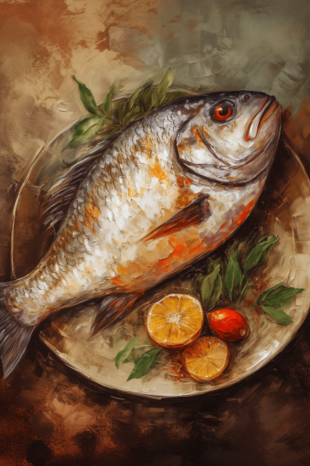破败轮船</a>

<a href="cod_一杯红酒.md" style="color:black">破败轮船</a>

<a href="cod_奶油夹心面包.md" style="color:black">破败轮船</a>

<a href="cod_奶酪面包.md" style="color:black">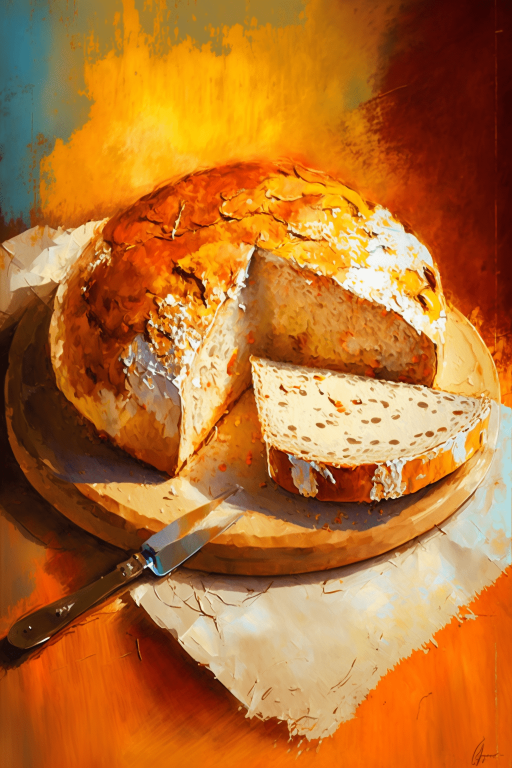破败轮船</a>

<a href="cod_巨无霸汉堡.md" style="color:black">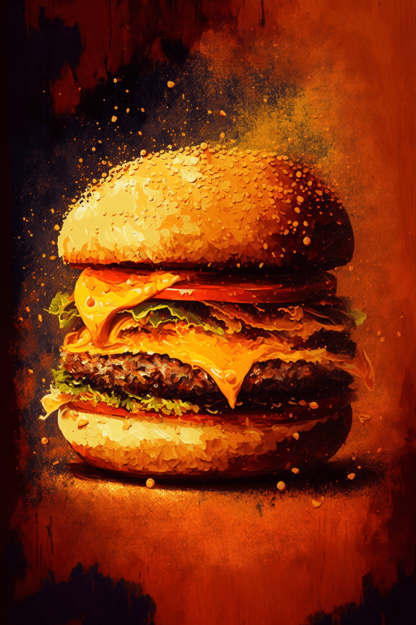破败轮船</a>

<a href="cod_水果沙拉.md" style="color:black">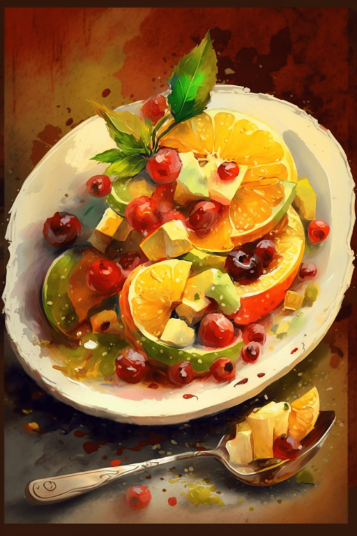破败轮船</a>

<a href="cod_火鸡.md" style="color:black">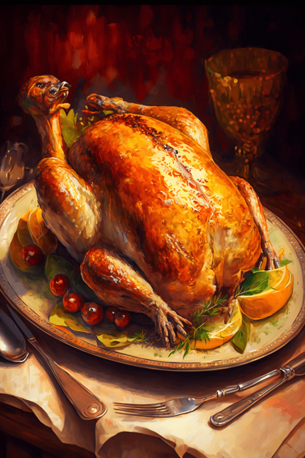破败轮船</a>

<a href="cod_炸鸡薯条.md" style="color:black">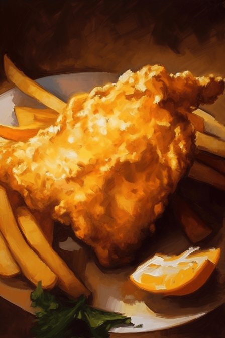破败轮船</a>

<a href="cod_牛排.md" style="color:black">破败轮船</a>

<a href="cod_猪排豆子.md" style="color:black">破败轮船</a>

<a href="cod_红烧鱼.md" style="color:black">破败轮船</a>

<a href="cod_蔬菜沙拉.md" style="color:black">破败轮船</a>

  
  

  
## 蓝图  

<a href="cod_高级盐田蓝图.md" style="color:black">高级盐田</a>

<a href="cod_一捆原木蓝图.md" style="color:black">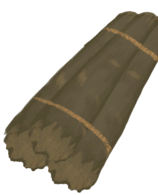捆一捆原木</a>

<a href="cod_一捆小树枝蓝图.md" style="color:black">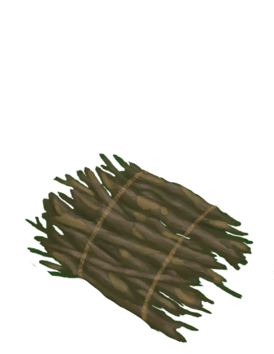捆一捆树枝</a>

<a href="cod_一捆长木棍蓝图.md" style="color:black">捆一捆长木棍</a>

<a href="cod_一篓小石头蓝图.md" style="color:black">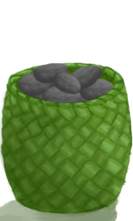装一篓小石子</a>

<a href="cod_一篓山羊蓝图.md" style="color:black">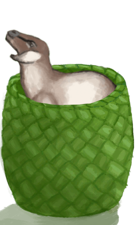装入山羊尸体</a>

<a href="cod_一篓巨蜥蓝图.md" style="color:black">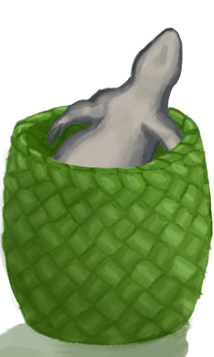装入巨蜥尸体</a>

<a href="cod_一篓沙子蓝图.md" style="color:black">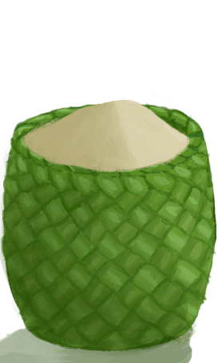装一篓沙子</a>

<a href="cod_一篓泥土蓝图.md" style="color:black">装一篓泥土</a>

<a href="cod_一篓海怪蓝图.md" style="color:black">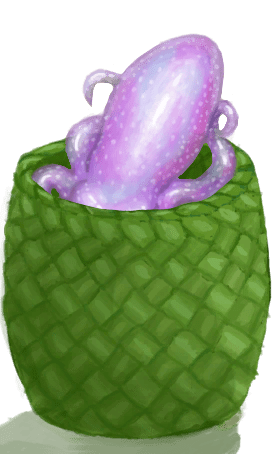装入海怪尸体</a>

<a href="cod_一篓蛇草蓝图.md" style="color:black">装一篓蛇草</a>

<a href="cod_一篓野猪蓝图.md" style="color:black">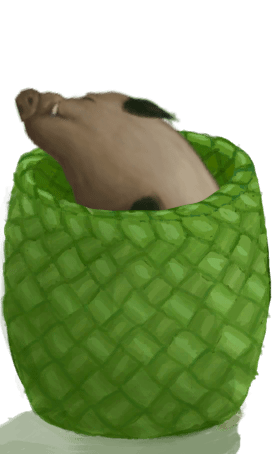装入野猪尸体</a>

<a href="cod_一篓青椰子蓝图.md" style="color:black">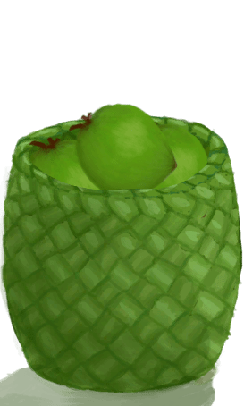装一篓青椰子</a>

<a href="cod_制作两根绳子蓝图.md" style="color:black">制作两根绳子</a>

<a href="cod_制作五根长木棍蓝图.md" style="color:black">制作五根长木棍</a>

<a href="cod_制作大油桶.md" style="color:black">购买10个蛇草</a>

<a href="cod_制作弹涂鱼罐头.md" style="color:black">购买10个蛇草</a>

<a href="cod_制作鱼罐头蓝图.md" style="color:black">购买10个蛇草</a>

<a href="cod_十个纤维蓝图.md" style="color:black">制作十个纤维</a>

<a href="cod_十二砂浆蓝图.md" style="color:black">十二砂浆</a>

<a href="cod_四份椰奶蓝图.md" style="color:black">四份椰奶</a>

<a href="cod_大石头砸小石头蓝图.md" style="color:black">制作小石头</a>

<a href="cod_灰烬蓝图.md" style="color:black">制作外星鸟食</a>

<a href="cod_碾碎六个干土蓝图.md" style="color:black">制作细土</a>

<a href="cod_锯木机锯木板.md" style="color:black">购买10个蛇草</a>

<a href="cod_外星猪饲料蓝图.md" style="color:black">制作外星猪饲料</a>

<a href="cod_外星羊饲料蓝图.md" style="color:black">制作外星鸟食</a>

<a href="cod_外星鸟食蓝图.md" style="color:black">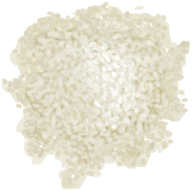制作外星鸟食</a>

<a href="cod_砖炉蓝图.md" style="color:black">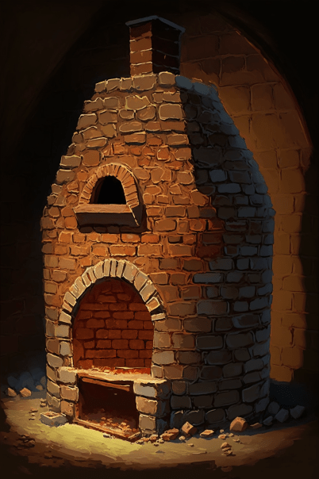砖炉</a>

<a href="cod_50铸币蓝图.md" style="color:black">购买10个蛇草</a>

<a href="cod_代金券5.md" style="color:black">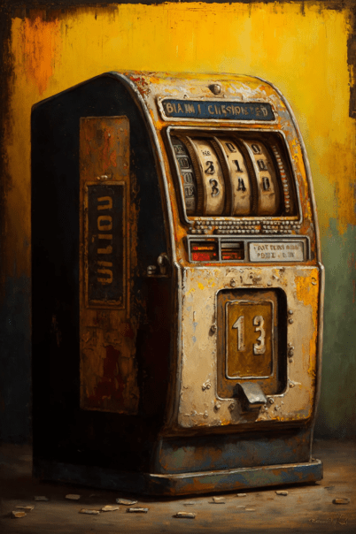购买10个蛇草</a>

<a href="cod_购买水包.md" style="color:black">购买10个蛇草</a>

<a href="cod_购买狗粮.md" style="color:black">购买10个蛇草</a>

<a href="cod_购买盐.md" style="color:black">购买10个蛇草</a>

<a href="cod_购买零食.md" style="color:black">购买10个蛇草</a>

<a href="cod_购买零食2.md" style="color:black">购买10个蛇草</a>

<a href="cod_购买零食3.md" style="color:black">购买10个蛇草</a>

<a href="cod_购买零食4.md" style="color:black">购买10个蛇草</a>

<a href="cod_购买零食5.md" style="color:black">购买10个蛇草</a>

<a href="cod_购买零食6.md" style="color:black">购买10个蛇草</a>

<a href="cod_购买零食7.md" style="color:black">购买10个蛇草</a>

<a href="cod_购买零食8.md" style="color:black">购买10个蛇草</a>

<a href="cod_赌博蓝图.md" style="color:black">购买10个蛇草</a>

<a href="cod_赌博蓝图2.md" style="color:black">购买10个蛇草</a>

<a href="cod_出售煤块.md" style="color:black">购买10个蛇草</a>

<a href="cod_出售空罐.md" style="color:black">购买10个蛇草</a>

<a href="cod_出售红砖.md" style="color:black">购买10个蛇草</a>

<a href="cod_出售编制物.md" style="color:black">购买10个蛇草</a>

<a href="cod_出售贝壳.md" style="color:black">购买10个蛇草</a>

<a href="cod_购买代金券.md" style="color:black">购买10个蛇草</a>

<a href="cod_购买外星种子.md" style="color:black">购买10个蛇草</a>

<a href="cod_购买大腰包.md" style="color:black">购买10个蛇草</a>

<a href="cod_购买子弹.md" style="color:black">购买10个蛇草</a>

<a href="cod_购买小型熔炉.md" style="color:black">购买10个蛇草</a>

<a href="cod_购买工作证.md" style="color:black">购买10个蛇草</a>

<a href="cod_购买工具箱.md" style="color:black">购买10个蛇草</a>

<a href="cod_购买左轮.md" style="color:black">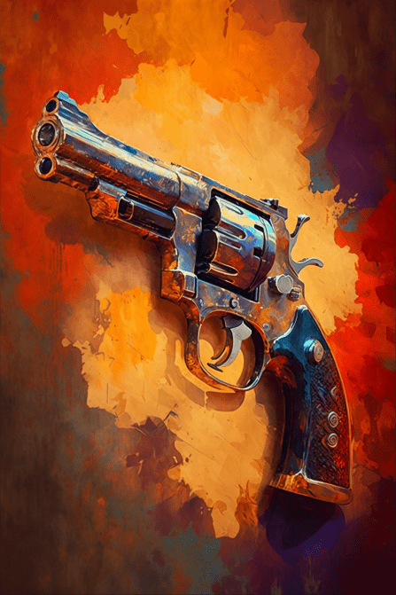购买10个蛇草</a>

<a href="cod_购买手电.md" style="color:black">购买10个蛇草</a>

<a href="cod_购买抗生素.md" style="color:black">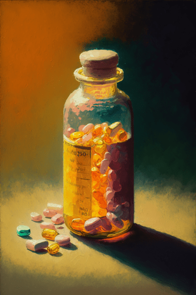购买10个蛇草</a>

<a href="cod_购买无人机.md" style="color:black">购买10个蛇草</a>

<a href="cod_购买末日背包.md" style="color:black">购买10个蛇草</a>

<a href="cod_购买玻璃罐.md" style="color:black">购买10个蛇草</a>

<a href="cod_购买罐装食物秘籍.md" style="color:black">购买10个蛇草</a>

<a href="cod_购买罐装食物秘籍2.md" style="color:black">购买10个蛇草</a>

<a href="cod_购买解毒剂.md" style="color:black">购买解毒剂</a>

<a href="cod_购买锯木工具.md" style="color:black">购买10个蛇草</a>

<a href="cod_出售公山羊.md" style="color:black">购买10个蛇草</a>

<a href="cod_出售公野猪.md" style="color:black">购买10个蛇草</a>

<a href="cod_出售山羊.md" style="color:black">购买10个蛇草</a>

<a href="cod_出售巨蜥.md" style="color:black">购买10个蛇草</a>

<a href="cod_制作左轮子弹蓝图.md" style="color:black">购买10个蛇草</a>

<a href="cod_购买泥堆.md" style="color:black">购买10个蛇草</a>

<a href="cod_购买泥锅.md" style="color:black">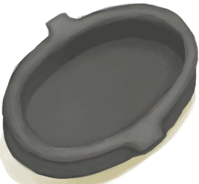购买10个蛇草</a>

<a href="cod_购买火药罐.md" style="color:black">购买10个蛇草</a>

<a href="cod_购买蛇草.md" style="color:black">购买10个蛇草</a>

<a href="cod_购买鱼罐头配方.md" style="color:black">购买10个蛇草</a>

<a href="cod_自制柠檬草罐头蓝图.md" style="color:black">购买10个蛇草</a>

<a href="cod_自制肉罐头蓝图.md" style="color:black">购买10个蛇草</a>

<a href="cod_自制芒果罐头蓝图.md" style="color:black">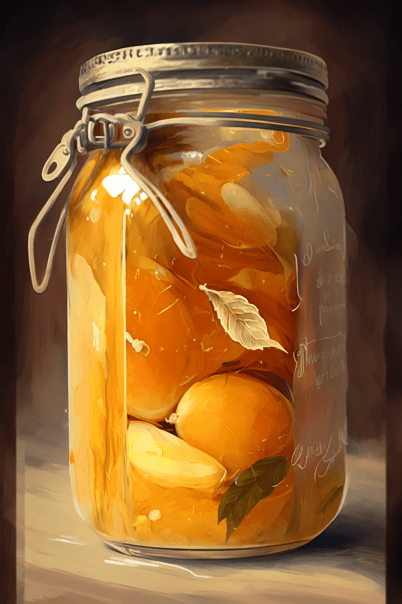购买10个蛇草</a>

<a href="cod_自制蘑菇罐头蓝图.md" style="color:black">购买10个蛇草</a>

<a href="cod_自制虾罐头蓝图.md" style="color:black">购买10个蛇草</a>

<a href="cod_自制辣椒罐头蓝图.md" style="color:black">购买10个蛇草</a>

<a href="cod_自制香蕉罐头蓝图.md" style="color:black">购买10个蛇草</a>

<a href="cod_蛋罐头蓝图.md" style="color:black">购买10个蛇草</a>

<a href="cod_Bp_Bandage.md" style="color:black">绷带</a>

<a href="cod_击鼓工作.md" style="color:black">购买10个蛇草</a>

<a href="cod_务农工作.md" style="color:black">购买10个蛇草</a>

<a href="cod_厨师工作.md" style="color:black">购买10个蛇草</a>

<a href="cod_射箭教学工作.md" style="color:black">购买10个蛇草</a>

<a href="cod_投石索教练.md" style="color:black">购买10个蛇草</a>

<a href="cod_捕兽工作.md" style="color:black">购买10个蛇草</a>

<a href="cod_木工工作.md" style="color:black">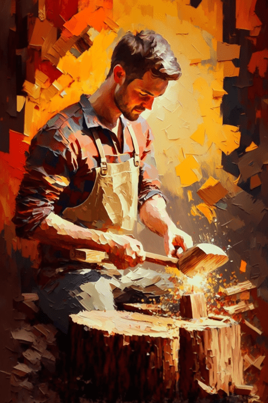购买10个蛇草</a>

<a href="cod_杂工工作蓝图.md" style="color:black">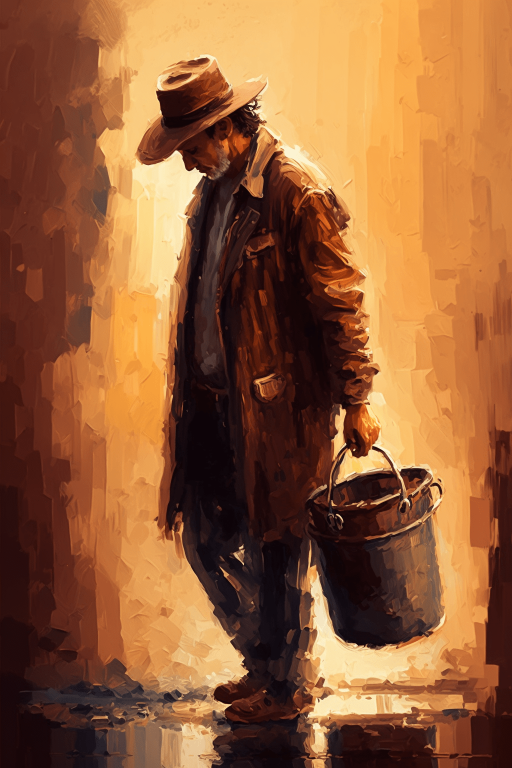购买10个蛇草</a>

<a href="cod_监工工作.md" style="color:black">购买10个蛇草</a>

<a href="cod_石匠工作.md" style="color:black">购买10个蛇草</a>

<a href="cod_纺织工作.md" style="color:black">购买10个蛇草</a>

<a href="cod_钓鱼工作.md" style="color:black">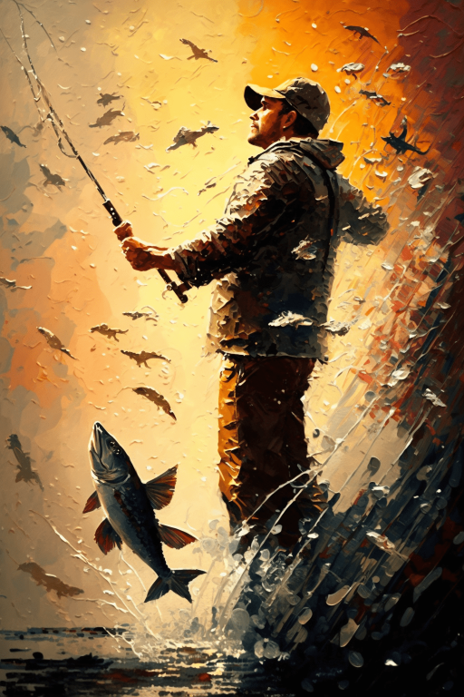购买10个蛇草</a>

<a href="cod_铁匠工作.md" style="color:black">购买10个蛇草</a>

<a href="cod_长矛教学工作.md" style="color:black">购买10个蛇草</a>

<a href="cod_尼根任务蓝图1.md" style="color:black">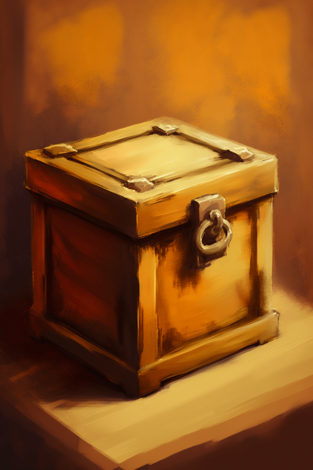购买10个蛇草</a>

<a href="cod_V我50套餐.md" style="color:black">购买10个蛇草</a>

<a href="cod_沙拉套餐.md" style="color:black">购买10个蛇草</a>

<a href="cod_火鸡菜谱.md" style="color:black">购买10个蛇草</a>

<a href="cod_牛排套餐.md" style="color:black">购买10个蛇草</a>

<a href="cod_猪排豆子套餐.md" style="color:black">购买10个蛇草</a>

<a href="cod_红烧鱼菜谱.md" style="color:black">购买10个蛇草</a>

<a href="cod_面包套餐.md" style="color:black">购买10个蛇草</a>

<a href="cod_Bp_IncendiaryBottle.md" style="color:black">燃烧瓶</a>

<a href="cod_Bp_IncendiaryBottle_TypeTwo.md" style="color:black">燃烧瓶组</a>

  
  

  
## 卡牌  

<a href="cod_钓鱼洞.md" style="color:black">钓鱼洞</a>

<a href="cod_高级盐田.md" style="color:black">高级盐田</a>

<a href="cod_一捆原木.md" style="color:black">破箱子</a>

<a href="cod_一捆小树枝.md" style="color:black">一捆小树枝</a>

<a href="cod_一捆长木棍.md" style="color:black">一捆长木棍</a>

<a href="cod_一篓小石头.md" style="color:black">一篓沙子</a>

<a href="cod_一篓山羊.md" style="color:black">山羊尸体</a>

<a href="cod_一篓巨蜥.md" style="color:black">巨蜥尸体</a>

<a href="cod_一篓沙子.md" style="color:black">一篓沙子</a>

<a href="cod_一篓泥土.md" style="color:black">一篓泥土</a>

<a href="cod_一篓海怪.md" style="color:black">海怪尸体</a>

<a href="cod_一篓蛇草.md" style="color:black">一篓蛇草</a>

<a href="cod_一篓野猪.md" style="color:black">野猪尸体</a>

<a href="cod_一篓青椰子.md" style="color:black">一篓青椰子</a>

<a href="cod_大建筑废墟.md" style="color:black">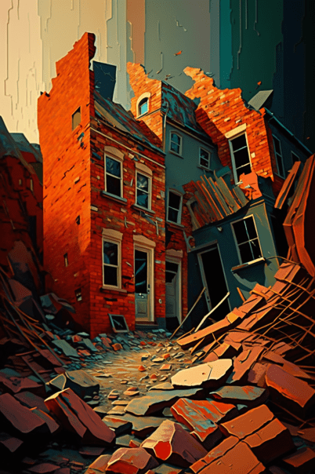破败轮船</a>

<a href="cod_小镇垃圾箱1.md" style="color:black">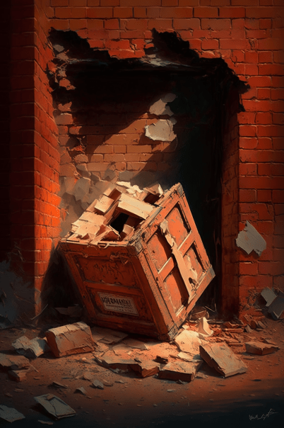破败轮船</a>

<a href="cod_小镇垃圾箱2.md" style="color:black">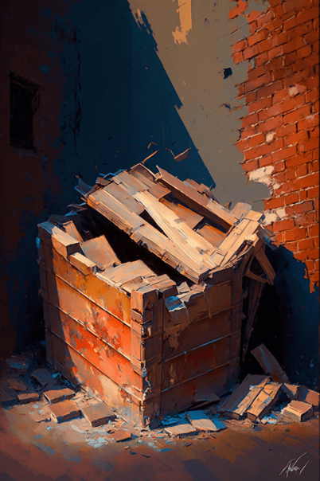破败轮船</a>

<a href="cod_废墟1.md" style="color:black">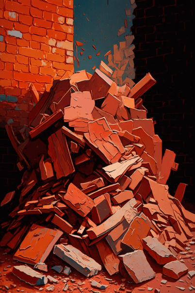破败轮船</a>

<a href="cod_废墟1箱子.md" style="color:black">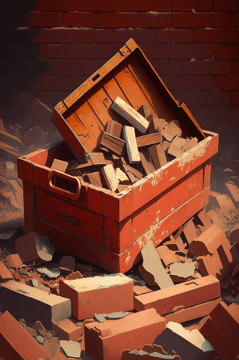破箱子</a>

<a href="cod_废墟2.md" style="color:black">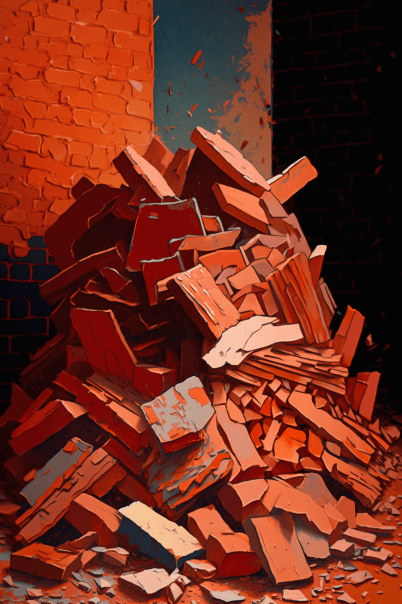破败轮船</a>

<a href="cod_废墟2箱子.md" style="color:black">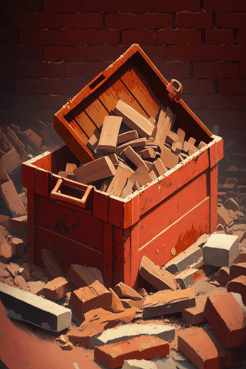破箱子</a>

<a href="cod_废墟3.md" style="color:black">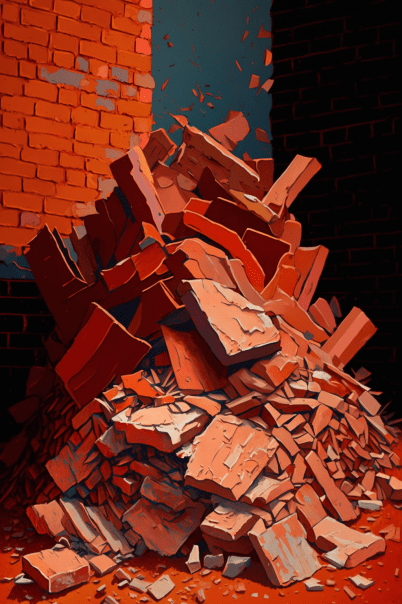破败轮船</a>

<a href="cod_废墟3箱子.md" style="color:black">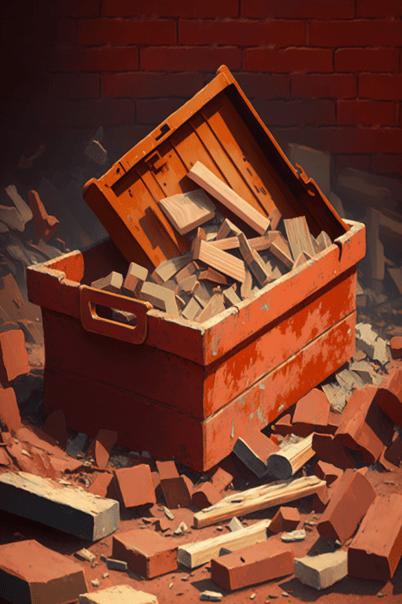破箱子</a>

<a href="cod_废墟4.md" style="color:black">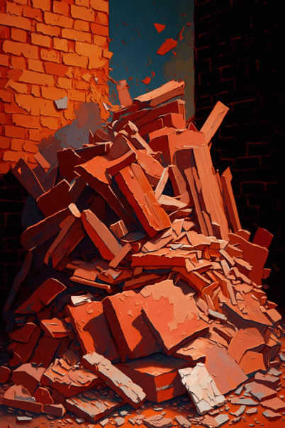破败轮船</a>

<a href="cod_废墟4箱子.md" style="color:black">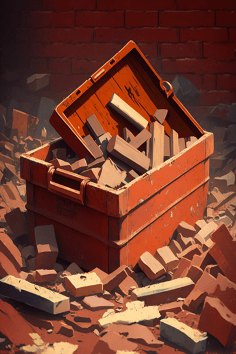破箱子</a>

<a href="cod_建筑废墟.md" style="color:black">破败轮船</a>

<a href="cod_未点燃的砖炉.md" style="color:black">砖炉</a>

<a href="cod_点燃的砖炉.md" style="color:black">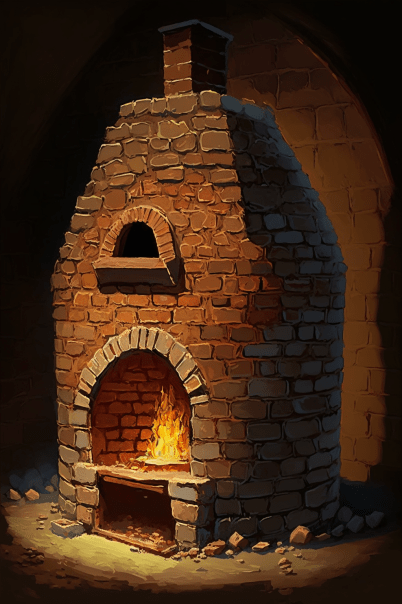破败轮船</a>

<a href="cod_石块堆.md" style="color:black">破败轮船</a>

<a href="cod_神秘小镇钟楼.md" style="color:black">破败轮船</a>

<a href="cod_神秘边境瞭望塔.md" style="color:black">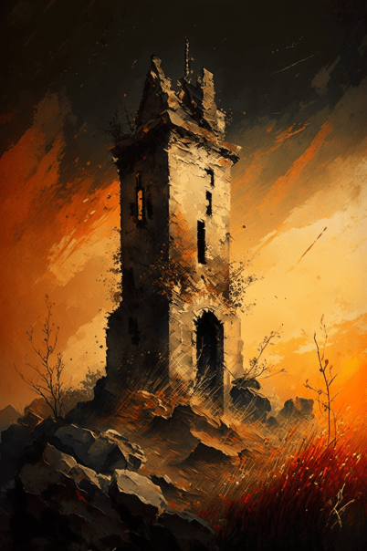破败轮船</a>

<a href="cod_红砖房柜子.md" style="color:black">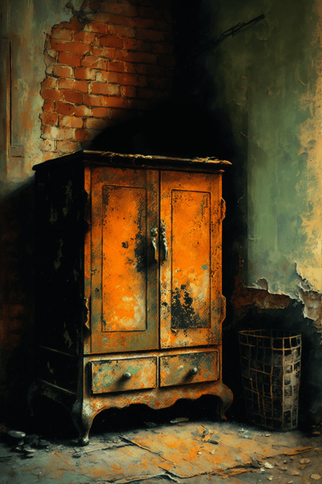破败轮船</a>

<a href="cod_老虎机.md" style="color:black">破败轮船</a>

<a href="cod_自动贩卖机.md" style="color:black">破败轮船</a>

<a href="cod_锯木机.md" style="color:black">破败轮船</a>

<a href="cod_Nc_IndustrialMaterials.md" style="color:black">铁制材料</a>

<a href="cod_Path_城市到锯木厂.md" style="color:black">腐败城市</a>

<a href="cod_Path_锯木厂到城市.md" style="color:black">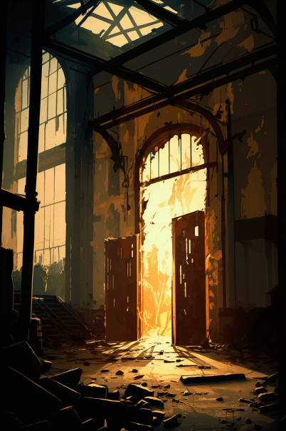腐败城市</a>

<a href="cod_伐木厂木材堆.md" style="color:black">破箱子</a>

<a href="cod_废弃的机械.md" style="color:black">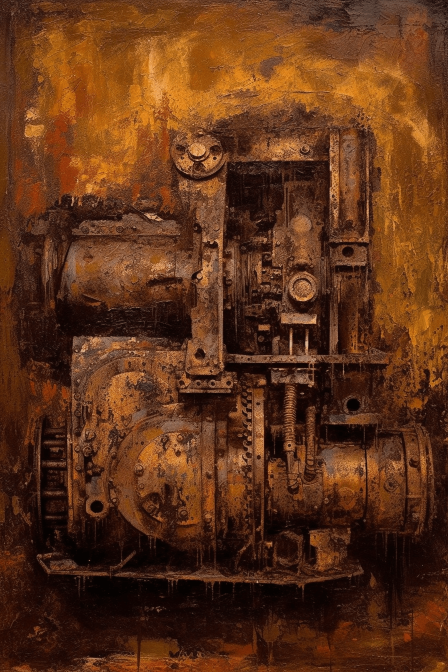破箱子</a>

<a href="cod_老式唱机.md" style="color:black">破败轮船</a>

<a href="cod_弹药学技能书.md" style="color:black">破箱子</a>

<a href="cod_Nc_ZombieDeathDrop_Accessories_TypeFive.md" style="color:black">饰品</a>

<a href="cod_Nc_ZombieDeathDrop_Accessories_TypeFour.md" style="color:black">饰品</a>

<a href="cod_Nc_ZombieDeathDrop_Accessories_TypeOne.md" style="color:black">饰品</a>

<a href="cod_Nc_ZombieDeathDrop_Accessories_TypeSix.md" style="color:black">饰品</a>

<a href="cod_Nc_ZombieDeathDrop_Accessories_TypeThree.md" style="color:black">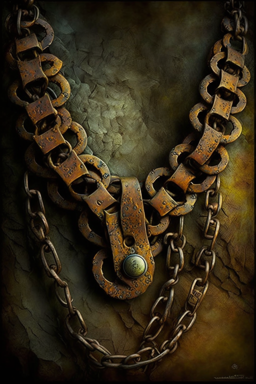饰品</a>

<a href="cod_Nc_ZombieDeathDrop_Accessories_TypeTwo.md" style="color:black">饰品</a>

<a href="cod_Nc_ZombieDeathDrop_Cigarettes_TypeOne.md" style="color:black">香烟</a>

<a href="cod_Nc_ZombieDeathDrop_Cigarettes_TypeThree.md" style="color:black">香烟</a>

<a href="cod_Nc_ZombieDeathDrop_Cigarettes_TypeTwo.md" style="color:black">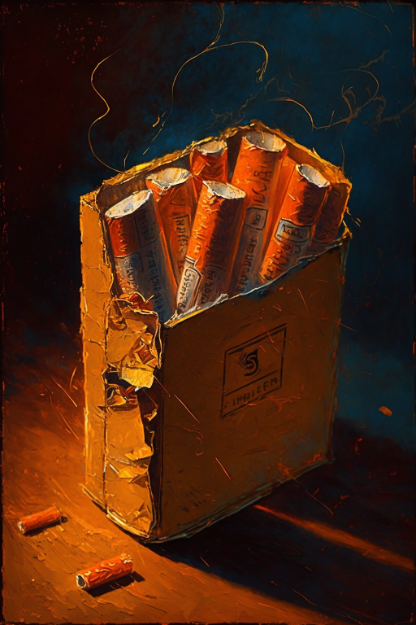香烟</a>

<a href="cod_代金券5元.md" style="color:black">破败轮船</a>

<a href="cod_弹药制作台.md" style="color:black">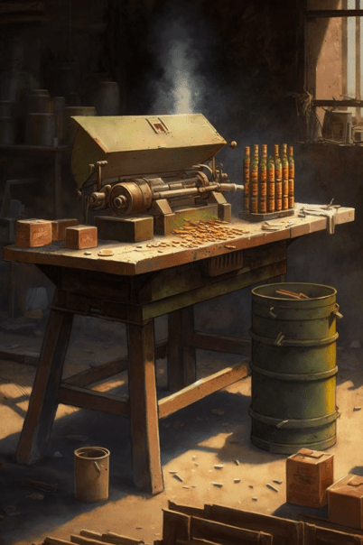破败轮船</a>

<a href="cod_火药罐.md" style="color:black">破败轮船</a>

<a href="cod_Garvin.md" style="color:black">破败轮船</a>

<a href="cod_Negan.md" style="color:black">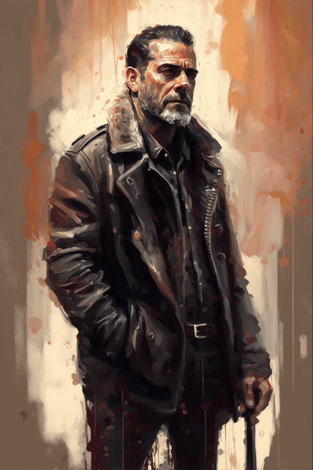破败轮船</a>

<a href="cod_Path_农场到腐败之城.md" style="color:black">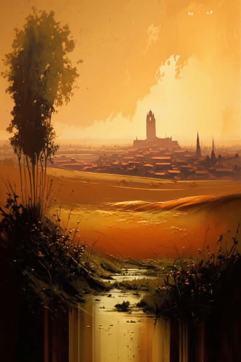腐败城市</a>

<a href="cod_Path_基地到腐败之城.md" style="color:black">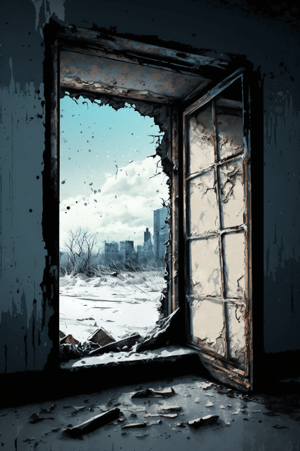腐败城市</a>

<a href="cod_Path_腐败之城到农场.md" style="color:black">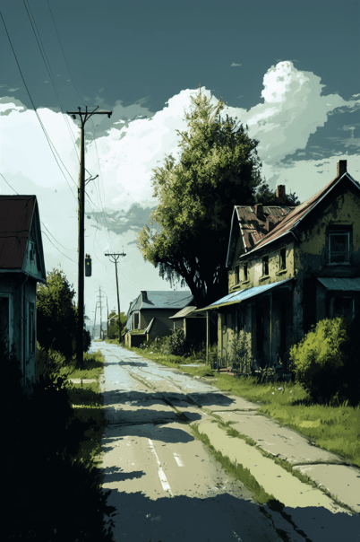腐败城市</a>

<a href="cod_Path_腐败之城到基地.md" style="color:black">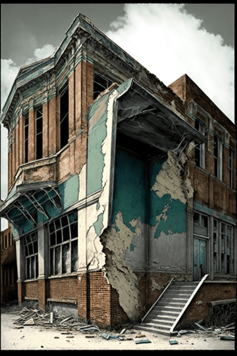腐败城市</a>

<a href="cod_城市垃圾桶.md" style="color:black">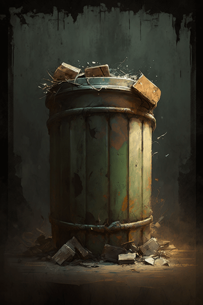破败轮船</a>

<a href="cod_城市长椅.md" style="color:black">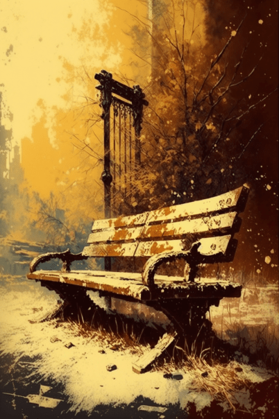破败轮船</a>

<a href="cod_城市雕像.md" style="color:black">破败轮船</a>

<a href="cod_Path_城市到破车1.md" style="color:black">腐败城市</a>

<a href="cod_Path_破车1到城市.md" style="color:black">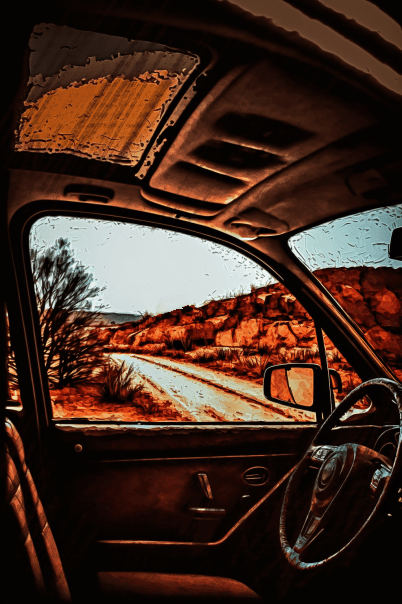腐败城市</a>

<a href="cod_汽车抽屉.md" style="color:black">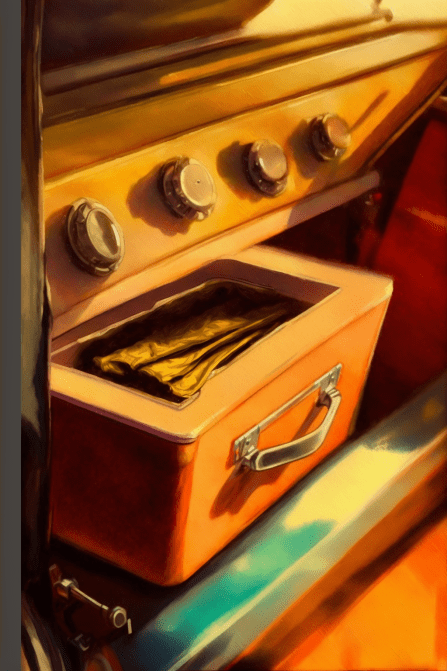破败轮船</a>

<a href="cod_Nc_Gun.md" style="color:black">枪</a>

<a href="cod_Nc_Gun_Empty.md" style="color:black">空的手枪</a>

<a href="cod_左轮子弹.md" style="color:black">破败轮船</a>

<a href="cod_al_flashlight_off.md" style="color:black">关闭的手电</a>

<a href="cod_al_flashlight_on.md" style="color:black">开启的手电</a>

<a href="cod_Nc_Antidote.md" style="color:black">解毒剂</a>

<a href="cod_Nc_BasicMaterials_Electrical_Wires.md" style="color:black">电线</a>

<a href="cod_Nc_BasicMaterials_Iron_MetalParts.md" style="color:black">铁钉</a>

<a href="cod_Nc_BasicMaterials_Iron_Nails.md" style="color:black">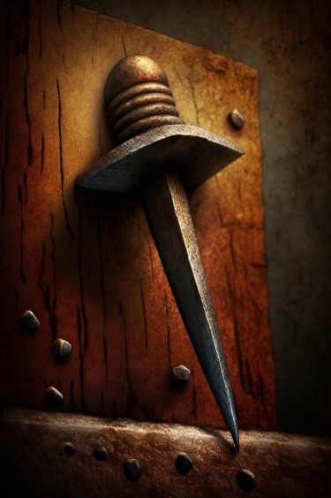铁钉</a>

<a href="cod_Nc_BasicMaterials_Wood_Plank.md" style="color:black">木板</a>

<a href="cod_Nc_BloodHeart_BloodPlagueSamples.md" style="color:black">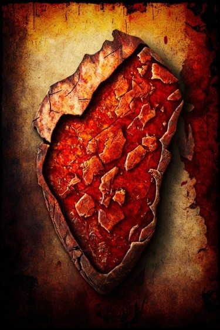血疫样本</a>

<a href="cod_Nc_RusticSpear_Destory.md" style="color:black">破损长矛</a>

<a href="cod_Nc_ScavengingSuppiles_Chemicals_ChemicalProducts_TypeEight.md" style="color:black">化学制品</a>

<a href="cod_Nc_ScavengingSuppiles_Chemicals_ChemicalProducts_TypeFive.md" style="color:black">化学制品</a>

<a href="cod_Nc_ScavengingSuppiles_Chemicals_ChemicalProducts_TypeFour.md" style="color:black">化学制品</a>

<a href="cod_Nc_ScavengingSuppiles_Chemicals_ChemicalProducts_TypeNine.md" style="color:black">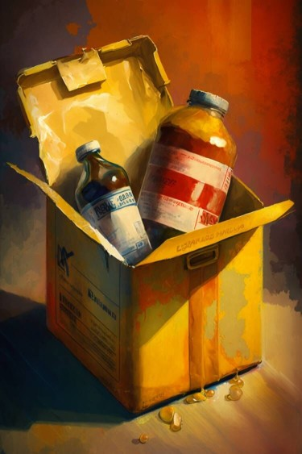化学制品</a>

<a href="cod_Nc_ScavengingSuppiles_Chemicals_ChemicalProducts_TypeOne.md" style="color:black">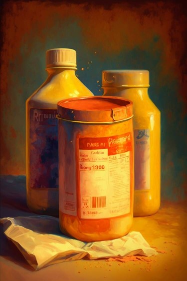化学制品</a>

<a href="cod_Nc_ScavengingSuppiles_Chemicals_ChemicalProducts_TypeSeven.md" style="color:black">化学制品</a>

<a href="cod_Nc_ScavengingSuppiles_Chemicals_ChemicalProducts_TypeSix.md" style="color:black">化学制品</a>

<a href="cod_Nc_ScavengingSuppiles_Chemicals_ChemicalProducts_TypeTen.md" style="color:black">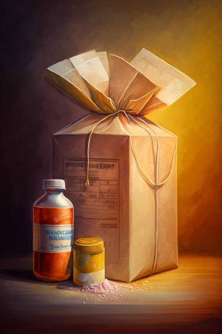化学制品</a>

<a href="cod_Nc_ScavengingSuppiles_Chemicals_ChemicalProducts_TypeThree.md" style="color:black">化学制品</a>

<a href="cod_Nc_ScavengingSuppiles_Chemicals_ChemicalProducts_TypeTwo.md" style="color:black">化学制品</a>

<a href="cod_Nc_ZombieDeathDrop_TatteredClothes_TypeOne.md" style="color:black">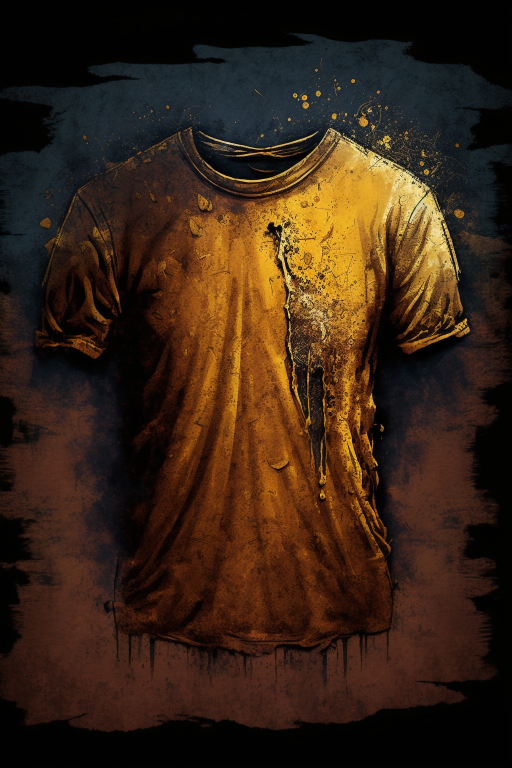破烂衣服</a>

<a href="cod_Nc_ZombieDeathDrop_TatteredClothes_TypeThree.md" style="color:black">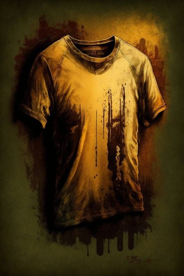破烂衣服</a>

<a href="cod_Nc_ZombieDeathDrop_TatteredClothes_TypeTwo.md" style="color:black">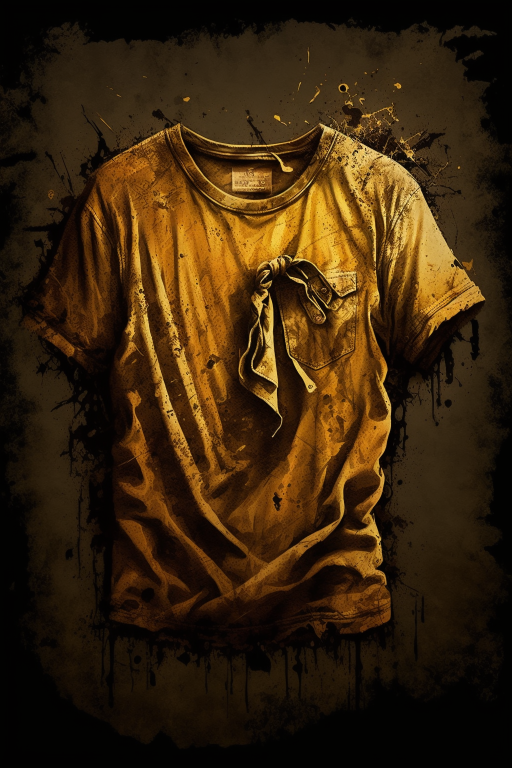破烂衣服</a>

<a href="cod_town一把钥匙.md" style="color:black">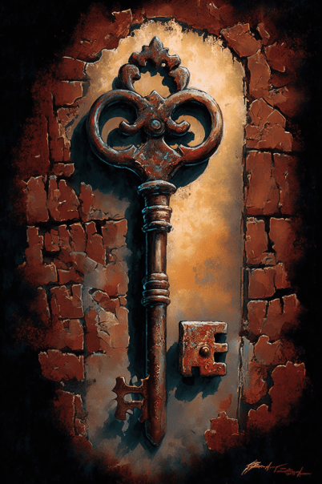破败轮船</a>

<a href="cod_一大袋食物.md" style="color:black">破箱子</a>

<a href="cod_一箱玻璃罐.md" style="color:black">破箱子</a>

<a href="cod_一罐脂肪块.md" style="color:black">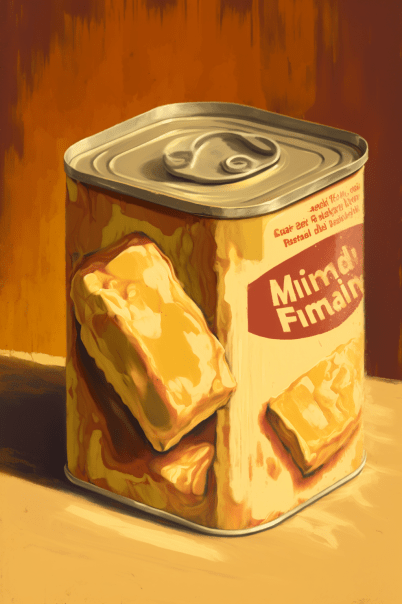破箱子</a>

<a href="cod_一袋大米.md" style="color:black">破箱子</a>

<a href="cod_免疫药品.md" style="color:black">抗生素</a>

<a href="cod_制作鱼罐头配方.md" style="color:black">破败轮船</a>

<a href="cod_勇气药品.md" style="color:black">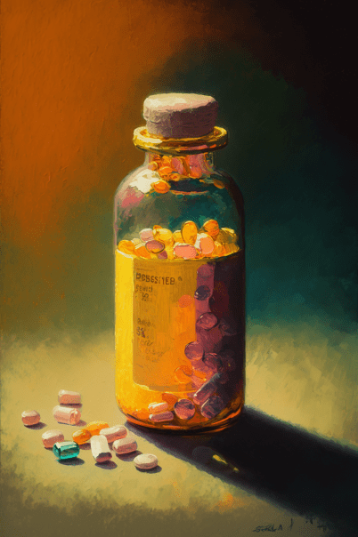破败轮船</a>

<a href="cod_升压药品.md" style="color:black">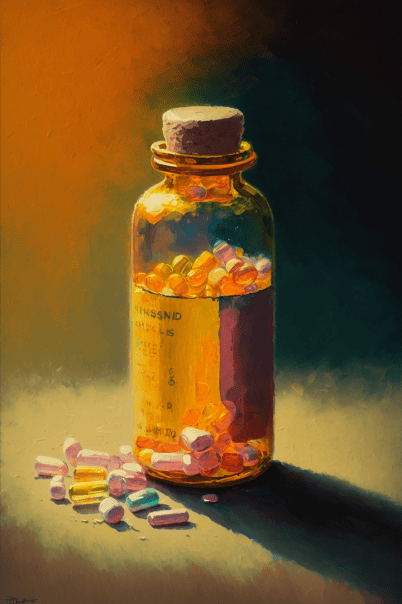破败轮船</a>

<a href="cod_多功能工具箱.md" style="color:black">破败轮船</a>

<a href="cod_大油桶.md" style="color:black">破败轮船</a>

<a href="cod_小形熔炉.md" style="color:black">破败轮船</a>

<a href="cod_小镇宝箱.md" style="color:black">破败轮船</a>

<a href="cod_工作证.md" style="color:black">破败轮船</a>

<a href="cod_干草堆.md" style="color:black">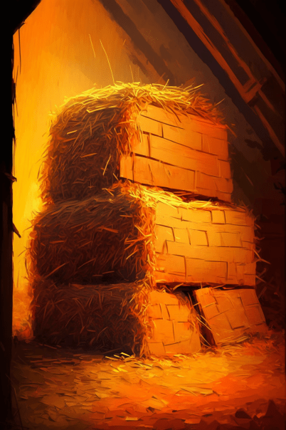破箱子</a>

<a href="cod_玻璃罐.md" style="color:black">破败轮船</a>

<a href="cod_空锡罐.md" style="color:black">破败轮船</a>

<a href="cod_红砖.md" style="color:black">破败轮船</a>

<a href="cod_罐装素食秘方.md" style="color:black">破败轮船</a>

<a href="cod_罐装肉食秘方.md" style="color:black">破败轮船</a>

<a href="cod_肥乔.md" style="color:black">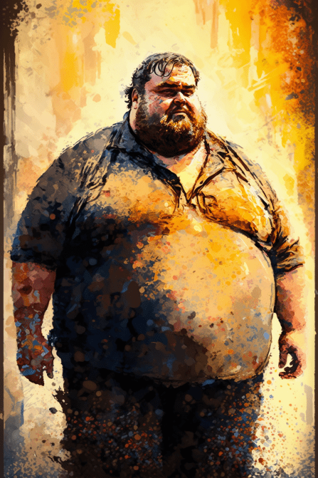破败轮船</a>

<a href="cod_铸币.md" style="color:black">铸币</a>

<a href="cod_鱼罐头制造机.md" style="color:black">破败轮船</a>

<a href="cod_Nc_ScavengingSupplies_AmmunitionWrapping.md" style="color:black">包囊</a>

<a href="cod_Nc_ScavengingSupplies_BuildingMaterialWrapping.md" style="color:black">包囊</a>

<a href="cod_Nc_ScavengingSupplies_FoodWrapping.md" style="color:black">包囊</a>

<a href="cod_Nc_ScavengingSupplies_Food_SugerBag_TypeFive.md" style="color:black">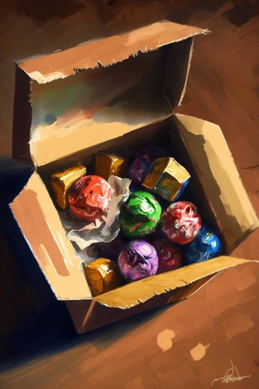糖果盒</a>

<a href="cod_Nc_ScavengingSupplies_Food_SugerBag_TypeFour.md" style="color:black">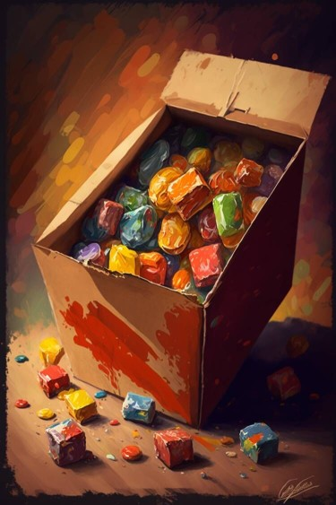糖果盒</a>

<a href="cod_Nc_ScavengingSupplies_Food_SugerBag_TypeOne.md" style="color:black">糖果盒</a>

<a href="cod_Nc_ScavengingSupplies_Food_SugerBag_TypeSix.md" style="color:black">糖果盒</a>

<a href="cod_Nc_ScavengingSupplies_Food_SugerBag_TypeThree.md" style="color:black">糖果盒</a>

<a href="cod_Nc_ScavengingSupplies_Food_SugerBag_TypeTwo.md" style="color:black">糖果盒</a>

<a href="cod_Nc_ScavengingSupplies_Location_Box_TypeOne.md" style="color:black">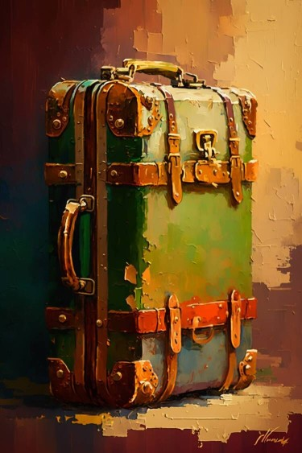铁箱</a>

<a href="cod_Nc_ScavengingSupplies_Location_Box_TypeThree.md" style="color:black">铁箱</a>

<a href="cod_Nc_ScavengingSupplies_Location_Box_TypeTwo.md" style="color:black">铁箱</a>

<a href="cod_Nc_ScavengingSupplies_Location_Brackets_TypeFive.md" style="color:black">支架</a>

<a href="cod_Nc_ScavengingSupplies_Location_Brackets_TypeFour.md" style="color:black">支架</a>

<a href="cod_Nc_ScavengingSupplies_Location_Brackets_TypeOne.md" style="color:black">支架</a>

<a href="cod_Nc_ScavengingSupplies_Location_Brackets_TypeThree.md" style="color:black">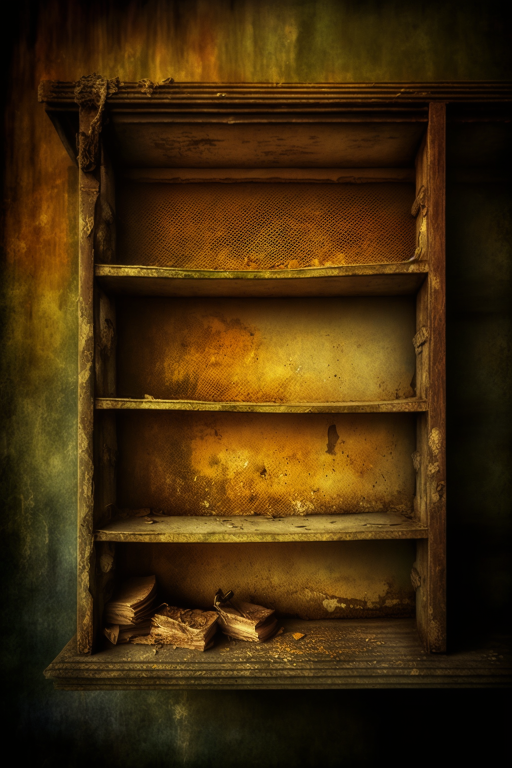支架</a>

<a href="cod_Nc_ScavengingSupplies_Location_Brackets_TypeTwo.md" style="color:black">支架</a>

<a href="cod_Nc_ScavengingSupplies_Location_Cabinet_TypeOne.md" style="color:black">铁柜</a>

<a href="cod_Nc_ScavengingSupplies_Location_Cabinet_TypeThree.md" style="color:black">铁柜</a>

<a href="cod_Nc_ScavengingSupplies_Location_Cabinet_TypeTwo.md" style="color:black">铁柜</a>

<a href="cod_Nc_ScavengingSupplies_Location_PileItems_Random.md" style="color:black">物品堆</a>

<a href="cod_Nc_ScavengingSupplies_Location_PileItems_TypeFive.md" style="color:black">物品堆</a>

<a href="cod_Nc_ScavengingSupplies_Location_PileItems_TypeFour.md" style="color:black">物品堆</a>

<a href="cod_Nc_ScavengingSupplies_Location_PileItems_TypeOne.md" style="color:black">物品堆</a>

<a href="cod_Nc_ScavengingSupplies_Location_PileItems_TypeThree.md" style="color:black">物品堆</a>

<a href="cod_Nc_ScavengingSupplies_Location_PileItems_TypeTwo.md" style="color:black">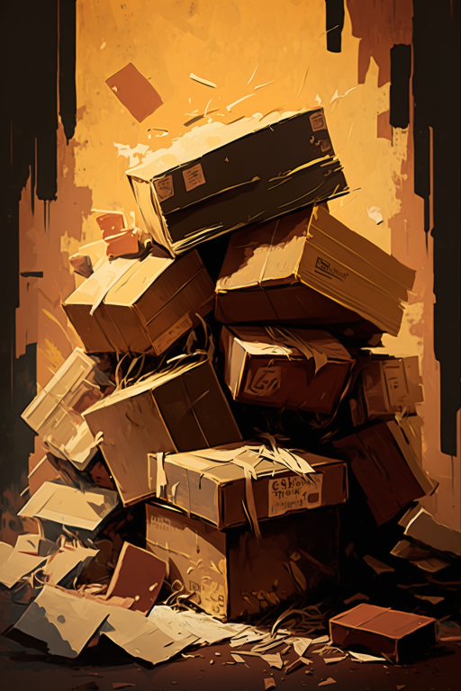物品堆</a>

<a href="cod_Nc_ScavengingSupplies_Location_RandomDrop.md" style="color:black">设施</a>

<a href="cod_Nc_ScavengingSupplies_MaterialWrapping.md" style="color:black">包囊</a>

<a href="cod_Nc_ScavengingSupplies_MedicineWrapping.md" style="color:black">包囊</a>

<a href="cod_Nc_ScavengingSupplies_WrappingBag.md" style="color:black">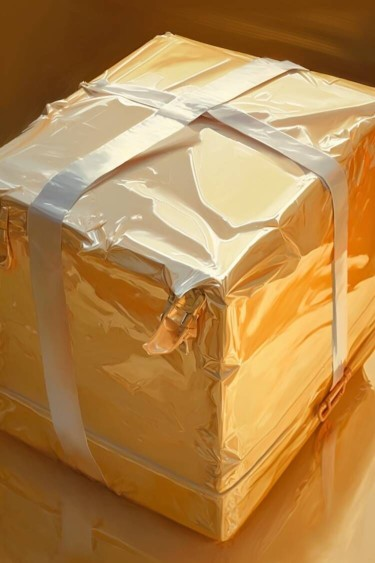巨大包囊</a>

<a href="cod_Nc_ScavengingSupplies_WrappingBag_Random.md" style="color:black">巨大包囊</a>

<a href="cod_一杯水.md" style="color:black">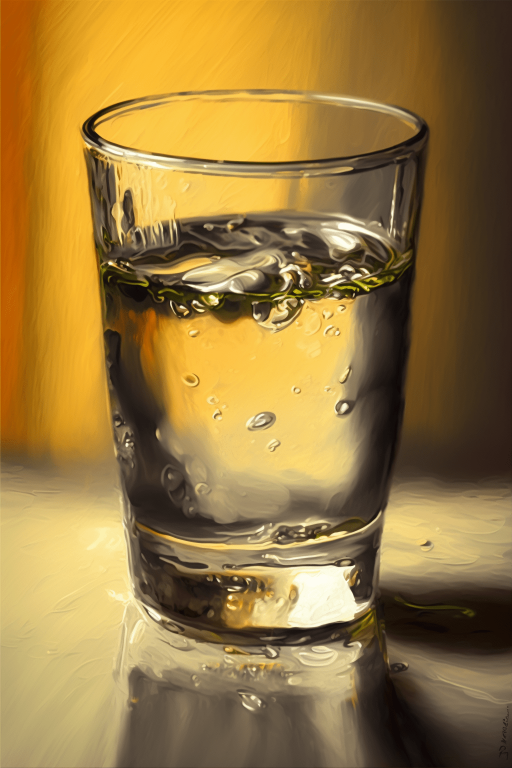破败轮船</a>

<a href="cod_Paht_农场到矿区.md" style="color:black">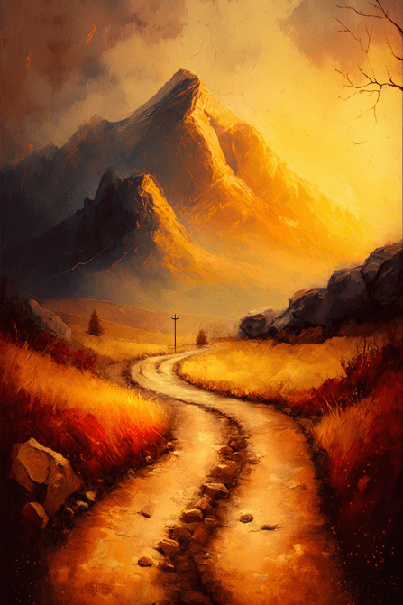腐败城市</a>

<a href="cod_Path_城市到矿区.md" style="color:black">腐败城市</a>

<a href="cod_Path_矿区到农场.md" style="color:black">腐败城市</a>

<a href="cod_Path_矿区到城市.md" style="color:black">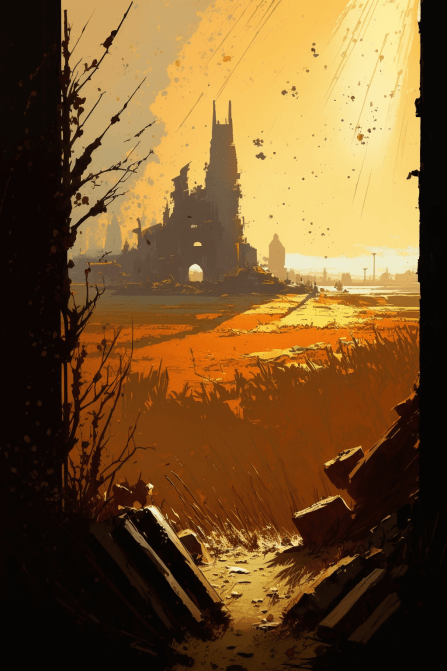腐败城市</a>

<a href="cod_煤块.md" style="color:black">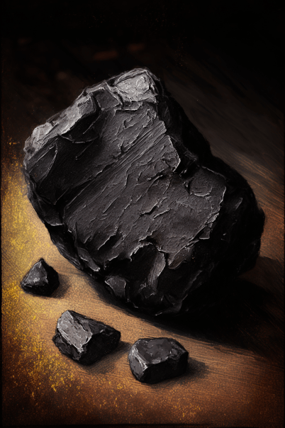破败轮船</a>

<a href="cod_煤矿脉.md" style="color:black">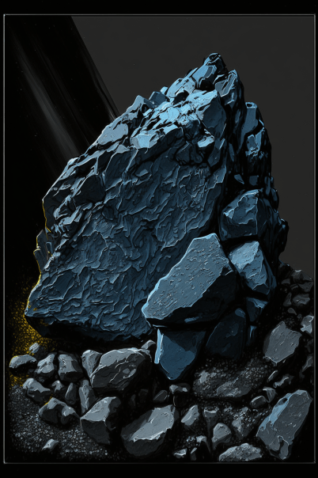破败轮船</a>

<a href="cod_Nc_Macy_ExploreScene_TypeEight.md" style="color:black">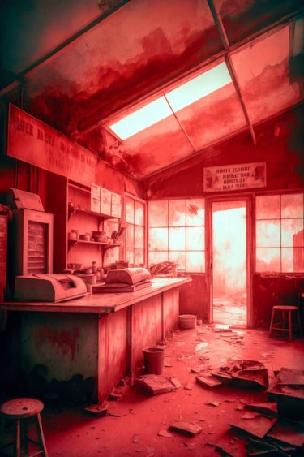设施</a>

<a href="cod_Nc_Macy_ExploreScene_TypeFive.md" style="color:black">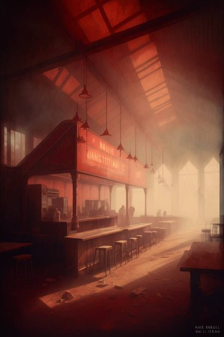设施</a>

<a href="cod_Nc_Macy_ExploreScene_TypeFour.md" style="color:black">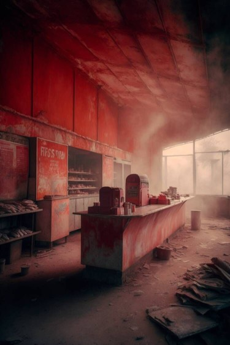设施</a>

<a href="cod_Nc_Macy_ExploreScene_TypeNine.md" style="color:black">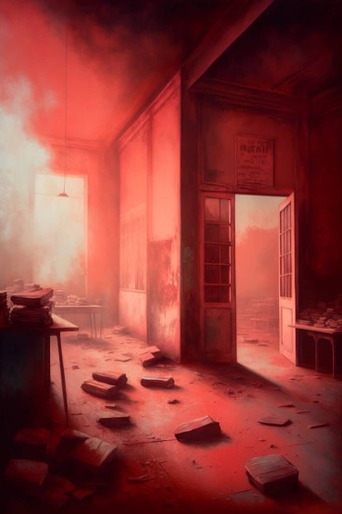设施</a>

<a href="cod_Nc_Macy_ExploreScene_TypeOne.md" style="color:black">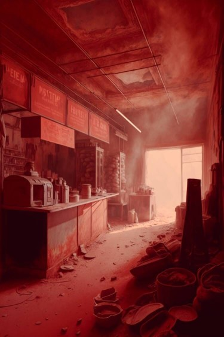设施</a>

<a href="cod_Nc_Macy_ExploreScene_TypeSeven.md" style="color:black">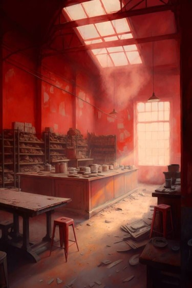设施</a>

<a href="cod_Nc_Macy_ExploreScene_TypeSix.md" style="color:black">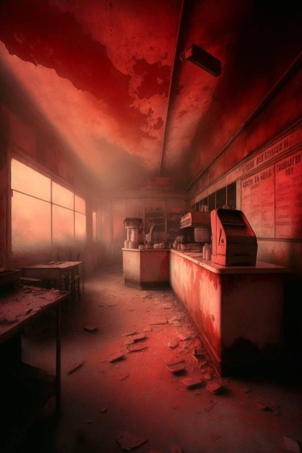设施</a>

<a href="cod_Nc_Macy_ExploreScene_TypeTen.md" style="color:black">设施</a>

<a href="cod_Nc_Macy_ExploreScene_TypeThree.md" style="color:black">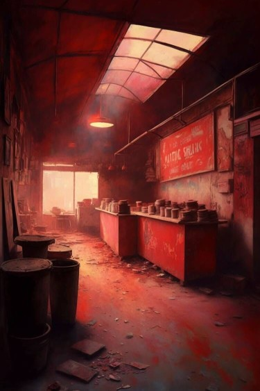设施</a>

<a href="cod_Nc_Macy_ExploreScene_TypeTwo.md" style="color:black">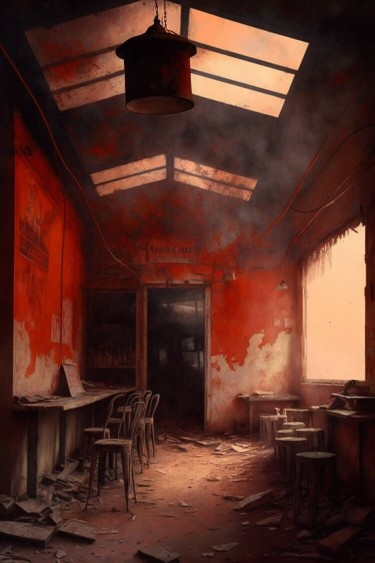设施</a>

<a href="cod_Nc_Macy_GoodsShelves_TypeFour.md" style="color:black">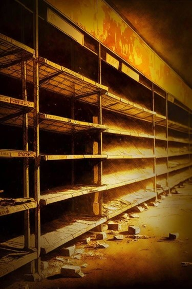货架</a>

<a href="cod_Nc_Macy_GoodsShelves_TypeOne.md" style="color:black">货架</a>

<a href="cod_Nc_Macy_GoodsShelves_TypeThree.md" style="color:black">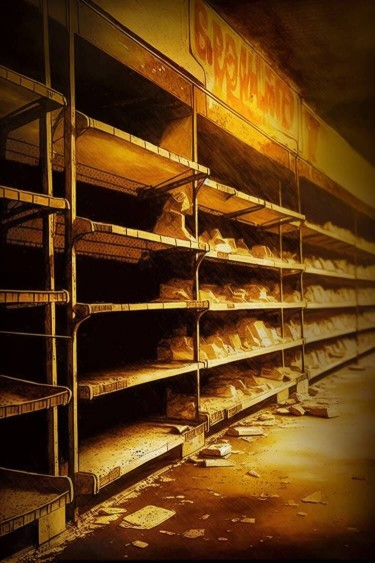货架</a>

<a href="cod_Nc_Macy_GoodsShelves_TypeTwo.md" style="color:black">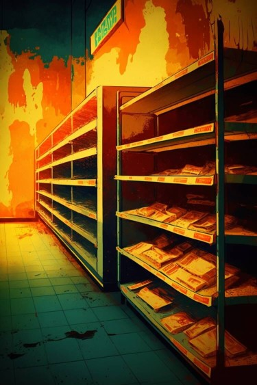货架</a>

<a href="cod_Path_BrokenPortToPharmacy.md" style="color:black">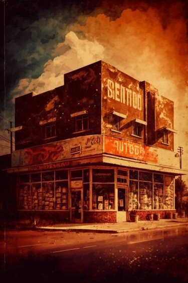维生</a>

<a href="cod_Path_PharmacyToBrokenPort.md" style="color:black">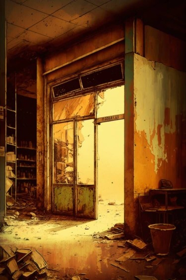破败港口</a>

<a href="cod_Pharmacy_GoodsShelves_TypeFour.md" style="color:black">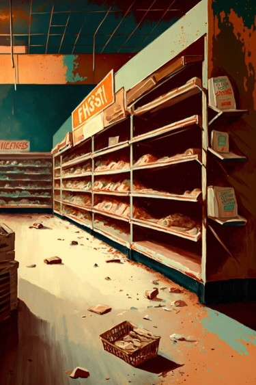货架</a>

<a href="cod_Pharmacy_GoodsShelves_TypeOne.md" style="color:black">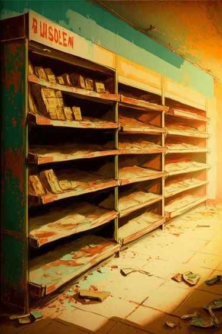货架</a>

<a href="cod_Pharmacy_GoodsShelves_TypeThree.md" style="color:black">货架</a>

<a href="cod_Pharmacy_GoodsShelves_TypeTwo.md" style="color:black">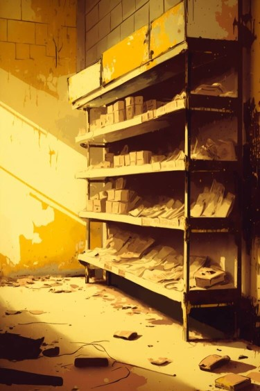货架</a>

<a href="cod_Pharmacy_MedicalKit.md" style="color:black">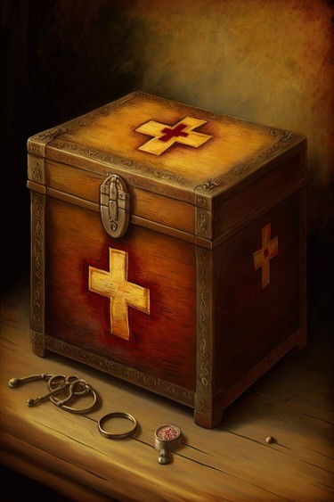医疗箱</a>

<a href="cod_Pharmacy_Pharmaceuticals_TypeEight.md" style="color:black">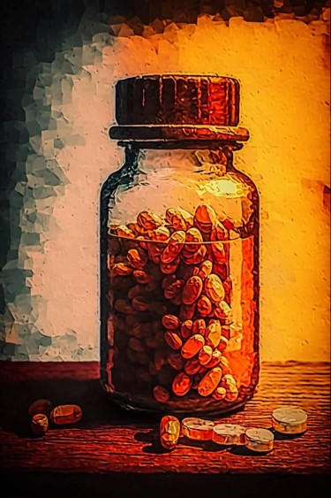多柔比星</a>

<a href="cod_Pharmacy_Pharmaceuticals_TypeFive.md" style="color:black">诺绿沙星</a>

<a href="cod_Pharmacy_Pharmaceuticals_TypeFour.md" style="color:black">美洛西林</a>

<a href="cod_Pharmacy_Pharmaceuticals_TypeNine.md" style="color:black">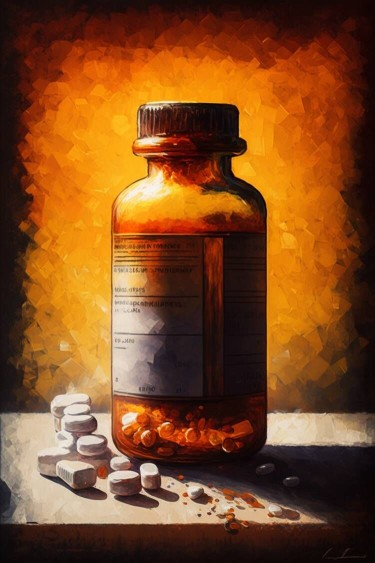表柔比星</a>

<a href="cod_Pharmacy_Pharmaceuticals_TypeOne.md" style="color:black">阿莫西林</a>

<a href="cod_Pharmacy_Pharmaceuticals_TypeSeven.md" style="color:black">头孢拉定</a>

<a href="cod_Pharmacy_Pharmaceuticals_TypeSix.md" style="color:black">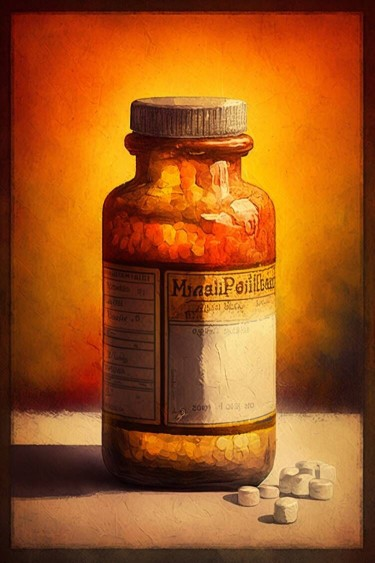维拉帕米</a>

<a href="cod_Pharmacy_Pharmaceuticals_TypeTen.md" style="color:black">可卡因</a>

<a href="cod_Pharmacy_Pharmaceuticals_TypeThree.md" style="color:black">哌拉西林</a>

<a href="cod_Pharmacy_Pharmaceuticals_TypeTwo.md" style="color:black">阿司匹林</a>

<a href="cod_Pharmarcy_DoorOpen.md" style="color:black">门</a>

<a href="cod_一小袋铸币.md" style="color:black">破箱子</a>

<a href="cod_一箱鱼罐头.md" style="color:black">破箱子</a>

<a href="cod_Paht_轮船到港口.md" style="color:black">腐败城市</a>

<a href="cod_Path_港口到腐败城市.md" style="color:black">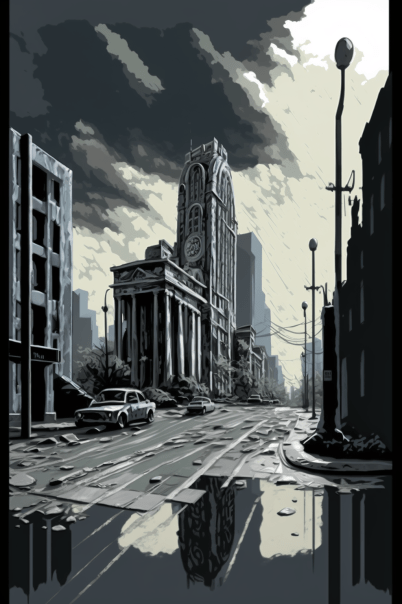腐败城市</a>

<a href="cod_Path_港口到轮船.md" style="color:black">腐败城市</a>

<a href="cod_Path_港口到鱼肉加工厂.md" style="color:black">腐败城市</a>

<a href="cod_Path_腐败城市到港口.md" style="color:black">腐败城市</a>

<a href="cod_Path_鱼肉加工厂到港口.md" style="color:black">腐败城市</a>

<a href="cod_尼根任务箱子1.md" style="color:black">破败轮船</a>

<a href="cod_国际象棋桌.md" style="color:black">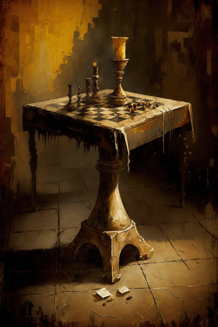破败轮船</a>

<a href="cod_大箱子.md" style="color:black">破败轮船</a>

<a href="cod_大箱子placed.md" style="color:black">破败轮船</a>

<a href="cod_看海景.md" style="color:black">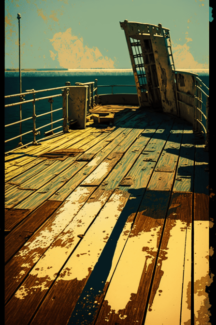破败轮船</a>

<a href="cod_船舱床位.md" style="color:black">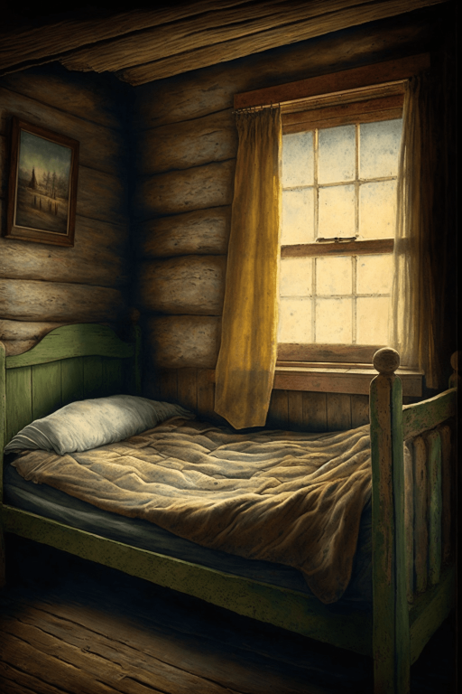破败轮船</a>

<a href="cod_船舱柜子.md" style="color:black">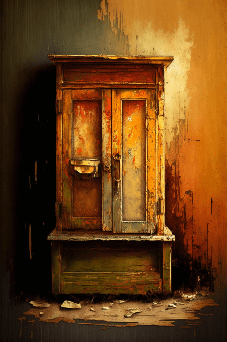破败轮船</a>

<a href="cod_邮轮健身房.md" style="color:black">破败轮船</a>

<a href="cod_邮轮酒吧.md" style="color:black">破败轮船</a>

<a href="cod_Path_废弃农场到神秘小镇.md" style="color:black">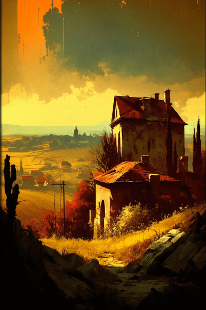腐败城市</a>

<a href="cod_Path_神秘小镇到废弃农场.md" style="color:black">腐败城市</a>

<a href="cod_Path_神秘边境到神秘小镇.md" style="color:black">腐败城市</a>

<a href="cod_Path_神秘边境到神秘谷.md" style="color:black">腐败城市</a>

<a href="cod_Paht_饭馆到基地.md" style="color:black">腐败城市</a>

<a href="cod_Path_基地到饭馆.md" style="color:black">腐败城市</a>

<a href="cod_吃饭的客人.md" style="color:black">破败轮船</a>

<a href="cod_餐馆桌椅.md" style="color:black">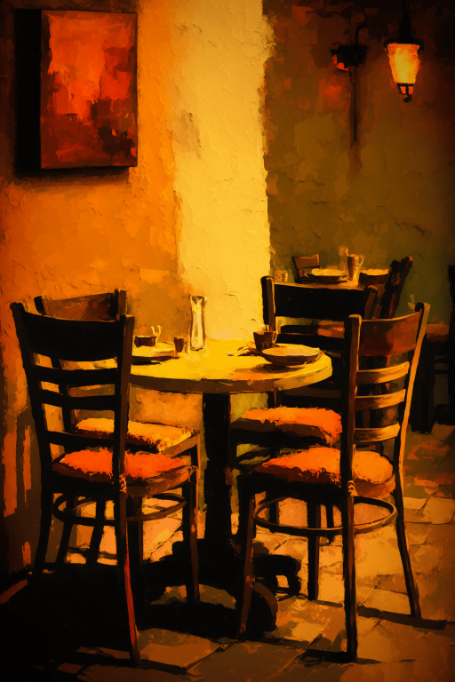破败轮船</a>

<a href="cod_饭馆服务员.md" style="color:black">破败轮船</a>

<a href="cod_Path_深入小镇到小镇.md" style="color:black">腐败城市</a>

<a href="cod_Nc_Heilcopter.md" style="color:black">直升机</a>

<a href="cod_Nc_IncendiaryBottle.md" style="color:black">燃烧瓶</a>

<a href="cod_Nc_IncendiaryBottle_Fire.md" style="color:black">燃烧瓶（点燃）</a>

<a href="cod_Nc_BloodHeart.md" style="color:black">血疫之心</a>

<a href="cod_Nc_BloodHeart_BloodMist.md" style="color:black">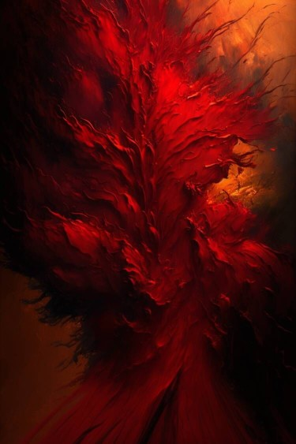血雾</a>

<a href="cod_Nc_BloodHeart_Death.md" style="color:black">残骸</a>

<a href="cod_Nc_FilthyZombie.md" style="color:black">污秽</a>

<a href="cod_Nc_GiantBusterZombie.md" style="color:black">巨霸</a>

<a href="cod_Nc_OrdinaryZombie.md" style="color:black">僵尸</a>

<a href="cod_Nc_PetrifiedZombie.md" style="color:black">石化</a>

<a href="cod_Nc_ScreamingZombies.md" style="color:black">尖啸</a>

<a href="cod_Nc_SharpClawZombies.md" style="color:black">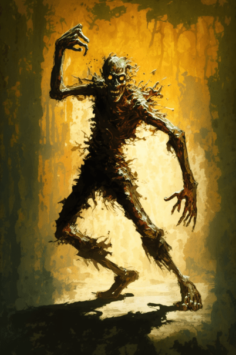利爪</a>

<a href="cod_Nc_SwiftZombie.md" style="color:black">迅猛</a>

<a href="cod_Nc_Vultures.md" style="color:black">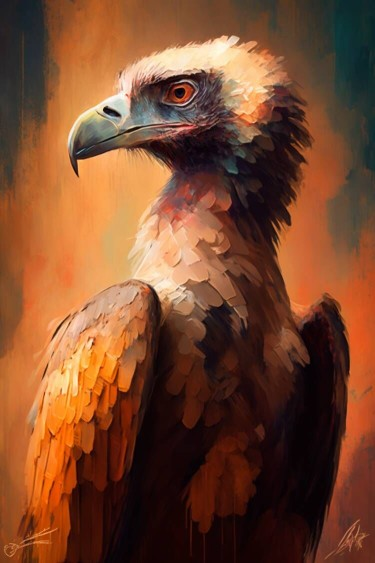秃鹫</a>

<a href="cod_Nc_ZombieBurn_TypeOne.md" style="color:black">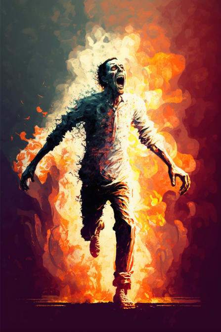燃烧僵尸</a>

<a href="cod_Nc_ZombieBurn_TypeThree.md" style="color:black">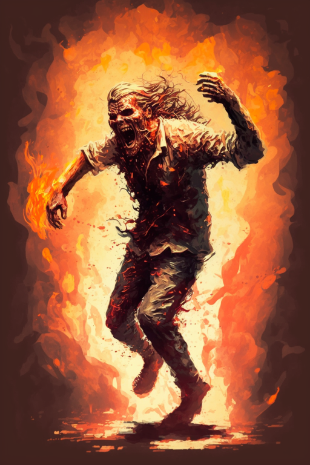燃烧僵尸</a>

<a href="cod_Nc_ZombieBurn_TypeTwo.md" style="color:black">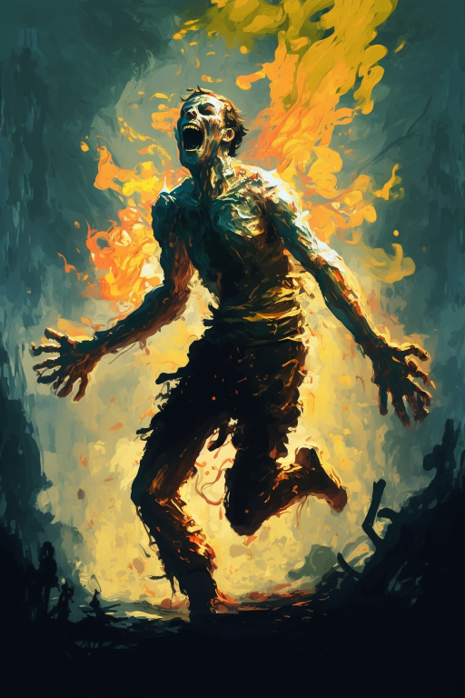燃烧僵尸</a>

<a href="cod_Nc_ZombieCorpse.md" style="color:black">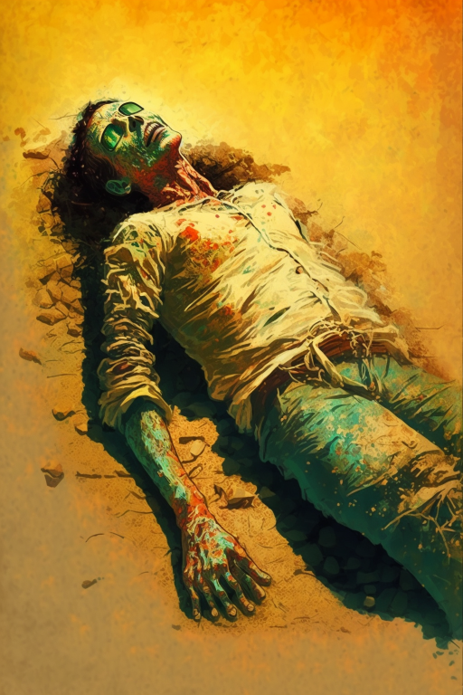僵尸尸体</a>

<a href="cod_Nc_ZombieCorpse_Burn_TypeOne.md" style="color:black">烧焦尸体</a>

<a href="cod_Nc_ZombieCorpse_Burn_TypeThree.md" style="color:black">烧焦尸体</a>

<a href="cod_Nc_ZombieCorpse_Burn_TypeTwo.md" style="color:black">烧焦尸体</a>

  
  

  
## 区域  

[

 [破败轮船](cod_Exp_锯木厂.md)](cod_Exp_锯木厂.md)

[

 [破败轮船](cod_Exp_基地.md)](cod_Exp_基地.md)

[

 [破败轮船](cod_Exp_腐败之城.md)](cod_Exp_腐败之城.md)

[

 [破败轮船](cod_Exp_破车1.md)](cod_Exp_破车1.md)

[

 [破败轮船](cod_Exp_矿区.md)](cod_Exp_矿区.md)

[

 [破败轮船](cod_Exp_矿洞.md)](cod_Exp_矿洞.md)

[

 [梅西百货](cod_Exp_Macy.md)](cod_Exp_Macy.md)

[

 [摩登街道](cod_Exp_ModernStreet.md)](cod_Exp_ModernStreet.md)

[

 [维生](cod_Exp_Pharmacy.md)](cod_Exp_Pharmacy.md)

[

 [破败轮船](cod_Exp_破旧轮船.md)](cod_Exp_破旧轮船.md)

[

 [破败轮船](cod_Exp_破败港口.md)](cod_Exp_破败港口.md)

[

 [破败轮船](cod_Exp_鱼肉加工厂.md)](cod_Exp_鱼肉加工厂.md)

[

 [破败轮船](cod_Exp_船舱.md)](cod_Exp_船舱.md)

[
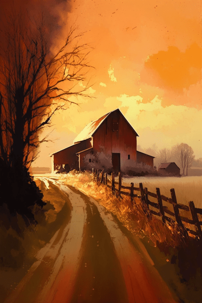
 [破败轮船](cod_Exp_废弃农场.md)](cod_Exp_废弃农场.md)

[

 [破败轮船](cod_Exp_废弃谷仓.md)](cod_Exp_废弃谷仓.md)

[

 [破败轮船](cod_Exp_神秘小镇.md)](cod_Exp_神秘小镇.md)

[

 [破败轮船](cod_Exp_神秘边境.md)](cod_Exp_神秘边境.md)

[

 [破败轮船](cod_废弃谷仓内部.md)](cod_废弃谷仓内部.md)

[

 [地窖](cod_谷仓地窖内部.md)](cod_谷仓地窖内部.md)

[
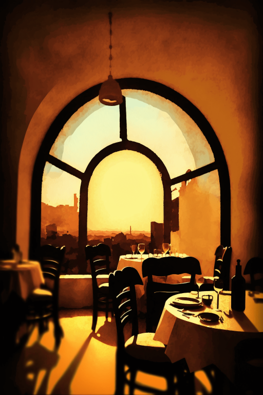
 [破败轮船](cod_Exp_饭馆.md)](cod_Exp_饭馆.md)

[

 [破败轮船](cod_Exp_深入小镇.md)](cod_Exp_深入小镇.md)

[

 [破败轮船](cod_Exp_红色砖房.md)](cod_Exp_红色砖房.md)

  
  

  
## 事件  

[
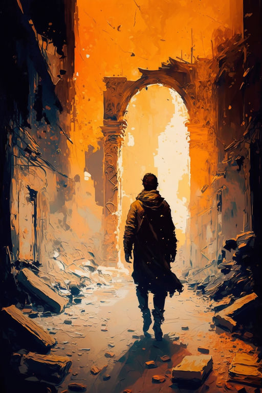
 [地区探索完毕](cod_探索地区完毕.md)](cod_探索地区完毕.md)

[
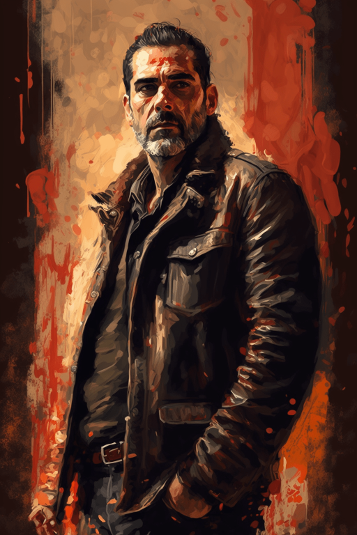
 [加文](cod_eve_信任度30.md)](cod_eve_信任度30.md)

[
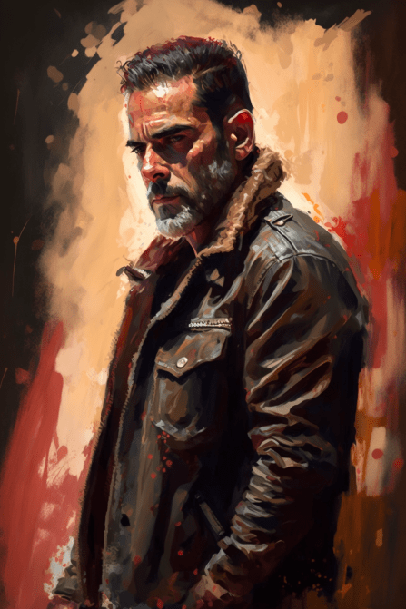
 [加文](cod_eve_信任度75.md)](cod_eve_信任度75.md)

[
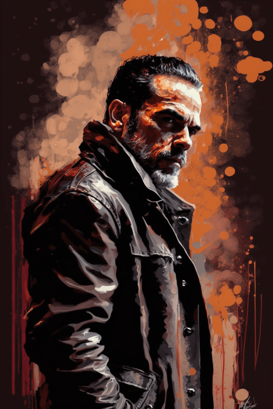
 [加文](cod_eve_救世军信任度奖励50.md)](cod_eve_救世军信任度奖励50.md)

[
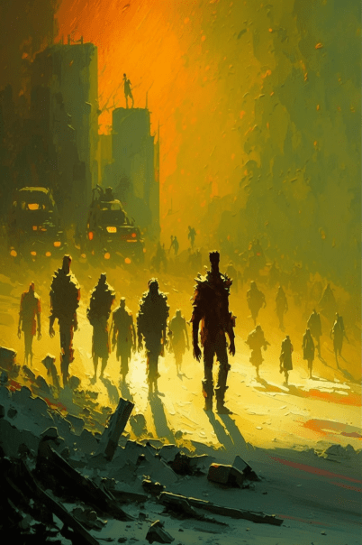
 [腐败城市](cod_eve_CodAlert.md)](cod_eve_CodAlert.md)

[

 [加文](cod_Eve_Garvin1.md)](cod_Eve_Garvin1.md)

[
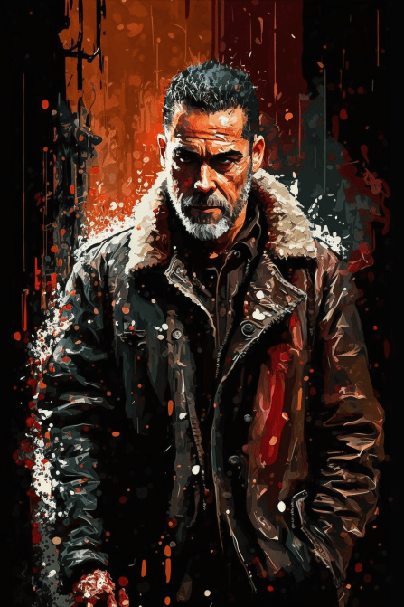
 [加文](cod_Eve_Negan_talk1.md)](cod_Eve_Negan_talk1.md)

[

 [加文](cod_Eve_Negan_talk2.md)](cod_Eve_Negan_talk2.md)

[
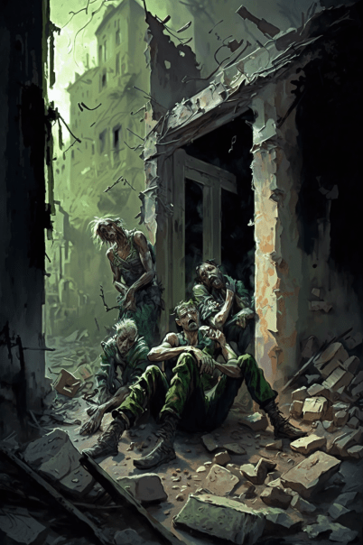
 [尸群](cod_eve_城市僵尸攻击事件1.md)](cod_eve_城市僵尸攻击事件1.md)

[

 [尸群](cod_eve_城市僵尸攻击事件2.md)](cod_eve_城市僵尸攻击事件2.md)

[

 [加文](cod_eve_肥乔谈话1.md)](cod_eve_肥乔谈话1.md)

[
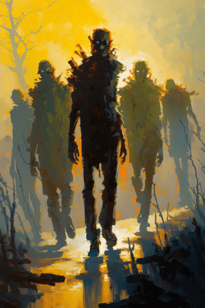
 [港口危险](cod_eve_farmAlert.md)](cod_eve_farmAlert.md)

[

 [加文](cod_eve_血压升高.md)](cod_eve_血压升高.md)

[

 [加文](cod_eve_回答我就是我.md)](cod_eve_回答我就是我.md)

[

 [加文](cod_eve_回答我是尼根.md)](cod_eve_回答我是尼根.md)

[

 [加文](cod_eve_尼根任务成功takl2.md)](cod_eve_尼根任务成功takl2.md)

[

 [加文](cod_eve_尼根任务成功talk1.md)](cod_eve_尼根任务成功talk1.md)

[

 [加文](cod_eve_尼根木箱任务成功.md)](cod_eve_尼根木箱任务成功.md)

[

 [加文](cod_eve_尼根的试验.md)](cod_eve_尼根的试验.md)

[

 [加文](cod_eve_尼根问题.md)](cod_eve_尼根问题.md)

[
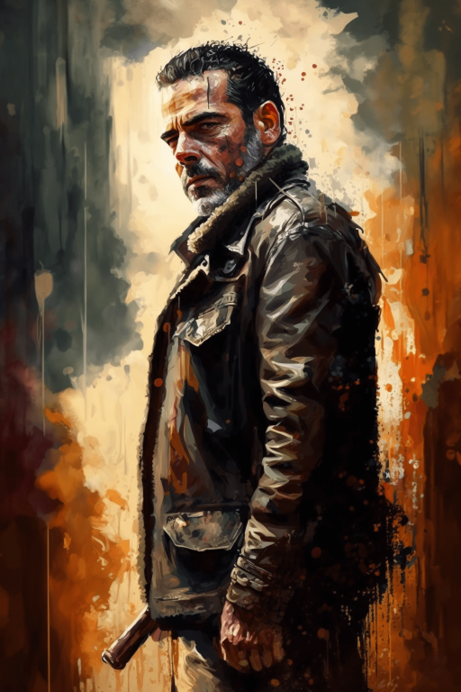
 [加文](cod_eve_遇见尼根给任务.md)](cod_eve_遇见尼根给任务.md)

[
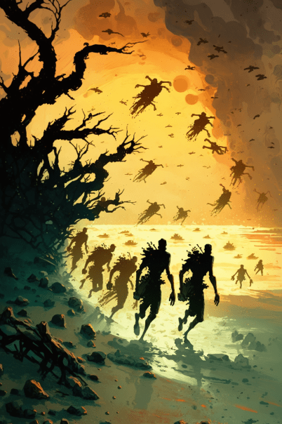
 [港口危险](cod_eve_shipAlert.md)](cod_eve_shipAlert.md)

[

 [加文](cod_eve_服务员对话.md)](cod_eve_服务员对话.md)

[
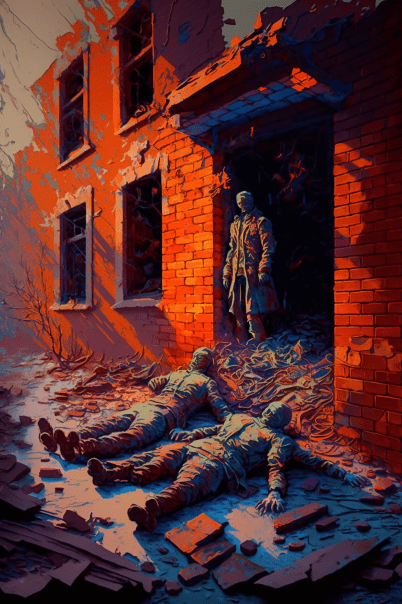
 [尸群](cod_eve_小镇僵尸埋伏事件.md)](cod_eve_小镇僵尸埋伏事件.md)

[

 [尸群](cod_eve_小镇僵尸袭击事件.md)](cod_eve_小镇僵尸袭击事件.md)

[
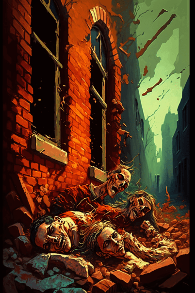
 [尸群](cod_eve_小镇骸骨事件.md)](cod_eve_小镇骸骨事件.md)

[
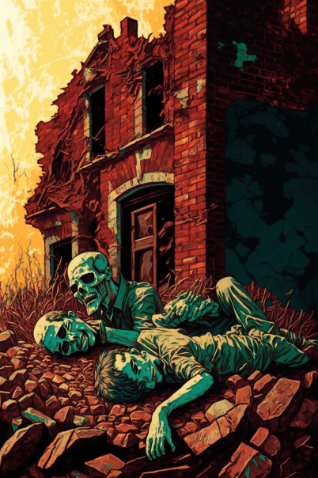
 [尸群](cod_eve_小镇骸骨事件2.md)](cod_eve_小镇骸骨事件2.md)

[

 [直升机](cod_Event_HelicopterApproach.md)](cod_Event_HelicopterApproach.md)

[

 [燃烧瓶](cod_Event_IncendiaryBottle_BurnSelf.md)](cod_Event_IncendiaryBottle_BurnSelf.md)

[

 [爆发](cod_Event_BloodHeart_BloodBoom.md)](cod_Event_BloodHeart_BloodBoom.md)

[

 [血疫](cod_Event_BloodHeart_Death.md)](cod_Event_BloodHeart_Death.md)

[

 [污秽](cod_Event_FilthyZombie_AttackFail_Injured.md)](cod_Event_FilthyZombie_AttackFail_Injured.md)

[

 [进攻](cod_Event_FilthyZombie_ShootingBlank.md)](cod_Event_FilthyZombie_ShootingBlank.md)

[

 [巨霸](cod_Event_GiantBusterZombie_AttackSuccess_Injured.md)](cod_Event_GiantBusterZombie_AttackSuccess_Injured.md)

[

 [逃脱](cod_Event_GiantBusterZombie_DodgeFail.md)](cod_Event_GiantBusterZombie_DodgeFail.md)

[

 [进攻](cod_Event_GiantBusterZombie_ShootingBlank.md)](cod_Event_GiantBusterZombie_ShootingBlank.md)

[

 [逃脱](cod_Event_OrdinaryZombie_DodgeFail.md)](cod_Event_OrdinaryZombie_DodgeFail.md)

[

 [进攻](cod_Event_OrdinaryZombie_ShootingBlank.md)](cod_Event_OrdinaryZombie_ShootingBlank.md)

[

 [石化](cod_Event_PetrifiedZombie_AttackSuccess_Injured.md)](cod_Event_PetrifiedZombie_AttackSuccess_Injured.md)

[

 [进攻](cod_Event_PetrifiedZombie_ShootingBlank.md)](cod_Event_PetrifiedZombie_ShootingBlank.md)

[

 [进攻](cod_Event_ScreamingZombies_AttackFail_ScreamingSuccess.md)](cod_Event_ScreamingZombies_AttackFail_ScreamingSuccess.md)

[

 [尖叫](cod_Event_ScreamingZombies_AttackSuccess_ScreamingSuccess.md)](cod_Event_ScreamingZombies_AttackSuccess_ScreamingSuccess.md)

[

 [尖啸](cod_Event_ScreamingZombies_Burn_ScreamingSuccess.md)](cod_Event_ScreamingZombies_Burn_ScreamingSuccess.md)

[

 [尖啸](cod_Event_ScreamingZombies_Screamin.md)](cod_Event_ScreamingZombies_Screamin.md)

[

 [打空了！](cod_Event_ScreamingZombies_ShootingBlank_ScreamingSuccess.md)](cod_Event_ScreamingZombies_ShootingBlank_ScreamingSuccess.md)

[

 [利爪](cod_Event_SharpClawZombie_AttackSuccess_Injured.md)](cod_Event_SharpClawZombie_AttackSuccess_Injured.md)

[

 [利爪](cod_Event_SharpClawZombie_ShootingBlank.md)](cod_Event_SharpClawZombie_ShootingBlank.md)

[

 [迅猛](cod_Event_SwiftZombie_AttackSuccess_Injured.md)](cod_Event_SwiftZombie_AttackSuccess_Injured.md)

[

 [逃脱](cod_Event_SwiftZombie_DodgeFail.md)](cod_Event_SwiftZombie_DodgeFail.md)

[

 [进攻](cod_Event_SwiftZombie_ShootBlank.md)](cod_Event_SwiftZombie_ShootBlank.md)

[

 [秃鹫](cod_Event_Vultures_Death.md)](cod_Event_Vultures_Death.md)

[
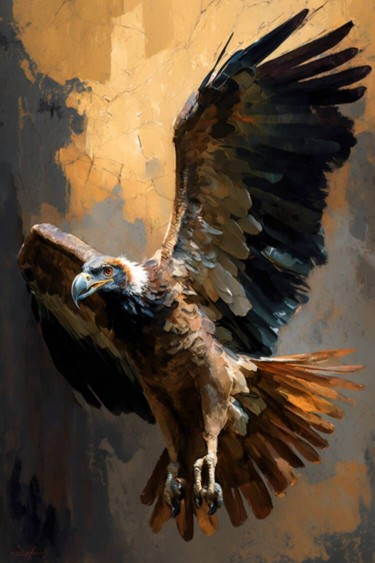
 [逃脱](cod_Event_Vultures_FlyAway.md)](cod_Event_Vultures_FlyAway.md)

[

 [秃鹫](cod_Event_Vultures_FlyDown.md)](cod_Event_Vultures_FlyDown.md)

[

 [尸群](cod_eve_一些普通僵尸来了.md)](cod_eve_一些普通僵尸来了.md)

[

 [尖叫僵尸](cod_eve_利爪僵尸攻击.md)](cod_eve_利爪僵尸攻击.md)

[

 [利爪](cod_eve_利爪僵尸解决掉了.md)](cod_eve_利爪僵尸解决掉了.md)

[

 [尖叫僵尸](cod_eve_尖叫僵尸攻击.md)](cod_eve_尖叫僵尸攻击.md)

[

 [尖啸](cod_eve_尖叫僵尸解决掉了.md)](cod_eve_尖叫僵尸解决掉了.md)

[

 [尸群](cod_eve_尸群来了.md)](cod_eve_尸群来了.md)

[

 [巨霸僵尸](cod_eve_巨霸僵尸攻击.md)](cod_eve_巨霸僵尸攻击.md)

[

 [迅猛](cod_eve_巨霸僵尸解决掉了.md)](cod_eve_巨霸僵尸解决掉了.md)

[

 [利爪](cod_eve_我受了利爪僵尸伤.md)](cod_eve_我受了利爪僵尸伤.md)

[

 [Ouch!](cod_eve_我受了巨霸僵尸伤.md)](cod_eve_我受了巨霸僵尸伤.md)

[

 [啊！](cod_eve_我受了污秽僵尸伤.md)](cod_eve_我受了污秽僵尸伤.md)

[

 [Ouch!](cod_eve_我受了迅猛僵尸伤.md)](cod_eve_我受了迅猛僵尸伤.md)

[

 [啊！](cod_eve_我受伤了擦伤.md)](cod_eve_我受伤了擦伤.md)

[

 [啊！](cod_eve_我受到了石化僵尸伤.md)](cod_eve_我受到了石化僵尸伤.md)

[

 [僵尸](cod_eve_普通僵尸攻击.md)](cod_eve_普通僵尸攻击.md)

[

 [僵尸](cod_eve_普通僵尸解决掉了.md)](cod_eve_普通僵尸解决掉了.md)

[

 [污秽僵尸](cod_eve_污秽僵尸攻击.md)](cod_eve_污秽僵尸攻击.md)

[

 [迅猛](cod_eve_污秽僵尸解决掉了.md)](cod_eve_污秽僵尸解决掉了.md)

[

 [石化僵尸](cod_eve_石化僵尸攻击.md)](cod_eve_石化僵尸攻击.md)

[

 [迅猛](cod_eve_石化僵尸解决掉了.md)](cod_eve_石化僵尸解决掉了.md)

[

 [尖叫僵尸](cod_eve_迅猛僵尸攻击.md)](cod_eve_迅猛僵尸攻击.md)

[

 [迅猛](cod_eve_迅猛僵尸解决掉了.md)](cod_eve_迅猛僵尸解决掉了.md)

  
  

  
## 天气  

[

 [风暴](cod_Weather_Storm.md)](cod_Weather_Storm.md)

  
  

  
## 受伤  

<a href="cod_W_GiantBusterZombie_ClawWound.md" style="color:black">巨霸撞伤</a>

<a href="cod_W_SharpClawZombie_ClawInjured.md" style="color:black">利爪撕裂</a>

<a href="cod_W_SharpClawZombie_ClawInjured_NotStitching.md" style="color:black">利爪撕裂</a>

<a href="cod_W_SharpClawZombie_ClawInjured_Stitching.md" style="color:black">已缝合的利爪撕裂</a>

<a href="cod_W_TaintedWounds.md" style="color:black">污秽侵蚀</a>

<a href="cod_W_ZombieBites.md" style="color:black">僵尸咬伤</a>

<a href="cod_W_ZombieScratch.md" style="color:black">僵尸咬伤</a>

  
  

  
## 其他  

[

 [破败轮船](cod_左轮手枪.md)](cod_左轮手枪.md)

[

 [破败轮船](cod_空的左轮.md)](cod_空的左轮.md)

[

 [罐装香蕉片](cod_自制柠檬草罐头.md)](cod_自制柠檬草罐头.md)

[

 [罐装香蕉片](cod_自制肉罐头.md)](cod_自制肉罐头.md)

[

 [罐装香蕉片](cod_自制芒果罐头.md)](cod_自制芒果罐头.md)

[

 [罐装香蕉片](cod_自制虾罐头.md)](cod_自制虾罐头.md)

[

 [罐装香蕉片](cod_自制蛋罐头.md)](cod_自制蛋罐头.md)

[

 [罐装香蕉片](cod_自制辣椒罐头.md)](cod_自制辣椒罐头.md)

[

 [罐装香蕉片](cod_自制香蕉罐头.md)](cod_自制香蕉罐头.md)

[

 [罐装蛋](cod_Nc_ScavengingSupplies_Food_CannedGood_TypeEight.md)](cod_Nc_ScavengingSupplies_Food_CannedGood_TypeEight.md)

[

 [泰园芒果](cod_Nc_ScavengingSupplies_Food_CannedGood_TypeFive.md)](cod_Nc_ScavengingSupplies_Food_CannedGood_TypeFive.md)

[

 [德式肉肠](cod_Nc_ScavengingSupplies_Food_CannedGood_TypeFour.md)](cod_Nc_ScavengingSupplies_Food_CannedGood_TypeFour.md)

[

 [罐装辣椒](cod_Nc_ScavengingSupplies_Food_CannedGood_TypeNine.md)](cod_Nc_ScavengingSupplies_Food_CannedGood_TypeNine.md)

[

 [冰原虾品](cod_Nc_ScavengingSupplies_Food_CannedGood_TypeSeven.md)](cod_Nc_ScavengingSupplies_Food_CannedGood_TypeSeven.md)

[

 [罐装香蕉片](cod_Nc_ScavengingSupplies_Food_CannedGood_TypeTen.md)](cod_Nc_ScavengingSupplies_Food_CannedGood_TypeTen.md)

[

 [世家草本](cod_Nc_ScavengingSupplies_Food_CannedGood_TypeThree.md)](cod_Nc_ScavengingSupplies_Food_CannedGood_TypeThree.md)

[
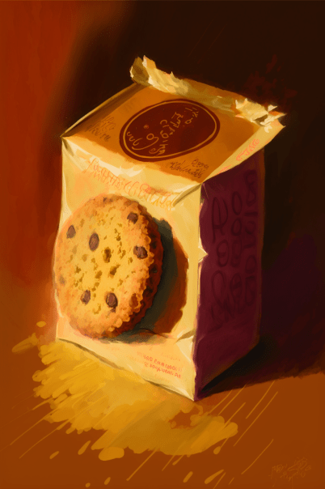
 [一包曲奇](cod_一包曲奇.md)](cod_一包曲奇.md)

  
  

  
## 特质  

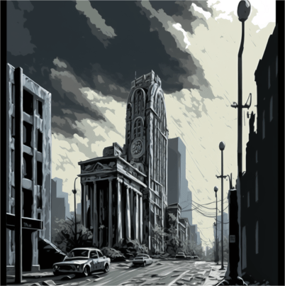
[废城](cod_Perk_Cod.md)

  
  
  
## 状态  

[

[感染度](cod_Gs_Ruins_ZombieInfectivity.md)](cod_Gs_Ruins_ZombieInfectivity.md)

[

[血疫](cod_Gs_Ruins_BloodPlague.md)](cod_Gs_Ruins_BloodPlague.md)

[

[血清](cod_Gs_Antidote.md)](cod_Gs_Antidote.md)

[Gs_BloodHeart_BloodMist_ProducedZombieCount](cod_Gs_BloodHeart_BloodMist_ProducedZombieCount.md)

[Gs_BloodHeart_Macy_ExistCount](cod_Gs_BloodHeart_Macy_ExistCount.md)

[

[身体强度](cod_Gs_Rains_BodyStrength.md)](cod_Gs_Rains_BodyStrength.md)

[

[锻炼程度](cod_Gs_ExerciseDegree.md)](cod_Gs_ExerciseDegree.md)

[Noise_OrdinaryZombie_AttackCount](cod_Gs_Noise_OrdinaryZombie_AttackCount.md)

[Gs_Noise_SwiftZombie_AttackCount](cod_Gs_Noise_SwiftZombie_AttackCount.md)

[Gs_Noise_FilthyZombie_AttackCount](cod_Gs_Noise_FilthyZombie_AttackCount.md)

[Gs_Noise_GiantBusterZombie_AttackCount](cod_Gs_Noise_GiantBusterZombie_AttackCount.md)

[Gs_Noise_PetrifiedZombie_AttackCount](cod_Gs_Noise_PetrifiedZombie_AttackCount.md)

[Gs_Noise_ScreamingZombies_AttackCount](cod_Gs_Noise_ScreamingZombies_AttackCount..md)

[Gs_Noise_SharpClawZombies_AttackCount](cod_Gs_Noise_SharpClawZombies_AttackCount.md)

[

[区域热度](cod_Gs_NoiseFactor.md)](cod_Gs_NoiseFactor.md)

[

[噪声系数](cod_Gs_NoiseLevel.md)](cod_Gs_NoiseLevel.md)

[Gs_Noise_ZombieProducedCount_ReCount](cod_Gs_Noise_ZombieProducedCount_ReCount.md)

[Gs_Noise_ZombieProducedCount](cod_Gs_Noise_ZombieProducedCount.md)

[Gs_Pharmacy_ExplorationCount](cod_Gs_Pharmacy_ExplorationCount.md)

[DisasterBeason_ToShipCounter](cod_Gs_Ruins_DisasterBeason_StartJourneyCounter.md)

[

[金币](cod_Gs_Ruins_GoldCoins.md)](cod_Gs_Ruins_GoldCoins.md)

[Ruins_MapCount](cod_Gs_Ruins_MapCount.md)

[

[开锁](cod_Gs_Ruins_Skill_Locksmithing.md)](cod_Gs_Ruins_Skill_Locksmithing.md)

[Vultures_FlyDownCount](cod_Gs_Vultures_FlyDownCount.md)

[Vultures_FlyDownCount](cod_Gs_Vultures_FlyDownCount_RestrictionsCounter.md)

[Gs_ZombiePresenceCounter](cod_Gs_ZombiePresenceCounter.md)

[

[餐馆好感度](cod_弹药学.md)](cod_弹药学.md)

[

[餐馆好感度](cod_救世军信任度.md)](cod_救世军信任度.md)

[

[用餐环境](cod_用餐环境.md)](cod_用餐环境.md)

[

[餐馆好感度](cod_餐馆好感度.md)](cod_餐馆好感度.md)

  
  
  
  
  

