# 天启  
> 天启Mod为一个巨型综合Mod，涉及近百类事件、数百个物品、九个超级气象、一个全新游戏角色的添加。  
> 同时为游戏增加五张全新的地图：浅海与花海、骷髅船、深海、飓风海域以及四个BOSS级对抗生物。  
> 很大程度上重建了游戏的天气系统，并且为每个天气增加独特的随机事件和全新的物品。  
> 这些物品与事件由目前共九个超级气象所组成与触发。  
>   
> mod玩法  
> 游戏中会解锁特性天赋：天启，游玩本Mod时必须加上该特性。  
> 会在游戏开始时，为玩家装备道具天启，需要玩家随身携带。  
> 天启装备不占用任何常规装备栏，视为额外装备，可以主动使用装备天启来随机召唤一次超级气象。  
> 也可以使用人类食物、各种肉类来为天启补充耐久度。天启项链自身会随时间恢复耐久。  
> 天启信标目前会三天触发一次，在九种超级气象中等概率随机产生一种气象，以及带来大量事件。  
> 气象目前有:火山爆发、雷暴、彩虹、大雁南飞、鲨龙卷、暴风雪、花粉季、血月、流星雨。  
> 九个个气象各有特点，会为玩家带来大量的随机事件。每个事件各有利弊，玩家可根据自身的条件和选择来度过难关  
>   
> 如果您是第一次玩天启，那么推荐使用天启添加的角色：罗拉·克劳芬。  
> 该角色相比常规角色拥有更好的初始装备，拥有专属于罗拉的故事剧情和任务目标。有助于您熟悉天启的各项机制。  
> 如果你希望能够使用罗拉·克劳芬，进入游戏后在游戏角色中下滑，即可找到她。  
>   
> 天启鼓励玩家自行探索这个全新的世界，每个气象都有独特的事件，每个事件都会带来不同的效果与选择。  
> 如果您希望完全了解天启的各项机制、各项内容。  
> 可以在浏览器输入cswiki.uuppi.com/wiki 来登入卡牌生存百科，在这里你可以了解到卡牌生存的一切。  
> 推荐各位玩家在进行一次完整的天启体验后再进入了解。  
>   
> 祝愿游戏愉快~  
>   
> By yoyo_koko  
<table><tr><td width=140><b>作者：</b></td><td>YoYo</td></tr><tr><td><b>Wiki数据版本：</b></td><td>1.44</td></tr><tr><td><b>版本下载：</b></td><td>

获取中...

</td></tr></table>  
## 角色  

[ 罗拉·克劳芬](tq_Pc_DiasterBeasons_Lola.md)

  
  
  
## 装备  

<a href="tq_Nc_BloodMoon_BloodWolf_Claw.md" style="color:black">狼爪</a>

<a href="tq_Nc_DiasterBeacons.md" style="color:black">天启</a>

<a href="tq_Nc_DiasterBeacons_Lola_Bag.md" style="color:black">旅途背包</a>

<a href="tq_Nc_DiasterBeacons_Lola_Bottle.md" style="color:black">旅行水壶</a>

<a href="tq_Nc_DiasterBeason_Character_Lola_StartMaterials_Bandages.md" style="color:black">医用绷带</a>

<a href="tq_Nc_DiasterBeason_PearNeckLace.md" style="color:black">Pearl Necklace</a>

<a href="tq_Nc_FlowerSea_CureWoundBall.md" style="color:black">自然之灵</a>

<a href="tq_Nc_GeeseSouth_DownJacket.md" style="color:black">羽绒服</a>

<a href="tq_Nc_GeeseSouth_FeatherHat.md" style="color:black">羽毛帽</a>

<a href="tq_Nc_GhostShip_BoneNeck.md" style="color:black">星星坠饰</a>

<a href="tq_Nc_GhostShip_CaptainSkeleton_Necklace.md" style="color:black">骷髅项链</a>

<a href="tq_Nc_Hail_IceCoolBall_Ice.md" style="color:black">冰晶球</a>

<a href="tq_Nc_Hail_IceCrystalsBall.md" style="color:black">寒霜</a>

<a href="tq_Nc_Hail_IceCrystalsBall_Off.md" style="color:black">寒霜</a>

<a href="tq_Nc_HatCloud_Hat.md" style="color:black">云朵</a>

<a href="tq_Nc_HatCloud_Hat_Green.md" style="color:black">云朵</a>

<a href="tq_Nc_HatCloud_Hat_Rain.md" style="color:black">云朵</a>

<a href="tq_Nc_Meteor_Imprint_Drugs.md" style="color:black">流星印记</a>

<a href="tq_Nc_Meteor_Imprint_Food.md" style="color:black">流星印记</a>

<a href="tq_Nc_Meteor_Imprint_Pray.md" style="color:black">流星印记</a>

<a href="tq_Nc_Meteor_Imprint_Rain.md" style="color:black">流星印记</a>

<a href="tq_Nc_Meteor_Imprint_StarPendant.md" style="color:black">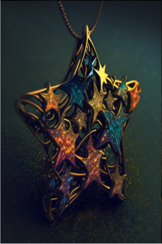星星坠饰</a>

<a href="tq_Nc_Meteor_Imprint_WeightBall.md" style="color:black">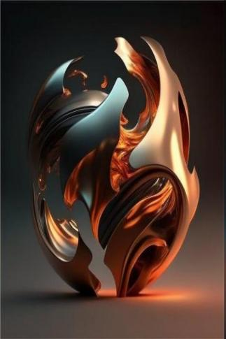引力(缓冲）</a>

<a href="tq_Nc_Meteor_Imprint_WeightBall_Empty.md" style="color:black">引力(缓冲）</a>

<a href="tq_Nc_RainBow_RainBowShoes.md" style="color:black">莱恩靴（暗淡）</a>

<a href="tq_Nc_RainBow_RainBowShoes_Empty.md" style="color:black">莱恩靴（暗淡）</a>

<a href="tq_Nc_UnderSea_IceCoolBall.md" style="color:black">冰晶球</a>

<a href="tq_Nc_UnderSea_LuminousPeral_NeckLack.md" style="color:black">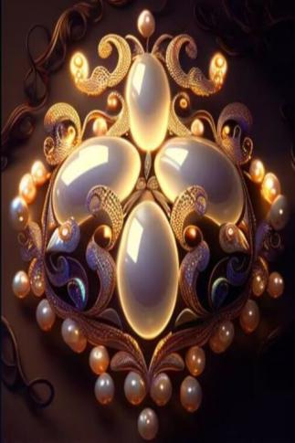夜明</a>

<a href="tq_Nc_UnderSea_SeaBall.md" style="color:black">海洋</a>

<a href="tq_Nc_UnderSea_WaterBallWaterBall.md" style="color:black">水灵球</a>

<a href="tq_Nc_VolcanicEruption_FireBall.md" style="color:black">灰烬</a>

<a href="tq_Nc_VolcanicEruption_FireBall_Off.md" style="color:black">灰烬</a>

  
  

  
## 食物  

<a href="tq_Nc_DiasterBeason_Character_Lola_StartMaterials_CannedGoods_TypeFour.md" style="color:black">库伦汤品</a>

<a href="tq_Nc_DiasterBeason_Character_Lola_StartMaterials_CannedGoods_TypeOne.md" style="color:black">梅林牛肉</a>

<a href="tq_Nc_DiasterBeason_Character_Lola_StartMaterials_CannedGoods_TypeThree.md" style="color:black">莱恩蛋白</a>

<a href="tq_Nc_DiasterBeason_Character_Lola_StartMaterials_CannedGoods_TypeTwo.md" style="color:black">塔克鱼肉</a>

<a href="tq_Nc_DiasterBeason_Character_Lola_StartMaterials_CookieBox.md" style="color:black">格林曲奇</a>

<a href="tq_Nc_DiasterBeason_Character_Lola_StartMaterials_ModernCoffee.md" style="color:black">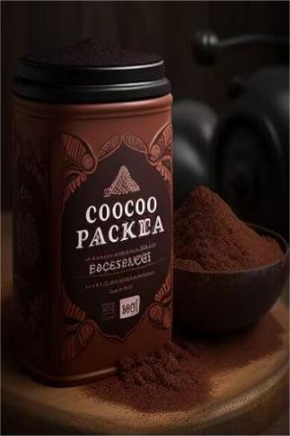巴克咖啡</a>

<a href="tq_Nc_Hail_Ice.md" style="color:black">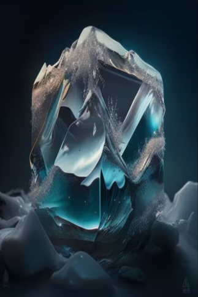冰</a>

<a href="tq_Nc_Meteor_Imprint_Food_TypeFive.md" style="color:black">星空蛋糕</a>

<a href="tq_Nc_Meteor_Imprint_Food_TypeFour.md" style="color:black">星空蛋糕</a>

<a href="tq_Nc_Meteor_Imprint_Food_TypeOne.md" style="color:black">星空蛋糕</a>

<a href="tq_Nc_Meteor_Imprint_Food_TypeThree.md" style="color:black">星空蛋糕</a>

<a href="tq_Nc_Meteor_Imprint_Food_TypeTwo.md" style="color:black">星空蛋糕</a>

<a href="tq_Nc_Meteor_Imprint_Suger_TypeOne.md" style="color:black">星空蛋糕</a>

<a href="tq_Nc_PollenSeason_Flower_DaffodilsFlower_Fruit.md" style="color:black">水仙花瓣</a>

<a href="tq_Nc_PollenSeason_Flower_GoldFruits.md" style="color:black">黄金果</a>

<a href="tq_Nc_PollenSeason_Flower_StepTwo_TypeOne_Fruit.md" style="color:black">瓜子</a>

<a href="tq_Nc_PollenSeason_Flower_StepTwo_TypeThree_Fruit.md" style="color:black">维恩果</a>

<a href="tq_Nc_PollenSeason_Tyrannus_Fruit.md" style="color:black">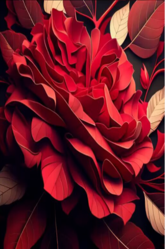红晶果</a>

<a href="tq_Nc_RainBow_Suger.md" style="color:black">彩虹糖</a>

<a href="tq_Nc_UnderSea_Kelp_Food.md" style="color:black">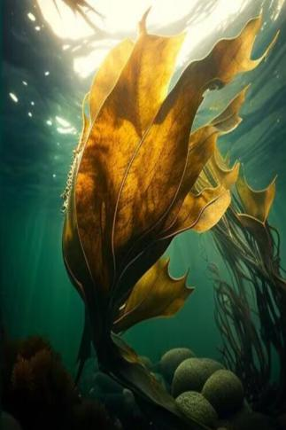海带</a>

  
  

  
## 工具  

<a href="tq_Nc_DiasterBeason_Character_Lola_StartMaterials_ModernKnives.md" style="color:black">苏伯锋具</a>

  
  

  
## 蓝图  

<a href="tq_Bp_BloodMoon_BloodGem.md" style="color:black">血泪</a>

<a href="tq_Bp_DiasterBeason_PearNeckLace.md" style="color:black">Pearl Necklace</a>

<a href="tq_Bp_GeeseSouth_DownJacket.md" style="color:black">羽绒服</a>

<a href="tq_Bp_GeeseSouth_FeatherHat.md" style="color:black">羽毛帽</a>

<a href="tq_Bp_GeeseSouth_FeatherPillow.md" style="color:black">羽毛枕</a>

<a href="tq_Bp_Hail_IceCoolBall.md" style="color:black">冰晶球</a>

<a href="tq_Bp_Hail_IceCoolBall_Ice.md" style="color:black">寒晶球</a>

<a href="tq_Bp_Hail_IceCrystalsBall.md" style="color:black">寒霜</a>

<a href="tq_Bp_Meteor_Imprint_WeightBall.md" style="color:black">引力</a>

<a href="tq_Bp_RainBow_RainBowShoes.md" style="color:black">莱恩靴</a>

<a href="tq_Bp_UnderSea_Kelp_Plasters.md" style="color:black">润肤膏</a>

<a href="tq_Bp_UnderSea_LuminousPeral_NeckLack.md" style="color:black">夜明</a>

<a href="tq_Bp_UnderSea_MarineOintment.md" style="color:black">海洋药膏</a>

<a href="tq_Bp_UnderSea_SeaBall.md" style="color:black">海洋</a>

<a href="tq_Bp_VineCraft_CryBall.md" style="color:black">水晶球</a>

<a href="tq_Bp_VineCraft_VineBox.md" style="color:black">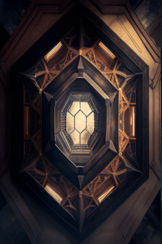维恩箱</a>

<a href="tq_Bp_VolcanicEruption_FireBall.md" style="color:black">灰烬</a>

  
  

  
## 卡牌  

<a href="tq_Nc_BloodMoon_BloodGem.md" style="color:black">血泪</a>

<a href="tq_Nc_BloodMoon_BloodWolf.md" style="color:black">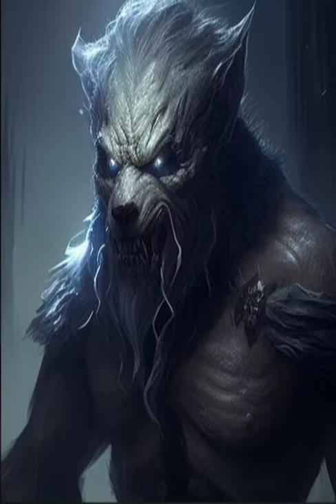血狼</a>

<a href="tq_Nc_BloodMoon_BloodWolf_Blood.md" style="color:black">一滩血迹</a>

<a href="tq_Nc_DeepSeaToOverTheDeepSea.md" style="color:black">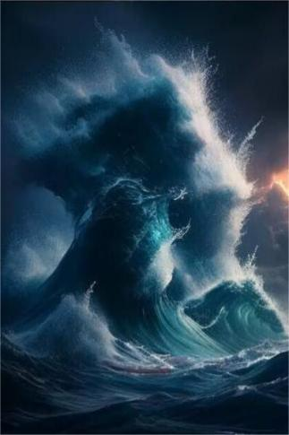海面</a>

<a href="tq_Nc_DeepSea_ScatteredMaterials.md" style="color:black">漂流物资</a>

<a href="tq_Nc_DiasterBeason_Character_Lola_StartMaterials_BandagesSet.md" style="color:black">绷带组合</a>

<a href="tq_Nc_DiasterBeason_Character_Lola_StartMaterials_CannedGoods_Empty.md" style="color:black">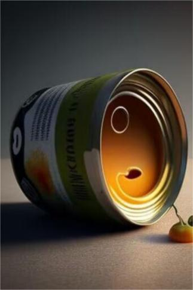空罐头</a>

<a href="tq_Nc_DiasterBeason_Character_Lola_StartMaterials_EmergencyWaterBags.md" style="color:black">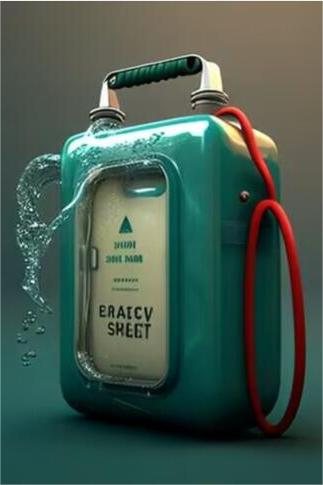应急水袋</a>

<a href="tq_Nc_DiasterBeason_Character_Lola_StartMaterials_Flashlight_Off.md" style="color:black">手电筒（关）</a>

<a href="tq_Nc_DiasterBeason_Character_Lola_StartMaterials_Flashlight_On.md" style="color:black">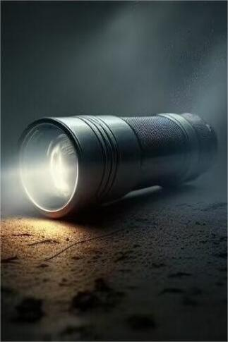手电筒（关）</a>

<a href="tq_Nc_DiasterBeason_Character_Lola_StartMaterials_LifeRaft_TypeFour.md" style="color:black">求生筏</a>

<a href="tq_Nc_DiasterBeason_Character_Lola_StartMaterials_LifeRaft_TypeOne.md" style="color:black">求生筏</a>

<a href="tq_Nc_DiasterBeason_Character_Lola_StartMaterials_LifeRaft_TypeThree.md" style="color:black">求生筏</a>

<a href="tq_Nc_DiasterBeason_Character_Lola_StartMaterials_LifeRaft_TypeTwo.md" style="color:black">求生筏</a>

<a href="tq_Nc_DiasterBeason_Character_Lola_StartMaterials_LighterOff.md" style="color:black">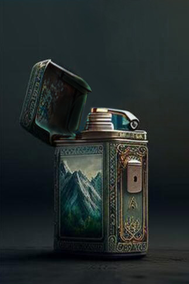打火机（关）</a>

<a href="tq_Nc_DiasterBeason_Character_Lola_StartMaterials_LighterOn.md" style="color:black">打火机（开）</a>

<a href="tq_Nc_DiasterBeason_Character_Lola_StartMaterials_MedicalKit.md" style="color:black">凯蒂</a>

<a href="tq_Nc_DiasterBeason_Character_Lola_StartMaterials_RiceBag.md" style="color:black">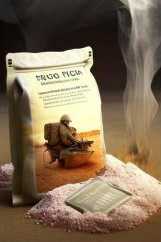远行米包</a>

<a href="tq_Nc_DiasterBeason_Tree.md" style="color:black">Large Tree</a>

<a href="tq_Nc_FlowerSea_TwistedVine_Boss.md" style="color:black">扭曲藤蔓</a>

<a href="tq_Nc_GeeseSouth_ApocalyFeather.md" style="color:black">极光羽</a>

<a href="tq_Nc_GeeseSouth_FeatherPillow.md" style="color:black">羽毛枕</a>

<a href="tq_Nc_GeeseSouth_MissileBird_Feather.md" style="color:black">轻羽</a>

<a href="tq_Nc_GeeseSouth_RainbowFeather.md" style="color:black">Feathers</a>

<a href="tq_Nc_GhostShip_BonePile.md" style="color:black">骨堆</a>

<a href="tq_Nc_GhostShip_BonePile_ProducedBoneMonster.md" style="color:black">骷髅</a>

<a href="tq_Nc_GhostShip_BonePile_ProducedBoneMonster_Explosives.md" style="color:black">炸药</a>

<a href="tq_Nc_GhostShip_CaptainSkeleton.md" style="color:black">船长</a>

<a href="tq_Nc_GhostShip_DeathBones.md" style="color:black">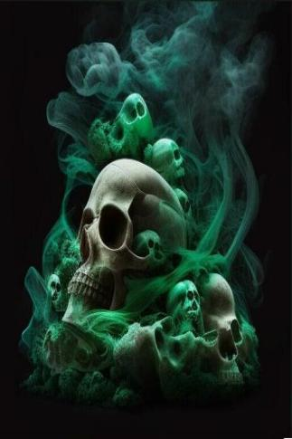死灵骨</a>

<a href="tq_Nc_Hail_DropColdFlower.md" style="color:black">积雪</a>

<a href="tq_Nc_Hail_IceCoolBall_Ice_Location.md" style="color:black">冰晶球</a>

<a href="tq_Nc_Hail_IceCrystals.md" style="color:black">寒晶</a>

<a href="tq_Nc_Hail_IceCrystals_Ice.md" style="color:black">冰晶</a>

<a href="tq_Nc_Hail_IceTree.md" style="color:black">寒树</a>

<a href="tq_Nc_HatCloud_HatCloudUnderSky.md" style="color:black">帽子云</a>

<a href="tq_Nc_Meteor_Imprint_StarDrop_StarFoodBag.md" style="color:black">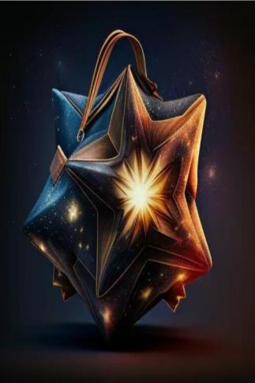星星包</a>

<a href="tq_Nc_Meteor_Imprint_StarDrop_TypeFour.md" style="color:black">陨石</a>

<a href="tq_Nc_Meteor_Imprint_StarDrop_TypeOne.md" style="color:black">陨石</a>

<a href="tq_Nc_Meteor_Imprint_StarDrop_TypeThree.md" style="color:black">陨石</a>

<a href="tq_Nc_Meteor_Imprint_StarDrop_TypeTwo.md" style="color:black">陨石</a>

<a href="tq_Nc_Meteor_Imprint_StarElement.md" style="color:black">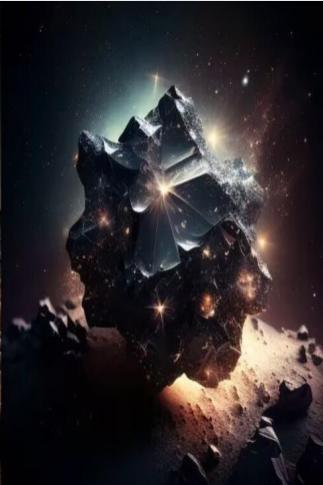星空元素</a>

<a href="tq_Nc_Meteor_Imprint_StarElement_ProduceStar_TypeOne.md" style="color:black">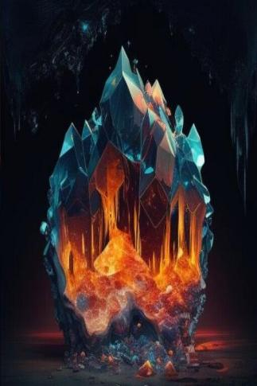星</a>

<a href="tq_Nc_PollenSeason_Flower_RainBowFlower.md" style="color:black">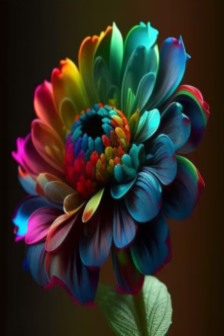彩虹花</a>

<a href="tq_Nc_PollenSeason_Flower_StepOne.md" style="color:black">花苞</a>

<a href="tq_Nc_PollenSeason_Flower_StepTwo_TypeFour.md" style="color:black">水仙花</a>

<a href="tq_Nc_PollenSeason_Flower_StepTwo_TypeFour_Zero.md" style="color:black">水仙花（空）</a>

<a href="tq_Nc_PollenSeason_Flower_StepTwo_TypeOne_Zero.md" style="color:black">太阳花（空）</a>

<a href="tq_Nc_PollenSeason_Flower_StepTwo_TypeThree.md" style="color:black">维恩花</a>

<a href="tq_Nc_PollenSeason_Flower_StepTwo_TypeThree_Zero.md" style="color:black">维恩花（空）</a>

<a href="tq_Nc_PollenSeason_Flower_StepTwo_TypeTwo.md" style="color:black">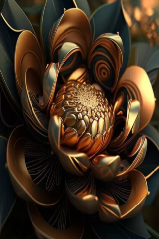黄金花</a>

<a href="tq_Nc_PollenSeason_Flower_StepTwo_TypeTwo_Zero.md" style="color:black">摘完的黄金花</a>

<a href="tq_Nc_PollenSeason_Flower_StepTwp_TypeOne.md" style="color:black">太阳花</a>

<a href="tq_Nc_PollenSeason_Flower_TwistedVine.md" style="color:black">扭曲藤蔓</a>

<a href="tq_Nc_PollenSeason_Flower_Tyrannus.md" style="color:black">奇异植株</a>

<a href="tq_Nc_PollenSeason_Tyrannus_GetHunt_Drop.md" style="color:black">花瓣</a>

<a href="tq_Nc_RainBow_RainBowPoop.md" style="color:black">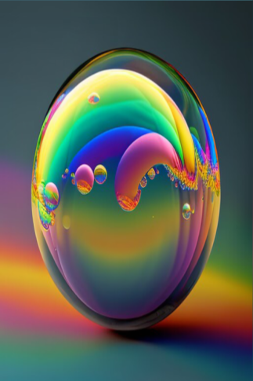彩虹泡泡</a>

<a href="tq_Nc_RainBow_RainBowSuger_Fly.md" style="color:black">莱恩</a>

<a href="tq_Nc_RainBow_RainBowSuger_Fly_GetHunt_Drop.md" style="color:black">翅膀</a>

<a href="tq_Nc_ThunderStorm_BurnTree.md" style="color:black">灰烬树</a>

<a href="tq_Nc_ThunderStorm_Lightning_In_Bottle.md" style="color:black">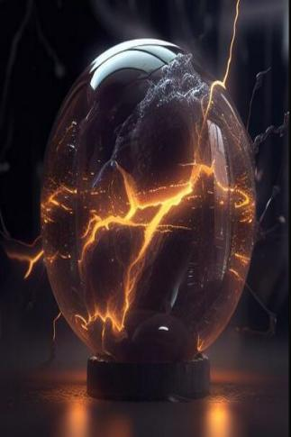瓶中闪电</a>

<a href="tq_Nc_ThunderStorm_Lightning_In_Bottle_StepTwo.md" style="color:black">雷鸣</a>

<a href="tq_Nc_ThunderStorm_ThunderBall.md" style="color:black">球形闪电</a>

<a href="tq_Nc_TornadoShark_DropShip.md" style="color:black">失落之船</a>

<a href="tq_Nc_UnderSea_BigShells.md" style="color:black">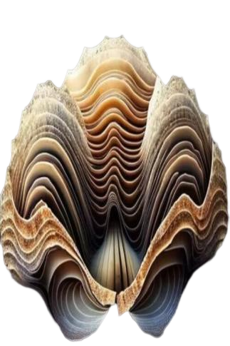海洋贝</a>

<a href="tq_Nc_UnderSea_CoralMeal.md" style="color:black">珊瑚粉</a>

<a href="tq_Nc_UnderSea_Coral_TypeFour.md" style="color:black">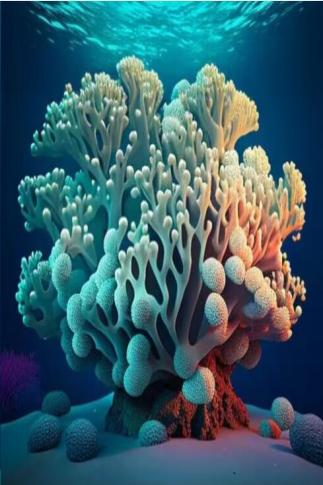珊瑚</a>

<a href="tq_Nc_UnderSea_Coral_TypeOne.md" style="color:black">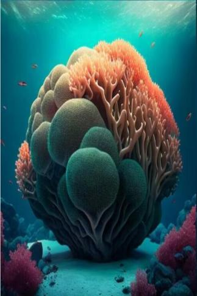珊瑚</a>

<a href="tq_Nc_UnderSea_Coral_TypeThree.md" style="color:black">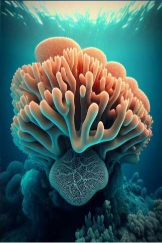珊瑚</a>

<a href="tq_Nc_UnderSea_Coral_TypeTwo.md" style="color:black">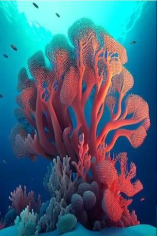珊瑚</a>

<a href="tq_Nc_UnderSea_IceCoolBall_Location.md" style="color:black">冰晶球</a>

<a href="tq_Nc_UnderSea_Kelp.md" style="color:black">海带</a>

<a href="tq_Nc_UnderSea_Kelp_Plasters.md" style="color:black">护肤膏</a>

<a href="tq_Nc_UnderSea_Kelp_Two.md" style="color:black">海带</a>

<a href="tq_Nc_UnderSea_LuminousPearl.md" style="color:black">夜明珠</a>

<a href="tq_Nc_UnderSea_MarineOintment.md" style="color:black">海洋药膏</a>

<a href="tq_Nc_UnderSea_Oyster.md" style="color:black">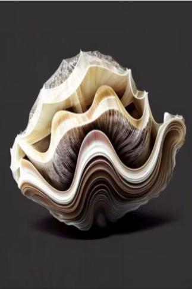贝壳</a>

<a href="tq_Nc_UndersSea_MarineOintment.md" style="color:black">珊瑚粉</a>

<a href="tq_Nc_VineCraft_CryBall.md" style="color:black">水晶球</a>

<a href="tq_Nc_VineCraft_VineBox.md" style="color:black">维恩箱</a>

<a href="tq_Nc_VolcanicEruption_BurnTree.md" style="color:black">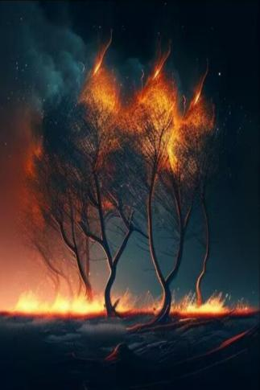灰烬树</a>

<a href="tq_Nc_VolcanicEruption_DeamonRock.md" style="color:black">狱岩</a>

<a href="tq_Nc_VolcanicEruption_Drop_Rock_Cold.md" style="color:black">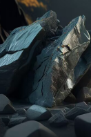巨岩</a>

<a href="tq_Nc_VolcanicEruption_Drop_Rock_Hot.md" style="color:black">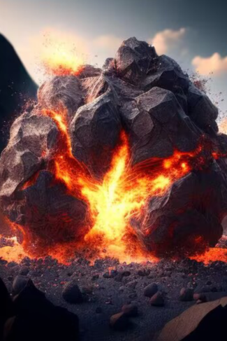巨岩</a>

<a href="tq_Nc_VolcanicEruption_Hot_Spring.md" style="color:black">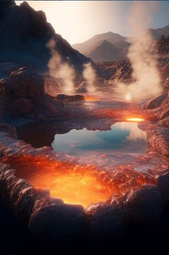温泉</a>

<a href="tq_Nc_VolcanicEruption_Volcanic_Ash.md" style="color:black">火山灰</a>

  
  

  
## 区域  

[
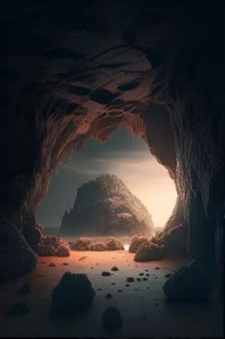
 [废弃矿区](tq_Exp_AbandonedMines.json.md)](tq_Exp_AbandonedMines.json.md)

[

 [深海](tq_Exp_DeepSea.md)](tq_Exp_DeepSea.md)

[
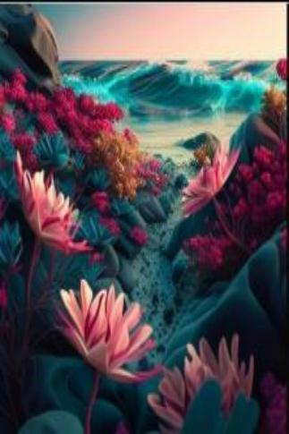
 [花海](tq_Exp_FlowerSea.md)](tq_Exp_FlowerSea.md)

[

 [骷髅船](tq_Exp_GhostShip.json.md)](tq_Exp_GhostShip.json.md)

[

 [飓风海域](tq_Exp_OverTheDeepSea.md)](tq_Exp_OverTheDeepSea.md)

[

 [浅海](tq_Exp_UnderSea.md)](tq_Exp_UnderSea.md)

  
  

  
## 事件  

[

 [他过来了！](tq_Event_BloodMoon_BloodWolf_Attack.md)](tq_Event_BloodMoon_BloodWolf_Attack.md)

[

 [阴影](tq_Event_BloodMoon_BloodWolf_Attack_RetretCounter.md)](tq_Event_BloodMoon_BloodWolf_Attack_RetretCounter.md)

[

 [奋力抗争](tq_Event_BloodMoon_BloodWolf_Confrontation_Tiebreaker.md)](tq_Event_BloodMoon_BloodWolf_Confrontation_Tiebreaker.md)

[

 [争相抗争！](tq_Event_BloodMoon_BloodWolf_Confrontion.md)](tq_Event_BloodMoon_BloodWolf_Confrontion.md)

[

 [奋力抗争](tq_Event_BloodMoon_BloodWolf_Confrontion_Dodge.md)](tq_Event_BloodMoon_BloodWolf_Confrontion_Dodge.md)

[

 [争相抗争！](tq_Event_BloodMoon_BloodWolf_Confrontion_Fail.md)](tq_Event_BloodMoon_BloodWolf_Confrontion_Fail.md)

[

 [攻其不备！](tq_Event_BloodMoon_BloodWolf_Confrontion_Success.md)](tq_Event_BloodMoon_BloodWolf_Confrontion_Success.md)

[

 [啊啊啊啊啊啊啊啊啊啊！](tq_Event_BloodMoon_BloodWolf_Death.md)](tq_Event_BloodMoon_BloodWolf_Death.md)

[

 [彻底癫狂](tq_Event_BloodMoon_BloodWolf_DeathAttack.md)](tq_Event_BloodMoon_BloodWolf_DeathAttack.md)

[

 [雷鸣！](tq_Event_BloodMoon_BloodWolf_HuntByThunderBall.md)](tq_Event_BloodMoon_BloodWolf_HuntByThunderBall.md)

[

 [血脉](tq_Event_BloodMoon_BloodWolf_TransformationFull_Leave.md)](tq_Event_BloodMoon_BloodWolf_TransformationFull_Leave.md)

[

 [飓风](tq_Event_Character_Lola_StartEpisode_Drowning_StepFour.md)](tq_Event_Character_Lola_StartEpisode_Drowning_StepFour.md)

[

 [洋流](tq_Event_Character_Lola_StartEpisode_Drowning_StepFour_DeepSeaAttack.md)](tq_Event_Character_Lola_StartEpisode_Drowning_StepFour_DeepSeaAttack.md)

[

 [飓风](tq_Event_Character_Lola_StartEpisode_Drowning_StepOne.md)](tq_Event_Character_Lola_StartEpisode_Drowning_StepOne.md)

[

 [乱流](tq_Event_Character_Lola_StartEpisode_Drowning_StepThree.md)](tq_Event_Character_Lola_StartEpisode_Drowning_StepThree.md)

[
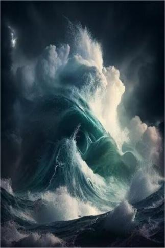
 [乱流](tq_Event_Character_Lola_StartEpisode_Drowning_StepTwo.md)](tq_Event_Character_Lola_StartEpisode_Drowning_StepTwo.md)

[

 [藤蔓破碎](tq_Event_FlowerSea_TwistedVine_Boss_Death.md)](tq_Event_FlowerSea_TwistedVine_Boss_Death.md)

[

 [背影](tq_Event_FlowerSea_TwistedVine_Boss_Death_Gril.md)](tq_Event_FlowerSea_TwistedVine_Boss_Death_Gril.md)

[

 [梦境](tq_Event_FlowerSea_TwistedVine_Boss_Death_Gril_Leave.md)](tq_Event_FlowerSea_TwistedVine_Boss_Death_Gril_Leave.md)

[

 [梦境](tq_Event_FlowerSea_TwistedVine_Boss_Death_Gril_Leave_Flower.md)](tq_Event_FlowerSea_TwistedVine_Boss_Death_Gril_Leave_Flower.md)

[
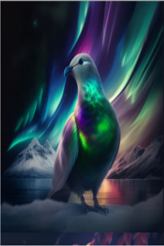
 [华彩](tq_Event_GeeseSouth_ApocalyBirdCounter.md)](tq_Event_GeeseSouth_ApocalyBirdCounter.md)

[

 [华彩](tq_Event_GeeseSouth_ApocalyBirdCounter_Eat_FlyAway.md)](tq_Event_GeeseSouth_ApocalyBirdCounter_Eat_FlyAway.md)

[

 [华彩](tq_Event_GeeseSouth_ApocalyBirdCounter_FlyAway.md)](tq_Event_GeeseSouth_ApocalyBirdCounter_FlyAway.md)

[

 [华彩](tq_Event_GeeseSouth_ApocalypseBird.md)](tq_Event_GeeseSouth_ApocalypseBird.md)

[
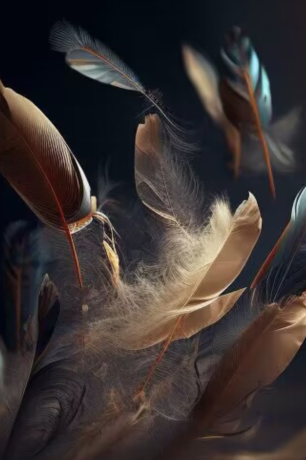
 [什么！](tq_Event_GeeseSouth_Feather_Drops.md)](tq_Event_GeeseSouth_Feather_Drops.md)

[

 [奇事](tq_Event_GeeseSouth_MissileBird.md)](tq_Event_GeeseSouth_MissileBird.md)

[

 [导弹冲击！](tq_Event_GeeseSouth_MissileBird_Attack.md)](tq_Event_GeeseSouth_MissileBird_Attack.md)

[

 [导弹冲击！](tq_Event_GeeseSouth_MissileBird_Attack_Fail.md)](tq_Event_GeeseSouth_MissileBird_Attack_Fail.md)

[

 [什么！](tq_Event_GeeseSouth_MissileBird_Attack_Success.md)](tq_Event_GeeseSouth_MissileBird_Attack_Success.md)

[

 [什么！](tq_Event_GeeseSouth_MissileBird_JumpOut.md)](tq_Event_GeeseSouth_MissileBird_JumpOut.md)

[

 [海鸥迁徙](tq_Event_GeeseSouth_PoopDrop.md)](tq_Event_GeeseSouth_PoopDrop.md)

[

 [海鸥！](tq_Event_GeeseSouth_TakeFood.md)](tq_Event_GeeseSouth_TakeFood.md)

[

 [什么！](tq_Event_GeeseSouth_VelvetBird.md)](tq_Event_GeeseSouth_VelvetBird.md)

[

 [那是什么！](tq_Event_GhostShip_BoneNeck_Tp.md)](tq_Event_GhostShip_BoneNeck_Tp.md)

[

 [亡者呐喊](tq_Event_GhostShip_BonePile_ProducedBoneMonster_Attack.md)](tq_Event_GhostShip_BonePile_ProducedBoneMonster_Attack.md)

[

 [对抗！](tq_Event_GhostShip_BonePile_ProducedBoneMonster_Confrontion.md)](tq_Event_GhostShip_BonePile_ProducedBoneMonster_Confrontion.md)

[

 [争相抗争！](tq_Event_GhostShip_BonePile_ProducedBoneMonster_Confrontion_Fail.md)](tq_Event_GhostShip_BonePile_ProducedBoneMonster_Confrontion_Fail.md)

[

 [攻其不备！](tq_Event_GhostShip_BonePile_ProducedBoneMonster_Confrontion_Success.md)](tq_Event_GhostShip_BonePile_ProducedBoneMonster_Confrontion_Success.md)

[

 [奋力抗争](tq_Event_GhostShip_BonePile_ProducedBoneMonster_Confrontion_Tiebreaker.md)](tq_Event_GhostShip_BonePile_ProducedBoneMonster_Confrontion_Tiebreaker.md)

[

 [巨响](tq_Event_GhostShip_BonePile_ProducedBoneMonster_ExplosivesBoom.md)](tq_Event_GhostShip_BonePile_ProducedBoneMonster_ExplosivesBoom.md)

[

 [电流激荡](tq_Event_GhostShip_BonePile_ProducedBoneMonster_ThunderBoom.md)](tq_Event_GhostShip_BonePile_ProducedBoneMonster_ThunderBoom.md)

[

 [雪花](tq_Event_Hail_Avalanche.md)](tq_Event_Hail_Avalanche.md)

[
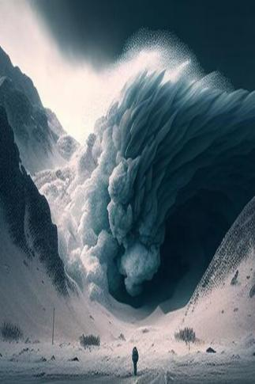
 [雪崩来袭！](tq_Event_Hail_Avalanche_DestoryItem.md)](tq_Event_Hail_Avalanche_DestoryItem.md)

[

 [命运](tq_Event_Hail_Avalanche_DestoryItem_Fail.md)](tq_Event_Hail_Avalanche_DestoryItem_Fail.md)

[

 [寒风](tq_Event_Hail_CoolFlowerWind.md)](tq_Event_Hail_CoolFlowerWind.md)

[

 [冰球来袭！](tq_Event_Hail_IceDrop.md)](tq_Event_Hail_IceDrop.md)

[

 [帽子云](tq_Event_HatCloud_HatClouDrop.md)](tq_Event_HatCloud_HatClouDrop.md)

[

 [云朵](tq_Event_HatCloud_TranformToGreen.md)](tq_Event_HatCloud_TranformToGreen.md)

[

 [云朵](tq_Event_HatCloud_TranformToRain.md)](tq_Event_HatCloud_TranformToRain.md)

[

 [什么！](tq_Event_Imprint_StarDrop_TypeOne_Boom.md)](tq_Event_Imprint_StarDrop_TypeOne_Boom.md)

[

 [流星雨！](tq_Event_Meteor_Shower.md)](tq_Event_Meteor_Shower.md)

[

 [流星](tq_Event_Meteor_Shower_StarDrop_One.md)](tq_Event_Meteor_Shower_StarDrop_One.md)

[

 [奇异植株](tq_Event_PollenSeason_Flower_Tyrannus_DropFruit.md)](tq_Event_PollenSeason_Flower_Tyrannus_DropFruit.md)

[

 [森林移动](tq_Event_PollenSeason_TwistedVineAttack.md)](tq_Event_PollenSeason_TwistedVineAttack.md)

[

 [剧烈燃烧](tq_Event_PollenSeason_TwistedVine_BurnDeath.md)](tq_Event_PollenSeason_TwistedVine_BurnDeath.md)

[

 [剧烈燃烧](tq_Event_PollenSeason_Tyrannus_BurnDeath.md)](tq_Event_PollenSeason_Tyrannus_BurnDeath.md)

[

 [摘花](tq_Event_PollenSeason_Tyrannus_GetHunt.md)](tq_Event_PollenSeason_Tyrannus_GetHunt.md)

[

 [奇事](tq_Event_PollenSeason_Tyrannus_StealItem.md)](tq_Event_PollenSeason_Tyrannus_StealItem.md)

[

 [奇异植物](tq_Event_PollenSeason_Tyrannus_StealSuccess.md)](tq_Event_PollenSeason_Tyrannus_StealSuccess.md)

[

 [微风](tq_Event_PollenSeason_WindAttack.md)](tq_Event_PollenSeason_WindAttack.md)

[

 [彩虹泡泡](tq_Event_RainBow_RainBowPoop_Boom.md)](tq_Event_RainBow_RainBowPoop_Boom.md)

[
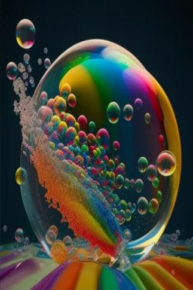
 [彩虹](tq_Event_RainBow_RainBowPoop_Boom_RainBow.md)](tq_Event_RainBow_RainBowPoop_Boom_RainBow.md)

[
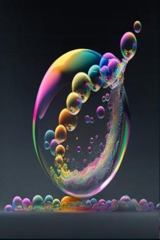
 [彩虹泡泡](tq_Event_RainBow_RainBowPoop_Bubble_One.md)](tq_Event_RainBow_RainBowPoop_Bubble_One.md)

[
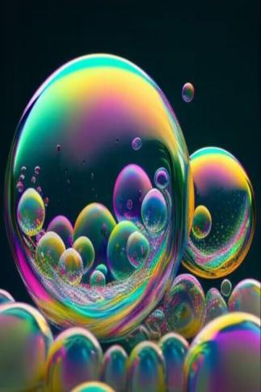
 [彩虹泡泡](tq_Event_RainBow_RainBowPoop_Bubble_Three.md)](tq_Event_RainBow_RainBowPoop_Bubble_Three.md)

[

 [彩虹泡泡](tq_Event_RainBow_RainBowPoop_Bubble_Two.md)](tq_Event_RainBow_RainBowPoop_Bubble_Two.md)

[

 [什么！](tq_Event_RainBow_RainBowSuger_Fly_Attack.md)](tq_Event_RainBow_RainBowSuger_Fly_Attack.md)

[

 [坠机](tq_Event_RainBow_RainBowSuger_Fly_DropDeath.md)](tq_Event_RainBow_RainBowSuger_Fly_DropDeath.md)

[

 [莱恩](tq_Event_RainBow_RainBowSuger_Fly_GetHunt.md)](tq_Event_RainBow_RainBowSuger_Fly_GetHunt.md)

[

 [莱恩](tq_Event_RainBow_RainBowSuger_Fly_Leave.md)](tq_Event_RainBow_RainBowSuger_Fly_Leave.md)

[

 [莱恩](tq_Event_RainBow_RainBowSuger_Fly_Steal.md)](tq_Event_RainBow_RainBowSuger_Fly_Steal.md)

[

 [那是什么！](tq_Event_RainBow_Suger.md)](tq_Event_RainBow_Suger.md)

[

 [轰隆隆！](tq_Event_ThunderBall.md)](tq_Event_ThunderBall.md)

[

 [雷云滚滚](tq_Event_ThunderStorm.md)](tq_Event_ThunderStorm.md)

[
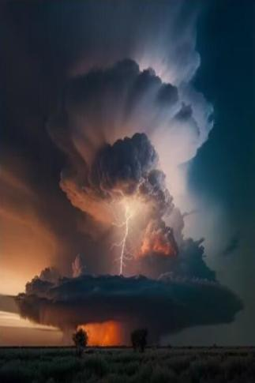
 [轰隆隆！](tq_Event_ThunderStorm_Animals.md)](tq_Event_ThunderStorm_Animals.md)

[

 [轰隆隆！](tq_Event_ThunderStorm_Animals_Attack.md)](tq_Event_ThunderStorm_Animals_Attack.md)

[

 [雷云滚滚](tq_Event_ThunderStorm_StormAttackHuman.md)](tq_Event_ThunderStorm_StormAttackHuman.md)

[

 [轰隆隆！](tq_Event_ThunderStorm_ThunderBall_AnimalsBoom.md)](tq_Event_ThunderStorm_ThunderBall_AnimalsBoom.md)

[

 [什么！](tq_Event_ThunderStorm_ThunderBall_Boom.md)](tq_Event_ThunderStorm_ThunderBall_Boom.md)

[

 [轰隆隆！](tq_Event_ThunderStorm_ThunderBall_Paralysis.md)](tq_Event_ThunderStorm_ThunderBall_Paralysis.md)

[

 [什么！](tq_Event_Thunder_LightInBottle_StepTwo_Boom.md)](tq_Event_Thunder_LightInBottle_StepTwo_Boom.md)

[

 [轰隆隆！](tq_Event_Thunder_NearHuman.md)](tq_Event_Thunder_NearHuman.md)

[

 [有些不对劲..](tq_Event_ToradosShark_NearBy.md)](tq_Event_ToradosShark_NearBy.md)

[
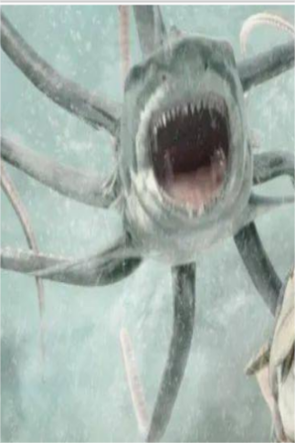
 [飞鲨来袭！](tq_Event_TornadoShark.md)](tq_Event_TornadoShark.md)

[

 [飓风离去](tq_Event_TornadoShark_Leave.md)](tq_Event_TornadoShark_Leave.md)

[

 [引力](tq_Event_TornadoShark_SharkAttack_Protect_WeightBall.md)](tq_Event_TornadoShark_SharkAttack_Protect_WeightBall.md)

[

 [飓风来袭！](tq_Event_TornadoShark_TornadoAttack.md)](tq_Event_TornadoShark_TornadoAttack.md)

[

 [狂风](tq_Event_TornadoShark_TornadoTp.md)](tq_Event_TornadoShark_TornadoTp.md)

[

 [什么！](tq_Event_UnderSea_BigShell_Attack.md)](tq_Event_UnderSea_BigShell_Attack.md)

[

 [海洋贝](tq_Event_UnderSea_BigShell_HungerFull.md)](tq_Event_UnderSea_BigShell_HungerFull.md)

[

 [流动](tq_Event_UnderSea_FishCounter.md)](tq_Event_UnderSea_FishCounter.md)

[

 [海带](tq_Event_UnderSea_Kelp_Winding.md)](tq_Event_UnderSea_Kelp_Winding.md)

[

 [轰隆隆！](tq_Event_VolcanicEruptions_BurnTree.md)](tq_Event_VolcanicEruptions_BurnTree.md)

[

 [轰隆隆！](tq_Event_VolcanicEruptions_HotSpringSpear.md)](tq_Event_VolcanicEruptions_HotSpringSpear.md)

[

 [轰隆隆！](tq_Event_VolcanicEruptions_RockDrop.md)](tq_Event_VolcanicEruptions_RockDrop.md)

[

 [轰隆隆！](tq_Event_VolcanicEruptions_RockDrop_Dodge_Failure.md)](tq_Event_VolcanicEruptions_RockDrop_Dodge_Failure.md)

[

 [蒸汽冲击](tq_Event_VolcanicEruptions_Rolling_Smoke.md)](tq_Event_VolcanicEruptions_Rolling_Smoke.md)

[

 [轰隆隆！](tq_Event_Volcanic_Eruptions_Animals_Die.md)](tq_Event_Volcanic_Eruptions_Animals_Die.md)

[

 [轰隆隆！](tq_Event_Volcanic_Eruptions_Animals_Drop.md)](tq_Event_Volcanic_Eruptions_Animals_Drop.md)

[

 [星辰消散](tq_Nc_Meteor_Imprint_Drugs_Drugs.md)](tq_Nc_Meteor_Imprint_Drugs_Drugs.md)

[

 [星辰消散](tq_Nc_Meteor_Imprint_Food_Food.md)](tq_Nc_Meteor_Imprint_Food_Food.md)

[

 [星辰消散](tq_Nc_Meteor_Imprint_Pray_Pray.md)](tq_Nc_Meteor_Imprint_Pray_Pray.md)

[

 [星辰消散](tq_Nc_Meteor_Imprint_Rain_Rain.md)](tq_Nc_Meteor_Imprint_Rain_Rain.md)

  
  

  
## 天气  

[

 [血月](tq_Wather_BloodMoon.md)](tq_Wather_BloodMoon.md)

[

 [大雁南飞](tq_Wather_GeeseSouth.md)](tq_Wather_GeeseSouth.md)

[

 [暴风雪](tq_Wather_Hail.md)](tq_Wather_Hail.md)

[

 [流星雨](tq_Wather_Meteor_Shower.md)](tq_Wather_Meteor_Shower.md)

[

 [花粉季](tq_Wather_PollenSeason.md)](tq_Wather_PollenSeason.md)

[

 [彩虹](tq_Wather_Rainbow.md)](tq_Wather_Rainbow.md)

[

 [帽子云](tq_Wather_Small_HatCloud.md)](tq_Wather_Small_HatCloud.md)

[

 [Storm](tq_Wather_StromRain.md)](tq_Wather_StromRain.md)

[

 [雷暴](tq_Wather_Thunderstorm.md)](tq_Wather_Thunderstorm.md)

[

 [鲨龙卷](tq_Wather_TornadoShark.md)](tq_Wather_TornadoShark.md)

[

 [火山爆发](tq_Wather_VolcanicEruptions.md)](tq_Wather_VolcanicEruptions.md)

  
  

  
## 受伤  

<a href="tq_W_BloodMoon_BloodWolf_Bite_Three.md" style="color:black">死亡撕裂</a>

<a href="tq_W_BloodMoon_BloodWolf_Bite_Three_Stitching.md" style="color:black">已缝合的死亡撕裂</a>

<a href="tq_W_BloodWolfAttack.md" style="color:black">狼人咬伤</a>

<a href="tq_W_BloodWolfBite.md" style="color:black">狼人咬伤</a>

<a href="tq_W_BloodWolfViur.md" style="color:black">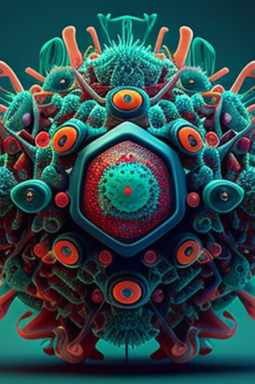未知病毒</a>

<a href="tq_W_BloodWolfViur_StepThree.md" style="color:black">狼人血统</a>

<a href="tq_W_BloodWolfViur_StepTwo.md" style="color:black">未知病毒</a>

<a href="tq_W_BloodWolf_Bite_Two.md" style="color:black">狼人刺伤</a>

<a href="tq_W_GeeseSouth_MissleBird_Bite.md" style="color:black">导弹撞击</a>

<a href="tq_W_GhostShip_BonePile_ProducedBoneMonster_Attack.md" style="color:black">死亡印记</a>

<a href="tq_W_GhostShip_BonePile_ProducedBoneMonster_Attack_Two.md" style="color:black">骷髅刺伤</a>

<a href="tq_W_Hail_IceCoolWind.md" style="color:black">寒风冻伤</a>

<a href="tq_W_Hail_IceDrop.md" style="color:black">冰雹砸伤</a>

<a href="tq_W_PollenSeason_TwistedVineBite.md" style="color:black">丛林印记</a>

<a href="tq_W_PollenSeason_TwistedVine_StepTwo.md" style="color:black">藤蔓刺伤</a>

<a href="tq_W_RainBow_RainBowPoop_Boom.md" style="color:black">彩虹印记</a>

<a href="tq_W_ThunderStorm_StormAttackHuman.md" style="color:black">雷暴劈伤</a>

<a href="tq_W_ThunderStorm_ThunderBall_Paralyis.md" style="color:black">电流麻痹</a>

<a href="tq_W_TyrannusHunt.md" style="color:black">花朵咬伤</a>

<a href="tq_W_UnderSea_BigShells_Attack.md" style="color:black">贝壳夹伤</a>

<a href="tq_W_UnderSea_BigShells_Two.md" style="color:black">贝壳毒素</a>

<a href="tq_W_VolcanicEruptions_AnimalsDrop.md" style="color:black">动物砸伤</a>

<a href="tq_W_VolcanicEruptions_RockDrop.md" style="color:black">落石撞伤</a>

  
  

  
## 特质  

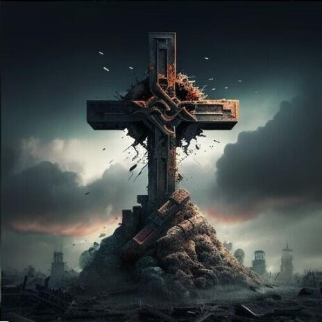
[天启](tq_DiasterBaeconsPerk.md)

[旅途](tq_DiasterBeason_LolaStart.md)

  
  
  
## 状态  

[

[肺部损伤](tq_Gs_DisasterBeason_LungDamage.md)](tq_Gs_DisasterBeason_LungDamage.md)

[

[局部烧伤](tq_Gs_DisasterBeason_Burns.md)](tq_Gs_DisasterBeason_Burns.md)

[

[血狼化](tq_Gs_BloodMoon_BloodWolfTransformation.md)](tq_Gs_BloodMoon_BloodWolfTransformation.md)

[Gs_Character_Lola_OpeningEpisode_Exhaustion](tq_Gs_Character_Lola_OpeningEpisode_Exhaustion.md)

[Gs_Character_Lola_OpeningEpisode_Exhaustion](tq_Gs_Character_Lola_OpeningEpisode_RovingCounter.md)

[Gs_CloudHat_CloudChangeCounter](tq_Gs_CloudHat_CloudChangeCounter.md)

[Gs_CloudHat_CloudChangeCounter_ToGreen](tq_Gs_CloudHat_CloudChangeCounter_ToGreen.md)

[DiasterBeasonsPresence](tq_Gs_DisasterBeasons_DiasterPresenceCounter.md)

[Travel Modifier](tq_Gs_DisasterBeasons_Modify_TravelAction.md)

[

[黄金果](tq_Gs_DisasterBeasons_NutrientAbsorption.md)](tq_Gs_DisasterBeasons_NutrientAbsorption.md)

[Lola_DeepSea_EventStartCounter](tq_Gs_DisasterBeason_Character_Lola_DeepSeaEventStartCounter.md)

[Gs_DisasterBeason_StrongTransportation_Level_One_RetreCounter](tq_Gs_DisasterBeason_StrongTransportation_Level_One.md)

[

[凋亡损伤](tq_Gs_GhostShip_Necromanticization.md)](tq_Gs_GhostShip_Necromanticization.md)

[

[冰爽](tq_Gs_Hail_IceCool.md)](tq_Gs_Hail_IceCool.md)

[

[水仙素](tq_Gs_PollenSeason_DaffodilsFlower_Fruit.md)](tq_Gs_PollenSeason_DaffodilsFlower_Fruit.md)

[
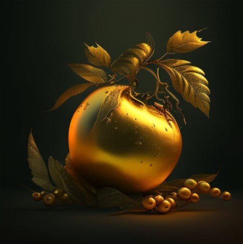
[黄金果](tq_Gs_PollenSeason_GoldFruit.md)](tq_Gs_PollenSeason_GoldFruit.md)

[

[红晶素](tq_Gs_PollenSeason_Tyrannus_Fruit.md)](tq_Gs_PollenSeason_Tyrannus_Fruit.md)

[

[莱恩](tq_Gs_RainBow_RainBowShoes.md)](tq_Gs_RainBow_RainBowShoes.md)

[

[海洋润肤](tq_Gs_UnderSea_Kelp_Plasters.md)](tq_Gs_UnderSea_Kelp_Plasters.md)

[

[缺氧程度](tq_Gs_UnderSea_Oxygen.md)](tq_Gs_UnderSea_Oxygen.md)

[BloodWolf_RetreCounter](tq_Sta_BloodMoon_BloodWolf_RetreCounter.md)

[Death](tq_Sta_GhostShip_ProducedBoneMonster_RetreatCounter.md)

  
  
  
  
  

