# 物品  
## 食物  
   |     |     |     
 :----:    |   :----:    |   :----:    |   :----:    
[ [参薯酱](YamJam.md)](YamJam.md)  |  [ [参薯咖喱](YamCurry.md)](YamCurry.md)  |  [ [巢脾](BeeHoneycomb.md)](BeeHoneycomb.md)  |  [ [炒菇球](FriedPuffballs.md)](FriedPuffballs.md)  
[ [蛋白棒](ProteinBar.md)](ProteinBar.md)  |  [ [蛋炒饭](EggFriedRice.md)](EggFriedRice.md)  |  [ [炖羊汤](GoatStew.md)](GoatStew.md)  |  [ [蜂蜜西米饼](SagoFlatbreadHoney.md)](SagoFlatbreadHoney.md)  
[ [骨头汤](BoneBroth.md)](BoneBroth.md)  |  [ [果酱西米饼](SagoFlatbreadJam.md)](SagoFlatbreadJam.md)  |  [ [黄油焗牡蛎](ButterBakedOystersCooked.md)](ButterBakedOystersCooked.md)  |  [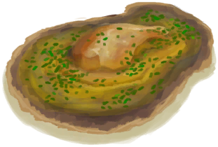 [黄油焗牡蛎](OysterMeatBaked.md)](OysterMeatBaked.md)  
[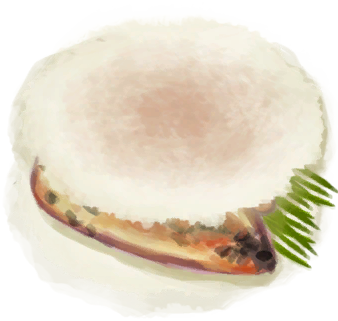 [鸡肉三明治](ChickenSandwich.md)](ChickenSandwich.md)  |  [ [姜糖](CandiedGinger.md)](CandiedGinger.md)  |  [ [巨蜥肉干](MonitorMeatDried.md)](MonitorMeatDried.md)  |  [ [咖啡果](CoffeeBerries.md)](CoffeeBerries.md)  
[ [烤北梭鱼](BonefishCooked.md)](BonefishCooked.md)  |  [ [烤蝙蝠](BatCooked.md)](BatCooked.md)  |  [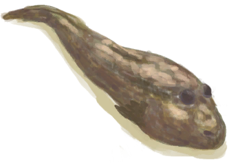 [烤弹涂鱼](MudskipperCooked.md)](MudskipperCooked.md)  |  [ [烤蛋](EggCooked.md)](EggCooked.md)  
[ [烤绯鲤](GoatfishCooked.md)](GoatfishCooked.md)  |  [ [烤鲱鱼](HerringCooked.md)](HerringCooked.md)  |  [ [烤海胆](UrchinMeatCooked.md)](UrchinMeatCooked.md)  |  [ [烤海怪肉](SeahoundCooked.md)](SeahoundCooked.md)  
[ [烤海螺肉](ConchMeatCooked.md)](ConchMeatCooked.md)  |  [ [烤巨蜥肉](MonitorMeatCooked.md)](MonitorMeatCooked.md)  |  [ [烤老鼠](MouseCooked.md)](MouseCooked.md)  |  [ [烤马鲅鱼](ThreadfinCooked.md)](ThreadfinCooked.md)  
[ [烤猕猴肉](MacaqueMeatCooked.md)](MacaqueMeatCooked.md)  |  [ [烤牡蛎肉](OysterMeatCooked.md)](OysterMeatCooked.md)  |  [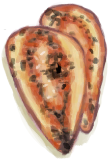 [烤鸟肉](BirdMeatCooked.md)](BirdMeatCooked.md)  |  [ [烤螃蟹](CrabCooked.md)](CrabCooked.md)  
[ [烤热带杏仁](TropicalAlmondsRoasted.md)](TropicalAlmondsRoasted.md)  |  [ [烤鲨鱼肉](SharkCooked.md)](SharkCooked.md)  |  [ [烤蛇肉](SnakeCooked.md)](SnakeCooked.md)  |  [ [烤石斑鱼](GrouperMeatCooked.md)](GrouperMeatCooked.md)  
[ [烤蜥蜴](LizardCooked.md)](LizardCooked.md)  |  [ [烤虾](PrawnsCooked.md)](PrawnsCooked.md)  |  [ [烤羊肉](GoatMeatCooked.md)](GoatMeatCooked.md)  |  [ [烤椰肉](CoconutMeatCooked.md)](CoconutMeatCooked.md)  
[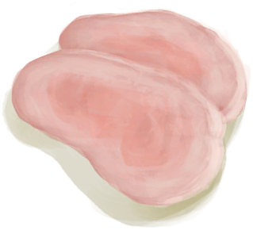 [烤野猪肉](BoarMeatCooked.md)](BoarMeatCooked.md)  |  [ [烤鹦哥鱼](ParrotFishCooked.md)](ParrotFishCooked.md)  |  [ [辣炒巨蜥肉](LizardFry.md)](LizardFry.md)  |  [ [辣椒](Chilies.md)](Chilies.md)  
[ [马勃菌](Puffballs.md)](Puffballs.md)  |  [ [芒果](Mango.md)](Mango.md)  |  [ [猕猴肉串](MacaqueSkewers.md)](MacaqueSkewers.md)  |  [ [猕猴肉干](MacaqueMeatDried.md)](MacaqueMeatDried.md)  
[ [米饭](RiceCooked.md)](RiceCooked.md)  |  [ [蜜糖](HoneyCandy.md)](HoneyCandy.md)  |  [ [蜜汁火腿](HoneyGlazedPork.md)](HoneyGlazedPork.md)  |  [ [巧克力](Chocolate.md)](Chocolate.md)  
[ [热带烤鸡](IslandChicken.md)](IslandChicken.md)  |  [ [热带杏仁核](TropicalAlmondKernels.md)](TropicalAlmondKernels.md)  |  [ [肉食盛宴](HeartyFeast.md)](HeartyFeast.md)  |  [ [山羊奶酪](Cheese.md)](Cheese.md)  
[ [寿司](Sushi.md)](Sushi.md)  |  [ [水椰籽](NipaSeeds.md)](NipaSeeds.md)  |  [ [水煮蛋](EggBoiled.md)](EggBoiled.md)  |  [ [松软的烤海螺肉](ConchMeatSoftCooked.md)](ConchMeatSoftCooked.md)  
[ [外星结节](AlienNodule.md)](AlienNodule.md)  |  [ [西米饼](SagoFlatbread.md)](SagoFlatbread.md)  |  [ [西米蛋糕](SagoCake.md)](SagoCake.md)  |  [ [西米糕](SagoSlime.md)](SagoSlime.md)  
[ [咸鱼](FishSalted.md)](FishSalted.md)  |  [ [香蕉](Banana.md)](Banana.md)  |  [ [压缩干粮](FoodRation.md)](FoodRation.md)  |  [ [烟熏北梭鱼](BonefishSmoked.md)](BonefishSmoked.md)  
[ [烟熏绯鲤](GoatfishSmoked.md)](GoatfishSmoked.md)  |  [ [烟熏鲱鱼](HerringSmoked.md)](HerringSmoked.md)  |  [ [烟熏巨蜥肉](MonitorMeatSmoked.md)](MonitorMeatSmoked.md)  |  [ [烟熏马鲅鱼](ThreadfinSmoked.md)](ThreadfinSmoked.md)  
[ [烟熏猕猴肉](MacaqueMeatSmoked.md)](MacaqueMeatSmoked.md)  |  [ [烟熏鸟肉](BirdMeatSmoked.md)](BirdMeatSmoked.md)  |  [ [烟熏鲨鱼肉](SharkSmoked.md)](SharkSmoked.md)  |  [ [烟熏石斑鱼](GrouperMeatSmoked.md)](GrouperMeatSmoked.md)  
[ [烟熏羊肉](GoatMeatSmoked.md)](GoatMeatSmoked.md)  |  [ [烟熏野猪肉](BoarMeatSmoked.md)](BoarMeatSmoked.md)  |  [ [烟熏鹦哥鱼](ParrotFishSmoked.md)](ParrotFishSmoked.md)  |  [ [腌巨蜥肉](MonitorMeatSalted.md)](MonitorMeatSalted.md)  
[ [腌猕猴肉](MacaqueMeatSalted.md)](MacaqueMeatSalted.md)  |  [ [腌羊肉](GoatMeatSalted.md)](GoatMeatSalted.md)  |  [ [腌野猪肉](BoarMeatSalted.md)](BoarMeatSalted.md)  |  [ [腌制中的野猪肉](BoarMeatSaltedDrying.md)](BoarMeatSaltedDrying.md)  
[ [羊肉干](GoatMeatDried.md)](GoatMeatDried.md)  |  [ [椰肉](CoconutMeat.md)](CoconutMeat.md)  |  [ [椰子鱼](CoconutFish.md)](CoconutFish.md)  |  [ [野枣](JujubeFruits.md)](JujubeFruits.md)  
[ [野猪肉干](BoarMeatDried.md)](BoarMeatDried.md)  |  [ [鱼干](FishDried.md)](FishDried.md)  |  [ [鱼肉蛋饼](FishOmelette.md)](FishOmelette.md)  |  [ [鱼肉塔可](FishTaco.md)](FishTaco.md)  
[ [炸香蕉](FriedBanana.md)](FriedBanana.md)  |  [ [炸鱼薯条](FishNChips.md)](FishNChips.md)  |  [ [煮熟的参薯](YamBoiled.md)](YamBoiled.md)  |  [ [醉蟹](DrunkenCrab.md)](DrunkenCrab.md)  
  
## 工具  
   |     |     |     
 :----:    |   :----:    |   :----:    |   :----:    
[ [安全刀](SafetyKnife.md)](SafetyKnife.md)  |  [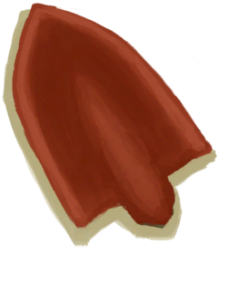 [铲子头](ShovelHead.md)](ShovelHead.md)  |  [ [大石块](StoneHeavy.md)](StoneHeavy.md)  |  [ [钝刀](KnifeCopperBlunt.md)](KnifeCopperBlunt.md)  
[ [钝刀](KnifeMilitaryBlunt.md)](KnifeMilitaryBlunt.md)  |  [ [钝的求生斧](AxeSurvivalBlunt.md)](AxeSurvivalBlunt.md)  |  [ [钝斧子头](AxeHeadBlunt.md)](AxeHeadBlunt.md)  |  [ [钝矛头](SpearHeadBlunt.md)](SpearHeadBlunt.md)  
[ [废金属铲](ShovelScrap.md)](ShovelScrap.md)  |  [ [废金属刀](KnifeScrap.md)](KnifeScrap.md)  |  [ [废金属斧](AxeScrap.md)](AxeScrap.md)  |  [ [斧子头](AxeHead.md)](AxeHead.md)  
[ [骨刀](KnifeBone.md)](KnifeBone.md)  |  [ [黑曜石刀](KnifeObsidian.md)](KnifeObsidian.md)  |  [ [晶洞](Geode.md)](Geode.md)  |  [ [军刀](KnifeMilitary.md)](KnifeMilitary.md)  
[ [硫磺石](StoneHeavyBrimstone.md)](StoneHeavyBrimstone.md)  |  [ [矛头](SpearHead.md)](SpearHead.md)  |  [ [牡蛎](Oyster.md)](Oyster.md)  |  [ [木铲](ShovelWooden.md)](ShovelWooden.md)  
[ [求生斧](AxeSurvival.md)](AxeSurvival.md)  |  [ [石刀](StoneSharpened.md)](StoneSharpened.md)  |  [ [石斧](StoneAxe.md)](StoneAxe.md)  |  [ [石头](Stone.md)](Stone.md)  
[ [燧石](Flint.md)](Flint.md)  |  [ [燧石板](FlintSlab.md)](FlintSlab.md)  |  [ [燧石刀](KnifeFlint.md)](KnifeFlint.md)  |  [ [燧石斧](AxeFlint.md)](AxeFlint.md)  
[ [铜铲](ShovelCopper.md)](ShovelCopper.md)  |  [ [铜刀](KnifeCopper.md)](KnifeCopper.md)  |  [ [铜斧](AxeCopper.md)](AxeCopper.md)  |  [ [仪式匕首](CeremonialDagger.md)](CeremonialDagger.md)  
[ [祖父的刀](KnifeGrandpa.md)](KnifeGrandpa.md)  |  [ [祖父的钝刀](KnifeGrandpaBlunt.md)](KnifeGrandpaBlunt.md)  |    |    
  
## 装备  
   |     |     |     
 :----:    |   :----:    |   :----:    |   :----:    
[ [绑手带](HandWrappings.md)](HandWrappings.md)  |  [ [包脚布](FootWrappings.md)](FootWrappings.md)  |  [ [贝壳项链](SeashellNecklace.md)](SeashellNecklace.md)  |  [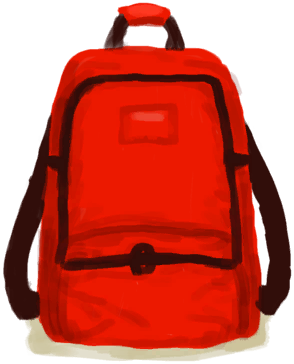 [背包](BackpackTourist.md)](BackpackTourist.md)  
[ [背篓](BackpackBasket.md)](BackpackBasket.md)  |  [布制裤子](PantsCloth.md)  |  [ [草木灰敷料](AshDressing.md)](AshDressing.md)  |  [ [草裙](LeafSKirt.md)](LeafSKirt.md)  
[ [衬衫](ShirtFiber.md)](ShirtFiber.md)  |  [ [短裤](Shorts.md)](Shorts.md)  |  [ [盾牌](Shield.md)](Shield.md)  |  [ [防毒面具](GasMaskRustic.md)](GasMaskRustic.md)  
[ [防蜂服](BeeSuit.md)](BeeSuit.md)  |  [ [废金属长矛](SpearScrap.md)](SpearScrap.md)  |  [ [风箱](Bellows.md)](Bellows.md)  |  [ [海鸥护符](SeagullCharm.md)](SeagullCharm.md)  
[ [黑曜石长矛](SpearObsidian.md)](SpearObsidian.md)  |  [ [葫芦瓶](GourdBottle.md)](GourdBottle.md)  |  [ [简易的弓](BowRustic.md)](BowRustic.md)  |  [ [箭筒](Quiver.md)](Quiver.md)  
[ [军裤](MilitaryPants.md)](MilitaryPants.md)  |  [ [军靴](MilitaryBoots.md)](MilitaryBoots.md)  |  [ [军用皮带](BeltMilitary.md)](BeltMilitary.md)  |  [ [挎包](Satchel.md)](Satchel.md)  
[ [挎包(猎人专有)](SatchelHunter.md)](SatchelHunter.md)  |  [ [临时绷带](ImprovisedDressing.md)](ImprovisedDressing.md)  |  [ [临时防毒面具](MaskMakeshift.md)](MaskMakeshift.md)  |  [ [猕猴朋友](MacaqueFriend.md)](MacaqueFriend.md)  
[ [内裤](Underwear.md)](Underwear.md)  |  [ [皮革背包](BackpackLeather.md)](BackpackLeather.md)  |  [ [皮革手套](LeatherGloves.md)](LeatherGloves.md)  |  [ [皮革鞋子](LeatherShoes.md)](LeatherShoes.md)  
[ [皮裤](LeatherPants.md)](LeatherPants.md)  |  [ [求生帽](HatSurvival.md)](HatSurvival.md)  |  [ [人字拖](Flipflops.md)](Flipflops.md)  |  [ [鲨鱼头饰](SharkHeadpiece.md)](SharkHeadpiece.md)  
[ [伤口敷料](WoundDressing.md)](WoundDressing.md)  |  [ [生存者背包](BackpackSurvivalist.md)](BackpackSurvivalist.md)  |  [ [绳子](Rope.md)](Rope.md)  |  [ [水袋](Waterskin.md)](Waterskin.md)  
[ [燧石长矛](SpearFlint.md)](SpearFlint.md)  |  [ [蓑衣](StrawCape.md)](StrawCape.md)  |  [ [铜瓶](CopperBottle.md)](CopperBottle.md)  |  [ [铜项链](CopperNecklace.md)](CopperNecklace.md)  
[ [铜长矛](SpearCopper.md)](SpearCopper.md)  |  [ [头巾](HeadWrappings.md)](HeadWrappings.md)  |  [ [袜子](Socks.md)](Socks.md)  |  [ [卫衣](HoodieRetromation.md)](HoodieRetromation.md)  
[ [蜥蜴皮手鼓](LizardDrum.md)](LizardDrum.md)  |  [ [夏威夷衬衫](HawaiianShirt.md)](HawaiianShirt.md)  |  [ [鲜花项链](FlowerNecklace.md)](FlowerNecklace.md)  |  [ [相机](Camera.md)](Camera.md)  
[ [项圈](CollarTV.md)](CollarTV.md)  |  [ [眼镜](Glasses.md)](Glasses.md)  |  [ [氧气面罩](Oxygen.md)](Oxygen.md)  |  [ [腰包](BeltBag.md)](BeltBag.md)  
[ [椰子凉鞋](CoconutSandals.md)](CoconutSandals.md)  |  [ [叶片绷带](LeafDressing.md)](LeafDressing.md)  |  [ [鱼镖](HarpoonBone.md)](HarpoonBone.md)  |  [ [雨衣](Raincoat.md)](Raincoat.md)  
[ [月季](ChinaRoseFlowers.md)](ChinaRoseFlowers.md)  |  [ [运动鞋](Sneakers.md)](Sneakers.md)  |  [ [珍珠项链](PearlNecklace.md)](PearlNecklace.md)  |  [ [棕榈编织帽](HatWoven.md)](HatWoven.md)  
[ [T恤](T-Shirt.md)](T-Shirt.md)  |    |    |    
  
## 其他  
   |     |     |     
 :----:    |   :----:    |   :----:    |   :----:    
[ [熬制好的胶水](GlueCooked.md)](GlueCooked.md)  |  [ [半个椰子](CoconutHalf.md)](CoconutHalf.md)  |  [ [半根原木](HalfLog.md)](HalfLog.md)  |  [ [保鲜罐](ClayPotCoolerUndeployed.md)](ClayPotCoolerUndeployed.md)  
[ [北梭鱼](Bonefish.md)](Bonefish.md)  |  [ [北梭鱼肉](BonefishMeat.md)](BonefishMeat.md)  |  [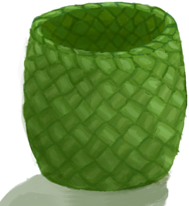 [编织篓](Basket.md)](Basket.md)  |  [ [蝙蝠尸体](Bat.md)](Bat.md)  
[ [剥皮的巨蜥](MonitorSkinned.md)](MonitorSkinned.md)  |  [ [剥皮的老鼠](MouseSkinned.md)](MouseSkinned.md)  |  [ [剥皮的山羊](GoatSkinned.md)](GoatSkinned.md)  |  [ [剥皮的蛇](SnakeSkinned.md)](SnakeSkinned.md)  
[ [剥皮的小羊](GoatSkinnedKid.md)](GoatSkinnedKid.md)  |  [ [剥皮的野猪](BoarSkinned.md)](BoarSkinned.md)  |  [ [剥皮的猪](BoarSkinnedPiglet.md)](BoarSkinnedPiglet.md)  |  [ [哺乳期山羊](GoatTiedFemaleLactating.md)](GoatTiedFemaleLactating.md)  
[ [捕鱼陷阱](FishTrap.md)](FishTrap.md)  |  [ [布](Cloth.md)](Cloth.md)  |  [ [布袋](Sack.md)](Sack.md)  |  [ [布片](ClothSmall.md)](ClothSmall.md)  
[ [参薯](Yam.md)](Yam.md)  |  [ [参薯片](YamCut.md)](YamCut.md)  |  [ [缠好的纺锤](SpindleFiber.md)](SpindleFiber.md)  |  [ [铲头模具](MoldShovel.md)](MoldShovel.md)  
[ [超大块布](ClothVeryLarge.md)](ClothVeryLarge.md)  |  [ [超级生存箱 2000](TrunkPerk.md)](TrunkPerk.md)  |  [ [虫子](Bugs.md)](Bugs.md)  |  [ [船长](Captain.md)](Captain.md)  
[ [雌灰山鹑](PartridgeFemaleLive.md)](PartridgeFemaleLive.md)  |  [ [丛林沙拉](JungleSalad.md)](JungleSalad.md)  |  [ [大海螺](GiantConch.md)](GiantConch.md)  |  [ [大块的布](ClothLarge.md)](ClothLarge.md)  
[ [大马鲅鱼](KingThreadfin.md)](KingThreadfin.md)  |  [ [大叶仙茅叶片](WeevilLilyLeaves.md)](WeevilLilyLeaves.md)  |  [ [带孔椰子](CoconutPerforated.md)](CoconutPerforated.md)  |  [ [弹涂鱼](Mudskipper.md)](Mudskipper.md)  
[ [蛋](Egg.md)](Egg.md)  |  [ [刀模具](MoldKnife.md)](MoldKnife.md)  |  [ [捣碎的卡瓦根](KavaRootGround.md)](KavaRootGround.md)  |  [ [捣碎的茉莉花](JasmineFlowersGround.md)](JasmineFlowersGround.md)  
[ [捣碎的柠檬草](LemonGrassGround.md)](LemonGrassGround.md)  |  [ [捣碎的蛇草](SnakeGrassGround.md)](SnakeGrassGround.md)  |  [ [捣碎的蜘蛛兰](SpiderLilyGround.md)](SpiderLilyGround.md)  |  [ [稻杆](RiceStraw.md)](RiceStraw.md)  
[ [稻秆](RiceStalks.md)](RiceStalks.md)  |  [ [稻米](RiceGrains.md)](RiceGrains.md)  |  [ [钓鱼竿](FishingRod.md)](FishingRod.md)  |  [ [钓鱼竿（已添加诱饵）](FishingRodBait.md)](FishingRodBait.md)  
[ [钓鱼线](FishingLine.md)](FishingLine.md)  |  [ [钓鱼线](FishingLineRustic.md)](FishingLineRustic.md)  |  [ [钓鱼线（已添加诱饵）](FishingLineBait.md)](FishingLineBait.md)  |  [ [钓鱼线（已添加诱饵）](FishingLineRusticBait.md)](FishingLineRusticBait.md)  
[ [煅烧后的大石块](StoneHeavyBurnt.md)](StoneHeavyBurnt.md)  |  [ [煅烧后的砂浆](MortarBurnt.md)](MortarBurnt.md)  |  [ [煅烧后的石头](StoneBurnt.md)](StoneBurnt.md)  |  [ [方解石晶体](Calcite.md)](Calcite.md)  
[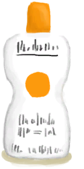 [防晒霜](SunScreen.md)](SunScreen.md)  |  [ [纺锤](Spindle.md)](Spindle.md)  |  [ [绯鲤](Goatfish.md)](Goatfish.md)  |  [ [鲱鱼](Herring.md)](Herring.md)  
[ [肥料](Fertilizer.md)](Fertilizer.md)  |  [ [肥皂](SoapDry.md)](SoapDry.md)  |  [ [废铜](CopperDecoration_Failed.md)](CopperDecoration_Failed.md)  |  [ [粪便](Manure.md)](Manure.md)  
[ [蜂后](QueenBee.md)](QueenBee.md)  |  [ [蜂蜡](Beeswax.md)](Beeswax.md)  |  [ [蜂蜡块](BeeswaxBlock.md)](BeeswaxBlock.md)  |  [ [斧头模具](MoldAxe.md)](MoldAxe.md)  
[ [腐烂的皮](SkinRotten.md)](SkinRotten.md)  |  [ [腐烂的椰子](CoconutRotten.md)](CoconutRotten.md)  |  [ [腐烂物](RottenRemains.md)](RottenRemains.md)  |  [ [干姜](GingerDried.md)](GingerDried.md)  
[ [干胶水](GlueDry.md)](GlueDry.md)  |  [ [干辣椒](ChiliesDried.md)](ChiliesDried.md)  |  [ [干土堆](DirtPile.md)](DirtPile.md)  |  [ [干燥的金鸡纳树皮](BarkCinchonaDried.md)](BarkCinchonaDried.md)  
[ [干燥的卡瓦根](KavaRootDried.md)](KavaRootDried.md)  |  [ [干燥的砂浆](MortarDry.md)](MortarDry.md)  |  [ [干燥的蜘蛛兰叶](SpiderLilyLeavesDried.md)](SpiderLilyLeavesDried.md)  |  [ [弓钻](BowDrill.md)](BowDrill.md)  
[ [公山羊](GoatTiedMale.md)](GoatTiedMale.md)  |  [ [公猪](BoarTiedMale.md)](BoarTiedMale.md)  |  [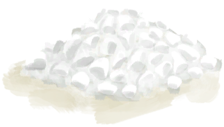 [骨粉](Bonemeal.md)](Bonemeal.md)  |  [ [骨钩](HookBone.md)](HookBone.md)  
[ [骨头](Bones.md)](Bones.md)  |  [ [骨头碎片](BoneSplinters.md)](BoneSplinters.md)  |  [ [骨针](BoneNeedle.md)](BoneNeedle.md)  |  [ [鼓](Drum.md)](Drum.md)  
[ [刮净的皮](SkinFleshed.md)](SkinFleshed.md)  |  [ [刮净的蜥蜴皮](SkinFleshedReptile.md)](SkinFleshedReptile.md)  |  [ [海胆](Urchin.md)](Urchin.md)  |  [ [海胆肉](UrchinMeat.md)](UrchinMeat.md)  
[ [海怪肉](Seahoundmeat.md)](Seahoundmeat.md)  |  [ [海怪尸体](SeahoundCarcass.md)](SeahoundCarcass.md)  |  [ [海螺](Conch.md)](Conch.md)  |  [ [海螺肉](ConchMeat.md)](ConchMeat.md)  
[ [海鸟粪](Guano.md)](Guano.md)  |  [ [海鸥木雕](WoodCarving_Seagull.md)](WoodCarving_Seagull.md)  |  [ [海鸥尸体](SeagullDead.md)](SeagullDead.md)  |  [ [海鸥遗骸](SeagullCarcass.md)](SeagullCarcass.md)  
[ [海蛇尸体](SeaKraitDead.md)](SeaKraitDead.md)  |  [ [海鲜杂烩](SeafoodCup.md)](SeafoodCup.md)  |  [ [海藻](Seaweed.md)](Seaweed.md)  |  [ [盒子](Box.md)](Box.md)  
[ [黑曜石](Obsidian.md)](Obsidian.md)  |  [ [护照](Passport.md)](Passport.md)  |  [ [黄油](Butter.md)](Butter.md)  |  [ [灰烬](Ash.md)](Ash.md)  
[ [灰山鹑尸体](PartridgeDead.md)](PartridgeDead.md)  |  [ [灰山鹑遗骸](PartridgeCarcass.md)](PartridgeCarcass.md)  |  [ [火把(关)](TorchOff.md)](TorchOff.md)  |  [ [火把(开)](TorchOn.md)](TorchOn.md)  
[ [火炭](Embers.md)](Embers.md)  |  [ [火种](TinderLit.md)](TinderLit.md)  |  [ [火钻](RubbingSticks.md)](RubbingSticks.md)  |  [ [急救包(救生筏)](FirstAidKitLifeRaft.md)](FirstAidKitLifeRaft.md)  
[ [急救包(飞机)](FirstAidKitPlane.md)](FirstAidKitPlane.md)  |  [ [急救包](FirstAidKitTrunk.md)](FirstAidKitTrunk.md)  |  [ [集装袋(A)](ContainerBagA.md)](ContainerBagA.md)  |  [ [集装袋(B)](ContainerBagB.md)](ContainerBagB.md)  
[ [集装袋(简易)](ContainerBagEasy.md)](ContainerBagEasy.md)  |  [记事本](Tmp_StrandedJournal.md)  |  [ [夹板](Splint.md)](Splint.md)  |  [ [简易箭矢](ArrowSimple.md)](ArrowSimple.md)  
[ [简易长矛](SpearRustic.md)](SpearRustic.md)  |  [ [简易止血带](TourniquetRustic.md)](TourniquetRustic.md)  |  [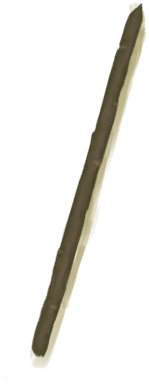 [箭杆](ArrowShaft.md)](ArrowShaft.md)  |  [ [姜](Ginger.md)](Ginger.md)  
[ [姜末](GingerGround.md)](GingerGround.md)  |  [ [姜糖(做好的)](CandiedGingerCooked.md)](CandiedGingerCooked.md)  |  [ [胶水](Glue.md)](Glue.md)  |  [ [金鸡纳树皮](BarkCinchona.md)](BarkCinchona.md)  
[ [金鸡纳树皮粉](QuininePowder.md)](QuininePowder.md)  |  [ [金属废料](MetalScrap.md)](MetalScrap.md)  |  [ [净水片](WaterPurificationTablets.md)](WaterPurificationTablets.md)  |  [ [巨蜥肉](MonitorMeat.md)](MonitorMeat.md)  
[ [巨蜥尸体](MonitorCarcass.md)](MonitorCarcass.md)  |  [ [咖啡豆](CoffeeBeans.md)](CoffeeBeans.md)  |  [ [咖啡果浆](CoffeeBerryPulp.md)](CoffeeBerryPulp.md)  |  [ [卡瓦根](KavaRoot.md)](KavaRoot.md)  
[ [抗生素](Antibiotics.md)](Antibiotics.md)  |  [ [烤咖啡豆](CoffeeRoastedBeans.md)](CoffeeRoastedBeans.md)  |  [ [烤鱼片](FishSlicesCooked.md)](FishSlicesCooked.md)  |  [ [烤鱼杂](FishScrapsCooked.md)](FishScrapsCooked.md)  
[ [空的手枪](GunEmpty.md)](GunEmpty.md)  |  [ [空蜂箱](BeeSkepEmpty.md)](BeeSkepEmpty.md)  |  [ [枯叶](LeavesDry.md)](LeavesDry.md)  |  [ [捆好的木头](WoodTied.md)](WoodTied.md)  
[ [蜡烛(关)](CandleOff.md)](CandleOff.md)  |  [ [蜡烛(开)](CandleOn.md)](CandleOn.md)  |  [ [辣椒粉](ChiliPowder.md)](ChiliPowder.md)  |  [ [老鼠尸体](Mouse.md)](Mouse.md)  
[ [硫磺](Brimstone.md)](Brimstone.md)  |  [ [硫磺膏](BrimstoneGel.md)](BrimstoneGel.md)  |  [ [硫酸奎宁](QuinineSulfate.md)](QuinineSulfate.md)  |  [ [硫酸盐混合物](VitriolUncooked.md)](VitriolUncooked.md)  
[ [芦荟膏](AloeVeraGel.md)](AloeVeraGel.md)  |  [ [芦荟叶](AloeVeraLeaf.md)](AloeVeraLeaf.md)  |  [ [马鲅鱼肉](ThreadfinMeat.md)](ThreadfinMeat.md)  |  [ [矛头模具](MoldSpear.md)](MoldSpear.md)  
[ [迷幻菇](MagicMushrooms.md)](MagicMushrooms.md)  |  [ [猕猴肉](MacaqueMeat.md)](MacaqueMeat.md)  |  [ [猕猴尸体](MacaqueCarcass.md)](MacaqueCarcass.md)  |  [ [蜜蜂](Bees.md)](Bees.md)  
[ [蜜糖(做好的)](HoneyCandyCooked.md)](HoneyCandyCooked.md)  |  [ [茉莉花(陶罐)](ClayJarJasmine.md)](ClayJarJasmine.md)  |  [ [茉莉花(塑料瓶)](PlasticBottleJasmine.md)](PlasticBottleJasmine.md)  |  [ [茉莉花](JasmineFlowers.md)](JasmineFlowers.md)  
[ [茉莉蜡烛(关)](CandleJasmineOff.md)](CandleJasmineOff.md)  |  [ [茉莉蜡烛(开)](CandleJasmineOn.md)](CandleJasmineOn.md)  |  [ [母山羊](GoatTiedFemale.md)](GoatTiedFemale.md)  |  [ [母猪](BoarTiedFemale.md)](BoarTiedFemale.md)  
[ [牡蛎肉](OysterMeat.md)](OysterMeat.md)  |  [ [木板](Plank.md)](Plank.md)  |  [ [木材](Wood.md)](Wood.md)  |  [ [木钉](Treenail.md)](Treenail.md)  
[ [木斧柄](HandleWood.md)](HandleWood.md)  |  [ [木炭](Charcoal.md)](Charcoal.md)  |  [ [木屑](WoodShavings.md)](WoodShavings.md)  |  [ [木针](WoodenNeedle.md)](WoodenNeedle.md)  
[ [木质餐具](EatingUtensilsWooden.md)](EatingUtensilsWooden.md)  |  [ [泥堆](MudPile.md)](MudPile.md)  |  [ [泥砖](MudBrick.md)](MudBrick.md)  |  [ [鸟巢](Nest.md)](Nest.md)  
[ [鸟骨](BonesBird.md)](BonesBird.md)  |  [ [鸟肉](BirdMeat.md)](BirdMeat.md)  |  [ [鸟食](FeedBird.md)](FeedBird.md)  |  [ [柠檬草](LemongrassStalks.md)](LemongrassStalks.md)  
[ [凝乳酶](Rennet.md)](Rennet.md)  |  [ [螃蟹](Crab.md)](Crab.md)  |  [ [烹饪锅](CookingPot.md)](CookingPot.md)  |  [ [烹饪好的蛋白棒](ProteinBarsCooked.md)](ProteinBarsCooked.md)  
[ [烹饪好的西米糕](SagoSlimeCooked.md)](SagoSlimeCooked.md)  |  [ [漂亮贝壳](SeashellsPretty.md)](SeashellsPretty.md)  |  [ [前置步骤](LiferaftBasics.md)](LiferaftBasics.md)  |  [ [枪](Gun.md)](Gun.md)  
[ [青椰子](CoconutHusked.md)](CoconutHusked.md)  |  [ [驱虫膏](BugRepellent.md)](BugRepellent.md)  |  [ [燃烧的信号弹(开)](FlareHandOn.md)](FlareHandOn.md)  |  [ [热带杏仁](TropicalAlmonds.md)](TropicalAlmonds.md)  
[ [鞣制巨蜥皮](CuredSkinReptile.md)](CuredSkinReptile.md)  |  [ [鞣制兽皮](CuredSkin.md)](CuredSkin.md)  |  [ [扫帚](Broom.md)](Broom.md)  |  [ [沙子](Sand.md)](Sand.md)  
[ [砂浆](Mortar.md)](Mortar.md)  |  [ [鲨鱼肉](SharkMeat.md)](SharkMeat.md)  |  [ [鲨鱼尸体](SharkCarcass.md)](SharkCarcass.md)  |  [ [鲨鱼下颚](SharkJaws.md)](SharkJaws.md)  
[ [山羊木雕](WoodCarving_Goat.md)](WoodCarving_Goat.md)  |  [ [山羊尸体(母)](GoatCarcassFemale.md)](GoatCarcassFemale.md)  |  [ [山羊尸体(公)](GoatCarcassMale.md)](GoatCarcassMale.md)  |  [ [山羊饲料](FeedGoat.md)](FeedGoat.md)  
[ [珊瑚](Coral.md)](Coral.md)  |  [ [上弦的简易弓](BowRustic_Copper.md)](BowRustic_Copper.md)  |  [ [上弦的简易弓](BowRustic_Simple.md)](BowRustic_Simple.md)  |  [ [烧焦物](CharredRemains.md)](CharredRemains.md)  
[ [烧着的木棒](WoodBurning.md)](WoodBurning.md)  |  [ [蛇草](SnakeGrass.md)](SnakeGrass.md)  |  [ [神赐壶](CoconutFlaskAmbrosia.md)](CoconutFlaskAmbrosia.md)  |  [ [神灵木雕](WoodCarving_Monster.md)](WoodCarving_Monster.md)  
[ [生存手册](Leaflet.md)](Leaflet.md)  |  [ [生存手册](LeafletSurvivalTrunk.md)](LeafletSurvivalTrunk.md)  |  [ [生存指南](SurvivalGuide.md)](SurvivalGuide.md)  |  [ [生石灰](Quicklime.md)](Quicklime.md)  
[ [胜利手册](TV_Leaflet.md)](TV_Leaflet.md)  |  [ [胜利药片](VictoryPillsTV.md)](VictoryPillsTV.md)  |  [ [失败品](WoodCarving_Failed.md)](WoodCarving_Failed.md)  |  [ [湿肥皂](SoapWet.md)](SoapWet.md)  
[石斑鱼](Grouper.md)  |  [ [石斑鱼肉](GrouperMeat.md)](GrouperMeat.md)  |  [ [食丸](GastricPellet.md)](GastricPellet.md)  |  [ [收纳箱](Trunk.md)](Trunk.md)  
[ [收起的帐篷](TentPacked.md)](TentPacked.md)  |  [ [手机(关)](PhoneOff.md)](PhoneOff.md)  |  [ [手机(开)](PhoneOn.md)](PhoneOn.md)  |  [ [手机](PhoneOnLight.md)](PhoneOnLight.md)  
[ [手钻](FirePlow.md)](FirePlow.md)  |  [ [手钻](HandDrill.md)](HandDrill.md)  |  [ [受精蛋](EggPartridgeFertilized.md)](EggPartridgeFertilized.md)  |  [ [受伤的猕猴](MacaqueWounded.md)](MacaqueWounded.md)  
[ [熟参薯酱](YamJamCooked.md)](YamJamCooked.md)  |  [ [熟的炸香蕉](FriedBananasCooked.md)](FriedBananasCooked.md)  |  [ [树叶](LeavesFresh.md)](LeavesFresh.md)  |  [ [水壶](Canteen.md)](Canteen.md)  
[ [水椰子](NipaFruit.md)](NipaFruit.md)  |  [ [睡袋](BedRoll.md)](BedRoll.md)  |  [ [松软的海螺肉](ConchMeatSoft.md)](ConchMeatSoft.md)  |  [ [塑料布](PlasticSheet.md)](PlasticSheet.md)  
[ [塑料袋](SackPlastic.md)](SackPlastic.md)  |  [ [塑料瓶](PlasticBottle.md)](PlasticBottle.md)  |  [ [塑料瓶(满)](PlasticBottleFull.md)](PlasticBottleFull.md)  |  [ [碎海螺壳](ConchBroken.md)](ConchBroken.md)  
[ [糖](Sugar.md)](Sugar.md)  |  [ [陶罐](ClayVase.md)](ClayVase.md)  |  [ [陶碗](ClayBowl.md)](ClayBowl.md)  |  [ [铜](Copper.md)](Copper.md)  
[ [铜板](CopperSheet.md)](CopperSheet.md)  |  [ [铜罐](CopperJar.md)](CopperJar.md)  |  [铜箭矢](ArrowCopper.md)  |  [ [铜矿石](CopperOre.md)](CopperOre.md)  
[ [铜针](CopperNeedle.md)](CopperNeedle.md)  |  [ [铜制贝壳](CopperDecoration_Seashell.md)](CopperDecoration_Seashell.md)  |  [ [铜制餐具](EatingUtensilsCopper.md)](EatingUtensilsCopper.md)  |  [ [铜制乌龟](CopperDecoration_Turtle.md)](CopperDecoration_Turtle.md)  
[ [铜制装饰品](CopperDecoration_Mold.md)](CopperDecoration_Mold.md)  |  [ [头骨](Skull.md)](Skull.md)  |  [ [投石索](Sling.md)](Sling.md)  |  [ [瓦斯炉(关)](GasCookerOff.md)](GasCookerOff.md)  
[ [韦斯顿](Weston.md)](Weston.md)  |  [ [未熬制的胶水](GlueUncooked.md)](GlueUncooked.md)  |  [ [未烹饪的参薯酱](YamJamUncooked.md)](YamJamUncooked.md)  |  [ [未烹饪的参薯咖喱](YamCurryUncooked.md)](YamCurryUncooked.md)  
[ [未烹饪的炒菇球](FriedPuffballsUncooked.md)](FriedPuffballsUncooked.md)  |  [ [未烹饪的蛋白棒](ProteinBarUncooked.md)](ProteinBarUncooked.md)  |  [ [未烹饪的蛋炒饭](EggFriedRiceUncooked.md)](EggFriedRiceUncooked.md)  |  [ [未烹饪的骨头汤](BoneBrothUncooked.md)](BoneBrothUncooked.md)  
[ [未烹饪的黄油牡蛎](ButterBakedOystersUncooked.md)](ButterBakedOystersUncooked.md)  |  [ [未烹饪的姜糖](CandiedGingerUncooked.md)](CandiedGingerUncooked.md)  |  [ [未烹饪的辣炒巨蜥肉](LizardFryUncooked.md)](LizardFryUncooked.md)  |  [ [未烹饪的猕猴肉串](MacaqueSkewersUncooked.md)](MacaqueSkewersUncooked.md)  
[ [未烹饪的蜜糖](HoneyCandyUncooked.md)](HoneyCandyUncooked.md)  |  [ [未烹饪的蜜汁火腿](HoneyGlazedPorkUncooked.md)](HoneyGlazedPorkUncooked.md)  |  [ [未烹饪的热带烤鸡](IslandChickenUncooked.md)](IslandChickenUncooked.md)  |  [ [未烹饪的肉食盛宴](HeartyFeastUncooked.md)](HeartyFeastUncooked.md)  
[ [未烹饪的西米蛋糕](SagoCakeUncooked.md)](SagoCakeUncooked.md)  |  [ [未烹饪的西米糕](SagoSlimeUncooked.md)](SagoSlimeUncooked.md)  |  [ [未烹饪的羊汤](GoatStewUncooked.md)](GoatStewUncooked.md)  |  [ [未烹饪的椰子鱼](CoconutFishUncooked.md)](CoconutFishUncooked.md)  
[ [未烹饪的鱼肉蛋饼](FishOmeletteUncooked.md)](FishOmeletteUncooked.md)  |  [ [未烹饪的炸香蕉](FriedBananasUncooked.md)](FriedBananasUncooked.md)  |  [ [未烹饪的炸鱼薯条](FishNChipsUncooked.md)](FishNChipsUncooked.md)  |  [ [未烹饪的醉蟹](DrunkenCrabUncooked.md)](DrunkenCrabUncooked.md)  
[ [未烧制的保鲜罐](ClayPotCoolerUnfired.md)](ClayPotCoolerUnfired.md)  |  [ [未烧制的烹饪锅](CookingPotUnfired.md)](CookingPotUnfired.md)  |  [ [未烧制的陶罐](ClayVaseUnfinished.md)](ClayVaseUnfinished.md)  |  [ [未烧制的陶罐](ClayVaseUnfired.md)](ClayVaseUnfired.md)  
[ [未烧制的陶碗](ClayBowlUnfired.md)](ClayBowlUnfired.md)  |  [ [未烧制的小陶罐](ClayJarUnfired.md)](ClayJarUnfired.md)  |  [ [未烧制的熏蜂器](BeeSmokerUnfired.md)](BeeSmokerUnfired.md)  |  [ [未烧制的釉面陶罐](GlazedVaseUnfired.md)](GlazedVaseUnfired.md)  
[ [未烧制的粘土火盆](ClayFirePitUnfired.md)](ClayFirePitUnfired.md)  |  [ [未烧制的蒸馏器](AlembicUnfired.md)](AlembicUnfired.md)  |  [ [未完成的木雕](WoodCarving_Unfinished.md)](WoodCarving_Unfinished.md)  |  [ [无线电](Radio.md)](Radio.md)  
[ [西米粉](SagoFlour.md)](SagoFlour.md)  |  [ [西米浆](SagoPulp.md)](SagoPulp.md)  |  [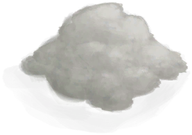 [西米树芯](SagoSawdust.md)](SagoSawdust.md)  |  [ [西米树种](SagoSeeds.md)](SagoSeeds.md)  
[ [蜥蜴](Lizard.md)](Lizard.md)  |  [ [蜥蜴生皮](SkinFreshReptile.md)](SkinFreshReptile.md)  |  [ [细土](FineDirt.md)](FineDirt.md)  |  [ [细线](CordFiber.md)](CordFiber.md)  
[ [虾](Prawns.md)](Prawns.md)  |  [ [纤维](Fibers.md)](Fibers.md)  |  [ [线团](YarnFiber.md)](YarnFiber.md)  |  [ [香蕉树芯](BananaStem.md)](BananaStem.md)  
[ [香茅蜡烛(关)](CandleCitronellaOff.md)](CandleCitronellaOff.md)  |  [ [香茅蜡烛(开)](CandleCitronellaOn.md)](CandleCitronellaOn.md)  |  [ [硝石晶体](NiterCrystals.md)](NiterCrystals.md)  |  [ [硝酸钾](Saltpeter.md)](Saltpeter.md)  
[ [小灰山鹑尸体](PartridgeChickDead.md)](PartridgeChickDead.md)  |  [ [小拉车](Travois.md)](Travois.md)  |  [ [小人木雕（男）](WoodCarving_Man.md)](WoodCarving_Man.md)  |  [ [小人木雕（女）](WoodCarving_Woman.md)](WoodCarving_Woman.md)  
[ [小树枝](Sticks.md)](Sticks.md)  |  [ [小陶罐](ClayJar.md)](ClayJar.md)  |  [ [小羊](GoatTiedKid.md)](GoatTiedKid.md)  |  [ [小羊尸体](GoatCarcassKid.md)](GoatCarcassKid.md)  
[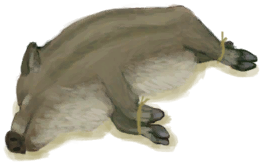 [小猪](BoarTiedPiglet.md)](BoarTiedPiglet.md)  |  [ [小猪尸体](BoarCarcassPiglet.md)](BoarCarcassPiglet.md)  |  [ [泻立停](AntiDiarrhoeaPills.md)](AntiDiarrhoeaPills.md)  |  [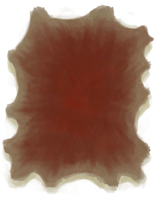 [新鲜兽皮](SkinFresh.md)](SkinFresh.md)  
[ [信号弹](FlareHand.md)](FlareHand.md)  |  [ [信号镜](SignalingMirror.md)](SignalingMirror.md)  |  [ [行李箱(A)](LuggageA.md)](LuggageA.md)  |  [ [行李箱(B)](LuggageB.md)](LuggageB.md)  
[ [行李箱(C)](LuggageC.md)](LuggageC.md)  |  [ [行李箱(D)](LuggageD.md)](LuggageD.md)  |  [ [雄灰山鹑](PartridgeMaleLive.md)](PartridgeMaleLive.md)  |  [ [熏蜂器(关)](BeeSmokerOff.md)](BeeSmokerOff.md)  
[ [熏蜂器(开)](BeeSmokerOn.md)](BeeSmokerOn.md)  |  [ [压缩干粮包](FoodRationsPackage.md)](FoodRationsPackage.md)  |  [ [腌制中的巨蜥肉](MonitorMeatSaltedDrying.md)](MonitorMeatSaltedDrying.md)  |  [ [腌制中的猕猴肉](MacaqueMeatSaltedDrying.md)](MacaqueMeatSaltedDrying.md)  
[ [腌制中的咸鱼肉](FishSaltedDrying.md)](FishSaltedDrying.md)  |  [ [腌制中的羊肉](GoatMeatSaltedDrying.md)](GoatMeatSaltedDrying.md)  |  [ [盐](Salt.md)](Salt.md)  |  [ [眼镜蛇尸体](CobraDead.md)](CobraDead.md)  
[ [羊肉](GoatMeat.md)](GoatMeat.md)  |  [ [椰壶](CoconutFlask.md)](CoconutFlask.md)  |  [ [椰子](Coconut.md)](Coconut.md)  |  [ [椰子壳](CoconutShell.md)](CoconutShell.md)  
[ [椰子皮](CoconutHusk.md)](CoconutHusk.md)  |  [ [野猪肉](BoarMeat.md)](BoarMeat.md)  |  [ [野猪尸体](BoarCarcass.md)](BoarCarcass.md)  |  [ [野猪牙](Tusk.md)](Tusk.md)  
[ [一串香蕉](BananaHand.md)](BananaHand.md)  |  [ [椅子](Chair.md)](Chair.md)  |  [ [应急水包](WaterRation.md)](WaterRation.md)  |  [ [应急水袋](WaterRationsPackage.md)](WaterRationsPackage.md)  
[ [婴儿](Baby.md)](Baby.md)  |  [ [鹦哥鱼](ParrotFish.md)](ParrotFish.md)  |  [ [油桶](Jerrycan.md)](Jerrycan.md)  |  [ [诱捕笼](CageTrap.md)](CageTrap.md)  
[ [釉面陶罐](GlazedVase.md)](GlazedVase.md)  |  [ [鱼叉](SpearFishing.md)](SpearFishing.md)  |  [ [鱼饵](FishBait.md)](FishBait.md)  |  [ [鱼片](FishSlices.md)](FishSlices.md)  
[ [鱼杂](FishScraps.md)](FishScraps.md)  |  [ [羽毛](Feathers.md)](Feathers.md)  |  [ [原木](Log.md)](Log.md)  |  [ [晕船药](SeasicknessPills.md)](SeasicknessPills.md)  
[ [杂菌](AssortedMushrooms.md)](AssortedMushrooms.md)  |  [ [炸药(关)](DynamiteOff.md)](DynamiteOff.md)  |  [ [炸药(开)](DynamiteOn.md)](DynamiteOn.md)  |  [ [粘土](Clay.md)](Clay.md)  
[ [粘土火盆(熄灭)](ClayFirePitExtinguished.md)](ClayFirePitExtinguished.md)  |  [ [长木棍](StickLong.md)](StickLong.md)  |  [ [针线(骨针)](BoneNeedleThreaded.md)](BoneNeedleThreaded.md)  |  [ [针线(铜针)](CopperNeedleThreaded.md)](CopperNeedleThreaded.md)  
[ [针线(木针)](WoodenNeedleThreaded.md)](WoodenNeedleThreaded.md)  |  [ [珍珠](Pearl.md)](Pearl.md)  |  [ [蒸馏器](AlembicUndeployed.md)](AlembicUndeployed.md)  |  [ [脂肪](Fat.md)](Fat.md)  
[ [蜘蛛兰叶](SpiderLilyLeaves.md)](SpiderLilyLeaves.md)  |  [ [止痛药](Painkillers.md)](Painkillers.md)  |  [ [止血带](Tourniquet.md)](Tourniquet.md)  |  [ [纸](Papers.md)](Papers.md)  
[ [中陷阱的猕猴](CageTrapMacaque.md)](CageTrapMacaque.md)  |  [ [忠犬朋友](DogFriend.md)](DogFriend.md)  |  [ [侏儒牙雕（男）](TuskCarving_GnomeMale.md)](TuskCarving_GnomeMale.md)  |  [ [侏儒牙雕（女）](TuskCarving_GnomeFemale.md)](TuskCarving_GnomeFemale.md)  
[ [猪食](FeedBoar.md)](FeedBoar.md)  |  [ [铸铜鱼雕](CopperDecoration_Fish.md)](CopperDecoration_Fish.md)  |  [ [装饰品模具](MoldCopperDecoration.md)](MoldCopperDecoration.md)  |  [ [装有燃料的油桶](JerrycanFuel.md)](JerrycanFuel.md)  
[ [棕榈编织物](WeavePalm.md)](WeavePalm.md)  |  [ [棕榈丛种子](PalmBushSeeds.md)](PalmBushSeeds.md)  |  [ [棕榈叶](PalmFronds.md)](PalmFronds.md)  |  [ [座椅](Seat.md)](Seat.md)  
[NONAME](Duplicator.md)  |    |    |    
  

