# 物品  
## 食物  

[

 [参薯酱](YamJam.md)](YamJam.md)

[

 [参薯咖喱](YamCurry.md)](YamCurry.md)

[

 [巢脾](BeeHoneycomb.md)](BeeHoneycomb.md)

[

 [炒菇球](FriedPuffballs.md)](FriedPuffballs.md)

[

 [蛋白棒](ProteinBar.md)](ProteinBar.md)

[

 [蛋炒饭](EggFriedRice.md)](EggFriedRice.md)

[
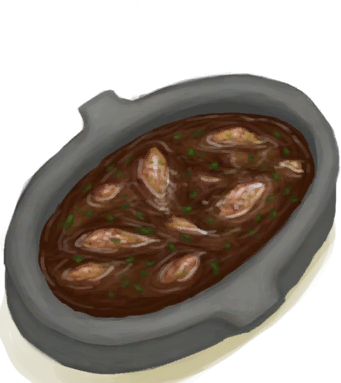
 [炖羊汤](GoatStew.md)](GoatStew.md)

[

 [蜂蜜西米饼](SagoFlatbreadHoney.md)](SagoFlatbreadHoney.md)

[

 [骨头汤](BoneBroth.md)](BoneBroth.md)

[

 [果酱西米饼](SagoFlatbreadJam.md)](SagoFlatbreadJam.md)

[

 [黄油焗牡蛎](ButterBakedOystersCooked.md)](ButterBakedOystersCooked.md)

[

 [黄油焗牡蛎](OysterMeatBaked.md)](OysterMeatBaked.md)

[

 [鸡肉三明治](ChickenSandwich.md)](ChickenSandwich.md)

[

 [姜糖](CandiedGinger.md)](CandiedGinger.md)

[

 [巨蜥肉干](MonitorMeatDried.md)](MonitorMeatDried.md)

[

 [咖啡果](CoffeeBerries.md)](CoffeeBerries.md)

[

 [烤北梭鱼](BonefishCooked.md)](BonefishCooked.md)

[

 [烤蝙蝠](BatCooked.md)](BatCooked.md)

[

 [烤弹涂鱼](MudskipperCooked.md)](MudskipperCooked.md)

[

 [烤蛋](EggCooked.md)](EggCooked.md)

[

 [烤绯鲤](GoatfishCooked.md)](GoatfishCooked.md)

[

 [烤鲱鱼](HerringCooked.md)](HerringCooked.md)

[

 [烤海胆](UrchinMeatCooked.md)](UrchinMeatCooked.md)

[

 [烤海怪肉](SeahoundCooked.md)](SeahoundCooked.md)

[

 [烤海螺肉](ConchMeatCooked.md)](ConchMeatCooked.md)

[

 [烤巨蜥肉](MonitorMeatCooked.md)](MonitorMeatCooked.md)

[

 [烤老鼠](MouseCooked.md)](MouseCooked.md)

[

 [烤马鲅鱼](ThreadfinCooked.md)](ThreadfinCooked.md)

[

 [烤猕猴肉](MacaqueMeatCooked.md)](MacaqueMeatCooked.md)

[

 [烤牡蛎肉](OysterMeatCooked.md)](OysterMeatCooked.md)

[

 [烤鸟肉](BirdMeatCooked.md)](BirdMeatCooked.md)

[

 [烤螃蟹](CrabCooked.md)](CrabCooked.md)

[

 [烤热带杏仁](TropicalAlmondsRoasted.md)](TropicalAlmondsRoasted.md)

[

 [烤鲨鱼肉](SharkCooked.md)](SharkCooked.md)

[

 [烤蛇肉](SnakeCooked.md)](SnakeCooked.md)

[

 [烤石斑鱼](GrouperMeatCooked.md)](GrouperMeatCooked.md)

[

 [烤蜥蜴](LizardCooked.md)](LizardCooked.md)

[

 [烤虾](PrawnsCooked.md)](PrawnsCooked.md)

[

 [烤羊肉](GoatMeatCooked.md)](GoatMeatCooked.md)

[

 [烤椰肉](CoconutMeatCooked.md)](CoconutMeatCooked.md)

[

 [烤野猪肉](BoarMeatCooked.md)](BoarMeatCooked.md)

[

 [烤鹦哥鱼](ParrotFishCooked.md)](ParrotFishCooked.md)

[

 [辣炒巨蜥肉](LizardFry.md)](LizardFry.md)

[

 [辣椒](Chilies.md)](Chilies.md)

[

 [马勃菌](Puffballs.md)](Puffballs.md)

[

 [芒果](Mango.md)](Mango.md)

[

 [猕猴肉串](MacaqueSkewers.md)](MacaqueSkewers.md)

[

 [猕猴肉干](MacaqueMeatDried.md)](MacaqueMeatDried.md)

[

 [米饭](RiceCooked.md)](RiceCooked.md)

[

 [蜜糖](HoneyCandy.md)](HoneyCandy.md)

[

 [蜜汁火腿](HoneyGlazedPork.md)](HoneyGlazedPork.md)

[

 [巧克力](Chocolate.md)](Chocolate.md)

[

 [热带烤鸡](IslandChicken.md)](IslandChicken.md)

[

 [热带杏仁核](TropicalAlmondKernels.md)](TropicalAlmondKernels.md)

[

 [肉食盛宴](HeartyFeast.md)](HeartyFeast.md)

[

 [山羊奶酪](Cheese.md)](Cheese.md)

[

 [寿司](Sushi.md)](Sushi.md)

[

 [水椰籽](NipaSeeds.md)](NipaSeeds.md)

[

 [水煮蛋](EggBoiled.md)](EggBoiled.md)

[

 [松软的烤海螺肉](ConchMeatSoftCooked.md)](ConchMeatSoftCooked.md)

[

 [外星结节](AlienNodule.md)](AlienNodule.md)

[

 [西米饼](SagoFlatbread.md)](SagoFlatbread.md)

[

 [西米蛋糕](SagoCake.md)](SagoCake.md)

[

 [西米糕](SagoSlime.md)](SagoSlime.md)

[

 [咸鱼](FishSalted.md)](FishSalted.md)

[

 [香蕉](Banana.md)](Banana.md)

[

 [压缩干粮](FoodRation.md)](FoodRation.md)

[

 [烟熏北梭鱼](BonefishSmoked.md)](BonefishSmoked.md)

[

 [烟熏绯鲤](GoatfishSmoked.md)](GoatfishSmoked.md)

[

 [烟熏鲱鱼](HerringSmoked.md)](HerringSmoked.md)

[

 [烟熏巨蜥肉](MonitorMeatSmoked.md)](MonitorMeatSmoked.md)

[

 [烟熏马鲅鱼](ThreadfinSmoked.md)](ThreadfinSmoked.md)

[

 [烟熏猕猴肉](MacaqueMeatSmoked.md)](MacaqueMeatSmoked.md)

[

 [烟熏鸟肉](BirdMeatSmoked.md)](BirdMeatSmoked.md)

[

 [烟熏鲨鱼肉](SharkSmoked.md)](SharkSmoked.md)

[

 [烟熏石斑鱼](GrouperMeatSmoked.md)](GrouperMeatSmoked.md)

[

 [烟熏羊肉](GoatMeatSmoked.md)](GoatMeatSmoked.md)

[

 [烟熏野猪肉](BoarMeatSmoked.md)](BoarMeatSmoked.md)

[

 [烟熏鹦哥鱼](ParrotFishSmoked.md)](ParrotFishSmoked.md)

[

 [腌巨蜥肉](MonitorMeatSalted.md)](MonitorMeatSalted.md)

[

 [腌猕猴肉](MacaqueMeatSalted.md)](MacaqueMeatSalted.md)

[

 [腌羊肉](GoatMeatSalted.md)](GoatMeatSalted.md)

[

 [腌野猪肉](BoarMeatSalted.md)](BoarMeatSalted.md)

[

 [腌制中的野猪肉](BoarMeatSaltedDrying.md)](BoarMeatSaltedDrying.md)

[

 [羊肉干](GoatMeatDried.md)](GoatMeatDried.md)

[

 [椰肉](CoconutMeat.md)](CoconutMeat.md)

[

 [椰子鱼](CoconutFish.md)](CoconutFish.md)

[

 [野枣](JujubeFruits.md)](JujubeFruits.md)

[

 [野猪肉干](BoarMeatDried.md)](BoarMeatDried.md)

[

 [鱼干](FishDried.md)](FishDried.md)

[

 [鱼肉蛋饼](FishOmelette.md)](FishOmelette.md)

[

 [鱼肉塔可](FishTaco.md)](FishTaco.md)

[

 [炸香蕉](FriedBanana.md)](FriedBanana.md)

[

 [炸鱼薯条](FishNChips.md)](FishNChips.md)

[

 [煮熟的参薯](YamBoiled.md)](YamBoiled.md)

[

 [醉蟹](DrunkenCrab.md)](DrunkenCrab.md)

  
  
  
## 工具  

[

 [安全刀](SafetyKnife.md)](SafetyKnife.md)

[

 [铲子头](ShovelHead.md)](ShovelHead.md)

[

 [大石块](StoneHeavy.md)](StoneHeavy.md)

[

 [钝刀](KnifeCopperBlunt.md)](KnifeCopperBlunt.md)

[

 [钝刀](KnifeMilitaryBlunt.md)](KnifeMilitaryBlunt.md)

[

 [钝的求生斧](AxeSurvivalBlunt.md)](AxeSurvivalBlunt.md)

[

 [钝斧子头](AxeHeadBlunt.md)](AxeHeadBlunt.md)

[

 [钝矛头](SpearHeadBlunt.md)](SpearHeadBlunt.md)

[

 [废金属铲](ShovelScrap.md)](ShovelScrap.md)

[

 [废金属刀](KnifeScrap.md)](KnifeScrap.md)

[

 [废金属斧](AxeScrap.md)](AxeScrap.md)

[

 [斧子头](AxeHead.md)](AxeHead.md)

[
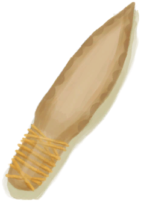
 [骨刀](KnifeBone.md)](KnifeBone.md)

[

 [黑曜石刀](KnifeObsidian.md)](KnifeObsidian.md)

[

 [晶洞](Geode.md)](Geode.md)

[

 [军刀](KnifeMilitary.md)](KnifeMilitary.md)

[
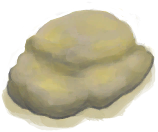
 [硫磺石](StoneHeavyBrimstone.md)](StoneHeavyBrimstone.md)

[

 [矛头](SpearHead.md)](SpearHead.md)

[

 [牡蛎](Oyster.md)](Oyster.md)

[

 [木铲](ShovelWooden.md)](ShovelWooden.md)

[

 [求生斧](AxeSurvival.md)](AxeSurvival.md)

[

 [石刀](StoneSharpened.md)](StoneSharpened.md)

[

 [石斧](StoneAxe.md)](StoneAxe.md)

[

 [石头](Stone.md)](Stone.md)

[

 [燧石](Flint.md)](Flint.md)

[

 [燧石板](FlintSlab.md)](FlintSlab.md)

[

 [燧石刀](KnifeFlint.md)](KnifeFlint.md)

[

 [燧石斧](AxeFlint.md)](AxeFlint.md)

[

 [铜铲](ShovelCopper.md)](ShovelCopper.md)

[

 [铜刀](KnifeCopper.md)](KnifeCopper.md)

[

 [铜斧](AxeCopper.md)](AxeCopper.md)

[

 [仪式匕首](CeremonialDagger.md)](CeremonialDagger.md)

[

 [祖父的刀](KnifeGrandpa.md)](KnifeGrandpa.md)

[

 [祖父的钝刀](KnifeGrandpaBlunt.md)](KnifeGrandpaBlunt.md)

  
  
  
## 装备  

[

 [绑手带](HandWrappings.md)](HandWrappings.md)

[

 [包脚布](FootWrappings.md)](FootWrappings.md)

[

 [贝壳项链](SeashellNecklace.md)](SeashellNecklace.md)

[

 [背包](BackpackTourist.md)](BackpackTourist.md)

[

 [背篓](BackpackBasket.md)](BackpackBasket.md)

[布制裤子](PantsCloth.md)

[

 [草木灰敷料](AshDressing.md)](AshDressing.md)

[

 [草裙](LeafSKirt.md)](LeafSKirt.md)

[

 [衬衫](ShirtFiber.md)](ShirtFiber.md)

[

 [短裤](Shorts.md)](Shorts.md)

[

 [盾牌](Shield.md)](Shield.md)

[

 [防毒面具](GasMaskRustic.md)](GasMaskRustic.md)

[

 [防蜂服](BeeSuit.md)](BeeSuit.md)

[

 [废金属长矛](SpearScrap.md)](SpearScrap.md)

[

 [风箱](Bellows.md)](Bellows.md)

[
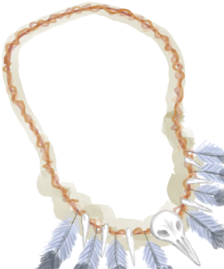
 [海鸥护符](SeagullCharm.md)](SeagullCharm.md)

[

 [黑曜石长矛](SpearObsidian.md)](SpearObsidian.md)

[

 [葫芦瓶](GourdBottle.md)](GourdBottle.md)

[

 [简易的弓](BowRustic.md)](BowRustic.md)

[

 [箭筒](Quiver.md)](Quiver.md)

[

 [军裤](MilitaryPants.md)](MilitaryPants.md)

[

 [军靴](MilitaryBoots.md)](MilitaryBoots.md)

[

 [军用皮带](BeltMilitary.md)](BeltMilitary.md)

[

 [挎包](Satchel.md)](Satchel.md)

[

 [挎包](SatchelHunter.md)](SatchelHunter.md)

[

 [临时绷带](ImprovisedDressing.md)](ImprovisedDressing.md)

[

 [临时防毒面具](MaskMakeshift.md)](MaskMakeshift.md)

[

 [猕猴朋友](MacaqueFriend.md)](MacaqueFriend.md)

[

 [内裤](Underwear.md)](Underwear.md)

[

 [皮革背包](BackpackLeather.md)](BackpackLeather.md)

[

 [皮革手套](LeatherGloves.md)](LeatherGloves.md)

[

 [皮革鞋子](LeatherShoes.md)](LeatherShoes.md)

[

 [皮裤](LeatherPants.md)](LeatherPants.md)

[

 [求生帽](HatSurvival.md)](HatSurvival.md)

[

 [人字拖](Flipflops.md)](Flipflops.md)

[

 [鲨鱼头饰](SharkHeadpiece.md)](SharkHeadpiece.md)

[

 [伤口敷料](WoundDressing.md)](WoundDressing.md)

[

 [生存者背包](BackpackSurvivalist.md)](BackpackSurvivalist.md)

[

 [绳子](Rope.md)](Rope.md)

[

 [水袋](Waterskin.md)](Waterskin.md)

[

 [燧石长矛](SpearFlint.md)](SpearFlint.md)

[

 [蓑衣](StrawCape.md)](StrawCape.md)

[

 [铜瓶](CopperBottle.md)](CopperBottle.md)

[

 [铜项链](CopperNecklace.md)](CopperNecklace.md)

[

 [铜长矛](SpearCopper.md)](SpearCopper.md)

[

 [头巾](HeadWrappings.md)](HeadWrappings.md)

[

 [袜子](Socks.md)](Socks.md)

[

 [卫衣](HoodieRetromation.md)](HoodieRetromation.md)

[

 [蜥蜴皮手鼓](LizardDrum.md)](LizardDrum.md)

[

 [夏威夷衬衫](HawaiianShirt.md)](HawaiianShirt.md)

[

 [鲜花项链](FlowerNecklace.md)](FlowerNecklace.md)

[

 [相机](Camera.md)](Camera.md)

[

 [项圈](CollarTV.md)](CollarTV.md)

[

 [眼镜](Glasses.md)](Glasses.md)

[

 [氧气面罩](Oxygen.md)](Oxygen.md)

[

 [腰包](BeltBag.md)](BeltBag.md)

[

 [椰子凉鞋](CoconutSandals.md)](CoconutSandals.md)

[

 [叶片绷带](LeafDressing.md)](LeafDressing.md)

[

 [鱼镖](HarpoonBone.md)](HarpoonBone.md)

[

 [雨衣](Raincoat.md)](Raincoat.md)

[

 [月季](ChinaRoseFlowers.md)](ChinaRoseFlowers.md)

[

 [运动鞋](Sneakers.md)](Sneakers.md)

[

 [珍珠项链](PearlNecklace.md)](PearlNecklace.md)

[

 [棕榈编织帽](HatWoven.md)](HatWoven.md)

[

 [T恤](T-Shirt.md)](T-Shirt.md)

  
  
  
## 其他  

[

 [熬制好的胶水](GlueCooked.md)](GlueCooked.md)

[

 [半个椰子](CoconutHalf.md)](CoconutHalf.md)

[

 [半根原木](HalfLog.md)](HalfLog.md)

[

 [保鲜罐](ClayPotCoolerUndeployed.md)](ClayPotCoolerUndeployed.md)

[

 [北梭鱼](Bonefish.md)](Bonefish.md)

[

 [北梭鱼肉](BonefishMeat.md)](BonefishMeat.md)

[

 [编织篓](Basket.md)](Basket.md)

[

 [蝙蝠尸体](Bat.md)](Bat.md)

[

 [剥皮的巨蜥](MonitorSkinned.md)](MonitorSkinned.md)

[

 [剥皮的老鼠](MouseSkinned.md)](MouseSkinned.md)

[

 [剥皮的山羊](GoatSkinned.md)](GoatSkinned.md)

[

 [剥皮的蛇](SnakeSkinned.md)](SnakeSkinned.md)

[

 [剥皮的小羊](GoatSkinnedKid.md)](GoatSkinnedKid.md)

[

 [剥皮的野猪](BoarSkinned.md)](BoarSkinned.md)

[

 [剥皮的猪](BoarSkinnedPiglet.md)](BoarSkinnedPiglet.md)

[

 [哺乳期山羊](GoatTiedFemaleLactating.md)](GoatTiedFemaleLactating.md)

[

 [捕鱼陷阱](FishTrap.md)](FishTrap.md)

[

 [布](Cloth.md)](Cloth.md)

[

 [布袋](Sack.md)](Sack.md)

[

 [布片](ClothSmall.md)](ClothSmall.md)

[

 [参薯](Yam.md)](Yam.md)

[

 [参薯片](YamCut.md)](YamCut.md)

[

 [缠好的纺锤](SpindleFiber.md)](SpindleFiber.md)

[

 [铲头模具](MoldShovel.md)](MoldShovel.md)

[

 [超大块布](ClothVeryLarge.md)](ClothVeryLarge.md)

[

 [超级生存箱 2000](TrunkPerk.md)](TrunkPerk.md)

[

 [虫子](Bugs.md)](Bugs.md)

[

 [船长](Captain.md)](Captain.md)

[

 [雌灰山鹑](PartridgeFemaleLive.md)](PartridgeFemaleLive.md)

[

 [丛林沙拉](JungleSalad.md)](JungleSalad.md)

[

 [大海螺](GiantConch.md)](GiantConch.md)

[
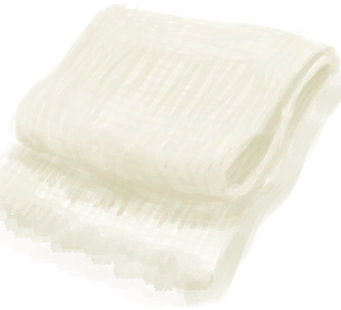
 [大块的布](ClothLarge.md)](ClothLarge.md)

[

 [大马鲅鱼](KingThreadfin.md)](KingThreadfin.md)

[

 [大叶仙茅叶片](WeevilLilyLeaves.md)](WeevilLilyLeaves.md)

[

 [带孔椰子](CoconutPerforated.md)](CoconutPerforated.md)

[

 [弹涂鱼](Mudskipper.md)](Mudskipper.md)

[

 [蛋](Egg.md)](Egg.md)

[

 [刀模具](MoldKnife.md)](MoldKnife.md)

[

 [捣碎的卡瓦根](KavaRootGround.md)](KavaRootGround.md)

[

 [捣碎的茉莉花](JasmineFlowersGround.md)](JasmineFlowersGround.md)

[

 [捣碎的柠檬草](LemonGrassGround.md)](LemonGrassGround.md)

[

 [捣碎的蛇草](SnakeGrassGround.md)](SnakeGrassGround.md)

[

 [捣碎的蜘蛛兰](SpiderLilyGround.md)](SpiderLilyGround.md)

[

 [稻杆](RiceStraw.md)](RiceStraw.md)

[

 [稻秆](RiceStalks.md)](RiceStalks.md)

[

 [稻米](RiceGrains.md)](RiceGrains.md)

[

 [钓鱼竿](FishingRod.md)](FishingRod.md)

[

 [钓鱼竿（已添加诱饵）](FishingRodBait.md)](FishingRodBait.md)

[

 [钓鱼线](FishingLine.md)](FishingLine.md)

[
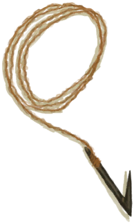
 [钓鱼线](FishingLineRustic.md)](FishingLineRustic.md)

[

 [钓鱼线（已添加诱饵）](FishingLineBait.md)](FishingLineBait.md)

[

 [钓鱼线（已添加诱饵）](FishingLineRusticBait.md)](FishingLineRusticBait.md)

[

 [煅烧后的大石块](StoneHeavyBurnt.md)](StoneHeavyBurnt.md)

[

 [煅烧后的砂浆](MortarBurnt.md)](MortarBurnt.md)

[

 [煅烧后的石头](StoneBurnt.md)](StoneBurnt.md)

[

 [方解石晶体](Calcite.md)](Calcite.md)

[

 [防晒霜](SunScreen.md)](SunScreen.md)

[

 [纺锤](Spindle.md)](Spindle.md)

[

 [绯鲤](Goatfish.md)](Goatfish.md)

[

 [鲱鱼](Herring.md)](Herring.md)

[

 [肥料](Fertilizer.md)](Fertilizer.md)

[
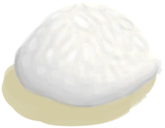
 [肥皂](SoapDry.md)](SoapDry.md)

[

 [废铜](CopperDecoration_Failed.md)](CopperDecoration_Failed.md)

[

 [粪便](Manure.md)](Manure.md)

[

 [蜂后](QueenBee.md)](QueenBee.md)

[

 [蜂蜡](Beeswax.md)](Beeswax.md)

[

 [蜂蜡块](BeeswaxBlock.md)](BeeswaxBlock.md)

[

 [斧头模具](MoldAxe.md)](MoldAxe.md)

[

 [腐烂的皮](SkinRotten.md)](SkinRotten.md)

[

 [腐烂的椰子](CoconutRotten.md)](CoconutRotten.md)

[

 [腐烂物](RottenRemains.md)](RottenRemains.md)

[

 [干姜](GingerDried.md)](GingerDried.md)

[

 [干胶水](GlueDry.md)](GlueDry.md)

[

 [干辣椒](ChiliesDried.md)](ChiliesDried.md)

[

 [干土堆](DirtPile.md)](DirtPile.md)

[
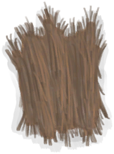
 [干燥的金鸡纳树皮](BarkCinchonaDried.md)](BarkCinchonaDried.md)

[

 [干燥的卡瓦根](KavaRootDried.md)](KavaRootDried.md)

[

 [干燥的砂浆](MortarDry.md)](MortarDry.md)

[

 [干燥的蜘蛛兰叶](SpiderLilyLeavesDried.md)](SpiderLilyLeavesDried.md)

[

 [弓钻](BowDrill.md)](BowDrill.md)

[

 [公山羊](GoatTiedMale.md)](GoatTiedMale.md)

[

 [公猪](BoarTiedMale.md)](BoarTiedMale.md)

[

 [骨粉](Bonemeal.md)](Bonemeal.md)

[

 [骨钩](HookBone.md)](HookBone.md)

[

 [骨头](Bones.md)](Bones.md)

[

 [骨头碎片](BoneSplinters.md)](BoneSplinters.md)

[

 [骨针](BoneNeedle.md)](BoneNeedle.md)

[

 [鼓](Drum.md)](Drum.md)

[

 [刮净的皮](SkinFleshed.md)](SkinFleshed.md)

[

 [刮净的蜥蜴皮](SkinFleshedReptile.md)](SkinFleshedReptile.md)

[

 [海胆](Urchin.md)](Urchin.md)

[
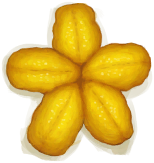
 [海胆肉](UrchinMeat.md)](UrchinMeat.md)

[

 [海怪肉](Seahoundmeat.md)](Seahoundmeat.md)

[

 [海怪尸体](SeahoundCarcass.md)](SeahoundCarcass.md)

[

 [海螺](Conch.md)](Conch.md)

[

 [海螺肉](ConchMeat.md)](ConchMeat.md)

[

 [海鸟粪](Guano.md)](Guano.md)

[

 [海鸥木雕](WoodCarving_Seagull.md)](WoodCarving_Seagull.md)

[

 [海鸥尸体](SeagullDead.md)](SeagullDead.md)

[

 [海鸥遗骸](SeagullCarcass.md)](SeagullCarcass.md)

[

 [海蛇尸体](SeaKraitDead.md)](SeaKraitDead.md)

[

 [海鲜杂烩](SeafoodCup.md)](SeafoodCup.md)

[

 [海藻](Seaweed.md)](Seaweed.md)

[

 [盒子](Box.md)](Box.md)

[

 [黑曜石](Obsidian.md)](Obsidian.md)

[

 [护照](Passport.md)](Passport.md)

[

 [黄油](Butter.md)](Butter.md)

[

 [灰烬](Ash.md)](Ash.md)

[

 [灰山鹑尸体](PartridgeDead.md)](PartridgeDead.md)

[

 [灰山鹑遗骸](PartridgeCarcass.md)](PartridgeCarcass.md)

[

 [火把](TorchOff.md)](TorchOff.md)

[

 [火把](TorchOn.md)](TorchOn.md)

[

 [火炭](Embers.md)](Embers.md)

[

 [火种](TinderLit.md)](TinderLit.md)

[

 [火钻](RubbingSticks.md)](RubbingSticks.md)

[
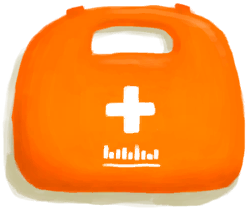
 [急救包](FirstAidKitLifeRaft.md)](FirstAidKitLifeRaft.md)

[

 [急救包](FirstAidKitPlane.md)](FirstAidKitPlane.md)

[

 [急救包](FirstAidKitTrunk.md)](FirstAidKitTrunk.md)

[

 [集装袋](ContainerBagA.md)](ContainerBagA.md)

[

 [集装袋](ContainerBagB.md)](ContainerBagB.md)

[

 [集装袋](ContainerBagEasy.md)](ContainerBagEasy.md)

[记事本](Tmp_StrandedJournal.md)

[

 [夹板](Splint.md)](Splint.md)

[

 [简易箭矢](ArrowSimple.md)](ArrowSimple.md)

[

 [简易长矛](SpearRustic.md)](SpearRustic.md)

[

 [简易止血带](TourniquetRustic.md)](TourniquetRustic.md)

[

 [箭杆](ArrowShaft.md)](ArrowShaft.md)

[

 [姜](Ginger.md)](Ginger.md)

[

 [姜末](GingerGround.md)](GingerGround.md)

[

 [姜糖](CandiedGingerCooked.md)](CandiedGingerCooked.md)

[

 [胶水](Glue.md)](Glue.md)

[

 [金鸡纳树皮](BarkCinchona.md)](BarkCinchona.md)

[

 [金鸡纳树皮粉](QuininePowder.md)](QuininePowder.md)

[

 [金属废料](MetalScrap.md)](MetalScrap.md)

[

 [净水片](WaterPurificationTablets.md)](WaterPurificationTablets.md)

[

 [巨蜥肉](MonitorMeat.md)](MonitorMeat.md)

[

 [巨蜥尸体](MonitorCarcass.md)](MonitorCarcass.md)

[

 [咖啡豆](CoffeeBeans.md)](CoffeeBeans.md)

[

 [咖啡果浆](CoffeeBerryPulp.md)](CoffeeBerryPulp.md)

[

 [卡瓦根](KavaRoot.md)](KavaRoot.md)

[

 [抗生素](Antibiotics.md)](Antibiotics.md)

[

 [烤咖啡豆](CoffeeRoastedBeans.md)](CoffeeRoastedBeans.md)

[

 [烤鱼片](FishSlicesCooked.md)](FishSlicesCooked.md)

[

 [烤鱼杂](FishScrapsCooked.md)](FishScrapsCooked.md)

[

 [空的手枪](GunEmpty.md)](GunEmpty.md)

[

 [空蜂箱](BeeSkepEmpty.md)](BeeSkepEmpty.md)

[

 [枯叶](LeavesDry.md)](LeavesDry.md)

[

 [捆好的木头](WoodTied.md)](WoodTied.md)

[

 [蜡烛](CandleOff.md)](CandleOff.md)

[

 [蜡烛](CandleOn.md)](CandleOn.md)

[

 [辣椒粉](ChiliPowder.md)](ChiliPowder.md)

[

 [老鼠尸体](Mouse.md)](Mouse.md)

[

 [硫磺](Brimstone.md)](Brimstone.md)

[

 [硫磺膏](BrimstoneGel.md)](BrimstoneGel.md)

[

 [硫酸奎宁](QuinineSulfate.md)](QuinineSulfate.md)

[

 [硫酸盐混合物](VitriolUncooked.md)](VitriolUncooked.md)

[

 [芦荟膏](AloeVeraGel.md)](AloeVeraGel.md)

[

 [芦荟叶](AloeVeraLeaf.md)](AloeVeraLeaf.md)

[

 [马鲅鱼肉](ThreadfinMeat.md)](ThreadfinMeat.md)

[

 [矛头模具](MoldSpear.md)](MoldSpear.md)

[

 [迷幻菇](MagicMushrooms.md)](MagicMushrooms.md)

[

 [猕猴肉](MacaqueMeat.md)](MacaqueMeat.md)

[

 [猕猴尸体](MacaqueCarcass.md)](MacaqueCarcass.md)

[

 [蜜蜂](Bees.md)](Bees.md)

[

 [蜜糖](HoneyCandyCooked.md)](HoneyCandyCooked.md)

[

 [茉莉花](ClayJarJasmine.md)](ClayJarJasmine.md)

[

 [茉莉花](PlasticBottleJasmine.md)](PlasticBottleJasmine.md)

[

 [茉莉花](JasmineFlowers.md)](JasmineFlowers.md)

[

 [茉莉蜡烛](CandleJasmineOff.md)](CandleJasmineOff.md)

[

 [茉莉蜡烛](CandleJasmineOn.md)](CandleJasmineOn.md)

[

 [母山羊](GoatTiedFemale.md)](GoatTiedFemale.md)

[

 [母猪](BoarTiedFemale.md)](BoarTiedFemale.md)

[

 [牡蛎肉](OysterMeat.md)](OysterMeat.md)

[

 [木板](Plank.md)](Plank.md)

[

 [木材](Wood.md)](Wood.md)

[

 [木钉](Treenail.md)](Treenail.md)

[

 [木斧柄](HandleWood.md)](HandleWood.md)

[

 [木炭](Charcoal.md)](Charcoal.md)

[

 [木屑](WoodShavings.md)](WoodShavings.md)

[

 [木针](WoodenNeedle.md)](WoodenNeedle.md)

[

 [木质餐具](EatingUtensilsWooden.md)](EatingUtensilsWooden.md)

[

 [泥堆](MudPile.md)](MudPile.md)

[

 [泥砖](MudBrick.md)](MudBrick.md)

[

 [鸟巢](Nest.md)](Nest.md)

[

 [鸟骨](BonesBird.md)](BonesBird.md)

[

 [鸟肉](BirdMeat.md)](BirdMeat.md)

[

 [鸟食](FeedBird.md)](FeedBird.md)

[

 [柠檬草](LemongrassStalks.md)](LemongrassStalks.md)

[

 [凝乳酶](Rennet.md)](Rennet.md)

[

 [螃蟹](Crab.md)](Crab.md)

[

 [烹饪锅](CookingPot.md)](CookingPot.md)

[

 [烹饪好的蛋白棒](ProteinBarsCooked.md)](ProteinBarsCooked.md)

[

 [烹饪好的西米糕](SagoSlimeCooked.md)](SagoSlimeCooked.md)

[

 [漂亮贝壳](SeashellsPretty.md)](SeashellsPretty.md)

[

 [前置步骤](LiferaftBasics.md)](LiferaftBasics.md)

[

 [枪](Gun.md)](Gun.md)

[

 [青椰子](CoconutHusked.md)](CoconutHusked.md)

[

 [驱虫膏](BugRepellent.md)](BugRepellent.md)

[

 [燃烧的信号弹](FlareHandOn.md)](FlareHandOn.md)

[
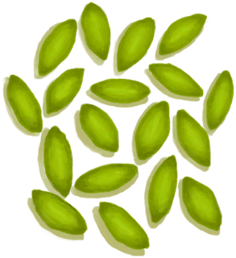
 [热带杏仁](TropicalAlmonds.md)](TropicalAlmonds.md)

[

 [鞣制巨蜥皮](CuredSkinReptile.md)](CuredSkinReptile.md)

[

 [鞣制兽皮](CuredSkin.md)](CuredSkin.md)

[

 [扫帚](Broom.md)](Broom.md)

[

 [沙子](Sand.md)](Sand.md)

[

 [砂浆](Mortar.md)](Mortar.md)

[
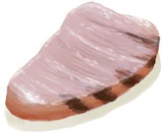
 [鲨鱼肉](SharkMeat.md)](SharkMeat.md)

[

 [鲨鱼尸体](SharkCarcass.md)](SharkCarcass.md)

[

 [鲨鱼下颚](SharkJaws.md)](SharkJaws.md)

[

 [山羊木雕](WoodCarving_Goat.md)](WoodCarving_Goat.md)

[

 [山羊尸体](GoatCarcassFemale.md)](GoatCarcassFemale.md)

[

 [山羊尸体](GoatCarcassMale.md)](GoatCarcassMale.md)

[

 [山羊饲料](FeedGoat.md)](FeedGoat.md)

[

 [珊瑚](Coral.md)](Coral.md)

[

 [上弦的简易弓](BowRustic_Copper.md)](BowRustic_Copper.md)

[

 [上弦的简易弓](BowRustic_Simple.md)](BowRustic_Simple.md)

[

 [烧焦物](CharredRemains.md)](CharredRemains.md)

[

 [烧着的木棒](WoodBurning.md)](WoodBurning.md)

[

 [蛇草](SnakeGrass.md)](SnakeGrass.md)

[

 [神赐壶](CoconutFlaskAmbrosia.md)](CoconutFlaskAmbrosia.md)

[

 [神灵木雕](WoodCarving_Monster.md)](WoodCarving_Monster.md)

[

 [生存手册](Leaflet.md)](Leaflet.md)

[

 [生存手册](LeafletSurvivalTrunk.md)](LeafletSurvivalTrunk.md)

[

 [生存指南](SurvivalGuide.md)](SurvivalGuide.md)

[

 [生石灰](Quicklime.md)](Quicklime.md)

[

 [胜利手册](TV_Leaflet.md)](TV_Leaflet.md)

[

 [胜利药片](VictoryPillsTV.md)](VictoryPillsTV.md)

[

 [失败品](WoodCarving_Failed.md)](WoodCarving_Failed.md)

[

 [湿肥皂](SoapWet.md)](SoapWet.md)

[石斑鱼](Grouper.md)

[

 [石斑鱼肉](GrouperMeat.md)](GrouperMeat.md)

[
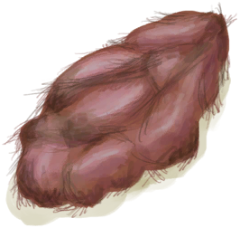
 [食丸](GastricPellet.md)](GastricPellet.md)

[

 [收纳箱](Trunk.md)](Trunk.md)

[

 [收起的帐篷](TentPacked.md)](TentPacked.md)

[

 [手机](PhoneOff.md)](PhoneOff.md)

[

 [手机](PhoneOn.md)](PhoneOn.md)

[

 [手机](PhoneOnLight.md)](PhoneOnLight.md)

[

 [手钻](FirePlow.md)](FirePlow.md)

[

 [手钻](HandDrill.md)](HandDrill.md)

[

 [受精蛋](EggPartridgeFertilized.md)](EggPartridgeFertilized.md)

[

 [受伤的猕猴](MacaqueWounded.md)](MacaqueWounded.md)

[

 [熟参薯酱](YamJamCooked.md)](YamJamCooked.md)

[

 [熟的炸香蕉](FriedBananasCooked.md)](FriedBananasCooked.md)

[

 [树叶](LeavesFresh.md)](LeavesFresh.md)

[

 [水壶](Canteen.md)](Canteen.md)

[

 [水椰子](NipaFruit.md)](NipaFruit.md)

[

 [睡袋](BedRoll.md)](BedRoll.md)

[

 [松软的海螺肉](ConchMeatSoft.md)](ConchMeatSoft.md)

[

 [塑料布](PlasticSheet.md)](PlasticSheet.md)

[

 [塑料袋](SackPlastic.md)](SackPlastic.md)

[

 [塑料瓶](PlasticBottle.md)](PlasticBottle.md)

[

 [塑料瓶](PlasticBottleFull.md)](PlasticBottleFull.md)

[

 [碎海螺壳](ConchBroken.md)](ConchBroken.md)

[

 [糖](Sugar.md)](Sugar.md)

[

 [陶罐](ClayVase.md)](ClayVase.md)

[

 [陶碗](ClayBowl.md)](ClayBowl.md)

[

 [铜](Copper.md)](Copper.md)

[

 [铜板](CopperSheet.md)](CopperSheet.md)

[

 [铜罐](CopperJar.md)](CopperJar.md)

[铜箭矢](ArrowCopper.md)

[

 [铜矿石](CopperOre.md)](CopperOre.md)

[

 [铜针](CopperNeedle.md)](CopperNeedle.md)

[

 [铜制贝壳](CopperDecoration_Seashell.md)](CopperDecoration_Seashell.md)

[

 [铜制餐具](EatingUtensilsCopper.md)](EatingUtensilsCopper.md)

[
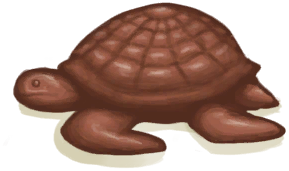
 [铜制乌龟](CopperDecoration_Turtle.md)](CopperDecoration_Turtle.md)

[

 [铜制装饰品](CopperDecoration_Mold.md)](CopperDecoration_Mold.md)

[

 [头骨](Skull.md)](Skull.md)

[

 [投石索](Sling.md)](Sling.md)

[

 [瓦斯炉](GasCookerOff.md)](GasCookerOff.md)

[

 [韦斯顿](Weston.md)](Weston.md)

[

 [未熬制的胶水](GlueUncooked.md)](GlueUncooked.md)

[

 [未烹饪的参薯酱](YamJamUncooked.md)](YamJamUncooked.md)

[

 [未烹饪的参薯咖喱](YamCurryUncooked.md)](YamCurryUncooked.md)

[

 [未烹饪的炒菇球](FriedPuffballsUncooked.md)](FriedPuffballsUncooked.md)

[

 [未烹饪的蛋白棒](ProteinBarUncooked.md)](ProteinBarUncooked.md)

[

 [未烹饪的蛋炒饭](EggFriedRiceUncooked.md)](EggFriedRiceUncooked.md)

[

 [未烹饪的骨头汤](BoneBrothUncooked.md)](BoneBrothUncooked.md)

[

 [未烹饪的黄油牡蛎](ButterBakedOystersUncooked.md)](ButterBakedOystersUncooked.md)

[

 [未烹饪的姜糖](CandiedGingerUncooked.md)](CandiedGingerUncooked.md)

[

 [未烹饪的辣炒巨蜥肉](LizardFryUncooked.md)](LizardFryUncooked.md)

[

 [未烹饪的猕猴肉串](MacaqueSkewersUncooked.md)](MacaqueSkewersUncooked.md)

[

 [未烹饪的蜜糖](HoneyCandyUncooked.md)](HoneyCandyUncooked.md)

[

 [未烹饪的蜜汁火腿](HoneyGlazedPorkUncooked.md)](HoneyGlazedPorkUncooked.md)

[

 [未烹饪的热带烤鸡](IslandChickenUncooked.md)](IslandChickenUncooked.md)

[

 [未烹饪的肉食盛宴](HeartyFeastUncooked.md)](HeartyFeastUncooked.md)

[

 [未烹饪的西米蛋糕](SagoCakeUncooked.md)](SagoCakeUncooked.md)

[

 [未烹饪的西米糕](SagoSlimeUncooked.md)](SagoSlimeUncooked.md)

[

 [未烹饪的羊汤](GoatStewUncooked.md)](GoatStewUncooked.md)

[

 [未烹饪的椰子鱼](CoconutFishUncooked.md)](CoconutFishUncooked.md)

[

 [未烹饪的鱼肉蛋饼](FishOmeletteUncooked.md)](FishOmeletteUncooked.md)

[

 [未烹饪的炸香蕉](FriedBananasUncooked.md)](FriedBananasUncooked.md)

[

 [未烹饪的炸鱼薯条](FishNChipsUncooked.md)](FishNChipsUncooked.md)

[

 [未烹饪的醉蟹](DrunkenCrabUncooked.md)](DrunkenCrabUncooked.md)

[

 [未烧制的保鲜罐](ClayPotCoolerUnfired.md)](ClayPotCoolerUnfired.md)

[

 [未烧制的烹饪锅](CookingPotUnfired.md)](CookingPotUnfired.md)

[

 [未烧制的陶罐](ClayVaseUnfinished.md)](ClayVaseUnfinished.md)

[

 [未烧制的陶罐](ClayVaseUnfired.md)](ClayVaseUnfired.md)

[

 [未烧制的陶碗](ClayBowlUnfired.md)](ClayBowlUnfired.md)

[

 [未烧制的小陶罐](ClayJarUnfired.md)](ClayJarUnfired.md)

[

 [未烧制的熏蜂器](BeeSmokerUnfired.md)](BeeSmokerUnfired.md)

[

 [未烧制的釉面陶罐](GlazedVaseUnfired.md)](GlazedVaseUnfired.md)

[

 [未烧制的粘土火盆](ClayFirePitUnfired.md)](ClayFirePitUnfired.md)

[

 [未烧制的蒸馏器](AlembicUnfired.md)](AlembicUnfired.md)

[

 [未完成的木雕](WoodCarving_Unfinished.md)](WoodCarving_Unfinished.md)

[

 [无线电](Radio.md)](Radio.md)

[

 [西米粉](SagoFlour.md)](SagoFlour.md)

[

 [西米浆](SagoPulp.md)](SagoPulp.md)

[

 [西米树芯](SagoSawdust.md)](SagoSawdust.md)

[

 [西米树种](SagoSeeds.md)](SagoSeeds.md)

[

 [蜥蜴](Lizard.md)](Lizard.md)

[

 [蜥蜴生皮](SkinFreshReptile.md)](SkinFreshReptile.md)

[

 [细土](FineDirt.md)](FineDirt.md)

[

 [细线](CordFiber.md)](CordFiber.md)

[

 [虾](Prawns.md)](Prawns.md)

[

 [纤维](Fibers.md)](Fibers.md)

[

 [线团](YarnFiber.md)](YarnFiber.md)

[

 [香蕉树芯](BananaStem.md)](BananaStem.md)

[

 [香茅蜡烛](CandleCitronellaOff.md)](CandleCitronellaOff.md)

[

 [香茅蜡烛](CandleCitronellaOn.md)](CandleCitronellaOn.md)

[

 [硝石晶体](NiterCrystals.md)](NiterCrystals.md)

[

 [硝酸钾](Saltpeter.md)](Saltpeter.md)

[

 [小灰山鹑尸体](PartridgeChickDead.md)](PartridgeChickDead.md)

[

 [小拉车](Travois.md)](Travois.md)

[

 [小人木雕（男）](WoodCarving_Man.md)](WoodCarving_Man.md)

[

 [小人木雕（女）](WoodCarving_Woman.md)](WoodCarving_Woman.md)

[

 [小树枝](Sticks.md)](Sticks.md)

[

 [小陶罐](ClayJar.md)](ClayJar.md)

[
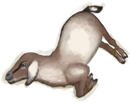
 [小羊](GoatTiedKid.md)](GoatTiedKid.md)

[

 [小羊尸体](GoatCarcassKid.md)](GoatCarcassKid.md)

[

 [小猪](BoarTiedPiglet.md)](BoarTiedPiglet.md)

[

 [小猪尸体](BoarCarcassPiglet.md)](BoarCarcassPiglet.md)

[

 [泻立停](AntiDiarrhoeaPills.md)](AntiDiarrhoeaPills.md)

[

 [新鲜兽皮](SkinFresh.md)](SkinFresh.md)

[

 [信号弹](FlareHand.md)](FlareHand.md)

[

 [信号镜](SignalingMirror.md)](SignalingMirror.md)

[

 [行李箱](LuggageA.md)](LuggageA.md)

[

 [行李箱](LuggageB.md)](LuggageB.md)

[

 [行李箱](LuggageC.md)](LuggageC.md)

[

 [行李箱](LuggageD.md)](LuggageD.md)

[

 [雄灰山鹑](PartridgeMaleLive.md)](PartridgeMaleLive.md)

[

 [熏蜂器](BeeSmokerOff.md)](BeeSmokerOff.md)

[

 [熏蜂器](BeeSmokerOn.md)](BeeSmokerOn.md)

[

 [压缩干粮包](FoodRationsPackage.md)](FoodRationsPackage.md)

[

 [腌制中的巨蜥肉](MonitorMeatSaltedDrying.md)](MonitorMeatSaltedDrying.md)

[

 [腌制中的猕猴肉](MacaqueMeatSaltedDrying.md)](MacaqueMeatSaltedDrying.md)

[

 [腌制中的咸鱼肉](FishSaltedDrying.md)](FishSaltedDrying.md)

[

 [腌制中的羊肉](GoatMeatSaltedDrying.md)](GoatMeatSaltedDrying.md)

[

 [盐](Salt.md)](Salt.md)

[

 [眼镜蛇尸体](CobraDead.md)](CobraDead.md)

[

 [羊肉](GoatMeat.md)](GoatMeat.md)

[

 [椰壶](CoconutFlask.md)](CoconutFlask.md)

[

 [椰子](Coconut.md)](Coconut.md)

[

 [椰子壳](CoconutShell.md)](CoconutShell.md)

[

 [椰子皮](CoconutHusk.md)](CoconutHusk.md)

[

 [野猪肉](BoarMeat.md)](BoarMeat.md)

[

 [野猪尸体](BoarCarcass.md)](BoarCarcass.md)

[

 [野猪牙](Tusk.md)](Tusk.md)

[

 [一串香蕉](BananaHand.md)](BananaHand.md)

[

 [椅子](Chair.md)](Chair.md)

[

 [应急水包](WaterRation.md)](WaterRation.md)

[

 [应急水袋](WaterRationsPackage.md)](WaterRationsPackage.md)

[

 [婴儿](Baby.md)](Baby.md)

[

 [鹦哥鱼](ParrotFish.md)](ParrotFish.md)

[

 [油桶](Jerrycan.md)](Jerrycan.md)

[

 [诱捕笼](CageTrap.md)](CageTrap.md)

[

 [釉面陶罐](GlazedVase.md)](GlazedVase.md)

[

 [鱼叉](SpearFishing.md)](SpearFishing.md)

[

 [鱼饵](FishBait.md)](FishBait.md)

[

 [鱼片](FishSlices.md)](FishSlices.md)

[

 [鱼杂](FishScraps.md)](FishScraps.md)

[

 [羽毛](Feathers.md)](Feathers.md)

[

 [原木](Log.md)](Log.md)

[

 [晕船药](SeasicknessPills.md)](SeasicknessPills.md)

[

 [杂菌](AssortedMushrooms.md)](AssortedMushrooms.md)

[

 [炸‍葯](DynamiteOff.md)](DynamiteOff.md)

[

 [炸‍葯](DynamiteOn.md)](DynamiteOn.md)

[

 [粘土](Clay.md)](Clay.md)

[

 [粘土火盆](ClayFirePitExtinguished.md)](ClayFirePitExtinguished.md)

[

 [长木棍](StickLong.md)](StickLong.md)

[

 [针线](BoneNeedleThreaded.md)](BoneNeedleThreaded.md)

[

 [针线](CopperNeedleThreaded.md)](CopperNeedleThreaded.md)

[
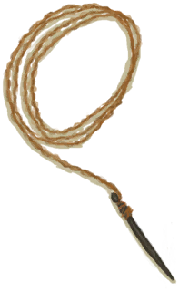
 [针线](WoodenNeedleThreaded.md)](WoodenNeedleThreaded.md)

[

 [珍珠](Pearl.md)](Pearl.md)

[

 [蒸馏器](AlembicUndeployed.md)](AlembicUndeployed.md)

[

 [脂肪](Fat.md)](Fat.md)

[

 [蜘蛛兰叶](SpiderLilyLeaves.md)](SpiderLilyLeaves.md)

[

 [止‍疼薬](Painkillers.md)](Painkillers.md)

[

 [止血带](Tourniquet.md)](Tourniquet.md)

[

 [纸](Papers.md)](Papers.md)

[

 [中陷阱的猕猴](CageTrapMacaque.md)](CageTrapMacaque.md)

[

 [忠犬朋友](DogFriend.md)](DogFriend.md)

[

 [侏儒牙雕（男）](TuskCarving_GnomeMale.md)](TuskCarving_GnomeMale.md)

[

 [侏儒牙雕（女）](TuskCarving_GnomeFemale.md)](TuskCarving_GnomeFemale.md)

[

 [猪食](FeedBoar.md)](FeedBoar.md)

[
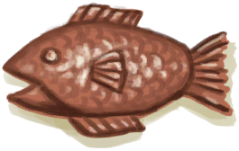
 [铸铜鱼雕](CopperDecoration_Fish.md)](CopperDecoration_Fish.md)

[

 [装饰品模具](MoldCopperDecoration.md)](MoldCopperDecoration.md)

[

 [装有燃料的油桶](JerrycanFuel.md)](JerrycanFuel.md)

[

 [棕榈编织物](WeavePalm.md)](WeavePalm.md)

[

 [棕榈丛种子](PalmBushSeeds.md)](PalmBushSeeds.md)

[

 [棕榈叶](PalmFronds.md)](PalmFronds.md)

[

 [座椅](Seat.md)](Seat.md)

[NONAME](Duplicator.md)

  
  
  

