# 物品  
## 工具  

<a href="SafetyKnife.md" style="color:black">安全刀</a>

<a href="ShovelHead.md" style="color:black">铲子头</a>

<a href="StoneHeavy.md" style="color:black">大石块</a>

<a href="KnifeCopperBlunt.md" style="color:black">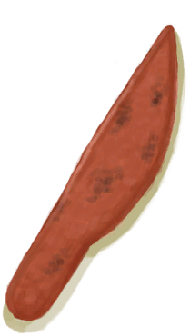钝刀</a>

<a href="KnifeMilitaryBlunt.md" style="color:black">钝刀</a>

<a href="AxeSurvivalBlunt.md" style="color:black">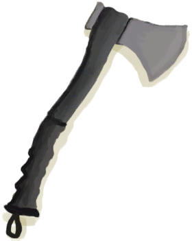钝的求生斧</a>

<a href="AxeHeadBlunt.md" style="color:black">钝斧子头</a>

<a href="SpearHeadBlunt.md" style="color:black">钝矛头</a>

<a href="ShovelScrap.md" style="color:black">废金属铲</a>

<a href="KnifeScrap.md" style="color:black">废金属刀</a>

<a href="AxeScrap.md" style="color:black">废金属斧</a>

<a href="AxeHead.md" style="color:black">斧子头</a>

<a href="KnifeBone.md" style="color:black">骨刀</a>

<a href="KnifeObsidian.md" style="color:black">黑曜石刀</a>

<a href="Geode.md" style="color:black">晶洞</a>

<a href="KnifeMilitary.md" style="color:black">军刀</a>

<a href="StoneHeavyBrimstone.md" style="color:black">硫磺石</a>

<a href="SpearHead.md" style="color:black">矛头</a>

<a href="Oyster.md" style="color:black">牡蛎</a>

<a href="ShovelWooden.md" style="color:black">木铲</a>

<a href="AxeSurvival.md" style="color:black">求生斧</a>

<a href="StoneSharpened.md" style="color:black">石刀</a>

<a href="StoneAxe.md" style="color:black">石斧</a>

<a href="Stone.md" style="color:black">石头</a>

<a href="Flint.md" style="color:black">燧石</a>

<a href="FlintSlab.md" style="color:black">燧石板</a>

<a href="KnifeFlint.md" style="color:black">燧石刀</a>

<a href="AxeFlint.md" style="color:black">燧石斧</a>

<a href="ShovelCopper.md" style="color:black">铜铲</a>

<a href="KnifeCopper.md" style="color:black">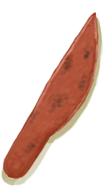铜刀</a>

<a href="AxeCopper.md" style="color:black">铜斧</a>

<a href="CeremonialDagger.md" style="color:black">仪式匕首</a>

<a href="KnifeGrandpa.md" style="color:black">祖父的刀</a>

<a href="KnifeGrandpaBlunt.md" style="color:black">祖父的钝刀</a>

  
  
## 装备  

<a href="HandWrappings.md" style="color:black">绑手带</a>

<a href="FootWrappings.md" style="color:black">包脚布</a>

<a href="SeashellNecklace.md" style="color:black">贝壳项链</a>

<a href="BackpackTourist.md" style="color:black">背包</a>

<a href="BackpackBasket.md" style="color:black">背篓</a>

<a href="PantsCloth.md" style="color:black">布制裤子</a>

<a href="AshDressing.md" style="color:black">草木灰敷料</a>

<a href="LeafSKirt.md" style="color:black">草裙</a>

<a href="ShirtFiber.md" style="color:black">衬衫</a>

<a href="Shorts.md" style="color:black">短裤</a>

<a href="Shield.md" style="color:black">盾牌</a>

<a href="GasMaskRustic.md" style="color:black">防毒面具</a>

<a href="BeeSuit.md" style="color:black">防蜂服</a>

<a href="SpearScrap.md" style="color:black">废金属长矛</a>

<a href="Bellows.md" style="color:black">风箱</a>

<a href="SeagullCharm.md" style="color:black">海鸥护符</a>

<a href="SpearObsidian.md" style="color:black">黑曜石长矛</a>

<a href="GourdBottle.md" style="color:black">葫芦瓶</a>

<a href="BowRustic.md" style="color:black">简易的弓</a>

<a href="Quiver.md" style="color:black">箭筒</a>

<a href="MilitaryPants.md" style="color:black">军裤</a>

<a href="MilitaryBoots.md" style="color:black">军靴</a>

<a href="BeltMilitary.md" style="color:black">军用皮带</a>

<a href="Satchel.md" style="color:black">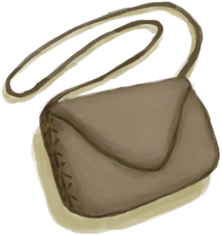挎包</a>

<a href="SatchelHunter.md" style="color:black">挎包</a>

<a href="ImprovisedDressing.md" style="color:black">临时绷带</a>

<a href="MaskMakeshift.md" style="color:black">临时防毒面具</a>

<a href="MacaqueFriend.md" style="color:black">猕猴朋友</a>

<a href="Underwear.md" style="color:black">内裤</a>

<a href="BackpackLeather.md" style="color:black">皮革背包</a>

<a href="LeatherGloves.md" style="color:black">皮革手套</a>

<a href="LeatherShoes.md" style="color:black">皮革鞋子</a>

<a href="LeatherPants.md" style="color:black">皮裤</a>

<a href="HatSurvival.md" style="color:black">求生帽</a>

<a href="Flipflops.md" style="color:black">人字拖</a>

<a href="SharkHeadpiece.md" style="color:black">鲨鱼头饰</a>

<a href="WoundDressing.md" style="color:black">伤口敷料</a>

<a href="BackpackSurvivalist.md" style="color:black">生存者背包</a>

<a href="Rope.md" style="color:black">绳子</a>

<a href="Waterskin.md" style="color:black">水袋</a>

<a href="SpearFlint.md" style="color:black">燧石长矛</a>

<a href="StrawCape.md" style="color:black">蓑衣</a>

<a href="CopperBottle.md" style="color:black">铜瓶</a>

<a href="CopperNecklace.md" style="color:black">铜项链</a>

<a href="SpearCopper.md" style="color:black">铜长矛</a>

<a href="HeadWrappings.md" style="color:black">头巾</a>

<a href="Socks.md" style="color:black">袜子</a>

<a href="HoodieRetromation.md" style="color:black">卫衣</a>

<a href="LizardDrum.md" style="color:black">蜥蜴皮手鼓</a>

<a href="HawaiianShirt.md" style="color:black">夏威夷衬衫</a>

<a href="FlowerNecklace.md" style="color:black">鲜花项链</a>

<a href="Camera.md" style="color:black">相机</a>

<a href="CollarTV.md" style="color:black">项圈</a>

<a href="Glasses.md" style="color:black">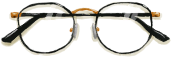眼镜</a>

<a href="BeltBag.md" style="color:black">腰包</a>

<a href="CoconutSandals.md" style="color:black">椰子凉鞋</a>

<a href="LeafDressing.md" style="color:black">叶片绷带</a>

<a href="HarpoonBone.md" style="color:black">鱼镖</a>

<a href="Raincoat.md" style="color:black">雨衣</a>

<a href="Sneakers.md" style="color:black">运动鞋</a>

<a href="PearlNecklace.md" style="color:black">珍珠项链</a>

<a href="HatWoven.md" style="color:black">棕榈编织帽</a>

<a href="T-Shirt.md" style="color:black">T恤</a>

  
  
## 食物  

<a href="YamJam.md" style="color:black">参薯酱</a>

<a href="YamCurry.md" style="color:black">参薯咖喱</a>

<a href="BeeHoneycomb.md" style="color:black">巢脾</a>

<a href="FriedPuffballs.md" style="color:black">炒菇球</a>

<a href="ProteinBar.md" style="color:black">蛋白棒</a>

<a href="EggFriedRice.md" style="color:black">蛋炒饭</a>

<a href="GoatStew.md" style="color:black">炖羊汤</a>

<a href="SagoFlatbreadHoney.md" style="color:black">蜂蜜西米饼</a>

<a href="BoneBroth.md" style="color:black">骨头汤</a>

<a href="SagoFlatbreadJam.md" style="color:black">果酱西米饼</a>

<a href="ButterBakedOystersCooked.md" style="color:black">黄油焗牡蛎</a>

<a href="OysterMeatBaked.md" style="color:black">黄油焗牡蛎</a>

<a href="ChickenSandwich.md" style="color:black">鸡肉三明治</a>

<a href="CandiedGinger.md" style="color:black">姜糖</a>

<a href="CoffeeBerries.md" style="color:black">咖啡果</a>

<a href="BonefishCooked.md" style="color:black">烤北梭鱼</a>

<a href="BatCooked.md" style="color:black">烤蝙蝠</a>

<a href="MudskipperCooked.md" style="color:black">烤弹涂鱼</a>

<a href="EggCooked.md" style="color:black">烤蛋</a>

<a href="GoatfishCooked.md" style="color:black">烤绯鲤</a>

<a href="HerringCooked.md" style="color:black">烤鲱鱼</a>

<a href="UrchinMeatCooked.md" style="color:black">烤海胆</a>

<a href="SeahoundCooked.md" style="color:black">烤海怪肉</a>

<a href="ConchMeatCooked.md" style="color:black">烤海螺肉</a>

<a href="MonitorMeatCooked.md" style="color:black">烤巨蜥肉</a>

<a href="MouseCooked.md" style="color:black">烤老鼠</a>

<a href="ThreadfinCooked.md" style="color:black">烤马鲅鱼</a>

<a href="MacaqueMeatCooked.md" style="color:black">烤猕猴肉</a>

<a href="OysterMeatCooked.md" style="color:black">烤牡蛎肉</a>

<a href="BirdMeatCooked.md" style="color:black">烤鸟肉</a>

<a href="CrabCooked.md" style="color:black">烤螃蟹</a>

<a href="TropicalAlmondsRoasted.md" style="color:black">烤热带杏仁</a>

<a href="SharkCooked.md" style="color:black">烤鲨鱼肉</a>

<a href="SnakeCooked.md" style="color:black">烤蛇肉</a>

<a href="GrouperMeatCooked.md" style="color:black">烤石斑鱼</a>

<a href="LizardCooked.md" style="color:black">烤蜥蜴</a>

<a href="PrawnsCooked.md" style="color:black">烤虾</a>

<a href="GoatMeatCooked.md" style="color:black">烤羊肉</a>

<a href="CoconutMeatCooked.md" style="color:black">烤椰肉</a>

<a href="BoarMeatCooked.md" style="color:black">烤野猪肉</a>

<a href="ParrotFishCooked.md" style="color:black">烤鹦哥鱼</a>

<a href="LizardFry.md" style="color:black">辣炒巨蜥肉</a>

<a href="Chilies.md" style="color:black">辣椒</a>

<a href="Puffballs.md" style="color:black">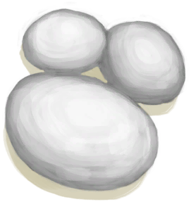马勃菌</a>

<a href="Mango.md" style="color:black">芒果</a>

<a href="MacaqueSkewers.md" style="color:black">猕猴肉串</a>

<a href="MacaqueMeatDried.md" style="color:black">猕猴肉干</a>

<a href="RiceCooked.md" style="color:black">米饭</a>

<a href="HoneyCandy.md" style="color:black">蜜糖</a>

<a href="HoneyGlazedPork.md" style="color:black">蜜汁火腿</a>

<a href="Chocolate.md" style="color:black">巧克力</a>

<a href="IslandChicken.md" style="color:black">热带烤鸡</a>

<a href="TropicalAlmondKernels.md" style="color:black">热带杏仁核</a>

<a href="HeartyFeast.md" style="color:black">肉食盛宴</a>

<a href="Cheese.md" style="color:black">山羊奶酪</a>

<a href="Sushi.md" style="color:black">寿司</a>

<a href="NipaSeeds.md" style="color:black">水椰籽</a>

<a href="ConchMeatSoftCooked.md" style="color:black">松软的烤海螺肉</a>

<a href="AlienNodule.md" style="color:black">外星结节</a>

<a href="SagoFlatbread.md" style="color:black">西米饼</a>

<a href="SagoCake.md" style="color:black">西米蛋糕</a>

<a href="SagoSlime.md" style="color:black">西米糕</a>

<a href="FishSalted.md" style="color:black">咸鱼</a>

<a href="Banana.md" style="color:black">香蕉</a>

<a href="FoodRation.md" style="color:black">压缩干粮</a>

<a href="BonefishSmoked.md" style="color:black">烟熏北梭鱼</a>

<a href="GoatfishSmoked.md" style="color:black">烟熏绯鲤</a>

<a href="MonitorMeatSmoked.md" style="color:black">烟熏巨蜥肉</a>

<a href="ThreadfinSmoked.md" style="color:black">烟熏马鲅鱼</a>

<a href="MacaqueMeatSmoked.md" style="color:black">烟熏猕猴肉</a>

<a href="BirdMeatSmoked.md" style="color:black">烟熏鸟肉</a>

<a href="SharkSmoked.md" style="color:black">烟熏鲨鱼肉</a>

<a href="GrouperMeatSmoked.md" style="color:black">烟熏石斑鱼</a>

<a href="GoatMeatSmoked.md" style="color:black">烟熏羊肉</a>

<a href="BoarMeatSmoked.md" style="color:black">烟熏野猪肉</a>

<a href="ParrotFishSmoked.md" style="color:black">烟熏鹦哥鱼</a>

<a href="MacaqueMeatSalted.md" style="color:black">腌猕猴肉</a>

<a href="GoatMeatSalted.md" style="color:black">腌羊肉</a>

<a href="BoarMeatSalted.md" style="color:black">腌野猪肉</a>

<a href="BoarMeatSaltedDrying.md" style="color:black">腌制中的野猪肉</a>

<a href="GoatMeatDried.md" style="color:black">羊肉干</a>

<a href="CoconutMeat.md" style="color:black">椰肉</a>

<a href="CoconutFish.md" style="color:black">椰子鱼</a>

<a href="JujubeFruits.md" style="color:black">野枣</a>

<a href="BoarMeatDried.md" style="color:black">野猪肉干</a>

<a href="FishDried.md" style="color:black">鱼干</a>

<a href="FishOmelette.md" style="color:black">鱼肉蛋饼</a>

<a href="FishTaco.md" style="color:black">鱼肉塔可</a>

<a href="FriedBanana.md" style="color:black">炸香蕉</a>

<a href="FishNChips.md" style="color:black">炸鱼薯条</a>

<a href="YamBoiled.md" style="color:black">煮熟的参薯</a>

<a href="DrunkenCrab.md" style="color:black">醉蟹</a>

  
  
## 食材  

<a href="BonefishMeat.md" style="color:black">北梭鱼肉</a>

<a href="Bat.md" style="color:black">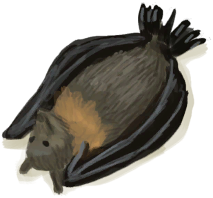蝙蝠尸体</a>

<a href="SnakeSkinned.md" style="color:black">剥皮的蛇</a>

<a href="YamCut.md" style="color:black">参薯片</a>

<a href="Bugs.md" style="color:black">虫子</a>

<a href="JungleSalad.md" style="color:black">丛林沙拉</a>

<a href="Mudskipper.md" style="color:black">弹涂鱼</a>

<a href="Egg.md" style="color:black">蛋</a>

<a href="KavaRootGround.md" style="color:black">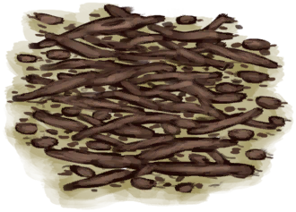捣碎的卡瓦根</a>

<a href="JasmineFlowersGround.md" style="color:black">捣碎的茉莉花</a>

<a href="LemonGrassGround.md" style="color:black">捣碎的柠檬草</a>

<a href="SnakeGrassGround.md" style="color:black">捣碎的蛇草</a>

<a href="SpiderLilyGround.md" style="color:black">捣碎的蜘蛛兰</a>

<a href="Goatfish.md" style="color:black">绯鲤</a>

<a href="Herring.md" style="color:black">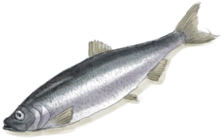鲱鱼</a>

<a href="RottenRemains.md" style="color:black">腐烂物</a>

<a href="GingerDried.md" style="color:black">干姜</a>

<a href="ChiliesDried.md" style="color:black">干辣椒</a>

<a href="KavaRootDried.md" style="color:black">干燥的卡瓦根</a>

<a href="SpiderLilyLeavesDried.md" style="color:black">干燥的蜘蛛兰叶</a>

<a href="UrchinMeat.md" style="color:black">海胆肉</a>

<a href="Seahoundmeat.md" style="color:black">海怪肉</a>

<a href="ConchMeat.md" style="color:black">海螺肉</a>

<a href="SeafoodCup.md" style="color:black">海鲜杂烩</a>

<a href="Seaweed.md" style="color:black">海藻</a>

<a href="Butter.md" style="color:black">黄油</a>

<a href="Ginger.md" style="color:black">姜</a>

<a href="GingerGround.md" style="color:black">姜末</a>

<a href="MonitorMeat.md" style="color:black">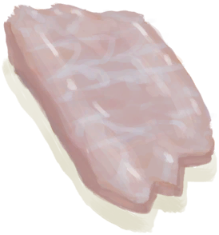巨蜥肉</a>

<a href="CoffeeBerryPulp.md" style="color:black">咖啡果浆</a>

<a href="KavaRoot.md" style="color:black">卡瓦根</a>

<a href="FishSlicesCooked.md" style="color:black">烤鱼片</a>

<a href="FishScrapsCooked.md" style="color:black">烤鱼杂</a>

<a href="Mouse.md" style="color:black">老鼠尸体</a>

<a href="AloeVeraGel.md" style="color:black">芦荟膏</a>

<a href="ThreadfinMeat.md" style="color:black">马鲅鱼肉</a>

<a href="MagicMushrooms.md" style="color:black">迷幻菇</a>

<a href="MacaqueMeat.md" style="color:black">猕猴肉</a>

<a href="JasmineFlowers.md" style="color:black">茉莉花</a>

<a href="OysterMeat.md" style="color:black">牡蛎肉</a>

<a href="BirdMeat.md" style="color:black">鸟肉</a>

<a href="LemongrassStalks.md" style="color:black">柠檬草</a>

<a href="Crab.md" style="color:black">螃蟹</a>

<a href="SharkMeat.md" style="color:black">鲨鱼肉</a>

<a href="CharredRemains.md" style="color:black">烧焦物</a>

<a href="EggPartridgeFertilized.md" style="color:black">受精蛋</a>

<a href="ConchMeatSoft.md" style="color:black">松软的海螺肉</a>

<a href="Sugar.md" style="color:black">糖</a>

<a href="GlueUncooked.md" style="color:black">未熬制的胶水</a>

<a href="YamJamUncooked.md" style="color:black">未烹饪的参薯酱</a>

<a href="YamCurryUncooked.md" style="color:black">未烹饪的参薯咖喱</a>

<a href="FriedPuffballsUncooked.md" style="color:black">未烹饪的炒菇球</a>

<a href="ProteinBarUncooked.md" style="color:black">未烹饪的蛋白棒</a>

<a href="EggFriedRiceUncooked.md" style="color:black">未烹饪的蛋炒饭</a>

<a href="BoneBrothUncooked.md" style="color:black">未烹饪的骨头汤</a>

<a href="ButterBakedOystersUncooked.md" style="color:black">未烹饪的黄油牡蛎</a>

<a href="CandiedGingerUncooked.md" style="color:black">未烹饪的姜糖</a>

<a href="LizardFryUncooked.md" style="color:black">未烹饪的辣炒巨蜥肉</a>

<a href="MacaqueSkewersUncooked.md" style="color:black">未烹饪的猕猴肉串</a>

<a href="HoneyCandyUncooked.md" style="color:black">未烹饪的蜜糖</a>

<a href="HoneyGlazedPorkUncooked.md" style="color:black">未烹饪的蜜汁火腿</a>

<a href="IslandChickenUncooked.md" style="color:black">未烹饪的热带烤鸡</a>

<a href="HeartyFeastUncooked.md" style="color:black">未烹饪的肉食盛宴</a>

<a href="SagoCakeUncooked.md" style="color:black">未烹饪的西米蛋糕</a>

<a href="SagoSlimeUncooked.md" style="color:black">未烹饪的西米糕</a>

<a href="GoatStewUncooked.md" style="color:black">未烹饪的羊汤</a>

<a href="CoconutFishUncooked.md" style="color:black">未烹饪的椰子鱼</a>

<a href="FishOmeletteUncooked.md" style="color:black">未烹饪的鱼肉蛋饼</a>

<a href="FriedBananasUncooked.md" style="color:black">未烹饪的炸香蕉</a>

<a href="FishNChipsUncooked.md" style="color:black">未烹饪的炸鱼薯条</a>

<a href="DrunkenCrabUncooked.md" style="color:black">未烹饪的醉蟹</a>

<a href="SagoFlour.md" style="color:black">西米粉</a>

<a href="SagoPulp.md" style="color:black">西米浆</a>

<a href="SagoSawdust.md" style="color:black">西米树芯</a>

<a href="Lizard.md" style="color:black">蜥蜴</a>

<a href="Prawns.md" style="color:black">虾</a>

<a href="BananaStem.md" style="color:black">香蕉树芯</a>

<a href="PartridgeChickDead.md" style="color:black">小灰山鹑尸体</a>

<a href="MacaqueMeatSaltedDrying.md" style="color:black">腌制中的猕猴肉</a>

<a href="FishSaltedDrying.md" style="color:black">腌制中的咸鱼肉</a>

<a href="GoatMeatSaltedDrying.md" style="color:black">腌制中的羊肉</a>

<a href="GoatMeat.md" style="color:black">羊肉</a>

<a href="BoarMeat.md" style="color:black">野猪肉</a>

<a href="ParrotFish.md" style="color:black">鹦哥鱼</a>

<a href="FishSlices.md" style="color:black">鱼片</a>

<a href="FishScraps.md" style="color:black">鱼杂</a>

<a href="ChinaRoseFlowers.md" style="color:black">月季</a>

<a href="AssortedMushrooms.md" style="color:black">杂菌</a>

<a href="Fat.md" style="color:black">脂肪</a>

<a href="SpiderLilyLeaves.md" style="color:black">蜘蛛兰叶</a>

  
  
## 其他  

<a href="GlueCooked.md" style="color:black">熬制好的胶水</a>

<a href="CoconutHalf.md" style="color:black">半个椰子</a>

<a href="HalfLog.md" style="color:black">半根原木</a>

<a href="ClayPotCoolerUndeployed.md" style="color:black">保鲜罐</a>

<a href="Bonefish.md" style="color:black">北梭鱼</a>

<a href="Basket.md" style="color:black">编织篓</a>

<a href="MonitorSkinned.md" style="color:black">剥皮的巨蜥</a>

<a href="GoatSkinned.md" style="color:black">剥皮的山羊</a>

<a href="GoatSkinnedKid.md" style="color:black">剥皮的小羊</a>

<a href="BoarSkinned.md" style="color:black">剥皮的野猪</a>

<a href="BoarSkinnedPiglet.md" style="color:black">剥皮的猪</a>

<a href="GoatTiedFemaleLactating.md" style="color:black">哺乳期山羊</a>

<a href="FishTrap.md" style="color:black">捕鱼陷阱</a>

<a href="Cloth.md" style="color:black">布</a>

<a href="Sack.md" style="color:black">布袋</a>

<a href="ClothSmall.md" style="color:black">布片</a>

<a href="Yam.md" style="color:black">参薯</a>

<a href="SpindleFiber.md" style="color:black">缠好的纺锤</a>

<a href="MoldShovel.md" style="color:black">铲头模具</a>

<a href="ClothVeryLarge.md" style="color:black">超大块布</a>

<a href="TrunkPerk.md" style="color:black">超级生存箱 2000</a>

<a href="Captain.md" style="color:black">船长</a>

<a href="PartridgeFemaleLive.md" style="color:black">雌灰山鹑</a>

<a href="GiantConch.md" style="color:black">大海螺</a>

<a href="ClothLarge.md" style="color:black">大块的布</a>

<a href="KingThreadfin.md" style="color:black">大马鲅鱼</a>

<a href="WeevilLilyLeaves.md" style="color:black">大叶仙茅叶片</a>

<a href="CoconutPerforated.md" style="color:black">带孔椰子</a>

<a href="MoldKnife.md" style="color:black">刀模具</a>

<a href="RiceStraw.md" style="color:black">稻杆</a>

<a href="RiceStalks.md" style="color:black">稻秆</a>

<a href="RiceGrains.md" style="color:black">稻米</a>

<a href="FishingRod.md" style="color:black">钓鱼竿</a>

<a href="FishingRodBait.md" style="color:black">钓鱼竿（已添加诱饵）</a>

<a href="FishingLine.md" style="color:black">钓鱼线</a>

<a href="FishingLineRustic.md" style="color:black">钓鱼线</a>

<a href="FishingLineBait.md" style="color:black">钓鱼线（已添加诱饵）</a>

<a href="FishingLineRusticBait.md" style="color:black">钓鱼线（已添加诱饵）</a>

<a href="StoneHeavyBurnt.md" style="color:black">煅烧后的大石块</a>

<a href="MortarBurnt.md" style="color:black">煅烧后的砂浆</a>

<a href="StoneBurnt.md" style="color:black">煅烧后的石头</a>

<a href="Calcite.md" style="color:black">方解石晶体</a>

<a href="SunScreen.md" style="color:black">防晒霜</a>

<a href="Spindle.md" style="color:black">纺锤</a>

<a href="Fertilizer.md" style="color:black">肥料</a>

<a href="SoapDry.md" style="color:black">肥皂</a>

<a href="CopperDecoration_Failed.md" style="color:black">废铜</a>

<a href="Manure.md" style="color:black">粪便</a>

<a href="QueenBee.md" style="color:black">蜂后</a>

<a href="Beeswax.md" style="color:black">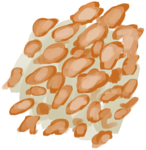蜂蜡</a>

<a href="BeeswaxBlock.md" style="color:black">蜂蜡块</a>

<a href="MoldAxe.md" style="color:black">斧头模具</a>

<a href="CoconutRotten.md" style="color:black">腐烂的椰子</a>

<a href="GlueDry.md" style="color:black">干胶水</a>

<a href="DirtPile.md" style="color:black">干土堆</a>

<a href="BarkCinchonaDried.md" style="color:black">干燥的金鸡纳树皮</a>

<a href="MortarDry.md" style="color:black">干燥的砂浆</a>

<a href="BowDrill.md" style="color:black">弓钻</a>

<a href="GoatTiedMale.md" style="color:black">公山羊</a>

<a href="BoarTiedMale.md" style="color:black">公猪</a>

<a href="Bonemeal.md" style="color:black">骨粉</a>

<a href="HookBone.md" style="color:black">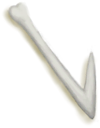骨钩</a>

<a href="Bones.md" style="color:black">骨头</a>

<a href="BoneSplinters.md" style="color:black">骨头碎片</a>

<a href="BoneNeedle.md" style="color:black">骨针</a>

<a href="Drum.md" style="color:black">鼓</a>

<a href="SkinFleshed.md" style="color:black">刮净的皮</a>

<a href="SkinFleshedReptile.md" style="color:black">刮净的蜥蜴皮</a>

<a href="Urchin.md" style="color:black">海胆</a>

<a href="SeahoundCarcass.md" style="color:black">海怪尸体</a>

<a href="Conch.md" style="color:black">海螺</a>

<a href="Guano.md" style="color:black">海鸟粪</a>

<a href="WoodCarving_Seagull.md" style="color:black">海鸥木雕</a>

<a href="SeagullDead.md" style="color:black">海鸥尸体</a>

<a href="SeagullCarcass.md" style="color:black">海鸥遗骸</a>

<a href="SeaKraitDead.md" style="color:black">海蛇尸体</a>

<a href="Obsidian.md" style="color:black">黑曜石</a>

<a href="Passport.md" style="color:black">护照</a>

<a href="Ash.md" style="color:black">灰烬</a>

<a href="PartridgeDead.md" style="color:black">灰山鹑尸体</a>

<a href="PartridgeCarcass.md" style="color:black">灰山鹑遗骸</a>

<a href="TorchOff.md" style="color:black">火把</a>

<a href="TorchOn.md" style="color:black">火把</a>

<a href="Embers.md" style="color:black">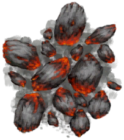火炭</a>

<a href="TinderLit.md" style="color:black">火种</a>

<a href="FirstAidKitLifeRaft.md" style="color:black">急救包</a>

<a href="FirstAidKitPlane.md" style="color:black">急救包</a>

<a href="FirstAidKitTrunk.md" style="color:black">急救包</a>

<a href="ContainerBagA.md" style="color:black">集装袋</a>

<a href="ContainerBagB.md" style="color:black">集装袋</a>

<a href="Splint.md" style="color:black">夹板</a>

<a href="ArrowSimple.md" style="color:black">简易箭矢</a>

<a href="SpearRustic.md" style="color:black">简易长矛</a>

<a href="TourniquetRustic.md" style="color:black">简易止血带</a>

<a href="CandiedGingerCooked.md" style="color:black">姜糖</a>

<a href="Glue.md" style="color:black">胶水</a>

<a href="BarkCinchona.md" style="color:black">金鸡纳树皮</a>

<a href="QuininePowder.md" style="color:black">金鸡纳树皮粉</a>

<a href="MetalScrap.md" style="color:black">金属废料</a>

<a href="WaterPurificationTablets.md" style="color:black">净水片</a>

<a href="MonitorCarcass.md" style="color:black">巨蜥尸体</a>

<a href="CoffeeBeans.md" style="color:black">咖啡豆</a>

<a href="Antibiotics.md" style="color:black">抗生素</a>

<a href="CoffeeRoastedBeans.md" style="color:black">烤咖啡豆</a>

<a href="GunEmpty.md" style="color:black">空的手枪</a>

<a href="BeeSkepEmpty.md" style="color:black">空蜂箱</a>

<a href="LeavesDry.md" style="color:black">枯叶</a>

<a href="CandleOff.md" style="color:black">蜡烛</a>

<a href="CandleOn.md" style="color:black">蜡烛</a>

<a href="ChiliPowder.md" style="color:black">辣椒粉</a>

<a href="Brimstone.md" style="color:black">硫磺</a>

<a href="BrimstoneGel.md" style="color:black">硫磺膏</a>

<a href="QuinineSulfate.md" style="color:black">硫酸奎宁</a>

<a href="AloeVeraLeaf.md" style="color:black">芦荟叶</a>

<a href="MoldSpear.md" style="color:black">矛头模具</a>

<a href="MacaqueCarcass.md" style="color:black">猕猴尸体</a>

<a href="Bees.md" style="color:black">蜜蜂</a>

<a href="HoneyCandyCooked.md" style="color:black">蜜糖</a>

<a href="ClayJarJasmine.md" style="color:black">茉莉花</a>

<a href="PlasticBottleJasmine.md" style="color:black">茉莉花</a>

<a href="CandleJasmineOff.md" style="color:black">茉莉蜡烛</a>

<a href="CandleJasmineOn.md" style="color:black">茉莉蜡烛</a>

<a href="GoatTiedFemale.md" style="color:black">母山羊</a>

<a href="BoarTiedFemale.md" style="color:black">母猪</a>

<a href="Plank.md" style="color:black">木板</a>

<a href="Wood.md" style="color:black">木材</a>

<a href="Treenail.md" style="color:black">木钉</a>

<a href="HandleWood.md" style="color:black">木斧柄</a>

<a href="Charcoal.md" style="color:black">木炭</a>

<a href="WoodShavings.md" style="color:black">木屑</a>

<a href="WoodenNeedle.md" style="color:black">木针</a>

<a href="EatingUtensilsWooden.md" style="color:black">木质餐具</a>

<a href="MudPile.md" style="color:black">泥堆</a>

<a href="MudBrick.md" style="color:black">泥砖</a>

<a href="Nest.md" style="color:black">鸟巢</a>

<a href="BonesBird.md" style="color:black">鸟骨</a>

<a href="FeedBird.md" style="color:black">鸟食</a>

<a href="Rennet.md" style="color:black">凝乳酶</a>

<a href="CookingPot.md" style="color:black">烹饪锅</a>

<a href="ProteinBarsCooked.md" style="color:black">烹饪好的蛋白棒</a>

<a href="SagoSlimeCooked.md" style="color:black">烹饪好的西米糕</a>

<a href="SeashellsPretty.md" style="color:black">漂亮贝壳</a>

<a href="Gun.md" style="color:black">枪</a>

<a href="CoconutHusked.md" style="color:black">青椰子</a>

<a href="BugRepellent.md" style="color:black">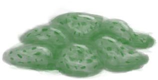驱虫膏</a>

<a href="FlareHandOn.md" style="color:black">燃烧的信号弹</a>

<a href="TropicalAlmonds.md" style="color:black">热带杏仁</a>

<a href="CuredSkinReptile.md" style="color:black">鞣制巨蜥皮</a>

<a href="CuredSkin.md" style="color:black">鞣制兽皮</a>

<a href="Broom.md" style="color:black">扫帚</a>

<a href="Sand.md" style="color:black">沙子</a>

<a href="Mortar.md" style="color:black">砂浆</a>

<a href="SharkCarcass.md" style="color:black">鲨鱼尸体</a>

<a href="SharkJaws.md" style="color:black">鲨鱼下颚</a>

<a href="WoodCarving_Goat.md" style="color:black">山羊木雕</a>

<a href="GoatCarcassFemale.md" style="color:black">山羊尸体</a>

<a href="GoatCarcassMale.md" style="color:black">山羊尸体</a>

<a href="FeedGoat.md" style="color:black">山羊饲料</a>

<a href="Coral.md" style="color:black">珊瑚</a>

<a href="WoodBurning.md" style="color:black">烧着的木棒</a>

<a href="SnakeGrass.md" style="color:black">蛇草</a>

<a href="WoodCarving_Monster.md" style="color:black">神灵木雕</a>

<a href="Quicklime.md" style="color:black">生石灰</a>

<a href="TV_Leaflet.md" style="color:black">胜利手册</a>

<a href="VictoryPillsTV.md" style="color:black">胜利药片</a>

<a href="WoodCarving_Failed.md" style="color:black">失败品</a>

<a href="SoapWet.md" style="color:black">湿肥皂</a>

<a href="GastricPellet.md" style="color:black">食丸</a>

<a href="Trunk.md" style="color:black">收纳箱</a>

<a href="TentPacked.md" style="color:black">收起的帐篷</a>

<a href="PhoneOff.md" style="color:black">手机</a>

<a href="PhoneOn.md" style="color:black">手机</a>

<a href="PhoneOnLight.md" style="color:black">手机</a>

<a href="HandDrill.md" style="color:black">手钻</a>

<a href="MacaqueWounded.md" style="color:black">受伤的猕猴</a>

<a href="YamJamCooked.md" style="color:black">熟参薯酱</a>

<a href="FriedBananasCooked.md" style="color:black">熟的炸香蕉</a>

<a href="LeavesFresh.md" style="color:black">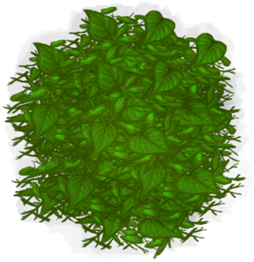树叶</a>

<a href="Canteen.md" style="color:black">水壶</a>

<a href="NipaFruit.md" style="color:black">水椰子</a>

<a href="BedRoll.md" style="color:black">睡袋</a>

<a href="PlasticSheet.md" style="color:black">塑料布</a>

<a href="PlasticBottle.md" style="color:black">塑料瓶</a>

<a href="PlasticBottleFull.md" style="color:black">塑料瓶</a>

<a href="ConchBroken.md" style="color:black">碎海螺壳</a>

<a href="ClayVase.md" style="color:black">陶罐</a>

<a href="ClayBowl.md" style="color:black">陶碗</a>

<a href="Copper.md" style="color:black">铜</a>

<a href="CopperSheet.md" style="color:black">铜板</a>

<a href="CopperJar.md" style="color:black">铜罐</a>

<a href="ArrowCopper.md" style="color:black">铜箭矢</a>

<a href="CopperOre.md" style="color:black">铜矿石</a>

<a href="CopperNeedle.md" style="color:black">铜针</a>

<a href="CopperDecoration_Seashell.md" style="color:black">铜制贝壳</a>

<a href="EatingUtensilsCopper.md" style="color:black">铜制餐具</a>

<a href="CopperDecoration_Turtle.md" style="color:black">铜制乌龟</a>

<a href="CopperDecoration_Mold.md" style="color:black">铜制装饰品</a>

<a href="Skull.md" style="color:black">头骨</a>

<a href="Sling.md" style="color:black">投石索</a>

<a href="GasCookerOff.md" style="color:black">瓦斯炉</a>

<a href="Weston.md" style="color:black">韦斯顿</a>

<a href="ClayPotCoolerUnfired.md" style="color:black">未烧制的保鲜罐</a>

<a href="CookingPotUnfired.md" style="color:black">未烧制的烹饪锅</a>

<a href="ClayVaseUnfired.md" style="color:black">未烧制的陶罐</a>

<a href="ClayBowlUnfired.md" style="color:black">未烧制的陶碗</a>

<a href="ClayJarUnfired.md" style="color:black">未烧制的小陶罐</a>

<a href="BeeSmokerUnfired.md" style="color:black">未烧制的熏蜂器</a>

<a href="GlazedVaseUnfired.md" style="color:black">未烧制的釉面陶罐</a>

<a href="ClayFirePitUnfired.md" style="color:black">未烧制的粘土火盆</a>

<a href="AlembicUnfired.md" style="color:black">未烧制的蒸馏器</a>

<a href="WoodCarving_Unfinished.md" style="color:black">未完成的木雕</a>

<a href="SagoSeeds.md" style="color:black">西米树种</a>

<a href="SkinFreshReptile.md" style="color:black">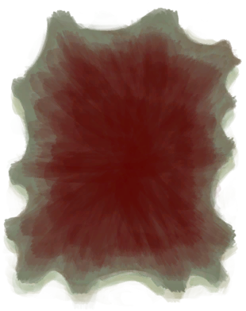蜥蜴生皮</a>

<a href="FineDirt.md" style="color:black">细土</a>

<a href="CordFiber.md" style="color:black">细线</a>

<a href="Fibers.md" style="color:black">纤维</a>

<a href="YarnFiber.md" style="color:black">线团</a>

<a href="CandleCitronellaOff.md" style="color:black">香茅蜡烛</a>

<a href="CandleCitronellaOn.md" style="color:black">香茅蜡烛</a>

<a href="NiterCrystals.md" style="color:black">硝石晶体</a>

<a href="Saltpeter.md" style="color:black">硝酸钾</a>

<a href="Travois.md" style="color:black">小拉车</a>

<a href="WoodCarving_Man.md" style="color:black">小人木雕（男）</a>

<a href="WoodCarving_Woman.md" style="color:black">小人木雕（女）</a>

<a href="Sticks.md" style="color:black">小树枝</a>

<a href="ClayJar.md" style="color:black">小陶罐</a>

<a href="GoatTiedKid.md" style="color:black">小羊</a>

<a href="GoatCarcassKid.md" style="color:black">小羊尸体</a>

<a href="BoarTiedPiglet.md" style="color:black">小猪</a>

<a href="BoarCarcassPiglet.md" style="color:black">小猪尸体</a>

<a href="AntiDiarrhoeaPills.md" style="color:black">泻立停</a>

<a href="SkinFresh.md" style="color:black">新鲜兽皮</a>

<a href="FlareHand.md" style="color:black">信号弹</a>

<a href="SignalingMirror.md" style="color:black">信号镜</a>

<a href="LuggageA.md" style="color:black">行李箱</a>

<a href="LuggageC.md" style="color:black">行李箱</a>

<a href="PartridgeMaleLive.md" style="color:black">雄灰山鹑</a>

<a href="BeeSmokerOff.md" style="color:black">熏蜂器</a>

<a href="BeeSmokerOn.md" style="color:black">熏蜂器</a>

<a href="FoodRationsPackage.md" style="color:black">压缩干粮包</a>

<a href="Salt.md" style="color:black">盐</a>

<a href="CobraDead.md" style="color:black">眼镜蛇尸体</a>

<a href="Coconut.md" style="color:black">椰子</a>

<a href="CoconutShell.md" style="color:black">椰子壳</a>

<a href="CoconutHusk.md" style="color:black">椰子皮</a>

<a href="BoarCarcass.md" style="color:black">野猪尸体</a>

<a href="Tusk.md" style="color:black">野猪牙</a>

<a href="Chair.md" style="color:black">椅子</a>

<a href="WaterRation.md" style="color:black">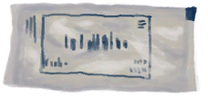应急水包</a>

<a href="WaterRationsPackage.md" style="color:black">应急水袋</a>

<a href="Baby.md" style="color:black">婴儿</a>

<a href="Jerrycan.md" style="color:black">油桶</a>

<a href="CageTrap.md" style="color:black">诱捕笼</a>

<a href="GlazedVase.md" style="color:black">釉面陶罐</a>

<a href="SpearFishing.md" style="color:black">鱼叉</a>

<a href="FishBait.md" style="color:black">鱼饵</a>

<a href="Feathers.md" style="color:black">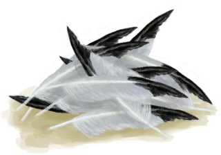羽毛</a>

<a href="Log.md" style="color:black">原木</a>

<a href="DynamiteOff.md" style="color:black">炸药</a>

<a href="DynamiteOn.md" style="color:black">炸药</a>

<a href="Clay.md" style="color:black">粘土</a>

<a href="ClayFirePitExtinguished.md" style="color:black">粘土火盆</a>

<a href="StickLong.md" style="color:black">长木棍</a>

<a href="BoneNeedleThreaded.md" style="color:black">针线</a>

<a href="CopperNeedleThreaded.md" style="color:black">针线</a>

<a href="WoodenNeedleThreaded.md" style="color:black">针线</a>

<a href="Pearl.md" style="color:black">珍珠</a>

<a href="AlembicUndeployed.md" style="color:black">蒸馏器</a>

<a href="Painkillers.md" style="color:black">止痛药</a>

<a href="Tourniquet.md" style="color:black">止血带</a>

<a href="Papers.md" style="color:black">纸</a>

<a href="CageTrapMacaque.md" style="color:black">中陷阱的猕猴</a>

<a href="DogFriend.md" style="color:black">忠犬朋友</a>

<a href="TuskCarving_GnomeMale.md" style="color:black">侏儒牙雕（男）</a>

<a href="TuskCarving_GnomeFemale.md" style="color:black">侏儒牙雕（女）</a>

<a href="FeedBoar.md" style="color:black">猪食</a>

<a href="CopperDecoration_Fish.md" style="color:black">铸铜鱼雕</a>

<a href="MoldCopperDecoration.md" style="color:black">装饰品模具</a>

<a href="JerrycanFuel.md" style="color:black">装有燃料的油桶</a>

<a href="WeavePalm.md" style="color:black">棕榈编织物</a>

<a href="PalmBushSeeds.md" style="color:black">棕榈丛种子</a>

<a href="PalmFronds.md" style="color:black">棕榈叶</a>

<a href="Seat.md" style="color:black">座椅</a>

<a href="Duplicator.md" style="color:black">Duplicator</a>

  
  

