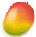

# 状态  
## 精神  
- [情绪](Morale.md)  
- [压力](Stress.md)  
- [清醒度](Wakefulness.md)  
- [食欲](Appetite.md)  
- [娱乐](Entertainment.md)  
- [勇气](Courage.md)  
- [孤独感](Loneliness.md)  
- [精神失常](MindState.md)  
- [狂躁](Mania.md)  
- [失实症](Derealization.md)  
- [世界观](Structure.md)  
- [孤立感](Isolation.md)  
  
  
## 身体  
- [水分](Hydration.md)  
- [饱食](Satiation.md)  
- [耐力](Stamina.md)  
- [污垢](Filth.md)  
- [体重](Weight.md)  
- [晒黑](Tanning.md)  
- [足茧](CallousesFeet.md)  
- [手茧](CallousesHands.md)  
- [视力](Myopia.md)  
- [皮肤完整度](SkinIntegrity.md)  
  
  
## 伤害  
- [疼痛](Pain.md)  
- [晒伤](Sunburn.md)  
- [背痛](BackPain.md)  
- [蚊虫叮咬](BugBites.md)  
- [足部损伤](FootDamage.md)  
- [手掌损伤](HandDamage.md)  
- [失血](BloodLoss.md)  
- [淤青](Bruising.md)  
- [烧伤](Burns.md)  
- [眼部损伤](EyeDamage.md)  
- [肺部伤害](LungDamage.md)  
  
  
## 身体内部  
- [过热](Hyperthermia.md)  
- [失温](Hypothermia.md)  
- [血压](Blood.md)  
- [发烧](Fever.md)  
- [恶心](Nausea.md)  
- [腹泻](Diarrhoea.md)  
- [免疫系统](ImmuneSystem.md)  
- [头疼](Headache.md)  
  
  
## 化合物  
- [镇痛](Analgesia.md)  
- [蜘蛛兰效果](SpiderLilyEffect.md)  
- [姜效果](GingerEffect.md)  
- [抗生素](AntibioticsEffect.md)  
- [酒精](Alcohol.md)  
- [钠](Sodium.md)  
- [奎宁](Quinine.md)  
- [咖啡因](Caffeine.md)  
- [辣椒素](Capsaicin.md)  
- [蛇床子素](Psylocibin.md)  
- [茉莉效果](JasmineEffect.md)  
- [食物中毒](FoodPoisoning.md)  
- [月季效果](ChinaRoseEffect.md)  
- [米饭效果](RiceEffect.md)  
- [蛇毒](VenomKrait.md)  
  
  
## 防护  
- [绝热](InsulationHeat.md)  
- [保温](InsulationCold.md)  
- [阳光防护](SunProtection.md)  
- [雨水防护](RainProtection.md)  
- [蚊虫防护](BugProtection.md)  
- [足部防护](FootProtection.md)  
- [护甲](Armor.md)  
  
  
## 厌倦度  
- [椰子<nobr>厌倦度</nobr>](SaturationCoconuts.md)  
- [甲壳类<nobr>厌倦度</nobr>](SaturationCrustaceans.md)  
- [软体类<nobr>厌倦度</nobr>](SaturationMollusks.md)  
- [鱼类<nobr>厌倦度</nobr>](SaturationFish.md)  
- [鸟类<nobr>厌倦度</nobr>](SaturationBird.md)  
- [肉类<nobr>厌倦度</nobr>](SaturationMeat.md)  
- [爬行类厌倦度](SaturationReptile.md)  
- [香蕉<nobr>厌倦度</nobr>](SaturationBananas.md)  
- [水果<nobr>厌倦度</nobr>](SaturationFruits.md)  
- [蔬菜<nobr>厌倦度</nobr>](SaturationVegetables.md)  
- [西米<nobr>厌倦度</nobr>](SaturationSago.md)  
- [糖<nobr>厌倦度</nobr>](SaturationSugar.md)  
- [稻米<nobr>厌倦度</nobr>](SaturationRice.md)  
- [坚果<nobr>厌倦度</nobr>](SaturationNuts.md)  
- [干粮<nobr>厌倦度</nobr>](SaturationRations.md)  
- [蛋类<nobr>厌倦度</nobr>](SaturationEggs.md)  
- [乳品<nobr>厌倦度</nobr>](SaturationDairy.md)  
- [蘑菇<nobr>厌倦度</nobr>](SaturationMushrooms.md)  
- [参薯<nobr>厌倦度</nobr>](SaturationYam.md)  
  
  
## 技能  
- [攀爬(技能)](Skill_Climbing.md)  
- [游泳(技能)](Skill_Swimming.md)  
- [药草学(技能)](Skill_Herbology.md)  
- [烹饪(技能)](Skill_Cooking.md)  
- [制作(技能)](Skill_Crafting.md)  
- [纺织(技能)](Skill_Tailoring.md)  
- [木工(技能)](Skill_Woodworking.md)  
- [石工(技能)](Skill_Knapping.md)  
- [金工(技能)](Skill_Metalworking.md)  
- [陷阱(技能)](Skill_Trapping.md)  
- [钓鱼(技能)](Skill_Fishing.md)  
- [叉鱼(技能)](Skill_SpearFishing.md)  
- [矛战(技能)](Skill_SpearFighting.md)  
- [箭术(技能)](Skill_Archery.md)  
- [投石(技能)](Skill_RockThrowing.md)  
- [投石索(技能)](Skill_Sling.md)  
- [击鼓(技能)](Skill_Percussion.md)  
- [潜行(技能)](Skill_Stealth.md)  
- [灵视(技能)](Skill_Insight.md)  
  
  
## 其他  
- [哀悼](Mourning.md)  
- [暴风雨次数](StormCounter.md)  
- [表面细菌](BacteriaSurface.md)  
- [波次](WaveCounter.md)  
- [不适](Discomfort.md)  
- [肠道](Intestines.md)  
- [船长陪伴](CaptainCompany.md)  
- [船长亲密关系](CaptainPropinquity.md)  
- [丛林边缘风暴](Storm_Outskirts.md)  
- [防晒霜](SunScreenApplied.md)  
- [风](Wind.md)  
- [蜂群密度](Pop_Boar.md)  
- [蜂蛰防护](BeeProtection.md)  
- [工作区](Workplace.md)  
- [关系层](RelationalLayer.md)  
- [光亮](Light.md)  
- [海风程度](SeaAgitation.md)  
- [海怪击杀数](SeaHoundKills.md)  
- [海怪寄生虫](ParasitesSeahound.md)  
- [海怪种群数量](Pop_Seahounds.md)  
- [海鸥之惧](SeagullFear.md)  
- [海湾风暴](Storm_Bay.md)  
- [害怕猕猴](MacaqueFear.md)  
- [航海技术](SeaSicknessResistance.md)  
- [航行](Sailed.md)  
- [红树林风暴](Storm_Mangroves.md)  
- [荒芜沙滩风暴](Storm_DesolateBeach.md)  
- [灰山鹑种群数量](Pop_Partridge.md)  
- [寄生虫](Parasites.md)  
- [监视者的凝视](WatchersGlare.md)  
- [监视者的注视](WatcherInsight.md)  
- [降水值](RainValue.md)  
- [焦虑计数](AnxietyCounter.md)  
- [巨蜥种群数量](Pop_Monitor.md)  
- [距离](Distance.md)  
- [决心](Determination.md)  
- [抗晕船](AntiSeasickness.md)  
- [空气毒性](AirToxicity.md)  
- [老鼠种群数量](Pop_Mouse.md)  
- [猎手的注视](HunterInsight.md)  
- [猎手接近](HuntersProximity.md)  
- [淋雨](RainExposure.md)  
- [芦荟膏防护](AloeVeraGelProtection.md)  
- [旅行加速](ModifierTravel.md)  
- [美人鱼最终行动](MermaidFinalAction.md)  
- [猕猴种群数量](Pop_Macaque.md)  
- [蜜蜂蛰刺](BeeStings.md)  
- [内陆恐惧症](LandSickness.md)  
- [泥巴防护](MudProtection.md)  
- [疟疾寄生虫](ParasiteMalaria.md)  
- [皮肤潮湿度](SkinHumidity.md)  
- [驱虫](BugRepellentApplied.md)  
- [杀手无人机种群数量](Pop_Drone.md)  
- [沙滩风暴](Storm_Beach.md)  
- [鲨鱼种群数量](Pop_Shark.md)  
- [山羊种群数量](Pop_Goat.md)  
- [神圣灵视](GodInsight.md)  
- [肾脏](IfKidneys.md)  
- [湿度](Wetness.md)  
- [手部神经损伤](NerveDamageHands.md)  
- [手部神经损伤](NerveDamageHandsPermanent.md)  
- [手枪(技能)](Skill_Handguns.md)  
- [受伤](Wounds.md)  
- [舒适度](Comfort.md)  
- [睡眠风险](SleepRisk.md)  
- [睡眠中断](SleepInterrupt.md)  
- [睡眠钟](SleepClock.md)  
- [宿敌现身](EnemyDefeated.md)  
- [探索从林深处](Exploration_DeepJungle.md)  
- [探索丛林](Exploration_Jungle.md)  
- [探索丛林边缘](Exploration_JungleOutskirts.md)  
- [探索海岸](Exploration_Beach.md)  
- [探索海湾](Exploration_Bay.md)  
- [探索红树林](Exploration_Mangroves.md)  
- [探索湿地](Exploration_Wetlands.md)  
- [探索岩滩](Exploration_Rocks.md)  
- [陶艺加成](PotteryBonus.md)  
- [体感温度](TemperaturePerceived.md)  
- [腿部防护](LegProtection.md)  
- [腿部神经损伤](NerveDamageLegs.md)  
- [外星斑点](AlienSpots.md)  
- [外星植物渴求](AlienCravings.md)  
- [韦斯顿的决心](WestonDetermination.md)  
- [韦斯顿的陪伴](WestonCompany.md)  
- [韦斯顿还在](WestonAlive.md)  
- [韦斯顿亲密关系](WestonPropinquity.md)  
- [胃](Stomach.md)  
- [蚊虫叮咬](BugDamage.md)  
- [蚊虫数量](BugPopulation.md)  
- [细菌性斑疹伤寒](BacteriaTyphusPackage.md)  
- [细菌性发烧](BacteriaFever.md)  
- [细菌性腹泻](BacteriaDiarrhoea.md)  
- [细菌性霍乱](BacteriaCholera.md)  
- [细菌性霍乱并发症](BacteriaCholeraPackage.md)  
- [虚空灵视](VoidInsight.md)  
- [岩滩风暴](Storm_Rocks.md)  
- [眼镜蛇种群数量](Pop_Cobra.md)  
- [阳光辐射](SunExposure.md)  
- [阳光强度](SunStrength.md)  
- [野营热病](BacteriaTyphus.md)  
- [夜晚](IsNight.md)  
- [已灌溉](Irrigated.md)  
- [用餐环境](Foodplace.md)  
- [油箱满的](FuelTankFull.md)  
- [雨水计数器](RainCounter.md)  
- [晕船](SeaSickness.md)  
- [晕倒次数](FaintCounter.md)  
- [在黑暗环境](InDarkPlace.md)  
- [在木筏上](OnRaft.md)  
- [遮蔽](Sheltered.md)  
- [真人秀 - 包裹倒计时](TV_CounterRush.md)  
- [真人秀 - 等待](TV_CounterWait.md)  
- [真人秀 - 岩滩](TV_Rocks.md)  
- [真人秀 草原](TV_Grasslands.md)  
- [真人秀 草原 - 探索](TV_GrasslandsExplore.md)  
- [真人秀 丛林](TV_Jungle.md)  
- [真人秀 丛林 - 探索](TV_JungleExplore.md)  
- [真人秀 高地](TV_Highlands.md)  
- [真人秀 高地 - 探索](TV_HighlandsExplore.md)  
- [真人秀 红树林](TV_Mangroves.md)  
- [真人秀 红树林 - 探索](TV_MangrovesExplore.md)  
- [真人秀 石滩 - 探索](TV_RocksExplore.md)  
- [真人秀舞台](TV_Stage.md)  
- [紫外线过敏](SunAllergy.md)  
- [阻止抽到海鸥巢](SeagullNestKiller.md)  
- [阻止抽到棕榈树](PalmTreeKiller.md)  
- [左腿神经损伤](NerveDamageLegsPermanent.md)  
- [IGNOREKEY](OnNotAxeAdv.md)  
- [MalariaResistance_GameName](MalariaResistance.md)  
- [ModifierClimb_GameName](ModifierClimb.md)  
- [ModifierHand_GameName](ModifierHand.md)  
- [ModifierLeg_GameName](ModifierLeg.md)  
- [VenomKraitInjector_GameName](VenomKraitInjector.md)  
- [VenomKraitResistance_GameName](VenomKraitResistance.md)  
