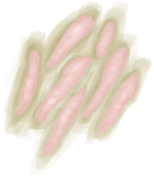

# “诱饵”  

[

 [蜜蜂](Bees.md)](Bees.md)

[

 [虫子](Bugs.md)](Bugs.md)

[

 [海螺肉](ConchMeat.md)](ConchMeat.md)

[

 [烤海螺肉](ConchMeatCooked.md)](ConchMeatCooked.md)

[

 [松软的海螺肉](ConchMeatSoft.md)](ConchMeatSoft.md)

[

 [松软的烤海螺肉](ConchMeatSoftCooked.md)](ConchMeatSoftCooked.md)

[

 [螃蟹](Crab.md)](Crab.md)

[

 [烤螃蟹](CrabCooked.md)](CrabCooked.md)

[

 [鱼饵](FishBait.md)](FishBait.md)

[

 [鱼杂](FishScraps.md)](FishScraps.md)

[

 [烤鱼杂](FishScrapsCooked.md)](FishScrapsCooked.md)

[

 [鱼片](FishSlices.md)](FishSlices.md)

[

 [烤鱼片](FishSlicesCooked.md)](FishSlicesCooked.md)

[

 [食丸](GastricPellet.md)](GastricPellet.md)

[

 [牡蛎肉](OysterMeat.md)](OysterMeat.md)

[

 [黄油焗牡蛎](OysterMeatBaked.md)](OysterMeatBaked.md)

[

 [烤牡蛎肉](OysterMeatCooked.md)](OysterMeatCooked.md)

[

 [虾](Prawns.md)](Prawns.md)

[

 [烤虾](PrawnsCooked.md)](PrawnsCooked.md)

[

 [凝乳酶](Rennet.md)](Rennet.md)

[

 [腐烂物](RottenRemains.md)](RottenRemains.md)

  
  

