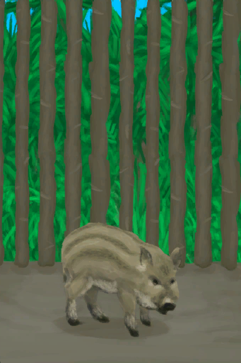

# “野猪”  

<a href="BoarEnclosureFemale.md" style="color:black">母猪</a>

<a href="BoarEnclosureMale.md" style="color:black">公猪</a>

<a href="BoarEnclosurePiglet.md" style="color:black">小猪</a>

<a href="BoarTiedFemale.md" style="color:black">母猪</a>

<a href="BoarTiedMale.md" style="color:black">公猪</a>

  
  

