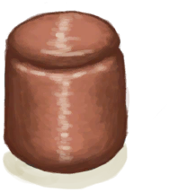

# “粘土”  

<a href="AlembicUnfired.md" style="color:black">未烧制的蒸馏器</a>

<a href="ClayBowl.md" style="color:black">陶碗</a>

<a href="ClayBowlUnfired.md" style="color:black">未烧制的陶碗</a>

<a href="ClayFirePitUnfired.md" style="color:black">未烧制的粘土火盆</a>

<a href="ClayJar.md" style="color:black">小陶罐</a>

<a href="ClayJarJasmine.md" style="color:black">茉莉花</a>

<a href="ClayJarUnfired.md" style="color:black">未烧制的小陶罐</a>

<a href="ClayPotCoolerUnfired.md" style="color:black">未烧制的保鲜罐</a>

<a href="ClayVase.md" style="color:black">陶罐</a>

<a href="ClayVaseUnfinished.md" style="color:black">未烧制的陶罐</a>

<a href="ClayVaseUnfired.md" style="color:black">未烧制的陶罐</a>

<a href="CookingPot.md" style="color:black">烹饪锅</a>

<a href="CookingPotUnfired.md" style="color:black">未烧制的烹饪锅</a>

<a href="CopperJar.md" style="color:black">铜罐</a>

<a href="GlazedVase.md" style="color:black">釉面陶罐</a>

<a href="GlazedVaseUnfired.md" style="color:black">未烧制的釉面陶罐</a>

<a href="MoldAxe.md" style="color:black">斧头模具</a>

<a href="MoldCopperDecoration.md" style="color:black">装饰品模具</a>

<a href="MoldKnife.md" style="color:black">刀模具</a>

<a href="MoldShovel.md" style="color:black">铲头模具</a>

<a href="MoldSpear.md" style="color:black">矛头模具</a>

<a href="BeeSmokerUnfired.md" style="color:black">未烧制的熏蜂器</a>

  
  

