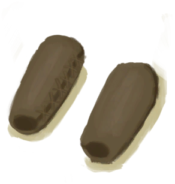
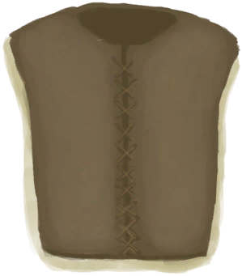

# “腿部（内层）”  

<a href="BeeSuit.md" style="color:black">防蜂服</a>

<a href="CollarTV.md" style="color:black">项圈</a>

<a href="CopperNecklace.md" style="color:black">铜项链</a>

<a href="FiberArmor.md" style="color:black">纤维甲</a>

<a href="FiberBracers.md" style="color:black">纤维护腕</a>

<a href="FiberCuirass.md" style="color:black">纤维胸甲</a>

<a href="FiberHelmet.md" style="color:black">纤维头盔</a>

<a href="FlowerNecklace.md" style="color:black">鲜花项链</a>

<a href="FootWrappings.md" style="color:black">包脚布</a>

<a href="GasMaskRustic.md" style="color:black">防毒面具</a>

<a href="HandWrappings.md" style="color:black">绑手带</a>

<a href="HatSurvival.md" style="color:black">求生帽</a>

<a href="HatWoven.md" style="color:black">棕榈编织帽</a>

<a href="HawaiianShirt.md" style="color:black">夏威夷衬衫</a>

<a href="HeadWrappings.md" style="color:black">头巾</a>

<a href="HoodieRetromation.md" style="color:black">卫衣</a>

<a href="JacketClothDisabled.md" style="color:black">布夹克</a>

<a href="LeafSKirt.md" style="color:black">草裙</a>

<a href="LeatherBracers.md" style="color:black">皮护腕</a>

<a href="LeatherGloves.md" style="color:black">皮革手套</a>

<a href="LeatherHelmet.md" style="color:black">皮头盔</a>

<a href="LeatherJacketDisabled.md" style="color:black">皮夹克</a>

<a href="LeatherPants.md" style="color:black">皮裤</a>

<a href="LeatherShoes.md" style="color:black">皮革鞋子</a>

<a href="LeatherStealthyPants.md" style="color:black">Leather Pants Stealth 1000</a>

<a href="LeatherVest.md" style="color:black">皮背心</a>

<a href="MaskMakeshift.md" style="color:black">临时防毒面具</a>

<a href="MilitaryBoots.md" style="color:black">军靴</a>

<a href="MilitaryPants.md" style="color:black">军裤</a>

<a href="PantsClothDisabled.md" style="color:black">裤子</a>

<a href="PearlNecklace.md" style="color:black">珍珠项链</a>

<a href="Raincoat.md" style="color:black">雨衣</a>

<a href="SeagullCharm.md" style="color:black">海鸥护符</a>

<a href="SeashellNecklace.md" style="color:black">贝壳项链</a>

<a href="SharkHeadpiece.md" style="color:black">鲨鱼头饰</a>

<a href="ShirtCloth.md" style="color:black">衬衫</a>

<a href="Shorts.md" style="color:black">短裤</a>

<a href="Sneakers.md" style="color:black">运动鞋</a>

<a href="Socks.md" style="color:black">袜子</a>

<a href="StrawCape.md" style="color:black">蓑衣</a>

<a href="T-Shirt.md" style="color:black">T恤</a>

<a href="Underwear.md" style="color:black">内裤</a>

  
  

