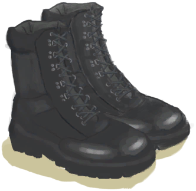

# “腿部（内层）”  

[

 [防蜂服](BeeSuit.md)](BeeSuit.md)

[

 [项圈](CollarTV.md)](CollarTV.md)

[

 [铜项链](CopperNecklace.md)](CopperNecklace.md)

[

 [鲜花项链](FlowerNecklace.md)](FlowerNecklace.md)

[

 [包脚布](FootWrappings.md)](FootWrappings.md)

[

 [防毒面具](GasMaskRustic.md)](GasMaskRustic.md)

[

 [绑手带](HandWrappings.md)](HandWrappings.md)

[

 [求生帽](HatSurvival.md)](HatSurvival.md)

[

 [棕榈编织帽](HatWoven.md)](HatWoven.md)

[

 [夏威夷衬衫](HawaiianShirt.md)](HawaiianShirt.md)

[

 [头巾](HeadWrappings.md)](HeadWrappings.md)

[

 [卫衣](HoodieRetromation.md)](HoodieRetromation.md)

[

 [草裙](LeafSKirt.md)](LeafSKirt.md)

[

 [皮革手套](LeatherGloves.md)](LeatherGloves.md)

[

 [皮裤](LeatherPants.md)](LeatherPants.md)

[

 [皮革鞋子](LeatherShoes.md)](LeatherShoes.md)

[

 [临时防毒面具](MaskMakeshift.md)](MaskMakeshift.md)

[

 [军靴](MilitaryBoots.md)](MilitaryBoots.md)

[

 [军裤](MilitaryPants.md)](MilitaryPants.md)

[布制裤子](PantsCloth.md)

[

 [珍珠项链](PearlNecklace.md)](PearlNecklace.md)

[

 [雨衣](Raincoat.md)](Raincoat.md)

[

 [海鸥护符](SeagullCharm.md)](SeagullCharm.md)

[

 [贝壳项链](SeashellNecklace.md)](SeashellNecklace.md)

[

 [鲨鱼头饰](SharkHeadpiece.md)](SharkHeadpiece.md)

[

 [衬衫](ShirtFiber.md)](ShirtFiber.md)

[

 [短裤](Shorts.md)](Shorts.md)

[

 [运动鞋](Sneakers.md)](Sneakers.md)

[

 [袜子](Socks.md)](Socks.md)

[

 [蓑衣](StrawCape.md)](StrawCape.md)

[

 [T恤](T-Shirt.md)](T-Shirt.md)

[

 [内裤](Underwear.md)](Underwear.md)

  
  
