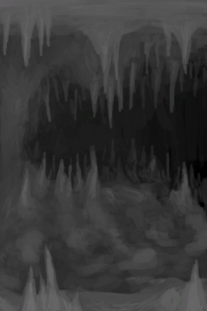
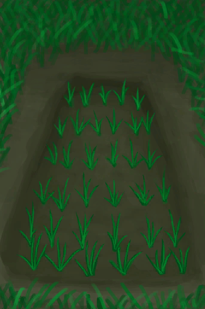
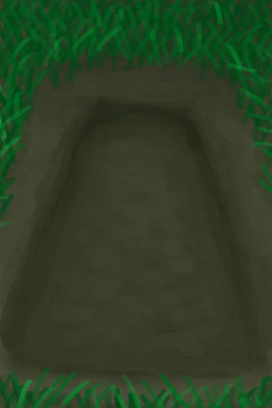

# “脏容器（敞口）”  
<table class="table table-bordered" data-toggle="table"  ><thead style=""><tr ><th  style="text-align:left;vertical-align:top;"  >名称</th><th  style="text-align:left;vertical-align:top;"  >储水量</th><th  style="text-align:left;vertical-align:top;"  >密封</th></tr></thead><tr ><td  style="text-align:left;vertical-align:top;"  >[

[干涸酸湖(火山)](AcidLakePuddle.md)](AcidLakePuddle.md)</td><td  style="text-align:left;vertical-align:top;"  >60000 (200份)</td><td  style="text-align:left;vertical-align:top;"  >❌</td></tr><tr ><td  style="text-align:left;vertical-align:top;"  >[

[干涸的小水塘(湿地)](Puddle.md)](Puddle.md)</td><td  style="text-align:left;vertical-align:top;"  >6000 (20份)</td><td  style="text-align:left;vertical-align:top;"  >❌</td></tr><tr ><td  style="text-align:left;vertical-align:top;"  >[

[水井](Well.md)](Well.md)</td><td  style="text-align:left;vertical-align:top;"  >6000 (20份)</td><td  style="text-align:left;vertical-align:top;"  >❌</td></tr><tr ><td  style="text-align:left;vertical-align:top;"  >[

[干涸的洞穴水潭(潮湿洞穴)](CavePond.md)](CavePond.md)</td><td  style="text-align:left;vertical-align:top;"  >2400 (8份)</td><td  style="text-align:left;vertical-align:top;"  >❌</td></tr><tr ><td  style="text-align:left;vertical-align:top;"  >[

[水稻田](RicePaddy.md)](RicePaddy.md)</td><td  style="text-align:left;vertical-align:top;"  >2000 (6.666666666666667份)</td><td  style="text-align:left;vertical-align:top;"  >❌</td></tr><tr ><td  style="text-align:left;vertical-align:top;"  >[

[未栽种的稻田(空)](RicePaddyEmpty.md)](RicePaddyEmpty.md)</td><td  style="text-align:left;vertical-align:top;"  >2000 (6.666666666666667份)</td><td  style="text-align:left;vertical-align:top;"  >❌</td></tr><tr ><td  style="text-align:left;vertical-align:top;"  >[

[干涸的小水坑(幽暗洞穴)](CavePuddle.md)](CavePuddle.md)</td><td  style="text-align:left;vertical-align:top;"  >600 (2份)</td><td  style="text-align:left;vertical-align:top;"  >❌</td></tr></tbody></table>  
  

