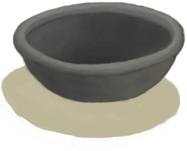
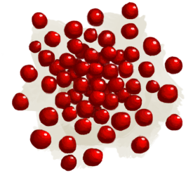
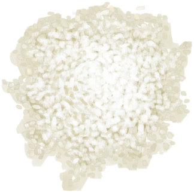
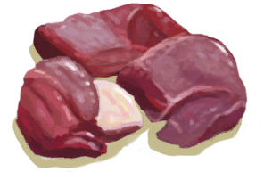
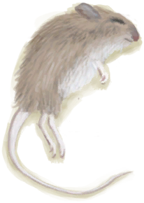
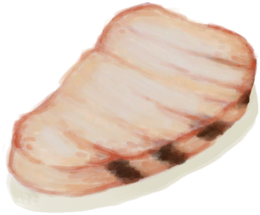

# “可烹饪的”  

[

 [金鸡纳树皮](BarkCinchona.md)](BarkCinchona.md)

[

 [干燥的金鸡纳树皮](BarkCinchonaDried.md)](BarkCinchonaDried.md)

[

 [未烧制的陶碗](ClayBowlUnfired.md)](ClayBowlUnfired.md)

[

 [未烧制的粘土火盆](ClayFirePitUnfired.md)](ClayFirePitUnfired.md)

[

 [小陶罐](ClayJar.md)](ClayJar.md)

[

 [茉莉花](ClayJarJasmine.md)](ClayJarJasmine.md)

[

 [未烧制的陶罐](ClayVaseUnfinished.md)](ClayVaseUnfinished.md)

[

 [未烧制的陶罐](ClayVaseUnfired.md)](ClayVaseUnfired.md)

[

 [烹饪锅](CookingPot.md)](CookingPot.md)

[

 [铜罐](CopperJar.md)](CopperJar.md)

[

 [未烧制的釉面陶罐](GlazedVaseUnfired.md)](GlazedVaseUnfired.md)

[

 [外星结节](AlienNodule.md)](AlienNodule.md)

[

 [香蕉](Banana.md)](Banana.md)

[

 [香蕉树芯](BananaStem.md)](BananaStem.md)

[

 [蝙蝠尸体](Bat.md)](Bat.md)

[

 [烤蝙蝠](BatCooked.md)](BatCooked.md)

[

 [巢脾](BeeHoneycomb.md)](BeeHoneycomb.md)

[

 [鸟肉](BirdMeat.md)](BirdMeat.md)

[

 [烤鸟肉](BirdMeatCooked.md)](BirdMeatCooked.md)

[

 [烟熏鸟肉](BirdMeatSmoked.md)](BirdMeatSmoked.md)

[

 [野猪肉](BoarMeat.md)](BoarMeat.md)

[

 [烤野猪肉](BoarMeatCooked.md)](BoarMeatCooked.md)

[

 [野猪肉干](BoarMeatDried.md)](BoarMeatDried.md)

[

 [腌野猪肉](BoarMeatSalted.md)](BoarMeatSalted.md)

[

 [腌制中的野猪肉](BoarMeatSaltedDrying.md)](BoarMeatSaltedDrying.md)

[

 [烟熏野猪肉](BoarMeatSmoked.md)](BoarMeatSmoked.md)

[

 [北梭鱼](Bonefish.md)](Bonefish.md)

[

 [烤北梭鱼](BonefishCooked.md)](BonefishCooked.md)

[

 [北梭鱼肉](BonefishMeat.md)](BonefishMeat.md)

[

 [烟熏北梭鱼](BonefishSmoked.md)](BonefishSmoked.md)

[

 [烧焦物](CharredRemains.md)](CharredRemains.md)

[

 [辣椒](Chilies.md)](Chilies.md)

[

 [干辣椒](ChiliesDried.md)](ChiliesDried.md)

[

 [眼镜蛇尸体](CobraDead.md)](CobraDead.md)

[

 [椰肉](CoconutMeat.md)](CoconutMeat.md)

[

 [烤椰肉](CoconutMeatCooked.md)](CoconutMeatCooked.md)

[

 [咖啡豆](CoffeeBeans.md)](CoffeeBeans.md)

[

 [咖啡果](CoffeeBerries.md)](CoffeeBerries.md)

[

 [咖啡果浆](CoffeeBerryPulp.md)](CoffeeBerryPulp.md)

[

 [烤咖啡豆](CoffeeRoastedBeans.md)](CoffeeRoastedBeans.md)

[

 [海螺肉](ConchMeat.md)](ConchMeat.md)

[

 [烤海螺肉](ConchMeatCooked.md)](ConchMeatCooked.md)

[

 [松软的海螺肉](ConchMeatSoft.md)](ConchMeatSoft.md)

[

 [松软的烤海螺肉](ConchMeatSoftCooked.md)](ConchMeatSoftCooked.md)

[

 [螃蟹](Crab.md)](Crab.md)

[

 [烤螃蟹](CrabCooked.md)](CrabCooked.md)

[

 [蛋](Egg.md)](Egg.md)

[

 [水煮蛋](EggBoiled.md)](EggBoiled.md)

[

 [烤蛋](EggCooked.md)](EggCooked.md)

[

 [受精蛋](EggPartridgeFertilized.md)](EggPartridgeFertilized.md)

[

 [鸟食](FeedBird.md)](FeedBird.md)

[

 [猪食](FeedBoar.md)](FeedBoar.md)

[

 [山羊饲料](FeedGoat.md)](FeedGoat.md)

[

 [鱼干](FishDried.md)](FishDried.md)

[

 [咸鱼](FishSalted.md)](FishSalted.md)

[

 [腌制中的咸鱼肉](FishSaltedDrying.md)](FishSaltedDrying.md)

[

 [鱼杂](FishScraps.md)](FishScraps.md)

[

 [烤鱼杂](FishScrapsCooked.md)](FishScrapsCooked.md)

[

 [羊肉](GoatMeat.md)](GoatMeat.md)

[

 [烤羊肉](GoatMeatCooked.md)](GoatMeatCooked.md)

[

 [羊肉干](GoatMeatDried.md)](GoatMeatDried.md)

[

 [腌羊肉](GoatMeatSalted.md)](GoatMeatSalted.md)

[

 [腌制中的羊肉](GoatMeatSaltedDrying.md)](GoatMeatSaltedDrying.md)

[

 [烟熏羊肉](GoatMeatSmoked.md)](GoatMeatSmoked.md)

[

 [绯鲤](Goatfish.md)](Goatfish.md)

[

 [烤绯鲤](GoatfishCooked.md)](GoatfishCooked.md)

[

 [烟熏绯鲤](GoatfishSmoked.md)](GoatfishSmoked.md)

[石斑鱼](Grouper.md)

[

 [石斑鱼肉](GrouperMeat.md)](GrouperMeat.md)

[

 [烤石斑鱼](GrouperMeatCooked.md)](GrouperMeatCooked.md)

[

 [烟熏石斑鱼](GrouperMeatSmoked.md)](GrouperMeatSmoked.md)

[

 [鲱鱼](Herring.md)](Herring.md)

[

 [烤鲱鱼](HerringCooked.md)](HerringCooked.md)

[

 [烟熏鲱鱼](HerringSmoked.md)](HerringSmoked.md)

[

 [野枣](JujubeFruits.md)](JujubeFruits.md)

[

 [大马鲅鱼](KingThreadfin.md)](KingThreadfin.md)

[

 [蜥蜴](Lizard.md)](Lizard.md)

[

 [烤蜥蜴](LizardCooked.md)](LizardCooked.md)

[

 [猕猴肉](MacaqueMeat.md)](MacaqueMeat.md)

[

 [烤猕猴肉](MacaqueMeatCooked.md)](MacaqueMeatCooked.md)

[

 [猕猴肉干](MacaqueMeatDried.md)](MacaqueMeatDried.md)

[

 [腌猕猴肉](MacaqueMeatSalted.md)](MacaqueMeatSalted.md)

[

 [腌制中的猕猴肉](MacaqueMeatSaltedDrying.md)](MacaqueMeatSaltedDrying.md)

[

 [烟熏猕猴肉](MacaqueMeatSmoked.md)](MacaqueMeatSmoked.md)

[

 [芒果](Mango.md)](Mango.md)

[

 [骨头汤](BoneBroth.md)](BoneBroth.md)

[

 [未烹饪的骨头汤](BoneBrothUncooked.md)](BoneBrothUncooked.md)

[

 [黄油焗牡蛎](ButterBakedOystersCooked.md)](ButterBakedOystersCooked.md)

[

 [未烹饪的黄油牡蛎](ButterBakedOystersUncooked.md)](ButterBakedOystersUncooked.md)

[

 [姜糖](CandiedGinger.md)](CandiedGinger.md)

[

 [姜糖](CandiedGingerCooked.md)](CandiedGingerCooked.md)

[

 [未烹饪的姜糖](CandiedGingerUncooked.md)](CandiedGingerUncooked.md)

[

 [山羊奶酪](Cheese.md)](Cheese.md)

[

 [鸡肉三明治](ChickenSandwich.md)](ChickenSandwich.md)

[

 [巧克力](Chocolate.md)](Chocolate.md)

[

 [椰子鱼](CoconutFish.md)](CoconutFish.md)

[

 [未烹饪的椰子鱼](CoconutFishUncooked.md)](CoconutFishUncooked.md)

[

 [醉蟹](DrunkenCrab.md)](DrunkenCrab.md)

[

 [未烹饪的醉蟹](DrunkenCrabUncooked.md)](DrunkenCrabUncooked.md)

[

 [蛋炒饭](EggFriedRice.md)](EggFriedRice.md)

[

 [未烹饪的蛋炒饭](EggFriedRiceUncooked.md)](EggFriedRiceUncooked.md)

[

 [炸鱼薯条](FishNChips.md)](FishNChips.md)

[

 [未烹饪的炸鱼薯条](FishNChipsUncooked.md)](FishNChipsUncooked.md)

[

 [鱼肉蛋饼](FishOmelette.md)](FishOmelette.md)

[

 [未烹饪的鱼肉蛋饼](FishOmeletteUncooked.md)](FishOmeletteUncooked.md)

[

 [鱼肉塔可](FishTaco.md)](FishTaco.md)

[

 [炸香蕉](FriedBanana.md)](FriedBanana.md)

[

 [熟的炸香蕉](FriedBananasCooked.md)](FriedBananasCooked.md)

[

 [未烹饪的炸香蕉](FriedBananasUncooked.md)](FriedBananasUncooked.md)

[

 [炒菇球](FriedPuffballs.md)](FriedPuffballs.md)

[

 [未烹饪的炒菇球](FriedPuffballsUncooked.md)](FriedPuffballsUncooked.md)

[

 [熬制好的胶水](GlueCooked.md)](GlueCooked.md)

[

 [未熬制的胶水](GlueUncooked.md)](GlueUncooked.md)

[

 [炖羊汤](GoatStew.md)](GoatStew.md)

[

 [未烹饪的羊汤](GoatStewUncooked.md)](GoatStewUncooked.md)

[

 [肉食盛宴](HeartyFeast.md)](HeartyFeast.md)

[

 [未烹饪的肉食盛宴](HeartyFeastUncooked.md)](HeartyFeastUncooked.md)

[

 [蜜糖](HoneyCandy.md)](HoneyCandy.md)

[

 [蜜糖](HoneyCandyCooked.md)](HoneyCandyCooked.md)

[

 [未烹饪的蜜糖](HoneyCandyUncooked.md)](HoneyCandyUncooked.md)

[

 [蜜汁火腿](HoneyGlazedPork.md)](HoneyGlazedPork.md)

[

 [未烹饪的蜜汁火腿](HoneyGlazedPorkUncooked.md)](HoneyGlazedPorkUncooked.md)

[

 [热带烤鸡](IslandChicken.md)](IslandChicken.md)

[

 [未烹饪的热带烤鸡](IslandChickenUncooked.md)](IslandChickenUncooked.md)

[

 [丛林沙拉](JungleSalad.md)](JungleSalad.md)

[

 [辣炒巨蜥肉](LizardFry.md)](LizardFry.md)

[

 [未烹饪的辣炒巨蜥肉](LizardFryUncooked.md)](LizardFryUncooked.md)

[

 [猕猴肉串](MacaqueSkewers.md)](MacaqueSkewers.md)

[

 [未烹饪的猕猴肉串](MacaqueSkewersUncooked.md)](MacaqueSkewersUncooked.md)

[

 [蛋白棒](ProteinBar.md)](ProteinBar.md)

[

 [未烹饪的蛋白棒](ProteinBarUncooked.md)](ProteinBarUncooked.md)

[

 [烹饪好的蛋白棒](ProteinBarsCooked.md)](ProteinBarsCooked.md)

[

 [西米蛋糕](SagoCake.md)](SagoCake.md)

[

 [未烹饪的西米蛋糕](SagoCakeUncooked.md)](SagoCakeUncooked.md)

[

 [西米糕](SagoSlime.md)](SagoSlime.md)

[

 [烹饪好的西米糕](SagoSlimeCooked.md)](SagoSlimeCooked.md)

[

 [未烹饪的西米糕](SagoSlimeUncooked.md)](SagoSlimeUncooked.md)

[

 [海鲜杂烩](SeafoodCup.md)](SeafoodCup.md)

[

 [硫酸盐混合物](VitriolUncooked.md)](VitriolUncooked.md)

[

 [参薯咖喱](YamCurry.md)](YamCurry.md)

[

 [未烹饪的参薯咖喱](YamCurryUncooked.md)](YamCurryUncooked.md)

[

 [熟参薯酱](YamJamCooked.md)](YamJamCooked.md)

[

 [未烹饪的参薯酱](YamJamUncooked.md)](YamJamUncooked.md)

[

 [巨蜥肉](MonitorMeat.md)](MonitorMeat.md)

[

 [烤巨蜥肉](MonitorMeatCooked.md)](MonitorMeatCooked.md)

[

 [巨蜥肉干](MonitorMeatDried.md)](MonitorMeatDried.md)

[

 [腌巨蜥肉](MonitorMeatSalted.md)](MonitorMeatSalted.md)

[

 [腌制中的巨蜥肉](MonitorMeatSaltedDrying.md)](MonitorMeatSaltedDrying.md)

[

 [烟熏巨蜥肉](MonitorMeatSmoked.md)](MonitorMeatSmoked.md)

[

 [老鼠尸体](Mouse.md)](Mouse.md)

[

 [烤老鼠](MouseCooked.md)](MouseCooked.md)

[

 [剥皮的老鼠](MouseSkinned.md)](MouseSkinned.md)

[

 [弹涂鱼](Mudskipper.md)](Mudskipper.md)

[

 [烤弹涂鱼](MudskipperCooked.md)](MudskipperCooked.md)

[

 [水椰籽](NipaSeeds.md)](NipaSeeds.md)

[

 [牡蛎肉](OysterMeat.md)](OysterMeat.md)

[

 [黄油焗牡蛎](OysterMeatBaked.md)](OysterMeatBaked.md)

[

 [烤牡蛎肉](OysterMeatCooked.md)](OysterMeatCooked.md)

[

 [鹦哥鱼](ParrotFish.md)](ParrotFish.md)

[

 [烤鹦哥鱼](ParrotFishCooked.md)](ParrotFishCooked.md)

[

 [烟熏鹦哥鱼](ParrotFishSmoked.md)](ParrotFishSmoked.md)

[

 [小灰山鹑尸体](PartridgeChickDead.md)](PartridgeChickDead.md)

[

 [虾](Prawns.md)](Prawns.md)

[

 [烤虾](PrawnsCooked.md)](PrawnsCooked.md)

[

 [米饭](RiceCooked.md)](RiceCooked.md)

[

 [稻米](RiceGrains.md)](RiceGrains.md)

[

 [西米饼](SagoFlatbread.md)](SagoFlatbread.md)

[

 [蜂蜜西米饼](SagoFlatbreadHoney.md)](SagoFlatbreadHoney.md)

[

 [果酱西米饼](SagoFlatbreadJam.md)](SagoFlatbreadJam.md)

[

 [西米粉](SagoFlour.md)](SagoFlour.md)

[

 [海蛇尸体](SeaKraitDead.md)](SeaKraitDead.md)

[

 [烤海怪肉](SeahoundCooked.md)](SeahoundCooked.md)

[

 [海怪肉](Seahoundmeat.md)](Seahoundmeat.md)

[

 [海藻](Seaweed.md)](Seaweed.md)

[

 [烤鲨鱼肉](SharkCooked.md)](SharkCooked.md)

[

 [鲨鱼肉](SharkMeat.md)](SharkMeat.md)

[

 [烟熏鲨鱼肉](SharkSmoked.md)](SharkSmoked.md)

[

 [烤蛇肉](SnakeCooked.md)](SnakeCooked.md)

[

 [剥皮的蛇](SnakeSkinned.md)](SnakeSkinned.md)

[

 [糖](Sugar.md)](Sugar.md)

[

 [寿司](Sushi.md)](Sushi.md)

[

 [烤马鲅鱼](ThreadfinCooked.md)](ThreadfinCooked.md)

[

 [马鲅鱼肉](ThreadfinMeat.md)](ThreadfinMeat.md)

[

 [烟熏马鲅鱼](ThreadfinSmoked.md)](ThreadfinSmoked.md)

[

 [热带杏仁核](TropicalAlmondKernels.md)](TropicalAlmondKernels.md)

[

 [烤热带杏仁](TropicalAlmondsRoasted.md)](TropicalAlmondsRoasted.md)

[

 [海胆肉](UrchinMeat.md)](UrchinMeat.md)

[

 [烤海胆](UrchinMeatCooked.md)](UrchinMeatCooked.md)

[

 [胶水](Glue.md)](Glue.md)

[

 [干胶水](GlueDry.md)](GlueDry.md)

[

 [石头](Stone.md)](Stone.md)

[

 [煅烧后的石头](StoneBurnt.md)](StoneBurnt.md)

  
  
